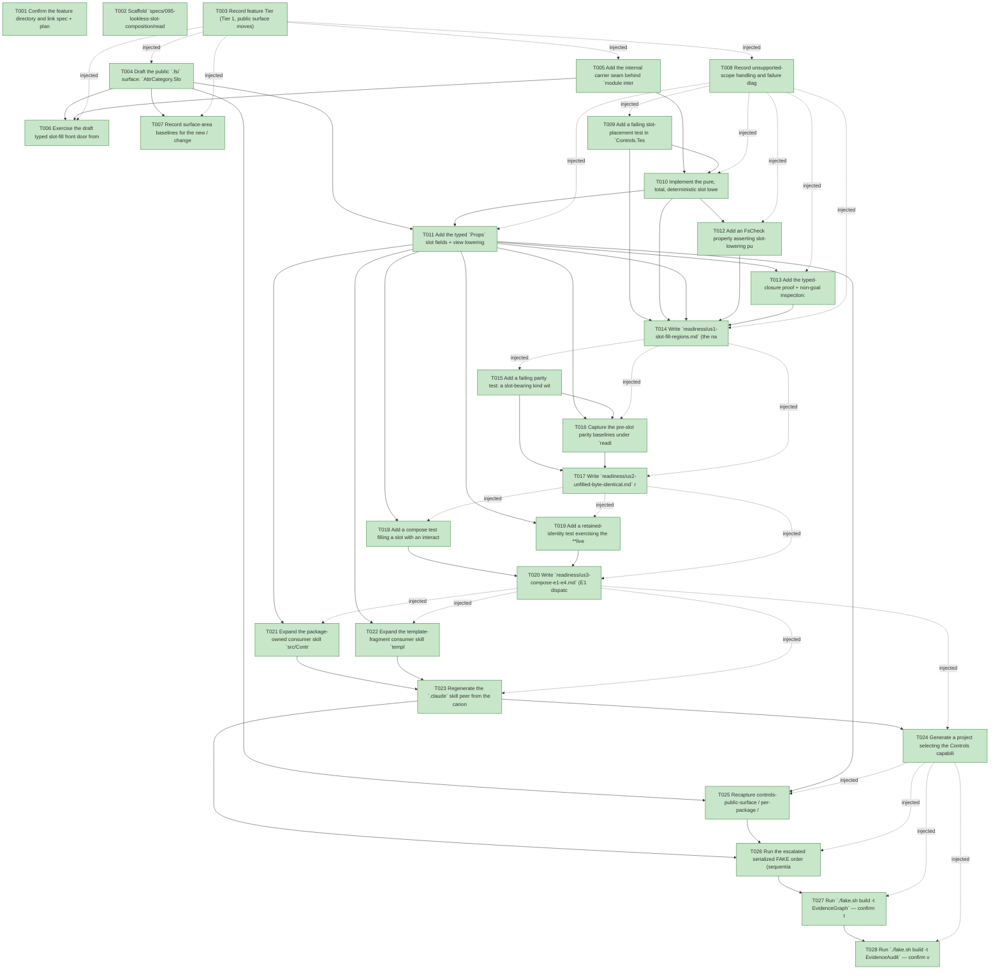

# Task Graph — 095-lookless-slot-composition

## ✓ Graph is acyclic and consistent

## Skill Match Assessments

| Task | Candidate | Confidence | Signals | Reviewer disposition | Diagnostic |
|------|-----------|------------|---------|----------------------|------------|
| T001 | (none) | none |  | accepted-empty | T001: skillist trusted as declared; no owns-based capability requirement |
| T002 | (none) | none |  | declared | T002: skillist trusted as declared; no owns-based capability requirement |
| T003 | (none) | none |  | accepted-empty | T003: skillist trusted as declared; no owns-based capability requirement |
| T004 | (none) | none |  | declared | T004: skillist trusted as declared; no owns-based capability requirement |
| T005 | (none) | none |  | declared | T005: skillist trusted as declared; no owns-based capability requirement |
| T006 | (none) | none |  | declared | T006: skillist trusted as declared; no owns-based capability requirement |
| T007 | (none) | none |  | accepted-empty | T007: skillist trusted as declared; no owns-based capability requirement |
| T008 | (none) | none |  | declared | T008: skillist trusted as declared; no owns-based capability requirement |
| T009 | (none) | none |  | declared | T009: skillist trusted as declared; no owns-based capability requirement |
| T010 | (none) | none |  | declared | T010: skillist trusted as declared; no owns-based capability requirement |
| T011 | (none) | none |  | declared | T011: skillist trusted as declared; no owns-based capability requirement |
| T012 | (none) | none |  | declared | T012: skillist trusted as declared; no owns-based capability requirement |
| T013 | (none) | none |  | declared | T013: skillist trusted as declared; no owns-based capability requirement |
| T014 | (none) | none |  | declared | T014: skillist trusted as declared; no owns-based capability requirement |
| T015 | (none) | none |  | declared | T015: skillist trusted as declared; no owns-based capability requirement |
| T016 | (none) | none |  | declared | T016: skillist trusted as declared; no owns-based capability requirement |
| T017 | (none) | none |  | declared | T017: skillist trusted as declared; no owns-based capability requirement |
| T018 | (none) | none |  | declared | T018: skillist trusted as declared; no owns-based capability requirement |
| T019 | (none) | none |  | declared | T019: skillist trusted as declared; no owns-based capability requirement |
| T020 | (none) | none |  | declared | T020: skillist trusted as declared; no owns-based capability requirement |
| T021 | (none) | none |  | declared | T021: skillist trusted as declared; no owns-based capability requirement |
| T022 | (none) | none |  | declared | T022: skillist trusted as declared; no owns-based capability requirement |
| T023 | (none) | none |  | declared | T023: skillist trusted as declared; no owns-based capability requirement |
| T024 | (none) | none |  | declared | T024: skillist trusted as declared; no owns-based capability requirement |
| T025 | (none) | none |  | declared | T025: skillist trusted as declared; no owns-based capability requirement |
| T026 | (none) | none |  | declared | T026: skillist trusted as declared; no owns-based capability requirement |
| T027 | speckit-evidence-graph | high | owns:graph-validation | accepted | T027: owns graph-validation requires skill speckit-evidence-graph; trigger_group=owns; matched_trigger=owns:graph-validation |
| T028 | speckit-evidence-audit | high | owns:evidence-audit | accepted | T028: owns evidence-audit requires skill speckit-evidence-audit; trigger_group=owns; matched_trigger=owns:evidence-audit |

## Status counts (effective)

| Status | Count |
|--------|-------|
| [X] done | 28 |
| [S] synthetic | 0 |
| [S*] auto-synthetic | 0 |
| accepted [SEH] synthetic | 0 |
| unaccepted synthetic | 0 |

## Graph



## ASCII view

```
T001 [X] Confirm the feature directory and link spec + plan; verify `.specify/feature.json` resolves `specs/095-lookless-slot-composition`
T002 [X] Scaffold `specs/095-lookless-slot-composition/readiness/` placeholders discoverable before implementation — the US/SC evidence files (`us1-slot-fill-regions.md`, `us2-unfilled-byte-identical.md`, `us3-compose-e1-e4.md`, `sc004-retained-identity.md`, `sc005-lowering-property.md`, `sc006-typed-closed-and-nongoals.md`, `us4-skill-e1-e5.md`, `fsi-transcript.md`, `surface-baselines.md`, `parity/`) and the audit-enforced contract files (`governance-risk-levels.md`, `runtime-limitations.md`, `aggregate-hang-diagnostics.md`, `generated-guidance-validation.md`, `real-image-evidence.md`), each naming its authoritative command, artifact path, failure class, and next action
T003 [X] Record feature Tier (Tier 1, public surface moves), affected layer (`FS.Skia.UI.Controls`), public-API impact (`Types.fsi` + `Widgets/Primitives.fsi` + `Widgets/Containers.fsi`), Elmish/MVU applicability (N/A — pure structural lowering), and evidence obligations; record as a **visible decision** that this is not a graphical viewer feature (deterministic render-only evidence, no live window), so no persistent-launch obligation applies
T004 [X] Draft the public `.fsi` surface: `AttrCategory.Slot` case + `AttrValue.SlotFillsValue of (string * Control<'msg>) list` case on `src/Controls/Types.fsi` (mirroring E3's `Style` / `StyleClassesValue`); additive `Widget<'msg> option` slot fields on `src/Controls/Widgets/Primitives.fsi` (`ButtonProps.Leading` / `.Trailing`) and `src/Controls/Widgets/Containers.fsi` (`PanelProps.Header` / `.Footer`), each defaulting `None`; document honestly (a slot lowers to `Control<'msg>`; it is not a data-bound template)
T005 [X] Add the internal carrier seam behind `module internal ControlInternals` (`src/Controls/Control.fs[i]`): `slotFill : (string * Control<'msg>) list -> Attr<'msg>` (builds `Slot`/`SlotFillsValue`), `slotFillsOf` (`tryLast "slot"` extractor, default `[]`), and `slotFor : string -> Attr<'msg> list -> Control<'msg> option` — **no** public free-form `Attr.slot` builder and **no** public `SlotName` type (FR-001)
T006 [X] Exercise the draft typed slot-fill front door from FSI through the packed library surface (representative `Button.Leading` and `Panel.Header` fills), capturing the session transcript to `readiness/fsi-transcript.md`
T007 [X] Record surface-area baselines for the new / changed public modules (controls-public-surface / per-package / cross-package) as the pre-change reference for the Phase 7 recapture
T008 [X] Record unsupported-scope handling and failure diagnostics: the FR-008 non-goal line (no `DataContext`, binding expression, per-item template instantiation, dependency/attached properties, CSS-selector styling) and the totality guarantee (every region has a default; lowering never throws; absent-name ⇒ default, present-name ⇒ fill even if empty), into `readiness/runtime-limitations.md`
T009 [X] Add a failing slot-placement test in `Controls.Tests`: filling a declared named slot lowers the supplied `Control<'msg>` sub-tree into that region of the lowered IR, and filling two distinct slots places into two distinct regions without collision/swap (SC-001) — fails before lowering places fills
T010 [X] Implement the pure, total, deterministic slot lowering in `ControlInternals`: per declared region, `slotFor name` ⇒ place the fill sub-tree, else render the region's default; inject fills into the lowered control's `Children` (ordered by region position) so they inherit E1–E4 + E2 identity by construction (FR-002, FR-004, FR-006)
T011 [X] Add the typed `Props` slot fields + view lowering for both representative kinds — `Button` (`Leading`/`Trailing` flanking the label, `Primitives.fs`) and `Panel` (`Header`/`Footer` around content, `Containers.fs`) — following E3's conditional-yield pattern (`None` everywhere ⇒ no slot `Attr` ⇒ byte-identical); update `defaults` with the new `None` fields (FR-001, FR-007)
T012 [X] Add an FsCheck property asserting slot-lowering purity / determinism / totality over ≥1000 generated `(kind, slot fills)` combinations (both kinds, arbitrary filled subsets incl. the empty-content case): identical inputs ⇒ identical IR, lowering never throws (SC-005)
T013 [X] Add the typed-closure proof + non-goal inspection: a does-not-compile fixture showing that filling a slot a kind does not declare (e.g. `Button.Header`) is a **compile-time error**, and a structural inspection confirming **no** `DataContext` / binding / template-instantiation surface was introduced (SC-006, FR-008); write `readiness/sc006-typed-closed-and-nongoals.md`
T014 [X] Write `readiness/us1-slot-fill-regions.md` (the named-slot fill + two-distinct-regions proof, SC-001) and `readiness/sc005-lowering-property.md` (the determinism/totality property result, SC-005)
T015 [X] Add a failing parity test: a slot-bearing kind with **no** slots filled is structurally-`Scene`-equal to a captured pre-slot baseline (`frozenButtonGeom`-style oracle) for each representative `(kind, theme, state)`, and a control kind not given slots is unchanged (SC-002, SC-007) — fails if exposing slots shifts the default render
T016 [X] Capture the pre-slot parity baselines under `readiness/parity/<kind>.<theme>.<state>.scene.txt`, confirm the peripheral defaults (`Leading`/`Trailing`/`Header`/`Footer`) contribute **zero geometry** so the label/content position is invariant, and make the T015 parity test pass (FR-003)
T017 [X] Write `readiness/us2-unfilled-byte-identical.md` recording the unfilled byte-identity result and the unmigrated-kind-unchanged regression (SC-002 / SC-007)
T018 [X] Add a compose test filling a slot with an interactive, style-classed, focusable control: its authored binding dispatches the expected message through the existing flat per-`ControlId` mechanism (E1), its style class/visual state resolves through E3's resolver, and it appears in the E4 tab order (SC-003)
T019 [X] Add a retained-identity test exercising the **live** retained render path: a focused/with-text slotted control keeps its focus/text across a sibling-shifting (092-case) model update, demonstrated through the live path rather than a hand-seeded `StateByIdentity` map (SC-004)
T020 [X] Write `readiness/us3-compose-e1-e4.md` (E1 dispatch + E3 resolve + E4 tab order, SC-003) and `readiness/sc004-retained-identity.md` (live-path retained identity across the sibling shift, SC-004)
T021 [X] Expand the package-owned consumer skill `src/Controls/skill/SKILL.md` (`fs-skia-ui-widgets`) to name and show a **runnable consumer example** for every rung E1–E5 (live event dispatch, retained identity + how to key for it, style class/variant + visual state, focus/keyboard traversal, slot fill), honest (a slot lowers to `Control<'msg>`, not a data-bound template; retained identity is a property of the keyed tree, not a binding) (FR-010)
T022 [X] Expand the template-fragment consumer skill `template/fragments/controls/skill/SKILL.md` (`fs-skia-generated-controls-guidance`) with the same honest, runnable E1–E5 guidance so a `dotnet new fs-skia-ui` project selecting Controls receives it (FR-011)
T023 [X] Regenerate the `.claude` skill peer from the canonical `.agents` source via `./fake.sh build -t RefreshSurfaceBaselines` (never hand-edited) and confirm `SkillSyncCheck`, `SkillQualityCheck`, and `GeneratedGuidanceCheck` are green (SC-008)
T024 [X] Generate a project selecting the Controls capability and confirm it receives the updated E1–E5 guidance (SC-009); write `readiness/us4-skill-e1-e5.md` recording the inspection + the three green governance checks + the generated-project confirmation
T025 [X] Recapture controls-public-surface / per-package / cross-package surface baselines after the `.fsi` change via `./fake.sh build -t RefreshSurfaceBaselines` and `PerPackageSurface.captureCurrent` (per-package snapshots are **not** covered by `RefreshSurfaceBaselines`); write `readiness/surface-baselines.md` with the baseline diffs
T026 [X] Run the escalated serialized FAKE order (sequential — `.fake` state is not concurrency-safe): `./fake.sh build -t Dev` → `GeneratedGuidanceCheck` → `TemplateCheck` → `GeneratedProductCheck`, plus `ContrastCheck` / `ControlFidelity` (apply to slotted-content rendering as to any control); record the governance risk level (small/medium/broad) and how non-authoritative aggregate results are recorded in `readiness/governance-risk-levels.md`
T027 [X] Run `./fake.sh build -t EvidenceGraph` — confirm the echoed `feature-directory` + `tasks=<n>` match, no cycles, no dangling refs, no `[S*]` surprises
T028 [X] Run `./fake.sh build -t EvidenceAudit` — confirm verdict PASS (synthetic-propagation + diff-scan) or document every `--accept-synthetic` override
```

## Injected checkpoint edges (Phase N+1 → Phase N) — FR-007

- T003 → T004  (auto-injected Phase-checkpoint edge)
- T003 → T005  (auto-injected Phase-checkpoint edge)
- T003 → T006  (auto-injected Phase-checkpoint edge)
- T003 → T007  (auto-injected Phase-checkpoint edge)
- T003 → T008  (auto-injected Phase-checkpoint edge)
- T008 → T009  (auto-injected Phase-checkpoint edge)
- T008 → T010  (auto-injected Phase-checkpoint edge)
- T008 → T011  (auto-injected Phase-checkpoint edge)
- T008 → T012  (auto-injected Phase-checkpoint edge)
- T008 → T013  (auto-injected Phase-checkpoint edge)
- T008 → T014  (auto-injected Phase-checkpoint edge)
- T014 → T015  (auto-injected Phase-checkpoint edge)
- T014 → T016  (auto-injected Phase-checkpoint edge)
- T014 → T017  (auto-injected Phase-checkpoint edge)
- T017 → T018  (auto-injected Phase-checkpoint edge)
- T017 → T019  (auto-injected Phase-checkpoint edge)
- T017 → T020  (auto-injected Phase-checkpoint edge)
- T020 → T021  (auto-injected Phase-checkpoint edge)
- T020 → T022  (auto-injected Phase-checkpoint edge)
- T020 → T023  (auto-injected Phase-checkpoint edge)
- T020 → T024  (auto-injected Phase-checkpoint edge)
- T024 → T025  (auto-injected Phase-checkpoint edge)
- T024 → T026  (auto-injected Phase-checkpoint edge)
- T024 → T027  (auto-injected Phase-checkpoint edge)
- T024 → T028  (auto-injected Phase-checkpoint edge)

## Resolved skillist ids — FR-007

Resolved skillist-id set (11): fs-skia-elmish, fs-skia-evidence-mode, fs-skia-generated-controls-guidance, fs-skia-keyboard-input, fs-skia-reconciliation, fs-skia-template-update, fs-skia-testing, fs-skia-typed-controls, fs-skia-ui-widgets, speckit-evidence-audit, speckit-evidence-graph

## Skillist id → SKILL.md path

fs-skia-elmish → src/Elmish/skill/SKILL.md
fs-skia-evidence-mode → .agents/skills/fs-skia-evidence-mode/SKILL.md
fs-skia-generated-controls-guidance → template/fragments/controls/skill/SKILL.md
fs-skia-keyboard-input → src/KeyboardInput/skill/SKILL.md
fs-skia-reconciliation → .agents/skills/fs-skia-reconciliation/SKILL.md
fs-skia-template-update → .agents/skills/fs-skia-template-update/SKILL.md
fs-skia-testing → src/Testing/skill/SKILL.md
fs-skia-typed-controls → .agents/skills/fs-skia-typed-controls/SKILL.md
fs-skia-ui-widgets → src/Controls/skill/SKILL.md
speckit-evidence-audit → .agents/skills/speckit-evidence-audit/SKILL.md
speckit-evidence-graph → .agents/skills/speckit-evidence-graph/SKILL.md

## Skillist id → unresolved / flagged

_(none — every declared skillist id resolves to exactly one installed skill)_

