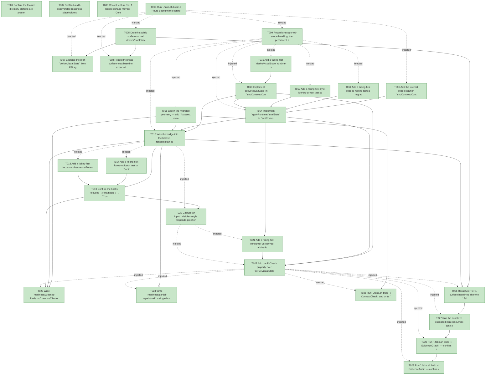

# Task Graph — 096-runtime-visual-state-bridge

## ✓ Graph is acyclic and consistent

## Skill Match Assessments

| Task | Candidate | Confidence | Signals | Reviewer disposition | Diagnostic |
|------|-----------|------------|---------|----------------------|------------|
| T001 | (none) | none |  | accepted-empty | T001: skillist trusted as declared; no owns-based capability requirement |
| T002 | (none) | none |  | declared | T002: skillist trusted as declared; no owns-based capability requirement |
| T003 | (none) | none |  | accepted-empty | T003: skillist trusted as declared; no owns-based capability requirement |
| T004 | (none) | none |  | accepted-empty | T004: skillist trusted as declared; no owns-based capability requirement |
| T005 | (none) | none |  | declared | T005: skillist trusted as declared; no owns-based capability requirement |
| T006 | (none) | none |  | declared | T006: skillist trusted as declared; no owns-based capability requirement |
| T007 | (none) | none |  | declared | T007: skillist trusted as declared; no owns-based capability requirement |
| T008 | (none) | none |  | accepted-empty | T008: skillist trusted as declared; no owns-based capability requirement |
| T009 | (none) | none |  | declared | T009: skillist trusted as declared; no owns-based capability requirement |
| T010 | (none) | none |  | declared | T010: skillist trusted as declared; no owns-based capability requirement |
| T011 | (none) | none |  | declared | T011: skillist trusted as declared; no owns-based capability requirement |
| T012 | (none) | none |  | declared | T012: skillist trusted as declared; no owns-based capability requirement |
| T013 | (none) | none |  | declared | T013: skillist trusted as declared; no owns-based capability requirement |
| T014 | (none) | none |  | declared | T014: skillist trusted as declared; no owns-based capability requirement |
| T015 | (none) | none |  | declared | T015: skillist trusted as declared; no owns-based capability requirement |
| T016 | (none) | none |  | declared | T016: skillist trusted as declared; no owns-based capability requirement |
| T017 | (none) | none |  | declared | T017: skillist trusted as declared; no owns-based capability requirement |
| T018 | (none) | none |  | declared | T018: skillist trusted as declared; no owns-based capability requirement |
| T019 | (none) | none |  | declared | T019: skillist trusted as declared; no owns-based capability requirement |
| T020 | (none) | none |  | declared | T020: skillist trusted as declared; no owns-based capability requirement |
| T021 | (none) | none |  | declared | T021: skillist trusted as declared; no owns-based capability requirement |
| T022 | (none) | none |  | declared | T022: skillist trusted as declared; no owns-based capability requirement |
| T023 | (none) | none |  | declared | T023: skillist trusted as declared; no owns-based capability requirement |
| T024 | (none) | none |  | declared | T024: skillist trusted as declared; no owns-based capability requirement |
| T025 | (none) | none |  | declared | T025: skillist trusted as declared; no owns-based capability requirement |
| T026 | (none) | none |  | declared | T026: skillist trusted as declared; no owns-based capability requirement |
| T027 | (none) | none |  | declared | T027: skillist trusted as declared; no owns-based capability requirement |
| T028 | speckit-evidence-graph | high | owns:graph-validation | accepted | T028: owns graph-validation requires skill speckit-evidence-graph; trigger_group=owns; matched_trigger=owns:graph-validation |
| T029 | speckit-evidence-audit | high | owns:evidence-audit | accepted | T029: owns evidence-audit requires skill speckit-evidence-audit; trigger_group=owns; matched_trigger=owns:evidence-audit |

## Status counts (effective)

| Status | Count |
|--------|-------|
| [X] done | 29 |
| [S] synthetic | 0 |
| [S*] auto-synthetic | 0 |
| accepted [SEH] synthetic | 0 |
| unaccepted synthetic | 0 |

## Graph



## ASCII view

```
T001 [X] Confirm the feature directory artifacts are present and linked (spec, plan, research, data-model, quickstart, `contracts/control-runtime-bridge.md`, `checklists/requirements.md`) and that `.specify/feature.json` resolves `specs/096-runtime-visual-state-bridge`
T002 [X] Scaffold audit-discoverable readiness placeholders under `readiness/`: `derive-precedence.md`, `live-restyle.md`, `focus-survives-reshuffle.md`, `byte-identity-at-rest.md`, `partial-repaint.md`, `widened-kinds.md`, `responds-proof.md`, `contrast.md`, `fsi-transcript.md`, `surface-baselines.md`, plus `governance-risk-levels.md`, `aggregate-hang-diagnostics.md`, `runtime-limitations.md`, `generated-guidance-validation.md`, `real-image-evidence.md`, `evidence-graph.md`, `evidence-audit.md` — each naming its authoritative command, artifact path, failure class, and next action
T003 [X] Record feature Tier 1 (public surface moves: `ControlRuntime.fsi` gains `deriveVisualState`), affected layers (`FS.Skia.UI.Controls` projection + internal bridge + widened geometry; `FS.Skia.UI.Controls.Elmish` host call site), public-API impact (single additive `val`; `applyRuntimeVisualState` internal), MVU applicability (reads the existing `ControlRuntimeModel`; no new `Msg`/`Effect`/`update`; pure bridge at the interpreter edge), and the evidence obligations from the plan; record as a **visible decision** that this is **not** a persistent graphical viewer feature (deterministic render-step + structural `Scene`/resolved-style equality; the responds-proof is the live retained render-step path), so no persistent-launch obligation applies
T004 [X] Run `./fake.sh build -t Route`; confirm the controls-public-surface escalation (the serialized six-target path **plus `ContrastCheck`**) and record the authoritative gate list plus the small/medium/broad governance risk levels for this Tier-1 surface move into `readiness/governance-risk-levels.md`
T005 [X] Draft the public surface — `val deriveVisualState : model:ControlRuntimeModel -> controlId:ControlId -> VisualState` on `src/Controls/ControlRuntime.fsi` with the doc comment per `contracts/control-runtime-bridge.md` (purely additive; no existing signature changes; `RetainedId` stays out of the surface — the bridge binds in the `ControlId` domain)
T006 [X] Add the internal bridge seam in `src/Controls/ControlRuntime.fs` (NOT declared in the `.fsi` → automatically internal): the `applyRuntimeVisualState` signature + a `setVisualState` helper (replace-or-append the last-writer `visualState` attribute that `ControlInternals.visualStateOf` reads), reachable from `Controls.Tests` / `Elmish.Tests` via the existing `InternalsVisibleTo` (`Controls.fsproj`); reuse `ControlInternals.visualStateOf` directly (`ControlRuntime.fs` compiles after `Control.fs`)
T007 [X] Exercise the draft `deriveVisualState` from FSI against the packed library — `Hover` for a hovered id, `Pressed` out-ranking `Hover`, `Normal` for an unknown id — per the contract FSI block; capture the session transcript to `readiness/fsi-transcript.md`
T008 [X] Record the initial surface-area baseline expectations for the changed public module (`ControlRuntime.fsi`: controls-public-surface / per-package / cross-package) as the pre-change reference for the Phase 6 recapture
T009 [X] Record unsupported-scope handling, the permanent non-goals, and failure diagnostics into `readiness/runtime-limitations.md`: a single carrier channel (the pre-existing `Attr.visualState` — no second/parallel consumer-state channel, FR-003), no new `VisualState` case, no new token literal or second contrast policy (FR-008), the bridge is total and silent (a `Normal`-and-unset node is a no-op, FR-005), it operates only in the `ControlId` domain (never `RetainedId`), a non-migrated kind derives state but produces no visible change, and no data-binding/observable/dependency-property/selector/template surface is introduced (FR-009)
T010 [X] Add a failing-first `deriveVisualState` runtime-precedence test: the runtime-derivable order `Pressed > Selected > Focused > Hover > Normal` holds (the runtime tail of FR-002), an id named by no interaction state resolves to `Normal`, and identical `(model, id)` inputs always yield an identical result (totality + determinism underpinning SC-001/SC-004)
T011 [X] Add a failing-first bridged-restyle test: a migrated control whose id is the `HoveredControl` / in `PressedControls` / the `Selection.ControlId` of a `ControlRuntimeModel` resolves to the matching `Hover`/`Pressed`/`Selected` style with a **no-attribute** consumer `view` (via `applyRuntimeVisualState` + `Style.resolve`, never a hand-authored attribute), and a non-interacted sibling resolves `Normal` (SC-001)
T012 [X] Add a failing-first byte-identity-at-rest test: a `Normal`-and-unset control is returned from `applyRuntimeVisualState` **unchanged** (no attribute added) and is structurally-`Scene`-equal to the un-bridged build, with `RecomputedNodeCount` unchanged at rest (FR-005, SC-003, SC-008)
T013 [X] Implement `deriveVisualState` in `src/Controls/ControlRuntime.fs` — the closed runtime-derivable precedence (`PressedControls.Contains id` → `Pressed`; `Selection` is `Some s` and `s.ControlId = id` → `Selected`; `FocusedControl = Some id` → `Focused`; `HoveredControl = Some id` → `Hover`; else `Normal`); pure, total, deterministic, with no per-kind branching
T014 [X] Implement `applyRuntimeVisualState` in `src/Controls/ControlRuntime.fs` — per node `id = Key |> Option.defaultValue Kind`; if `ControlInternals.visualStateOf` is `<> Normal` return the node unchanged (consumer wins, FR-003); else match `deriveVisualState model id`: `Normal` → node unchanged (emit nothing, FR-005), `derived` → `setVisualState derived`; recurse the structural `Children`; pure (no `model` mutation), stamping in the `ControlId` domain so a change becomes a scoped reconciler `Update` patch (FR-004)
T015 [X] Widen the migrated geometry — add `(classes, state)` params to `sliderGeom` / `textFieldGeom` / `radioGeom` / `switchGeom` in `src/Controls/Control.fs` and route their paint through `Style.resolve theme baseStyle classes state` (matching `buttonGeom` / `checkboxGeom`); at `classes = []`, `state = Normal` the output is **byte-identical** to today (FR-006; the widened half of SC-006)
T016 [X] Wire the bridge into the host: in `renderRetained` (`src/Controls.Elmish/ControlsElmish.fs:555`) assemble a read-only `ControlRuntimeModel` from the live `pointerState` (`Hover`/`Presses`, already `ControlId`-keyed) + `focused` (`RetainedId` resolved back to `ControlId` via the prior retained tree) and apply `applyRuntimeVisualState` to `host.View size model` **before** `RetainedRender.init`/`step` (pre-reconcile, `ControlId` domain); capture US1 to `readiness/live-restyle.md` (SC-001) and the at-rest result to `readiness/byte-identity-at-rest.md` (FR-005, SC-003)
T017 [X] Add a failing-first focus-indicator test: a `ControlRuntimeModel` whose `FocusedControl` is a migrated focusable control resolves that control with its `Focused` indicator via the bridge + E3 resolver and **no consumer focus attribute**; when focus moves to a different control, the previously-focused one returns to its non-focused resolution and the newly-focused one gains the indicator (SC-002, US2.1/US2.3)
T018 [X] Add a failing-first focus-survives-reshuffle test over the **live** retained path: across a sibling-shifting unrelated re-render the `Focused` indicator stays on the same control via E2 retained identity — demonstrated through the live-path identity, **not** a hand-seeded `StateByIdentity` map (SC-002, FR-007)
T019 [X] Confirm the host's `focused` (`RetainedId`) → `ControlId` resolution feeds `deriveVisualState`'s `Focused` rank so the indicator attaches to the E2 stable retained identity and survives the reshuffle; R1 **consumes** — never re-derives — the 067/091/092 identity scheme (FR-007); capture to `readiness/focus-survives-reshuffle.md` (SC-002)
T020 [X] Capture an input→visible-restyle responds-proof on the live retained path (a hover/press/focus change → a reconciler `Update` patch → a restyle) that an inert/un-bridged build fails (identical frames / `Inert`); record to `readiness/responds-proof.md`
T021 [X] Add a failing-first consumer-vs-derived arbitration test: a consumer-`Disabled` control the runtime also reports hovered/pressed/focused resolves `Disabled` (consumer state out-ranks derived, FR-003); a consumer-`Selected` control the runtime reports `Pressed` resolves `Selected`; a control the consumer left at `Normal` that the runtime reports focused resolves `Focused` (derived fills the `Normal` slot) — the single-carrier rule, no second channel (US3.1/US3.2/US3.3, SC-004 preservation half)
T022 [X] Add the FsCheck property over `deriveVisualState` + `applyRuntimeVisualState`: purity / totality / determinism over **≥1000** generated `(ControlRuntimeModel, ControlId, consumer-state)` combinations, the fixed order (`Disabled > Validation > Loading > Pressed > Selected > Focused > Hover > Normal`) holds for every combination, and a consumer-set non-`Normal` state is preserved over any derived interaction state in **100%** of cases; record to `readiness/derive-precedence.md` (SC-004)
T023 [X] Write `readiness/widened-kinds.md`: each of `button` / `check-box` / `slider` / `text-box` / `radio-group` / `switch` restyles on interaction and shows a focus indicator on the live path; the unmigrated kinds (incl. `toggle-button` / `list-box` / `multi-select-list` / `combo-box`) show **no render-output delta** (SC-006)
T024 [X] Write `readiness/partial-repaint.md`: a single hover entering one control surfaces a single reconciler `Update` patch and the repaint is O(hovered-subtree) measured via the existing `WorkReduction` metric — not a whole-tree repaint (SC-005, FR-004)
T025 [X] Run `./fake.sh build -t ContrastCheck` and write `readiness/contrast.md`: no migrated control's bridged styling regresses its contrast result, and the bridge adds no second contrast policy and no new token literal (any styling flows through E3's `Style.resolve` over DTCG-sourced tokens) (SC-007, FR-008)
T026 [X] Recapture Tier-1 surface baselines after the `.fsi` change via `./fake.sh build -t RefreshSurfaceBaselines` (controls-public-surface + cross-package) and `PerPackageSurface.captureCurrent` (per-package snapshots are **not** covered by `RefreshSurfaceBaselines`); record the diffs to `readiness/surface-baselines.md`
T027 [X] Run the serialized escalated non-concurrent gate prefix **sequentially** (shared `.fake` state) — `./fake.sh build -t Dev` → `GeneratedGuidanceCheck` → `TemplateCheck` → `GeneratedProductCheck` — recording the aggregate results as **non-authoritative** into `readiness/generated-guidance-validation.md`
T028 [X] Run `./fake.sh build -t EvidenceGraph` — confirm the echoed `feature-directory` + `tasks=<n>` match, no cycles, no dangling refs, no `[S*]` surprises; record to `readiness/evidence-graph.md`
T029 [X] Run `./fake.sh build -t EvidenceAudit` — confirm verdict PASS (synthetic-propagation + diff-scan) or document every `--accept-synthetic` override; record to `readiness/evidence-audit.md`
```

## Injected checkpoint edges (Phase N+1 → Phase N) — FR-007

- T004 → T005  (auto-injected Phase-checkpoint edge)
- T004 → T006  (auto-injected Phase-checkpoint edge)
- T004 → T007  (auto-injected Phase-checkpoint edge)
- T004 → T008  (auto-injected Phase-checkpoint edge)
- T004 → T009  (auto-injected Phase-checkpoint edge)
- T009 → T010  (auto-injected Phase-checkpoint edge)
- T009 → T011  (auto-injected Phase-checkpoint edge)
- T009 → T012  (auto-injected Phase-checkpoint edge)
- T009 → T013  (auto-injected Phase-checkpoint edge)
- T009 → T014  (auto-injected Phase-checkpoint edge)
- T009 → T015  (auto-injected Phase-checkpoint edge)
- T009 → T016  (auto-injected Phase-checkpoint edge)
- T016 → T017  (auto-injected Phase-checkpoint edge)
- T016 → T018  (auto-injected Phase-checkpoint edge)
- T016 → T020  (auto-injected Phase-checkpoint edge)
- T020 → T021  (auto-injected Phase-checkpoint edge)
- T020 → T022  (auto-injected Phase-checkpoint edge)
- T022 → T023  (auto-injected Phase-checkpoint edge)
- T022 → T024  (auto-injected Phase-checkpoint edge)
- T022 → T025  (auto-injected Phase-checkpoint edge)
- T022 → T026  (auto-injected Phase-checkpoint edge)
- T022 → T027  (auto-injected Phase-checkpoint edge)
- T022 → T028  (auto-injected Phase-checkpoint edge)
- T022 → T029  (auto-injected Phase-checkpoint edge)

## Resolved skillist ids — FR-007

Resolved skillist-id set (9): fs-skia-design-tokens, fs-skia-elmish, fs-skia-evidence-mode, fs-skia-reconciliation, fs-skia-template-update, fs-skia-testing, fs-skia-ui-widgets, speckit-evidence-audit, speckit-evidence-graph

## Skillist id → SKILL.md path

fs-skia-design-tokens → .agents/skills/fs-skia-design-tokens/SKILL.md
fs-skia-elmish → src/Elmish/skill/SKILL.md
fs-skia-evidence-mode → .agents/skills/fs-skia-evidence-mode/SKILL.md
fs-skia-reconciliation → .agents/skills/fs-skia-reconciliation/SKILL.md
fs-skia-template-update → .agents/skills/fs-skia-template-update/SKILL.md
fs-skia-testing → src/Testing/skill/SKILL.md
fs-skia-ui-widgets → src/Controls/skill/SKILL.md
speckit-evidence-audit → .agents/skills/speckit-evidence-audit/SKILL.md
speckit-evidence-graph → .agents/skills/speckit-evidence-graph/SKILL.md

## Skillist id → unresolved / flagged

_(none — every declared skillist id resolves to exactly one installed skill)_

