# Task Graph — 097-incremental-partial-relayout

## ✓ Graph is acyclic and consistent

## Skill Match Assessments

| Task | Candidate | Confidence | Signals | Reviewer disposition | Diagnostic |
|------|-----------|------------|---------|----------------------|------------|
| T001 | (none) | none |  | accepted-empty | T001: skillist trusted as declared; no owns-based capability requirement |
| T002 | (none) | none |  | declared | T002: skillist trusted as declared; no owns-based capability requirement |
| T003 | (none) | none |  | accepted-empty | T003: skillist trusted as declared; no owns-based capability requirement |
| T004 | (none) | none |  | accepted-empty | T004: skillist trusted as declared; no owns-based capability requirement |
| T005 | (none) | none |  | declared | T005: skillist trusted as declared; no owns-based capability requirement |
| T006 | (none) | none |  | declared | T006: skillist trusted as declared; no owns-based capability requirement |
| T007 | (none) | none |  | declared | T007: skillist trusted as declared; no owns-based capability requirement |
| T008 | (none) | none |  | declared | T008: skillist trusted as declared; no owns-based capability requirement |
| T009 | (none) | none |  | declared | T009: skillist trusted as declared; no owns-based capability requirement |
| T010 | (none) | none |  | declared | T010: skillist trusted as declared; no owns-based capability requirement |
| T011 | (none) | none |  | declared | T011: skillist trusted as declared; no owns-based capability requirement |
| T012 | (none) | none |  | declared | T012: skillist trusted as declared; no owns-based capability requirement |
| T013 | (none) | none |  | declared | T013: skillist trusted as declared; no owns-based capability requirement |
| T014 | (none) | none |  | declared | T014: skillist trusted as declared; no owns-based capability requirement |
| T015 | (none) | none |  | declared | T015: skillist trusted as declared; no owns-based capability requirement |
| T016 | (none) | none |  | declared | T016: skillist trusted as declared; no owns-based capability requirement |
| T017 | (none) | none |  | declared | T017: skillist trusted as declared; no owns-based capability requirement |
| T018 | (none) | none |  | declared | T018: skillist trusted as declared; no owns-based capability requirement |
| T019 | (none) | none |  | declared | T019: skillist trusted as declared; no owns-based capability requirement |
| T020 | (none) | none |  | declared | T020: skillist trusted as declared; no owns-based capability requirement |
| T021 | (none) | none |  | declared | T021: skillist trusted as declared; no owns-based capability requirement |
| T022 | (none) | none |  | declared | T022: skillist trusted as declared; no owns-based capability requirement |
| T023 | (none) | none |  | declared | T023: skillist trusted as declared; no owns-based capability requirement |
| T024 | (none) | none |  | declared | T024: skillist trusted as declared; no owns-based capability requirement |
| T025 | speckit-evidence-graph | high | owns:graph-validation | accepted | T025: owns graph-validation requires skill speckit-evidence-graph; trigger_group=owns; matched_trigger=owns:graph-validation |
| T026 | speckit-evidence-audit | high | owns:evidence-audit | accepted | T026: owns evidence-audit requires skill speckit-evidence-audit; trigger_group=owns; matched_trigger=owns:evidence-audit |

## Status counts (effective)

| Status | Count |
|--------|-------|
| [X] done | 26 |
| [S] synthetic | 0 |
| [S*] auto-synthetic | 0 |
| accepted [SEH] synthetic | 0 |
| unaccepted synthetic | 0 |

## Graph

```mermaid
graph TD
  T001["T001 Confirm the feature directory artifacts are presen"]:::done
  T002["T002 Scaffold audit-discoverable readiness placeholders"]:::done
  T003["T003 Record feature Tier 2 (internal change; public-beh"]:::done
  T004["T004 Run `./fake.sh build -t Route`; confirm the routed"]:::done
  T005["T005 Confirm the existing public `Layout.evaluateIncrem"]:::done
  T006["T006 Define the internal seams (no public `.fsi` move):"]:::done
  T007["T007 Record unsupported-scope handling, permanent non-g"]:::done
  T008["T008 Add a failing-first localized-re-measure test on t"]:::done
  T009["T009 Implement the pure `layoutDirtySet : prev:Control<"]:::done
  T010["T010 Implement the conservative propagation (contract C"]:::done
  T011["T011 Replace the stub body of `Layout.evaluateIncrement"]:::done
  T012["T012 Maintain the per-node measure/bounds cache keyed b"]:::done
  T013["T013 Wire `RetainedRender.step` (`src/Controls/Retained"]:::done
  T014["T014 Add the failing-first equivalence property suite ("]:::done
  T015["T015 Add the failing-first `Invalidated`-honesty test ("]:::done
  T016["T016 Add the dirty-derivation unit cases (contract C2/C"]:::done
  T017["T017 Capture the equivalence + honesty evidence: `readi"]:::done
  T018["T018 Add the failing-first re-measure-metric test on th"]:::done
  T019["T019 Write `readiness/remeasure-metric.md`: the extende"]:::done
  T020["T020 Write `readiness/byte-identity-at-rest.md` (FR-008"]:::done
  T021["T021 Write `readiness/e2-invariants.md` (SC-007): on th"]:::done
  T022["T022 Exercise the real (no-longer-stub) public `Layout."]:::done
  T023["T023 Confirm the `FS.Skia.UI.Layout` / per-package / cr"]:::done
  T024["T024 Run exactly the gates `Route` printed (T004) — the"]:::done
  T025["T025 Run `./fake.sh build -t EvidenceGraph` — confirm t"]:::done
  T026["T026 Run `./fake.sh build -t EvidenceAudit` — confirm v"]:::done
  T004 -. injected .-> T005
  T004 -. injected .-> T006
  T004 -. injected .-> T007
  T007 -. injected .-> T008
  T006 --> T009
  T008 --> T009
  T007 -. injected .-> T009
  T005 --> T010
  T008 --> T010
  T007 -. injected .-> T010
  T005 --> T011
  T008 --> T011
  T010 --> T011
  T007 -. injected .-> T011
  T006 --> T012
  T007 -. injected .-> T012
  T006 --> T013
  T009 --> T013
  T011 --> T013
  T012 --> T013
  T007 -. injected .-> T013
  T013 -. injected .-> T014
  T013 -. injected .-> T015
  T013 -. injected .-> T016
  T014 --> T017
  T015 --> T017
  T016 --> T017
  T013 -. injected .-> T017
  T017 -. injected .-> T018
  T018 --> T019
  T017 -. injected .-> T019
  T013 --> T020
  T019 -. injected .-> T020
  T013 --> T021
  T019 -. injected .-> T021
  T011 --> T022
  T019 -. injected .-> T022
  T005 --> T023
  T019 -. injected .-> T023
  T020 --> T024
  T021 --> T024
  T022 --> T024
  T023 --> T024
  T019 -. injected .-> T024
  T024 --> T025
  T019 -. injected .-> T025
  T025 --> T026
  T019 -. injected .-> T026
  classDef pending fill:#eeeeee,stroke:#999
  classDef done fill:#c8e6c9,stroke:#2e7d32
  classDef synthetic fill:#ffe0b2,stroke:#e65100,stroke-width:2px
  classDef autoSynthetic fill:#ffab91,stroke:#bf360c,stroke-width:2px,stroke-dasharray:5 3
  classDef failed fill:#ffcdd2,stroke:#b71c1c,stroke-width:2px
  classDef skipped fill:#f5f5f5,stroke:#666,stroke-dasharray:3 3
```



## ASCII view

```
T001 [X] Confirm the feature directory artifacts are present and linked (spec, plan, research, data-model, quickstart, `contracts/incremental-layout.md`, `checklists/requirements.md`) and that `.specify/feature.json` resolves `specs/097-incremental-partial-relayout`
T002 [X] Scaffold audit-discoverable readiness placeholders under `readiness/`: `partial-remeasure.md`, `equivalence-property.md`, `remeasure-metric.md`, `dirty-derivation.md`, `invalidated-honest.md`, `byte-identity-at-rest.md`, `e2-invariants.md`, `fsi-transcript.md`, `surface-baselines.md`, plus `governance-risk-levels.md`, `aggregate-hang-diagnostics.md`, `runtime-limitations.md`, `generated-guidance-validation.md`, `real-image-evidence.md`, `evidence-graph.md`, `evidence-audit.md` — each naming its authoritative command, artifact path, failure class, and next action (use `key=value` lines, not bare image-filename claims)
T003 [X] Record feature Tier 2 (internal change; public-behavior nuance only — `evaluateIncremental` body + `Invalidated` value), affected layers (`FS.Skia.UI.Layout` evaluator body + propagation helper; `FS.Skia.UI.Controls` dirty-set derivation, retained measure cache, `RetainedRender.step` swap, extended `WorkReductionRecord`), public-API impact (signature/shape unchanged; cache + metric internal), MVU applicability (untouched — pure functions; no new `Msg`/`Effect`/`update`), and the evidence obligations from the plan; record as a **visible decision** that this is **not** a persistent graphical viewer feature (performance-and-metric-only; structural `Bounds`/`Scene` equality; no persistent-launch / screenshot / real-image obligation)
T004 [X] Run `./fake.sh build -t Route`; confirm the routed tier (inner-loop `Dev` + Layout/Controls determinism tests if no `.fsi` moves; the serialized six-target escalation only if an `.fsi` is forced to change) and record the authoritative gate list plus the small/medium/broad governance risk levels into `readiness/governance-risk-levels.md`
T005 [X] Confirm the existing public `Layout.evaluateIncremental` signature (`previous -> changedNodeIds -> available -> root -> LayoutResult`, `src/Layout/Layout.fsi:10`) is the correct shape for genuine incremental layout (it already takes the dirty set) and `LayoutResult` already carries `Revision`/`Invalidated` — so this is a **body-only** change with no `.fsi` symbol added or moved; record the current `FS.Skia.UI.Layout` / per-package / cross-package surface-area baselines as the **unchanged** pre-change reference for the Phase 6 confirmation (SC-006)
T006 [X] Define the internal seams (no public `.fsi` move): extend the internal `WorkReductionRecord` with `RemeasuredNodeCount: int` (`src/Controls/RetainedRender.fsi`); extend the internal `RenderFragment`/`RetainedNode` to cache the per-node intrinsic measure + computed `ComputedBounds` keyed by `RetainedId`; carry the previous frame's `LayoutResult` on the internal `RetainedRender<'msg>`; declare the internal incremental `ControlInternals.evaluateLayoutIncremental` seam (`size -> control -> previous -> cache -> dirty -> LayoutNode * Map<LayoutNodeId, Rect> * LayoutResult`, contract C4) in `src/Controls/Control.fs` (NOT in any `.fsi` → automatically internal) — all reachable from `Controls.Tests` via the existing `InternalsVisibleTo`
T007 [X] Record unsupported-scope handling, permanent non-goals, and failure diagnostics into `readiness/runtime-limitations.md`: no virtualization/windowing (§6.2 deferred), no new layout algorithm, no new public layout type, no change to computed geometry; the evaluator is **total** (a cache miss / unrecognized dirty id degrades to a full re-measure of that subtree — conservative, never silent divergence, contract C1); `dirty` is a performance hint, never a correctness input; theme-only changes do **not** dirty measure (geometry is theme-independent, INV-7); no data-binding/observable/dependency-property/selector/lookless-template surface (permanent non-goals, FR-009)
T008 [X] Add a failing-first localized-re-measure test on the wired path: a next frame whose patch touches a single leaf (content-only — no `AttrCategory.Layout` attr, no `ChildOp`) yields `WorkReductionRecord.RemeasuredNodeCount` **strictly below** `BaselineNodeCount` and equal to the changed leaf's enclosing flex-line subtree, and the resolved `Scene` is byte-identical to a full-rebuild frame (fails against today's always-full-measure stub; SC-001)
T009 [X] Implement the pure `layoutDirtySet : prev:Control<'msg> -> patch:Reconcile.NodePatch<'msg> -> Set<LayoutNodeId>` derivation (Controls-side, `LayoutNodeId` layout-path domain, contract C2): a node is self-dirty iff its `Update u` has an `AttrSet` whose `attr.Category = AttrCategory.Layout`, or an `AttrRemoved` whose **prev** attr had `Category = AttrCategory.Layout`, or any `ChildInsert`/`ChildRemove`/`ChildMove`; `Keep`/`Replace`/non-layout `Update` contribute no self-dirt; classification reads `attr.Category` — never a hand-maintained name list (FR-003, INV-2)
T010 [X] Implement the conservative propagation (contract C3, FR-004) over the `LayoutNode` tree: for each self-dirty node add its whole nearest flex container/line, then climb adding ancestors until (and including) the first ancestor whose `LayoutIntent.Size` is `Some` on the constraining axis and **stop**; a fully content-sized chain reaches the root; when a fixed-size determination is ambiguous, treat the ancestor as **not** fixed (keep climbing — never under-dirty) (INV-3)
T011 [X] Replace the stub body of `Layout.evaluateIncremental` (`src/Layout/Layout.fs`) with the genuine evaluator: propagate `changedNodeIds` (T010), re-measure **only** the propagated set, reuse `previous.Bounds` for everything else (translating when an ancestor moved), and return a `LayoutResult` whose `Bounds` are **byte-identical** to `evaluate available root` (INV-1); set `Invalidated` = the actual re-measured set (post-propagation, not the verbatim input, FR-001a) and `Revision = previous.Revision + 1L`; preserve `Diagnostics` verbatim; total — never throws (FR-001, contract C1)
T012 [X] Maintain the per-node measure/bounds cache keyed by `RetainedId` on the internal `RenderFragment`/`RetainedNode` (FR-002, INV-6): an unchanged subtree's intrinsic measure + computed bounds survive across frames and are reused (or **translated** by the ancestor delta when an ancestor moved, never re-measured); the cache is **pure** — keyed on the node's content / layout-relevant attrs / available-axis only, no clock/randomness/escaping mutation (confined to the `RetainedRender.step` mutable-ref retained state, constitution III)
T013 [X] Wire `RetainedRender.step` (`src/Controls/RetainedRender.fs:141`) to drive layout through the internal `ControlInternals.evaluateLayoutIncremental` seam instead of the unconditional full `evaluateLayout`: thread the carried previous `LayoutResult` + measure cache + the `layoutDirtySet`-derived dirty set, seed the cache with a full `evaluate` on the first frame / when no previous exists, preserve the reuse-driven paint walk (`box = pr.Fragment.Box`) and the `themeChanged` full-repaint (measure stays clean), and count re-measured nodes into `RemeasuredNodeCount` (interpreter-edge mutable); capture US1 to `readiness/partial-remeasure.md` (SC-001)
T014 [X] Add the failing-first equivalence property suite (`tests/Layout.Tests`, FsCheck, contract C6 / FR-007): over **≥1000** generated `(tree, edit-sequence)` cases — attribute changes, inserts, removes, moves, in any order — apply each edit through both `evaluateIncremental` (carrying the cache forward) and full `evaluate`, and assert their computed `Bounds` are **byte-identical** at **every** step, including long cumulative sequences that stress cache staleness; any divergence fails the gate with no tolerance (SC-002)
T015 [X] Add the failing-first `Invalidated`-honesty test (fails against the verbatim-echo stub): after a localized incremental call, `Invalidated` is the **actual re-measured set** (⊋ the single requested node, bounded by the fixed-size-ancestor subtree, post-propagation) and `Revision = previous.Revision + 1L`; for an empty (all-`Keep`) patch `Invalidated` is empty; only `Bounds` are constrained to byte-identity — `Invalidated`/`Revision` are incremental metadata (FR-001a, INV-4, SC-008)
T016 [X] Add the dirty-derivation unit cases (contract C2/C3, SC-004): an `AttrCategory.Layout` attr dirties the nearest flex line and climbs to/including the first fixed-`Size` ancestor and **stops** (a subtree under a fixed-`Size` container does not dirty that container's ancestors); a fully content-sized chain dirties up to the root; each `ChildInsert`/`ChildRemove`/`ChildMove` dirties its parent container; a non-layout attr (content/style/state/`visualState`) and a `Keep`/`Replace` dirty **no** measure. **Failing-first**: authored against the `layoutDirtySet`/propagation **signatures before their bodies land** (fails against the stub derivation), so this test does **not** depend on the T009/T010 implementations
T017 [X] Capture the equivalence + honesty evidence: `readiness/equivalence-property.md` (≥1000 cases, zero divergences incl. cumulative cache-staleness, SC-002/FR-007), `readiness/invalidated-honest.md` (post-incremental `Invalidated` = actual re-measured set, empty for empty patch, SC-008), and `readiness/dirty-derivation.md` (flex-line / fixed-size-ancestor stop, content-chain-to-root, each `ChildOp`, non-layout no-dirt, SC-004)
T018 [X] Add the failing-first re-measure-metric test on the wired path (contract C5, FR-006): a localized leaf edit shows `RemeasuredNodeCount < BaselineNodeCount` (consistent with the dirty flex-line subtree) **and** a re-paint reduction (`RecomputedNodeCount < BaselineNodeCount`); a genuine whole-tree relayout (a root-level `AttrCategory.Layout` change) shows `RemeasuredNodeCount = BaselineNodeCount` (never under-reports); an empty (all-`Keep`) patch shows `RemeasuredNodeCount = 0` (SC-003)
T019 [X] Write `readiness/remeasure-metric.md`: the extended `WorkReductionRecord` reports both a re-measure reduction and a re-paint reduction for a localized update, a re-measure count **equal to baseline** for a genuine whole-tree relayout, and **zero** for an empty patch — read from the real wired `step`, not assumed (SC-003, US3)
T020 [X] Write `readiness/byte-identity-at-rest.md` (FR-008/SC-005): an at-rest frame (all-`Keep` patch) re-measures nothing (`RemeasuredNodeCount = 0`) and renders a `Scene` byte-identical to the un-incremental build; every tested frame (localized + whole-tree) is byte-identical to the pre-R2 full-re-measure build — R2 changes work and metrics, never geometry or pixels
T021 [X] Write `readiness/e2-invariants.md` (SC-007): on the incremental-layout-wired path all E2 determinism invariants still hold — `RecomputedNodeCount = ChangedSubtreeBound + ShiftedNodeCount`, `Keep → reuse`, first-frame full paint, and `KeyCollision` diagnostics — demonstrated on the live render seam
T022 [X] Exercise the real (no-longer-stub) public `Layout.evaluateIncremental` from FSI against the packed library per quickstart §1 — `Bounds` byte-identical to a full re-evaluate, `Invalidated` reporting the propagated set (not the verbatim input), `Revision` advancing — and capture the session transcript to `readiness/fsi-transcript.md`
T023 [X] Confirm the `FS.Skia.UI.Layout` / per-package / cross-package surface-area baselines are committed **unchanged** vs the T005 reference (the `evaluateIncremental` signature and `LayoutResult` shape are preserved; the measure cache and `RemeasuredNodeCount` remain internal); record to `readiness/surface-baselines.md` (SC-006)
T024 [X] Run exactly the gates `Route` printed (T004) — the inner-loop `Dev` plus the Layout/Controls determinism suites if no `.fsi` moved; only the serialized `Dev → GeneratedGuidanceCheck → TemplateCheck → GeneratedProductCheck` prefix **sequentially** (shared `.fake` state) if an `.fsi` was forced to change — recording the aggregate results as **non-authoritative** into `readiness/generated-guidance-validation.md`
T025 [X] Run `./fake.sh build -t EvidenceGraph` — confirm the echoed `feature-directory` + `tasks=<n>` match this feature, no cycles, no dangling refs, no `[S*]` surprises; record to `readiness/evidence-graph.md`
T026 [X] Run `./fake.sh build -t EvidenceAudit` — confirm verdict PASS (synthetic-propagation + diff-scan) or document every `--accept-synthetic` override; record to `readiness/evidence-audit.md`
```

## Injected checkpoint edges (Phase N+1 → Phase N) — FR-007

- T004 → T005  (auto-injected Phase-checkpoint edge)
- T004 → T006  (auto-injected Phase-checkpoint edge)
- T004 → T007  (auto-injected Phase-checkpoint edge)
- T007 → T008  (auto-injected Phase-checkpoint edge)
- T007 → T009  (auto-injected Phase-checkpoint edge)
- T007 → T010  (auto-injected Phase-checkpoint edge)
- T007 → T011  (auto-injected Phase-checkpoint edge)
- T007 → T012  (auto-injected Phase-checkpoint edge)
- T007 → T013  (auto-injected Phase-checkpoint edge)
- T013 → T014  (auto-injected Phase-checkpoint edge)
- T013 → T015  (auto-injected Phase-checkpoint edge)
- T013 → T016  (auto-injected Phase-checkpoint edge)
- T013 → T017  (auto-injected Phase-checkpoint edge)
- T017 → T018  (auto-injected Phase-checkpoint edge)
- T017 → T019  (auto-injected Phase-checkpoint edge)
- T019 → T020  (auto-injected Phase-checkpoint edge)
- T019 → T021  (auto-injected Phase-checkpoint edge)
- T019 → T022  (auto-injected Phase-checkpoint edge)
- T019 → T023  (auto-injected Phase-checkpoint edge)
- T019 → T024  (auto-injected Phase-checkpoint edge)
- T019 → T025  (auto-injected Phase-checkpoint edge)
- T019 → T026  (auto-injected Phase-checkpoint edge)

## Resolved skillist ids — FR-007

Resolved skillist-id set (8): fs-skia-elmish, fs-skia-evidence-mode, fs-skia-layout, fs-skia-reconciliation, fs-skia-testing, fs-skia-ui-widgets, speckit-evidence-audit, speckit-evidence-graph

## Skillist id → SKILL.md path

fs-skia-elmish → src/Elmish/skill/SKILL.md
fs-skia-evidence-mode → .agents/skills/fs-skia-evidence-mode/SKILL.md
fs-skia-layout → src/Layout/skill/SKILL.md
fs-skia-reconciliation → .agents/skills/fs-skia-reconciliation/SKILL.md
fs-skia-testing → src/Testing/skill/SKILL.md
fs-skia-ui-widgets → src/Controls/skill/SKILL.md
speckit-evidence-audit → .agents/skills/speckit-evidence-audit/SKILL.md
speckit-evidence-graph → .agents/skills/speckit-evidence-graph/SKILL.md

## Skillist id → unresolved / flagged

_(none — every declared skillist id resolves to exactly one installed skill)_

