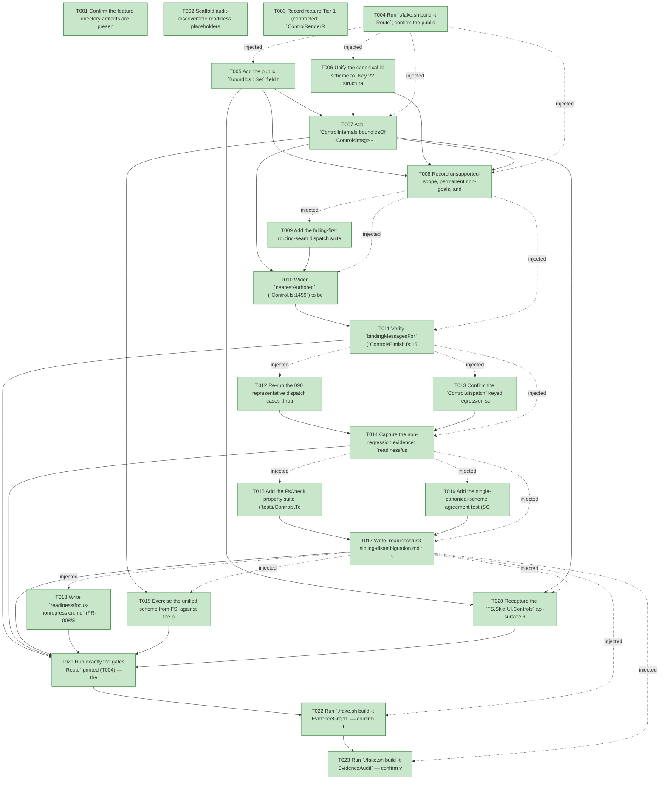

# Task Graph — 098-binding-aware-recovery

## ✓ Graph is acyclic and consistent

## Skill Match Assessments

| Task | Candidate | Confidence | Signals | Reviewer disposition | Diagnostic |
|------|-----------|------------|---------|----------------------|------------|
| T001 | (none) | none |  | accepted-empty | T001: skillist trusted as declared; no owns-based capability requirement |
| T002 | (none) | none |  | declared | T002: skillist trusted as declared; no owns-based capability requirement |
| T003 | (none) | none |  | accepted-empty | T003: skillist trusted as declared; no owns-based capability requirement |
| T004 | (none) | none |  | accepted-empty | T004: skillist trusted as declared; no owns-based capability requirement |
| T005 | (none) | none |  | declared | T005: skillist trusted as declared; no owns-based capability requirement |
| T006 | (none) | none |  | declared | T006: skillist trusted as declared; no owns-based capability requirement |
| T007 | (none) | none |  | declared | T007: skillist trusted as declared; no owns-based capability requirement |
| T008 | (none) | none |  | declared | T008: skillist trusted as declared; no owns-based capability requirement |
| T009 | (none) | none |  | declared | T009: skillist trusted as declared; no owns-based capability requirement |
| T010 | (none) | none |  | declared | T010: skillist trusted as declared; no owns-based capability requirement |
| T011 | (none) | none |  | declared | T011: skillist trusted as declared; no owns-based capability requirement |
| T012 | (none) | none |  | declared | T012: skillist trusted as declared; no owns-based capability requirement |
| T013 | (none) | none |  | declared | T013: skillist trusted as declared; no owns-based capability requirement |
| T014 | (none) | none |  | declared | T014: skillist trusted as declared; no owns-based capability requirement |
| T015 | (none) | none |  | declared | T015: skillist trusted as declared; no owns-based capability requirement |
| T016 | (none) | none |  | declared | T016: skillist trusted as declared; no owns-based capability requirement |
| T017 | (none) | none |  | declared | T017: skillist trusted as declared; no owns-based capability requirement |
| T018 | (none) | none |  | declared | T018: skillist trusted as declared; no owns-based capability requirement |
| T019 | (none) | none |  | declared | T019: skillist trusted as declared; no owns-based capability requirement |
| T020 | (none) | none |  | declared | T020: skillist trusted as declared; no owns-based capability requirement |
| T021 | (none) | none |  | declared | T021: skillist trusted as declared; no owns-based capability requirement |
| T022 | speckit-evidence-graph | high | owns:graph-validation | accepted | T022: owns graph-validation requires skill speckit-evidence-graph; trigger_group=owns; matched_trigger=owns:graph-validation |
| T023 | speckit-evidence-audit | high | owns:evidence-audit | accepted | T023: owns evidence-audit requires skill speckit-evidence-audit; trigger_group=owns; matched_trigger=owns:evidence-audit |

## Status counts (effective)

| Status | Count |
|--------|-------|
| [X] done | 23 |
| [S] synthetic | 0 |
| [S*] auto-synthetic | 0 |
| accepted [SEH] synthetic | 0 |
| unaccepted synthetic | 0 |

## Graph



## ASCII view

```
T001 [X] Confirm the feature directory artifacts are present and linked (spec, plan, research, data-model, quickstart, `contracts/control-render-result.md`, `contracts/nearest-authored.md`, `checklists/requirements.md`) and that `.specify/feature.json` resolves `specs/098-binding-aware-recovery`
T002 [X] Scaffold audit-discoverable readiness placeholders under `readiness/`: `us1-unkeyed-dispatch.md`, `us2-keyed-nonregression.md`, `us3-sibling-disambiguation.md`, `fallback-and-mappointer.md`, `focus-nonregression.md`, `surface-baseline.md`, `validation-log.md`, `fsi-transcript.md`, plus `governance-risk-levels.md`, `aggregate-hang-diagnostics.md`, `runtime-limitations.md`, `generated-guidance-validation.md`, `real-image-evidence.md`, `evidence-graph.md`, `evidence-audit.md` — each naming its authoritative command, artifact path, failure class, and next action (use `key=value` lines, not bare image-filename claims; `real-image-evidence.md` records **not-applicable**: framework-internal id/recovery change, no rendered-output/geometry change)
T003 [X] Record feature Tier 1 (contracted: `ControlRenderResult.BoundIds` field + `val boundIdsOf` + the unkeyed canonical-id change in `Bounds`/`ControlEvent.ControlId`), affected layers (`FS.Skia.UI.Controls` — `Types.fsi`/`Types.fs` field, `Control.fs`/`Control.fsi` id-unification + `boundIdsOf` + `nearestAuthored` + `Control.dispatch`, `RetainedRender.fs` `BoundIds` population; `FS.Skia.UI.Controls.Elmish` — `bindingMessagesFor` verify-only), public-API impact (`BoundIds` field added, unkeyed canonical-id changed, `nearestAuthored` signature unchanged), MVU applicability (untouched — pure recovery; no new `Msg`/`Effect`/`update`), and the evidence obligations from the plan; record as a **visible decision** that this is **not** a persistent graphical viewer feature (framework-internal dispatch/id correction; `Scene`/`Layout`/`Bounds` rectangles byte-identical; proof is the `routeInteractivePointer` seam + property tests; no persistent-launch / screenshot / real-image obligation)
T004 [X] Run `./fake.sh build -t Route`; confirm the public `src/Controls/**/*.fsi` change **escalates** to the serialized six-target maintainer-verify path (`Dev → GeneratedGuidanceCheck → TemplateCheck → GeneratedProductCheck → EvidenceGraph → EvidenceAudit`) and record the authoritative gate list plus the small/medium/broad governance risk levels into `readiness/governance-risk-levels.md`
T005 [X] Add the public `BoundIds : Set<ControlId>` field to `ControlRenderResult<'msg>` in `src/Controls/Types.fsi` (≈ line 345) and mirror it in `src/Controls/Types.fs` (≈ line 287); record the current `FS.Skia.UI.Controls` api-surface + per-package `.fsi.txt` baselines as the **pre-change reference** for the Phase 6 recapture (the canonical-id change and the new field move this baseline; SC-006/FR-002)
T006 [X] Unify the canonical id scheme to `Key ?? structural-path` in one atomic, compiling change (FR-001, D1/D2/D5): make the internal `eventBindings` (`Control.fs:194`) path-aware — thread the `parent + "." + index` path `collectBoundsWith` already mints and derive `id = Key ?? path` (replacing `Key ?? Kind`); change `collectBoundsWith`'s emitted `controlId` (`:1332`) from `Key ?? Kind` to the `layoutId = Key ?? path` it already computes (`:1331`); thread the path into `Control.dispatch` (`:1480`) so its `event.ControlId = Some binding.ControlId` matching uses the unified scheme — eliminating the last residual `Key ?? Kind` derivation. The **keyed branch is byte-identical** (`Key` remains the id), so `InteractionTests.fs` keyed cases and the `event.ControlId = None` wildcard are unaffected; only the **unkeyed** fallback shifts `Kind → path`. `nearestAuthored` is **not** yet widened (still key-only) so the US1 failing-first test goes **RED**
T007 [X] Add `ControlInternals.boundIdsOf : Control<'msg> -> Set<ControlId>` (a `go "0"` walk collecting `Key ?? path` for every node whose path-aware `eventBindings` is non-empty) and its `val boundIdsOf` in the `Control.fsi` `ControlInternals` block; populate `BoundIds` from this single source at all four `ControlRenderResult` construction sites — `Control.render` (`:1385`), `Control.renderTree` (`:1409`), and both `RetainedRender.fs` frames (`:118` first frame, `:374` subsequent) — so the retained path is byte-identical to the full rebuild by construction; `render.BoundIds` is **populated** (mirrors its populated `EventBindings`) while `render.Bounds` stays `[]` (FR-002, D3/D6)
T008 [X] Record unsupported-scope, permanent non-goals, and failure diagnostics into `readiness/runtime-limitations.md` (FR-008/FR-009): no routed/bubbling/tunneling event system, no command system, no new public event type, no framework-level focus-traversal change, no catalog-wide retrofit of all 52 typed views' bindings (separate fitness pass); the 092 retained focus path (`resolveFocus`/`retainedHitTest`/`RetainedId`) is **out of scope and must not regress** (FR-008); recovery is **total** (`None` → `MapPointer` when nothing on the path is keyed or bound — never a throw, never an invented id); the `disabledOrReadOnly` guard is preserved (a disabled bound node does not dispatch); the click-equivalent kinds stay the existing closed set (`click`/`changed`/`selected`); no data-binding/observable/dependency-property/selector/lookless-template surface (permanent non-goals)
T009 [X] Add the failing-first routing-seam dispatch suite (`tests/Controls.Elmish.Tests`, fails against the un-widened `nearestAuthored`; SC-001/SC-005): (AS1) a view with a single **unkeyed** `Button.onClick` over its bounds — a press+release Click dispatches the authored message and `MapPointer` is **not** consulted; (AS2) a nested unkeyed bound control inside an **unbound, unkeyed** container — a Click on the inner control recovers the inner bound node and its binding dispatches; (AS3) an unkeyed **unbound** leaf with no bound/keyed ancestor — a Click recovers `None` and falls back to `MapPointer` exactly as 090 (no spurious dispatch)
T010 [X] Widen `nearestAuthored` (`Control.fs:1459`) to be **binding-aware** (FR-003, D4): at each node on the hit path treat it as *authored* when `node.Id <> path` (keyed) **OR** `Set.contains node.Id result.BoundIds` (bound), and return the nearest such ancestor (including self); return `None` only when nothing on the path qualifies. `node.Id` is already `Key ?? path`, so it **is** the canonical id — a directly-keyed leaf stays a fixed point, and an unkeyed-bound node now returns `Some node.Id` (its path) where it returned `None` before; this is a one-predicate widening with no control-flow restructure
T011 [X] Verify `bindingMessagesFor` (`ControlsElmish.fs:155`) resolves the unkeyed-bound case **for free** — the recovered id and the `EventBindings` keys now share the unified scheme, so the lookup matches; confirm the precedence is preserved (an authored binding **wins**; `MapPointer` is consulted **only** when recovery is `None` or no click-equivalent binding matches — never both, no double-dispatch; FR-004); capture US1 to `readiness/us1-unkeyed-dispatch.md` (real dispatch through the live-adapter `routeInteractivePointer` seam — an artifact an un-fixed build cannot produce) and the `None`-fallback half to `readiness/fallback-and-mappointer.md` (SC-001/SC-005)
T012 [X] Re-run the 090 representative dispatch cases through the R3 routing seam and assert **identical** dispatched messages and **identical** recovered ids (FR-005, SC-002, AS1–3): (AS1) a directly-keyed leaf with a binding — recovery resolves to its `Key` (a fixed point) and its binding dispatches, unchanged from 090; (AS2) a container-keyed composite — a Click on an inner **unkeyed, unbound** positional node climbs to the keyed container and dispatches the container's binding, unchanged from 090; (AS3) a control with both a `Key` **and** a binding — the binding is found by the unified id (the `Key`), with no double-dispatch; plus a `MapPointer`-only consumer (no authored bindings) is **bit-for-bit unchanged**
T013 [X] Confirm the `Control.dispatch` keyed regression suite (`InteractionTests.fs` — the 8 keyed `"save-button"` cases + typed parity) stays **green unchanged** under the path-threaded `dispatch` (D5): the keyed branch is byte-identical and the `event.ControlId = None` wildcard path is unchanged; no test passes an unkeyed `Kind` id to `dispatch` today, so no payload regression for keyed `dispatch` consumers
T014 [X] Capture the non-regression evidence: `readiness/us2-keyed-nonregression.md` (keyed-leaf fixed point + container-keyed recovery byte-identical to 090, same dispatched messages + recovered ids, no double-dispatch for key+binding) and the `MapPointer`-only invariance half of `readiness/fallback-and-mappointer.md` (consumers with no authored bindings are bit-for-bit unchanged; binding-wins precedence preserved) (FR-005, SC-002)
T015 [X] Add the FsCheck property suite (`tests/Controls.Tests`, **≥1000** generated cases; FR-006, SC-004): **determinism** — `boundIdsOf`/`collectBoundsWith`/`eventBindingsOf` over the same tree produce identical results across runs; **same-kind-sibling distinctness** — any two distinct unkeyed same-kind nodes have distinct canonical ids (their structural paths `"0.0"`/`"0.1"`, never a single shared `Kind` id); plus a concrete two-unkeyed-bound-sibling routing case — a Click on the second dispatches the second's message and **not** the first's (no cross-routing)
T016 [X] Add the single-canonical-scheme agreement test (SC-003, FR-007): for a laid-out node, the id in `Bounds`, the id in `EventBindings` (when bound), the `BoundIds` membership key, and the id `nearestAuthored` returns are **the same value** (no node reports `Kind` from one surface and `path` from another); assert `render.BoundIds` is **populated** from its bound nodes while `render.Bounds` stays `[]`
T017 [X] Write `readiness/us3-sibling-disambiguation.md`: two unkeyed same-kind bound siblings mint **distinct** structural ids and route only to their own bindings (no collision, no cross-routing), property-tested for determinism + same-kind-sibling distinctness across ≥1000 generated cases, and the single canonical scheme spans `Bounds`/`EventBindings`/`BoundIds`/recovery — read from the real suites, not assumed (SC-003/SC-004)
T018 [X] Write `readiness/focus-nonregression.md` (FR-008/SC-007): the 092 retained focus path (`resolveFocus`/`RetainedRender.retainedHitTest`, returning a `RetainedId`) is **untouched and not regressed** — focus resolution behavior is identical (the `RetainedId` domain is separate from the `Layout.evaluate` + `nearestAuthored` + `EventBindings` dispatch seam R3 corrects); demonstrate via the existing 092 focus suite staying green
T019 [X] Exercise the unified scheme from FSI against the packed library per `quickstart.md` — author an unkeyed `Button.onClick`, confirm `renderTree` emits a populated `BoundIds` whose ids match its `EventBindings` keys in the `Key ?? path` scheme, and that `render.BoundIds` is populated while `render.Bounds` stays `[]` — and capture the session transcript to `readiness/fsi-transcript.md`
T020 [X] Recapture the `FS.Skia.UI.Controls` api-surface + per-package `.fsi.txt` baselines vs the T005 reference and confirm the diff shows exactly the `BoundIds` field, the `val boundIdsOf`, and the documented unkeyed canonical-id change (no other surface drift); record to `readiness/surface-baseline.md` (SC-006, FR-007)
T021 [X] Run exactly the gates `Route` printed (T004) — the serialized `Dev → GeneratedGuidanceCheck → TemplateCheck → GeneratedProductCheck` prefix **sequentially** (shared `.fake` state, never concurrently) — and record the aggregate results as **non-authoritative** into `readiness/generated-guidance-validation.md` and the run transcript into `readiness/validation-log.md`; rerun any race-like FAKE failure sequentially before any product-regression claim (SC-008)
T022 [X] Run `./fake.sh build -t EvidenceGraph` — confirm the echoed `feature-directory` + `tasks=<n>` match this feature, no cycles, no dangling refs, no `[S*]` surprises; record to `readiness/evidence-graph.md`
T023 [X] Run `./fake.sh build -t EvidenceAudit` — confirm verdict PASS (synthetic-propagation + diff-scan; no synthetic/stub work) or document every `--accept-synthetic` override; record to `readiness/evidence-audit.md`
```

## Injected checkpoint edges (Phase N+1 → Phase N) — FR-007

- T004 → T005  (auto-injected Phase-checkpoint edge)
- T004 → T006  (auto-injected Phase-checkpoint edge)
- T004 → T007  (auto-injected Phase-checkpoint edge)
- T004 → T008  (auto-injected Phase-checkpoint edge)
- T008 → T009  (auto-injected Phase-checkpoint edge)
- T008 → T010  (auto-injected Phase-checkpoint edge)
- T008 → T011  (auto-injected Phase-checkpoint edge)
- T011 → T012  (auto-injected Phase-checkpoint edge)
- T011 → T013  (auto-injected Phase-checkpoint edge)
- T011 → T014  (auto-injected Phase-checkpoint edge)
- T014 → T015  (auto-injected Phase-checkpoint edge)
- T014 → T016  (auto-injected Phase-checkpoint edge)
- T014 → T017  (auto-injected Phase-checkpoint edge)
- T017 → T018  (auto-injected Phase-checkpoint edge)
- T017 → T019  (auto-injected Phase-checkpoint edge)
- T017 → T020  (auto-injected Phase-checkpoint edge)
- T017 → T022  (auto-injected Phase-checkpoint edge)
- T017 → T023  (auto-injected Phase-checkpoint edge)

## Resolved skillist ids — FR-007

Resolved skillist-id set (7): fs-skia-elmish, fs-skia-evidence-mode, fs-skia-reconciliation, fs-skia-testing, fs-skia-ui-widgets, speckit-evidence-audit, speckit-evidence-graph

## Skillist id → SKILL.md path

fs-skia-elmish → src/Elmish/skill/SKILL.md
fs-skia-evidence-mode → .agents/skills/fs-skia-evidence-mode/SKILL.md
fs-skia-reconciliation → .agents/skills/fs-skia-reconciliation/SKILL.md
fs-skia-testing → src/Testing/skill/SKILL.md
fs-skia-ui-widgets → src/Controls/skill/SKILL.md
speckit-evidence-audit → .agents/skills/speckit-evidence-audit/SKILL.md
speckit-evidence-graph → .agents/skills/speckit-evidence-graph/SKILL.md

## Skillist id → unresolved / flagged

_(none — every declared skillist id resolves to exactly one installed skill)_

