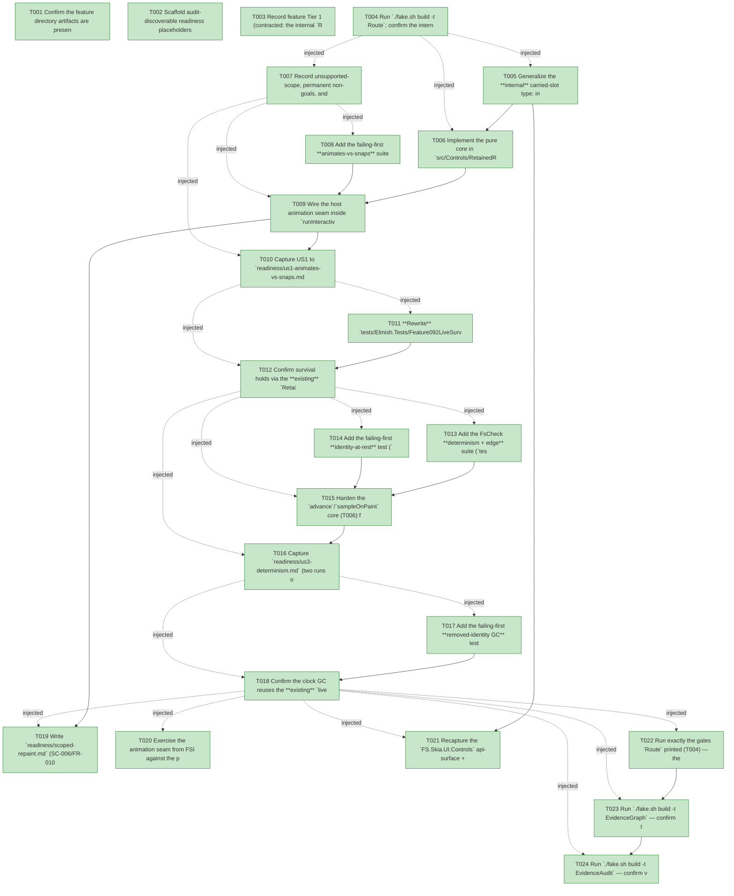

# Task Graph — 099-live-animation-clock

## ✓ Graph is acyclic and consistent

## Skill Match Assessments

| Task | Candidate | Confidence | Signals | Reviewer disposition | Diagnostic |
|------|-----------|------------|---------|----------------------|------------|
| T001 | (none) | none |  | accepted-empty | T001: skillist trusted as declared; no owns-based capability requirement |
| T002 | (none) | none |  | declared | T002: skillist trusted as declared; no owns-based capability requirement |
| T003 | (none) | none |  | accepted-empty | T003: skillist trusted as declared; no owns-based capability requirement |
| T004 | (none) | none |  | accepted-empty | T004: skillist trusted as declared; no owns-based capability requirement |
| T005 | (none) | none |  | declared | T005: skillist trusted as declared; no owns-based capability requirement |
| T006 | (none) | none |  | declared | T006: skillist trusted as declared; no owns-based capability requirement |
| T007 | (none) | none |  | declared | T007: skillist trusted as declared; no owns-based capability requirement |
| T008 | (none) | none |  | declared | T008: skillist trusted as declared; no owns-based capability requirement |
| T009 | (none) | none |  | declared | T009: skillist trusted as declared; no owns-based capability requirement |
| T010 | (none) | none |  | declared | T010: skillist trusted as declared; no owns-based capability requirement |
| T011 | (none) | none |  | declared | T011: skillist trusted as declared; no owns-based capability requirement |
| T012 | (none) | none |  | declared | T012: skillist trusted as declared; no owns-based capability requirement |
| T013 | (none) | none |  | declared | T013: skillist trusted as declared; no owns-based capability requirement |
| T014 | (none) | none |  | declared | T014: skillist trusted as declared; no owns-based capability requirement |
| T015 | (none) | none |  | declared | T015: skillist trusted as declared; no owns-based capability requirement |
| T016 | (none) | none |  | declared | T016: skillist trusted as declared; no owns-based capability requirement |
| T017 | (none) | none |  | declared | T017: skillist trusted as declared; no owns-based capability requirement |
| T018 | (none) | none |  | declared | T018: skillist trusted as declared; no owns-based capability requirement |
| T019 | (none) | none |  | declared | T019: skillist trusted as declared; no owns-based capability requirement |
| T020 | (none) | none |  | declared | T020: skillist trusted as declared; no owns-based capability requirement |
| T021 | (none) | none |  | declared | T021: skillist trusted as declared; no owns-based capability requirement |
| T022 | (none) | none |  | declared | T022: skillist trusted as declared; no owns-based capability requirement |
| T023 | speckit-evidence-graph | high | owns:graph-validation | accepted | T023: owns graph-validation requires skill speckit-evidence-graph; trigger_group=owns; matched_trigger=owns:graph-validation |
| T024 | speckit-evidence-audit | high | owns:evidence-audit | accepted | T024: owns evidence-audit requires skill speckit-evidence-audit; trigger_group=owns; matched_trigger=owns:evidence-audit |

## Status counts (effective)

| Status | Count |
|--------|-------|
| [X] done | 24 |
| [S] synthetic | 0 |
| [S*] auto-synthetic | 0 |
| accepted [SEH] synthetic | 0 |
| unaccepted synthetic | 0 |

## Graph



## ASCII view

```
T001 [X] Confirm the feature directory artifacts are present and linked (`spec.md`, `plan.md`, `research.md`, `data-model.md`, `quickstart.md`, `contracts/host-animation-seam.md`, `contracts/sample-on-paint.md`, `checklists/`) and that `.specify/feature.json` resolves `specs/099-live-animation-clock`
T002 [X] Scaffold audit-discoverable readiness placeholders under `readiness/`: `us1-animates-vs-snaps.md`, `us2-survival.md`, `us3-identity-at-rest.md`, `us3-determinism.md`, `us4-gc.md`, `scoped-repaint.md`, `surface-baseline.md`, `fsi-transcript.md`, `validation-log.md`, plus `governance-risk-levels.md`, `aggregate-hang-diagnostics.md`, `runtime-limitations.md`, `generated-guidance-validation.md`, `real-image-evidence.md`, `evidence-graph.md`, `evidence-audit.md` — each naming its authoritative command, artifact path, failure class, and next action (use `key=value` lines, not bare image-filename claims; `real-image-evidence.md` records the **animates-vs-snaps frame-sequence** captured through the deterministic `runInteractiveApp` seam as the rendered-output evidence, cross-referencing `us1-animates-vs-snaps.md` — there is no persistent-launch / window obligation)
T003 [X] Record feature Tier 1 (contracted: the internal `RetainedUiState.Animation` carried-slot type generalized to the feature-073 multi-channel clock in `RetainedRender.fsi`/`.fs`), affected layers (`FS.Skia.UI.Controls` — `RetainedRender.fsi`/`RetainedRender.fs` slot type + `advance`/`sampleOnPaint`/retarget core + carry/GC reuse; `FS.Skia.UI.Controls.Elmish` — `ControlsElmish.fs` host-seam wiring only; `FS.Skia.UI.Scene` feature-073 animation **consumed, not modified**; `ControlRuntime` R1 bridge **consumed, not modified**), public-API impact (the **public** `runInteractiveApp`/`InteractiveAppHost` surface is **unchanged**; only the internal `RetainedRender.fsi` slot type moves), MVU applicability (no new consumer `Model`/`Msg`/`Effect`/`update`; clock advance/sample are pure functions of the injected delta; the host loop is the interpreter edge), and the evidence obligations from the plan; record as a **visible decision** that the persistent-launch / viewer-launch task-generation rule does **not** newly apply (no default-exe / persistent-launch entry point added; animation is observed through the existing `runInteractiveApp` seam; at-rest frames byte-identical; no window-visibility / screenshot obligation)
T004 [X] Run `./fake.sh build -t Route`; confirm the internal `src/Controls/**/*.fsi` slot-type change **escalates** to the serialized six-target maintainer-verify path (`Dev → GeneratedGuidanceCheck → TemplateCheck → GeneratedProductCheck → EvidenceGraph → EvidenceAudit`) and record the authoritative gate list plus the small/medium/broad governance risk levels into `readiness/governance-risk-levels.md` (note: `Route` escalates only **after** the `.fsi` edit exists; T004 records the **expected** escalation, T022/T023/T024 verify it on the real diff)
T005 [X] Generalize the **internal** carried-slot type: in `src/Controls/RetainedRender.fsi` change `RetainedUiState.Animation` from `AnimationState<Transform> option` to a feature-073 multi-channel clock `option` (per-identity record carrying `Anim : FS.Skia.UI.Scene.Animation`, `Elapsed : System.TimeSpan`, `Target : VisualState`), mirror it in `src/Controls/RetainedRender.fs` (`:26–28`), and declare the internal `advance` / `sampleOnPaint` / retarget helper signatures `internal` in the `.fsi` for the test assembly; record the current `FS.Skia.UI.Controls` api-surface + per-package `.fsi.txt` baselines as the **pre-change reference** for the Phase-7 recapture (this internal slot type moves the baseline; SC-007/FR-008). The existing `Feature092LiveSurvivalTests` hand-seed no longer compiles against the new type and is **rewritten** in US2 (T011)
T006 [X] Implement the pure core in `src/Controls/RetainedRender.fs`, **reusing** feature-073 `Animation.applyAt`/`AnimationState.advance`/`retarget`/`isSettled` (no new engine; FR-009): `advance (delta : TimeSpan) clock` accumulates `Elapsed` (basic path); `sampleOnPaint` derives the painted node through `Animation.applyAt clock.Elapsed clock.Anim` (opacity/transform/color, paint-level only — never layout); the retarget helper **starts** a tween (no clock + desired ≠ `Normal`) or **retargets** from the **current sampled value** (clock + desired ≠ `Target`) when the stamped `VisualState` differs from `clock.Target`, using the single pinned framework default `defaultTransitionDuration = 150 ms` + `EaseOut`, opacity/tint channel (research §R4 / data-model constant — a fixed value, not a per-control knob, so the determinism goldens reach the settled end after the same fixed frame count); carry + GC are **unchanged** (the existing `liveIds` filter already drops the slot with its identity). The host seam is **not** yet wired (`ControlsElmish.fs` still passes `Tick` through), so the **live host still snaps** and the US1 failing-first test (T008) goes **RED**
T007 [X] Record unsupported-scope, permanent non-goals, and failure diagnostics into `readiness/runtime-limitations.md` (Out of Scope / Assumptions): no consumer-facing animation authoring API (keyframes, timelines, per-control DSL); no spring/physics or easing models beyond the feature-073 set; **no layout geometry animation** (size/position reflow) — paint-level only, so R2 incremental measure + scoped-repaint are preserved; no general animation scheduler beyond the per-frame tick advance; no full-52-control animation coverage (tracked with E3/R1); the clock is driven by **injected deltas only** (no `Date.now`/wall-clock); a **non-positive** delta is a designed **no-op** (never rewinds), a **very-large** delta **clamps** to the settled end (no overshoot); a reduced-motion / opt-out policy is **not required** but the design must **not preclude** one (snap = the pre-R4 path); CSS selectors, attached/dependency properties, lookless templates, and data binding remain permanent roadmap non-goals
T008 [X] Add the failing-first **animates-vs-snaps** suite (`tests/Elmish.Tests`, fails against the un-wired seam from T006; SC-001/FR-002/FR-003): drive a hover/focus interaction on a **`Button`** (the representative R1-migrated interactive kind — feature 096's migrated set is `Button`, `CheckBox`, `Slider`, `TextBox`, `RadioGroup`, `Switch`; `Button` exercises hover/press/focus-ring fade on the opacity/tint channel) through the **real** `runInteractiveApp` host seam with a fixed sequence of injected per-frame deltas, capture the sampled appearance across consecutive frames, and assert at least one **intermediate** sampled value is present **before** the target is reached (a gradual transition), then that the target is reached and converges to exactly the snapped appearance; a build without the seam snaps in one step and fails the assertion
T009 [X] Wire the host animation seam inside `runInteractiveApp` (`src/Controls.Elmish/ControlsElmish.fs`, `renderRetained` `:583`, `viewerHost` `:695–702`; contract C1/C2): **wrap** `host.Tick` so the injected per-frame `delta` **advances** every live per-identity clock in `retained.Value.StateByIdentity` (via T006 `advance`) **before** the next `renderRetained`, then **delegates** to `host.Tick delta` for the consumer message (total delegation — no swallowed consumer tick, no double-dispatch); the **retarget** reads the per-identity `VisualState` already stamped by `applyRuntimeVisualState` (`:587`,`:594`, R1) and starts/retargets the tween (T006 retarget helper); **sample on paint** feeds each active clock's `sampleOnPaint` value into that identity's painted node, scoped to its subtree — making the live transition **animate**; this makes T008 **GREEN**. The public `ControlsElmish.fsi` surface stays unchanged (internal wiring); if a host-internal value must reach the test assembly declare it `internal` and recapture only that package baseline
T010 [X] Capture US1 to `readiness/us1-animates-vs-snaps.md` (the real `runInteractiveApp` seam, injected deltas, the captured frame sequence for the **`Button`** representative kind showing ≥1 intermediate sampled appearance before the target, converging to the snapped target; name the kind and the `defaultTransitionDuration = 150 ms` so the frame count is reproducible; an un-wired/no-seam build snaps and cannot produce this artifact) (SC-001)
T011 [X] **Rewrite** `tests/Elmish.Tests/Feature092LiveSurvivalTests.fs` to drive survival entirely through the **real** seam (delete the hand-seeded `startedClock ()` PRECONDITION `:54–58,98–105`; SC-002/FR-004): start a tween via a real interaction through `runInteractiveApp`, advance a few frames with injected deltas, apply an **unrelated, sibling-shifting** re-render (a model change that reorders siblings), then continue ticking — assert the **same** `RetainedId`'s clock continues from its **prior** `Elapsed` (not reset, not dropped) and **completes** with the **same final result** as an un-shifted run. This is failing-first against the un-wired build and against any parallel-identity regression
T012 [X] Confirm survival holds via the **existing** `RetainedId`-keyed `StateByIdentity` carry (the clock rides the same identity map E2 established — **no parallel identity scheme**, FR-008); demonstrate the sibling-shift keeps the identity stable and the clock continues from its prior `Elapsed` to completion; capture `readiness/us2-survival.md` (seam-driven, replacing the prior hand-seeded precondition) (SC-002)
T013 [X] Add the FsCheck **determinism + edge** suite (`tests/Controls.Tests`, **≥1000** generated cases; SC-004/FR-006): two runs over an **identical** generated injected-delta sequence produce **identical** sampled output, and the clock consults **no** wall-clock source (pure function of accumulated deltas); plus edge cases (failing-first for the hardening in T015) — **zero / non-positive** delta is a **no-op** (clock unchanged, never rewinds), a **very-large** delta **clamps** to the settled end (no overshoot past target), a transition **retargeted mid-flight** re-aims from the **current sampled value** (no snap to start), a **return-to-`Normal`** clock that has settled **drops** to no output, and **multiple controls animating simultaneously** advance **independent** clocks — given two identities with active clocks at different `Elapsed`, advancing one frame moves each by its own injected delta and **one clock completing/dropping does not perturb the other's `Elapsed` or sampled output** (spec edge case "Multiple controls animating simultaneously"; SC-006/FR-010 independence)
T014 [X] Add the failing-first **identity-at-rest** test (`tests/Controls.Tests`; SC-003/FR-005): a frame for an identity with **no active clock** (`Animation = None`, including a settled-and-dropped clock) emits **no** animation attribute and is **byte-identical** to the pre-R4 static render, and the at-rest recompute / animation-output count for that frame is **zero** (E2 `RecomputedNodeCount = 0` preserved)
T015 [X] Harden the `advance`/`sampleOnPaint` core (T006) for totality, determinism, and the at-rest fast path (makes T013/T014 **GREEN**; FR-005/FR-006/FR-009): non-positive delta ⇒ no-op (`Elapsed` unchanged); `Elapsed` past the tween `Duration` ⇒ **clamp** to the settled end value via `Animation.isSettled` (no overshoot); a settled clock whose `Target = Normal` is **dropped** to `None` so the identity returns to byte-identical at-rest output (resolving the FR-003 vs FR-005 interaction — the converged frame reaches **exactly** the snapped target); advance/sample remain **pure** (no `Date.now`, no randomness, resume-safe); the no-active-clock paint path emits **no** attribute (byte-identical fast path retained)
T016 [X] Capture `readiness/us3-determinism.md` (two runs over an identical injected-delta sequence → identical sampled output, ≥1000 cases, no wall-clock consulted) and `readiness/us3-identity-at-rest.md` (a no-active-clock frame is byte-identical to the pre-R4 golden with a zero at-rest recompute/output count) — read from the real suites, not assumed (SC-003/SC-004)
T017 [X] Add the failing-first **removed-identity GC** test (`tests/Elmish.Tests`; SC-005/FR-007): animate a control through the real seam (its `RetainedId` has an active clock), then apply a re-render in which that control is **removed** from the tree (its identity no longer appears); assert the retained state for that identity — **including its animation clock** — is **absent** on the next frame, matching the existing focus/text GC behavior, with no leaked or dangling animation state
T018 [X] Confirm the clock GC reuses the **existing** `liveIds` filter (`RetainedRender.fs:363–371`) that already drops focus/text state for removed identities — **no new GC code** (the generalized slot is dropped with the rest of its `RetainedUiState`); capture `readiness/us4-gc.md` (a removed identity's animation clock is gone the following frame, via the live-identity filter) (SC-005)
T019 [X] Write `readiness/scoped-repaint.md` (SC-006/FR-010): advancing and sampling an animating identity's clock keeps the per-frame repaint **scoped to that identity's own subtree** — the work-reduction metric shows animation does **not** force a whole-tree repaint or re-measure, and the presence of one active animation does **not** invalidate the at-rest fast path for other identities (R2 incremental measure preserved); demonstrate via the `Elmish.Tests` work-reduction assertion
T020 [X] Exercise the animation seam from FSI against the packed library per `quickstart.md` — host a migrated control, drive a hover/focus transition with injected deltas, observe a **gradual** (non-snapping) transition with **zero** consumer animation code, and confirm an at-rest frame emits no animation attribute — capture the session transcript to `readiness/fsi-transcript.md`
T021 [X] Recapture the `FS.Skia.UI.Controls` api-surface + per-package `.fsi.txt` baselines vs the T005 pre-change reference and confirm the diff shows **exactly** the internal `RetainedUiState.Animation` slot-type generalization (and any `internal` helper declarations) with no other surface drift; confirm the public `ControlsElmish.fsi` `runInteractiveApp`/`InteractiveAppHost` surface is **unchanged**; record to `readiness/surface-baseline.md` (SC-007/FR-008)
T022 [X] Run exactly the gates `Route` printed (T004) — the serialized `Dev → GeneratedGuidanceCheck → TemplateCheck → GeneratedProductCheck` prefix **sequentially** (shared `.fake` state, never concurrently) — and record the aggregate results as **non-authoritative** into `readiness/generated-guidance-validation.md` and the run transcript into `readiness/validation-log.md`; rerun any race-like FAKE failure sequentially before any product-regression claim; if an aggregate hangs, record the diagnosis in `readiness/aggregate-hang-diagnostics.md` (SC-007)
T023 [X] Run `./fake.sh build -t EvidenceGraph` — confirm the echoed `feature-directory` + `tasks=<n>` match this feature, no cycles, no dangling refs, no `[S*]` surprises; record to `readiness/evidence-graph.md`
T024 [X] Run `./fake.sh build -t EvidenceAudit` — confirm verdict PASS (synthetic-propagation + diff-scan; no synthetic/stub work) or document every `--accept-synthetic` override; record to `readiness/evidence-audit.md`
```

## Injected checkpoint edges (Phase N+1 → Phase N) — FR-007

- T004 → T005  (auto-injected Phase-checkpoint edge)
- T004 → T006  (auto-injected Phase-checkpoint edge)
- T004 → T007  (auto-injected Phase-checkpoint edge)
- T007 → T008  (auto-injected Phase-checkpoint edge)
- T007 → T009  (auto-injected Phase-checkpoint edge)
- T007 → T010  (auto-injected Phase-checkpoint edge)
- T010 → T011  (auto-injected Phase-checkpoint edge)
- T010 → T012  (auto-injected Phase-checkpoint edge)
- T012 → T013  (auto-injected Phase-checkpoint edge)
- T012 → T014  (auto-injected Phase-checkpoint edge)
- T012 → T015  (auto-injected Phase-checkpoint edge)
- T012 → T016  (auto-injected Phase-checkpoint edge)
- T016 → T017  (auto-injected Phase-checkpoint edge)
- T016 → T018  (auto-injected Phase-checkpoint edge)
- T018 → T019  (auto-injected Phase-checkpoint edge)
- T018 → T020  (auto-injected Phase-checkpoint edge)
- T018 → T021  (auto-injected Phase-checkpoint edge)
- T018 → T022  (auto-injected Phase-checkpoint edge)
- T018 → T023  (auto-injected Phase-checkpoint edge)
- T018 → T024  (auto-injected Phase-checkpoint edge)

## Resolved skillist ids — FR-007

Resolved skillist-id set (8): fs-skia-elmish, fs-skia-evidence-mode, fs-skia-reconciliation, fs-skia-scene, fs-skia-testing, fs-skia-ui-widgets, speckit-evidence-audit, speckit-evidence-graph

## Skillist id → SKILL.md path

fs-skia-elmish → src/Elmish/skill/SKILL.md
fs-skia-evidence-mode → .agents/skills/fs-skia-evidence-mode/SKILL.md
fs-skia-reconciliation → .agents/skills/fs-skia-reconciliation/SKILL.md
fs-skia-scene → src/Scene/skill/SKILL.md
fs-skia-testing → src/Testing/skill/SKILL.md
fs-skia-ui-widgets → src/Controls/skill/SKILL.md
speckit-evidence-audit → .agents/skills/speckit-evidence-audit/SKILL.md
speckit-evidence-graph → .agents/skills/speckit-evidence-graph/SKILL.md

## Skillist id → unresolved / flagged

_(none — every declared skillist id resolves to exactly one installed skill)_

