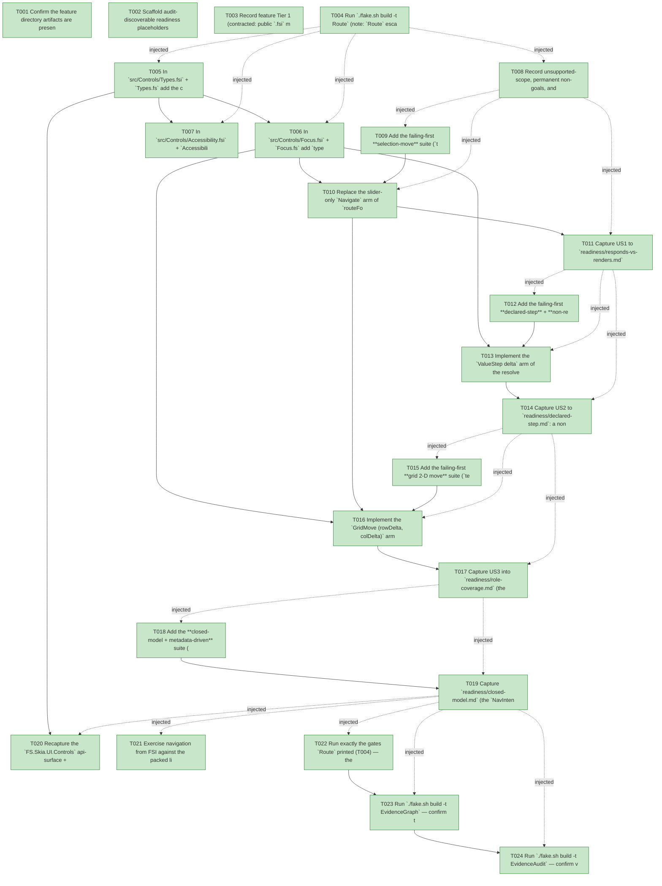

# Task Graph — 100-general-navigation-keys

## ✓ Graph is acyclic and consistent

## Skill Match Assessments

| Task | Candidate | Confidence | Signals | Reviewer disposition | Diagnostic |
|------|-----------|------------|---------|----------------------|------------|
| T001 | (none) | none |  | accepted-empty | T001: skillist trusted as declared; no owns-based capability requirement |
| T002 | (none) | none |  | declared | T002: skillist trusted as declared; no owns-based capability requirement |
| T003 | (none) | none |  | accepted-empty | T003: skillist trusted as declared; no owns-based capability requirement |
| T004 | (none) | none |  | accepted-empty | T004: skillist trusted as declared; no owns-based capability requirement |
| T005 | (none) | none |  | declared | T005: skillist trusted as declared; no owns-based capability requirement |
| T006 | (none) | none |  | declared | T006: skillist trusted as declared; no owns-based capability requirement |
| T007 | (none) | none |  | declared | T007: skillist trusted as declared; no owns-based capability requirement |
| T008 | (none) | none |  | declared | T008: skillist trusted as declared; no owns-based capability requirement |
| T009 | (none) | none |  | declared | T009: skillist trusted as declared; no owns-based capability requirement |
| T010 | (none) | none |  | declared | T010: skillist trusted as declared; no owns-based capability requirement |
| T011 | (none) | none |  | declared | T011: skillist trusted as declared; no owns-based capability requirement |
| T012 | (none) | none |  | declared | T012: skillist trusted as declared; no owns-based capability requirement |
| T013 | (none) | none |  | declared | T013: skillist trusted as declared; no owns-based capability requirement |
| T014 | (none) | none |  | declared | T014: skillist trusted as declared; no owns-based capability requirement |
| T015 | (none) | none |  | declared | T015: skillist trusted as declared; no owns-based capability requirement |
| T016 | (none) | none |  | declared | T016: skillist trusted as declared; no owns-based capability requirement |
| T017 | (none) | none |  | declared | T017: skillist trusted as declared; no owns-based capability requirement |
| T018 | (none) | none |  | declared | T018: skillist trusted as declared; no owns-based capability requirement |
| T019 | (none) | none |  | declared | T019: skillist trusted as declared; no owns-based capability requirement |
| T020 | (none) | none |  | declared | T020: skillist trusted as declared; no owns-based capability requirement |
| T021 | (none) | none |  | declared | T021: skillist trusted as declared; no owns-based capability requirement |
| T022 | (none) | none |  | declared | T022: skillist trusted as declared; no owns-based capability requirement |
| T023 | speckit-evidence-graph | high | owns:graph-validation | accepted | T023: owns graph-validation requires skill speckit-evidence-graph; trigger_group=owns; matched_trigger=owns:graph-validation |
| T024 | speckit-evidence-audit | high | owns:evidence-audit | accepted | T024: owns evidence-audit requires skill speckit-evidence-audit; trigger_group=owns; matched_trigger=owns:evidence-audit |

## Status counts (effective)

| Status | Count |
|--------|-------|
| [X] done | 24 |
| [S] synthetic | 0 |
| [S*] auto-synthetic | 0 |
| accepted [SEH] synthetic | 0 |
| unaccepted synthetic | 0 |

## Graph



## ASCII view

```
T001 [X] Confirm the feature directory artifacts are present and linked (`spec.md`, `plan.md`, `research.md`, `data-model.md`, `quickstart.md`, `contracts/Focus.nav.fsi`, `contracts/Types.nav.fsi`, `contracts/resolver.behavior.md`, `checklists/requirements.md`) and that `.specify/feature.json` resolves `specs/100-general-navigation-keys`
T002 [X] Scaffold audit-discoverable readiness placeholders under `readiness/`: `responds-vs-renders.md`, `declared-step.md`, `role-coverage.md`, `closed-model.md`, `surface-baseline.md`, `fsi-transcript.md`, `validation-log.md`, plus `governance-risk-levels.md`, `aggregate-hang-diagnostics.md`, `runtime-limitations.md`, `generated-guidance-validation.md`, `visual-evidence-honesty.md`, `window-visibility.md`, `real-image-evidence.md`, `evidence-graph.md`, `evidence-audit.md` — each naming its authoritative command, artifact path, failure class, and next action (use `key=value` lines, not bare image-filename claims; `window-visibility.md` records the not-applicable decision with honest values per T003; `real-image-evidence.md` records the **responds-vs-renders** capture through the real `runInteractiveApp` seam as the rendered-output evidence, cross-referencing `responds-vs-renders.md` — there is no persistent-launch / window obligation)
T003 [X] Record feature Tier 1 (contracted: public `.fsi` moves in `Focus`/`Types`/`Accessibility`), affected layers (`FS.Skia.UI.Controls` — `Focus.fsi`/`.fs` `Direction`/`NavIntent`/widened `route`; `Types.fsi`/`.fs` `NavRange`/`NavPayload`/`ControlEvent.Nav`/`AccessibilityMetadata.Navigation`; `Accessibility.fsi`/`.fs` `metadata` widening + per-role `NavigationKeys`/`NavRange`; `FS.Skia.UI.Controls.Elmish` — `ControlsElmish.fs` `Navigate`-arm resolver only, module-internal), public-API impact (the **public** `runInteractiveApp`/`InteractiveAppHost` surface is **unchanged**; only the three Controls `.fsi` files move; `Payload : string option` retained on `ControlEvent`), MVU applicability (no new consumer `Model`/`Msg`/`Effect`/`update`; `Focus.route` + resolver are pure; navigation produces `'msg list`, no I/O; the host loop is the interpreter edge reusing the landed E4 seam + E2 retained identity), and the four evidence obligations from the plan; record as a **visible decision** that the persistent-launch / viewer-launch task-generation rule does **not** newly apply (no default-exe / persistent-launch entry point added; navigation is observed through the existing `runInteractiveApp` seam; at-rest rendered output unchanged; no window-visibility / screenshot obligation)
T004 [X] Run `./fake.sh build -t Route` (note: `Route` escalates only **after** the `.fsi` edits exist — T004 records the **expected** escalation, T022/T023/T024 verify it on the real diff); confirm the `src/Controls/**/*.fsi` change **escalates** to the serialized six-target maintainer-verify path (`Dev → GeneratedGuidanceCheck → TemplateCheck → GeneratedProductCheck → EvidenceGraph → EvidenceAudit`) and record the authoritative gate list plus the small/medium/broad governance risk levels into `readiness/governance-risk-levels.md`
T005 [X] In `src/Controls/Types.fsi` + `Types.fs` add the closed value types and the two new optional fields (data-model §`NavRange`/`NavPayload`/`AccessibilityMetadata`/`ControlEvent`): `type NavRange = { Step: float; Min: float; Max: float }`; `type NavPayload = SteppedValue of value: float | MovedSelection of index: int * item: string option | MovedCell of row: int * col: int`; add `Navigation : NavRange option` to `AccessibilityMetadata` and `Nav : NavPayload option` to `ControlEvent`, **retaining** `Payload : string option` (research R-3 — avoid churning every existing click/changed/text/pointer event). Define the types in **both** the `.fsi` and `.fs`; update **every** framework-internal `AccessibilityMetadata`/`ControlEvent` construction site in the same change to supply the new field (`Navigation = None` / `Nav = None` defaults). Capture the current `FS.Skia.UI.Controls` api-surface + per-package `.fsi.txt` baselines as the **pre-change reference** for the Phase-7 recapture (SC-007)
T006 [X] In `src/Controls/Focus.fsi` + `Focus.fs` add `type Direction = Previous | Next | First | Last` and `type NavIntent = ValueStep of delta: float | SelectionMove of Direction | GridMove of rowDelta: int * colDelta: int`; change `KeyRouting.Navigate` from nullary to `Navigate of NavIntent`; **widen** `route` to take the control's `AccessibilityRole` + declared `NavRange option` alongside the keyboard op + key, keeping the unchanged E4 precedence (activation & navigation membership tested **before** the Tab test) (research R-1/R-5, data-model §`KeyRouting`). `route` is the **single role-specific branch** (FR-006): map role + key to the intent class per orientation — linear selection `ArrowUp`/`ArrowLeft`→`Previous`, `ArrowDown`/`ArrowRight`→`Next`, `Home`→`First`, `End`→`Last`; range `ArrowRight`/`ArrowUp`→`+Step`, `ArrowLeft`/`ArrowDown`→`−Step`, `Home`→min, `End`→max (only when a `NavRange` is present); grid `ArrowUp/Down`→`(±1,0)`, `ArrowLeft/Right`→`(0,±1)`. A key **absent** from the role's `NavigationKeys` → `Fallthrough` (FR-008 no-op). `route` stays **pure & total**; `ValueStep` carries a **delta** (declared `Step` × sign), not a resolved value — the host applies + clamps (research R-1)
T007 [X] In `src/Controls/Accessibility.fsi` + `Accessibility.fs` widen `metadata` to accept a `NavRange option` and thread it into the produced `AccessibilityMetadata.Navigation`; keep `keyboardFor`'s already-declared per-role `NavigationKeys` (Tab Left/Right; RadioGroup all four; Grid all four — research R-5) unchanged. Declare a **default-step slider** `NavRange` of `{ Step = 0.1; Min = 0.0; Max = 1.0 }` so the pre-R5 constant is reproduced **byte-identically** (FR-007); leave non-range roles `Navigation = None`. Confirm `validate` still accepts a range role with `Navigation = None` (it simply cannot value-step — FR-008) and continues to flag a focusable control with no operable key set
T008 [X] Record unsupported-scope, permanent non-goals, and failure diagnostics into `readiness/runtime-limitations.md` (Out of Scope / Assumptions): no consumer-facing custom key-binding/remapping API and no free-form per-key handler surface (would drift toward the rejected routed-event system); no authored navigation DSL; no type-ahead / incremental-search selection; no multi-select range extension (Shift-arrow) — single-selection moves only; no drag-reorder; **no** focus-traversal (Tab/Shift-Tab) or activation (Space/Enter) change — those are E4, unchanged; full-52-control navigation coverage beyond the representative value/selection/grid roles is a later fitness pass; boundary policy defaults to **clamp** (wrap is opt-in metadata, not shipped here); the honest failure modes are **no-ops with no spurious dispatch** (no `NavigationKeys`, empty group, unset index, boundary clamp), asserted as verified outcomes; this is the **final** roadmap remediation (R1–R5) — no successor
T009 [X] Add the failing-first **selection-move** suite (`tests/Elmish.Tests/Feature100*`, fails against the un-wired slider-only `Navigate` arm; SC-001/FR-003/FR-009): focus a **radio-group** with several items authored the documented way (`"selected"`/`"changed"` binding, **no custom key handler**) through the **real** `runInteractiveApp` host seam, press Down/Up (and Home/End per role), and assert the dispatched `'msg`/`ControlEvent` carries the moved index/item — `Payload = Some itemId` **and** `Nav = Some (MovedSelection (newIndex, Some itemId))` (research R-2 dual-set) — on the role's selected-then-changed binding; assert **boundary clamp** (last + Next, first + Previous → **no dispatch**) and **empty group / unresolvable current index → no dispatch** (research R-7). Add the paired pure `tests/Controls.Tests/Feature100*` assertion that `Focus.route` for a linear selection role + arrow key yields the exact `SelectionMove Direction`. A pre-R5 build dispatches nothing and fails
T010 [X] Replace the slider-only `Navigate` arm of `routeFocusedKey` (`src/Controls.Elmish/ControlsElmish.fs:455–478` — **line refs are indicative; locate the `Navigate` arm by name**, the working tree may have drifted) with the **uniform per-intent resolver** (a pure `(node, NavIntent) -> 'msg list`, module-internal; contracts/resolver.behavior.md) and implement the `SelectionMove dir` arm fully (makes T009 **GREEN**; FR-003/FR-006): read `Items` (count) + current index (index of current `value`/`selected` in `Items`, `src/Controls/Widgets/Input.fs:18–22`, `Control.fs:1616–1620`); empty items or unresolved index → **no dispatch**; compute `Previous=i-1`/`Next=i+1`/`First=0`/`Last=n-1`, **clamp** to `[0,n-1]`, clamped==current → **no dispatch**; dispatch the role's binding matching `EventKind = "selected"` then falling back to `"changed"` (research R-2) with `Payload = Some itemId` **and** `Nav = Some (MovedSelection ...)`. The resolver branches on the **intent** (not the kind); the `ValueStep` arm initially ports the existing `steppedValue` behavior unchanged (US2 makes it declared-step) and the `GridMove` arm is a **no-dispatch** placeholder reproducing pre-R5 grid behavior (US3 completes it) so the match is total with no stub marker. The public `ControlsElmish.fsi` surface stays unchanged
T011 [X] Capture US1 to `readiness/responds-vs-renders.md` (the real `runInteractiveApp` seam via the compiled self-closing host, `live-vulkan-window-x11-path`): a focused radio-group/tab arrow press moves selection and dispatches its binding with the moved item; name the items, the pressed keys, and the dispatched `MovedSelection`; an un-wired/pre-R5 build dispatches nothing and cannot produce this artifact (SC-001)
T012 [X] Add the failing-first **declared-step** + **non-regressive golden** suite (`tests/Elmish.Tests/Feature100*` + `tests/Controls.Tests/Feature100*`; SC-002/FR-002/FR-007/FR-009): focus a slider declared with a **non-default** `NavRange` (e.g. `{ Step = 5.0; Min = 0.0; Max = 100.0 }`) through the real seam, press arrows, assert the value moves by **exactly** the declared step within bounds and the dispatched `Nav = Some (SteppedValue target)` matches (a pre-R5 build steps by the hardcoded `0.1` regardless and fails); assert **min/max clamp** (at the bound + step toward it → **no dispatch**); and pin a **byte-identical golden** for a **default-step** slider (`{ 0.1; 0.0; 1.0 }`) proving the dispatched value equals the pre-R5 `steppedValue` path exactly (non-regressive). Add the paired pure `Focus.route` assertion that a range role + arrow yields `ValueStep (±Step)`
T013 [X] Implement the `ValueStep delta` arm of the resolver (makes T012 **GREEN**; FR-002/FR-007), replacing the hardcoded `navStep = 0.1` / `Math.Clamp(.., 0.0, 1.0)` in `steppedValue` (`src/Controls.Elmish/ControlsElmish.fs:366–381` — **line refs indicative; locate `steppedValue` by name**): read the current value (`controlFloatValue`) and the declared `NavRange { Step; Min; Max }` from the focused control's metadata; `target = clamp(current + delta, Min, Max)`; `target == current` (already at the bound) → **no dispatch** (clamp no-op); else dispatch the value binding (`EventKind = "changed"`) with `Payload = Some (string target)` **and** `Nav = Some (SteppedValue target)`. A default-step slider (`{0.1;0;1}`) produces a value byte-identical to the pre-R5 path (FR-007 / the T012 golden)
T014 [X] Capture US2 to `readiness/declared-step.md`: a non-default-step slider steps by its declared step within declared bounds (named step/min/max and the observed stepped values), and a default-step slider's dispatched value is byte-identical to the pre-R5 numeric golden (read from the T012 suite, not assumed) (SC-002)
T015 [X] Add the failing-first **grid 2-D move** suite (`tests/Elmish.Tests/Feature100*` + `tests/Controls.Tests/Feature100*`; SC-003/FR-004/FR-009): focus a grid/data-grid with known dimensions and a current cell through the real seam, press Up/Down (row) and Left/Right (column), and assert the dispatched `Nav = Some (MovedCell (newRow, newCol))` (and `Payload` set to the resulting cell/item id) matches the expected neighbor; assert **edge clamp** (an edge cell + an outward arrow → **no dispatch**). Add the paired pure `Focus.route` assertion that a grid role + arrow yields the exact `GridMove (rowDelta, colDelta)`. A pre-R5 build (grid does nothing on arrows) fails
T016 [X] Implement the `GridMove (rowDelta, colDelta)` arm of the resolver, replacing the T010 no-dispatch placeholder (makes T015 **GREEN**; FR-004/FR-009): read the grid dimensions (`data-grid` `Columns`/`Rows`) + current `(row, col)` (`FocusedCell`, `src/Controls/Widgets/DataGridWidget.fs:7-8,35`); `newRow = clamp(row + rowDelta, 0, rows-1)`, `newCol = clamp(col + colDelta, 0, cols-1)`; `(newRow,newCol) == (row,col)` → **no dispatch** (edge clamp); else dispatch the selection binding (selected-then-changed, research R-2) with `Nav = Some (MovedCell (newRow,newCol))` and `Payload` set to the resulting cell/item id. Still branches on the **intent** — no per-kind branch beyond the role classification already done in `Focus.route`
T017 [X] Capture US3 into `readiness/role-coverage.md` (the grid section): a focused grid moves selection by a 2-D delta and dispatches the resulting coordinate, with edge clamp; name the grid dims, current cell, pressed keys, and dispatched `MovedCell`, validated against `Accessibility.validate` for the grid role (SC-003)
T018 [X] Add the **closed-model + metadata-driven** suite (`tests/Controls.Tests/Feature100*`; SC-004/SC-005/SC-006/FR-005/FR-006/FR-008/FR-010): an FsCheck `Check.One` **exhaustiveness/closed-set** proof that `NavIntent` and `NavPayload` are closed, **totally-matched** sets (a total match arm over every case, one-to-one `NavIntent`↔`NavPayload`; no free-form key surface — research R-8, no `testProperty` in this repo); a **metadata-driven** assertion that each covered role's navigation outcome is reproduced **purely** from its declared role + `NavigationKeys` (+ `NavRange`) metadata and the closed intent/payload model, with the resolver branching only on the intent (no per-kind host special-case); `Accessibility.validate` **passes** for the representative value (slider), linear-selection (radio-group/tab), and grid roles (FR-010); and a **non-navigable button** (no matching `NavigationKeys`) is a navigation **no-op** on arrows while Space/Enter activation (E4) is unaffected (FR-008)
T019 [X] Capture `readiness/closed-model.md` (the `NavIntent`/`NavPayload` closed, totally-matched proof — read from the T018 suite, not assumed) and complete `readiness/role-coverage.md` (the value + linear-selection + grid sections, each validated by `Accessibility.validate`, plus the non-navigable-button no-op) (SC-004/SC-005/SC-006/FR-010)
T020 [X] Recapture the `FS.Skia.UI.Controls` api-surface + per-package `.fsi.txt` baselines (`PerPackageSurface.captureCurrent`; `RefreshSurfaceBaselines` does **not** cover the per-package snapshots) vs the T005 pre-change reference and confirm the diff shows **exactly** the `Focus`/`Types`/`Accessibility` surface moves (`Direction`/`NavIntent`/widened `route`; `NavRange`/`NavPayload`/`ControlEvent.Nav`/`AccessibilityMetadata.Navigation`; widened `metadata`) with no other drift; confirm the public `ControlsElmish.fsi` `runInteractiveApp`/`InteractiveAppHost` surface is **unchanged**; record to `readiness/surface-baseline.md` (SC-007)
T021 [X] Exercise navigation from FSI against the packed library per `quickstart.md` — host a focused radio-group, press an arrow, observe the selection move + dispatched binding with **zero** consumer key-handling code; host a non-default-step slider and observe declared-step movement; confirm a focused button is a no-op on arrows but activates on Space/Enter — capture the session transcript to `readiness/fsi-transcript.md`
T022 [X] Run exactly the gates `Route` printed (T004) — the serialized `Dev → GeneratedGuidanceCheck → TemplateCheck → GeneratedProductCheck` prefix **sequentially** (shared `.fake` state, never concurrently) — and record the aggregate results as **non-authoritative** into `readiness/generated-guidance-validation.md` and the run transcript into `readiness/validation-log.md`; rerun any race-like FAKE failure sequentially before any product-regression claim; if an aggregate hangs, record the diagnosis in `readiness/aggregate-hang-diagnostics.md` (SC-007)
T023 [X] Run `./fake.sh build -t EvidenceGraph` — confirm the echoed `feature-directory` + `tasks=<n>` match this feature, no cycles, no dangling refs, no `[S*]` surprises; record to `readiness/evidence-graph.md`
T024 [X] Run `./fake.sh build -t EvidenceAudit` — confirm verdict PASS (synthetic-propagation + diff-scan; no synthetic/stub work) or document every `--accept-synthetic` override; record to `readiness/evidence-audit.md`
```

## Injected checkpoint edges (Phase N+1 → Phase N) — FR-007

- T004 → T005  (auto-injected Phase-checkpoint edge)
- T004 → T006  (auto-injected Phase-checkpoint edge)
- T004 → T007  (auto-injected Phase-checkpoint edge)
- T004 → T008  (auto-injected Phase-checkpoint edge)
- T008 → T009  (auto-injected Phase-checkpoint edge)
- T008 → T010  (auto-injected Phase-checkpoint edge)
- T008 → T011  (auto-injected Phase-checkpoint edge)
- T011 → T012  (auto-injected Phase-checkpoint edge)
- T011 → T013  (auto-injected Phase-checkpoint edge)
- T011 → T014  (auto-injected Phase-checkpoint edge)
- T014 → T015  (auto-injected Phase-checkpoint edge)
- T014 → T016  (auto-injected Phase-checkpoint edge)
- T014 → T017  (auto-injected Phase-checkpoint edge)
- T017 → T018  (auto-injected Phase-checkpoint edge)
- T017 → T019  (auto-injected Phase-checkpoint edge)
- T019 → T020  (auto-injected Phase-checkpoint edge)
- T019 → T021  (auto-injected Phase-checkpoint edge)
- T019 → T022  (auto-injected Phase-checkpoint edge)
- T019 → T023  (auto-injected Phase-checkpoint edge)
- T019 → T024  (auto-injected Phase-checkpoint edge)

## Resolved skillist ids — FR-007

Resolved skillist-id set (7): fs-skia-elmish, fs-skia-evidence-mode, fs-skia-keyboard-input, fs-skia-testing, fs-skia-ui-widgets, speckit-evidence-audit, speckit-evidence-graph

## Skillist id → SKILL.md path

fs-skia-elmish → src/Elmish/skill/SKILL.md
fs-skia-evidence-mode → .agents/skills/fs-skia-evidence-mode/SKILL.md
fs-skia-keyboard-input → src/KeyboardInput/skill/SKILL.md
fs-skia-testing → src/Testing/skill/SKILL.md
fs-skia-ui-widgets → src/Controls/skill/SKILL.md
speckit-evidence-audit → .agents/skills/speckit-evidence-audit/SKILL.md
speckit-evidence-graph → .agents/skills/speckit-evidence-graph/SKILL.md

## Skillist id → unresolved / flagged

_(none — every declared skillist id resolves to exactly one installed skill)_

