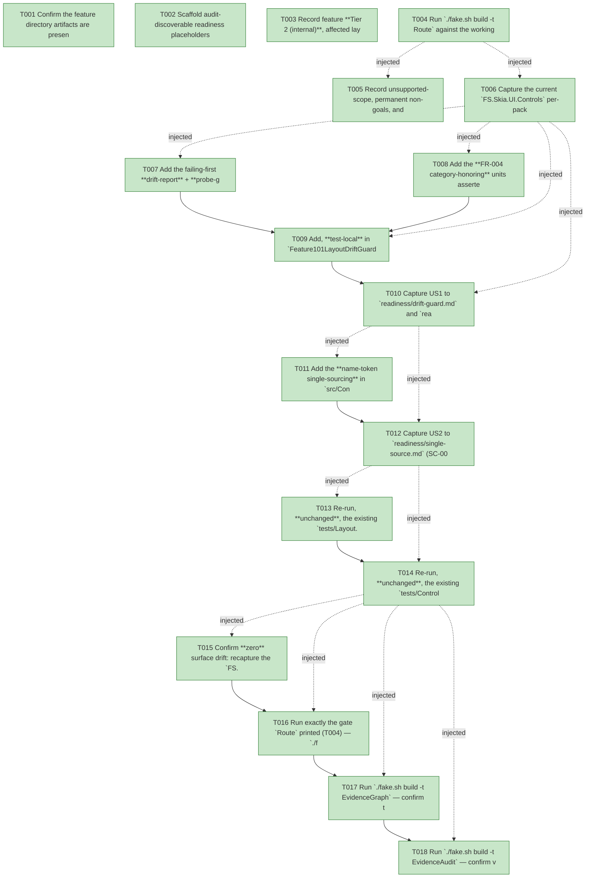

# Task Graph — 101-layout-dirty-set-guard

## ✓ Graph is acyclic and consistent

## Skill Match Assessments

| Task | Candidate | Confidence | Signals | Reviewer disposition | Diagnostic |
|------|-----------|------------|---------|----------------------|------------|
| T001 | (none) | none |  | accepted-empty | T001: skillist trusted as declared; no owns-based capability requirement |
| T002 | (none) | none |  | declared | T002: skillist trusted as declared; no owns-based capability requirement |
| T003 | (none) | none |  | accepted-empty | T003: skillist trusted as declared; no owns-based capability requirement |
| T004 | (none) | none |  | accepted-empty | T004: skillist trusted as declared; no owns-based capability requirement |
| T005 | (none) | none |  | declared | T005: skillist trusted as declared; no owns-based capability requirement |
| T006 | (none) | none |  | declared | T006: skillist trusted as declared; no owns-based capability requirement |
| T007 | (none) | none |  | declared | T007: skillist trusted as declared; no owns-based capability requirement |
| T008 | (none) | none |  | declared | T008: skillist trusted as declared; no owns-based capability requirement |
| T009 | (none) | none |  | declared | T009: skillist trusted as declared; no owns-based capability requirement |
| T010 | (none) | none |  | declared | T010: skillist trusted as declared; no owns-based capability requirement |
| T011 | (none) | none |  | declared | T011: skillist trusted as declared; no owns-based capability requirement |
| T012 | (none) | none |  | declared | T012: skillist trusted as declared; no owns-based capability requirement |
| T013 | (none) | none |  | declared | T013: skillist trusted as declared; no owns-based capability requirement |
| T014 | (none) | none |  | declared | T014: skillist trusted as declared; no owns-based capability requirement |
| T015 | (none) | none |  | declared | T015: skillist trusted as declared; no owns-based capability requirement |
| T016 | (none) | none |  | declared | T016: skillist trusted as declared; no owns-based capability requirement |
| T017 | speckit-evidence-graph | high | owns:graph-validation | accepted | T017: owns graph-validation requires skill speckit-evidence-graph; trigger_group=owns; matched_trigger=owns:graph-validation |
| T018 | speckit-evidence-audit | high | owns:evidence-audit | accepted | T018: owns evidence-audit requires skill speckit-evidence-audit; trigger_group=owns; matched_trigger=owns:evidence-audit |

## Status counts (effective)

| Status | Count |
|--------|-------|
| [X] done | 18 |
| [S] synthetic | 0 |
| [S*] auto-synthetic | 0 |
| accepted [SEH] synthetic | 0 |
| unaccepted synthetic | 0 |

## Graph



## ASCII view

```
T001 [X] Confirm the feature directory artifacts are present and linked (`spec.md`, `plan.md`, `research.md`, `data-model.md`, `quickstart.md`, `contracts/layout-drift-guard.md`, `checklists/`) and that `.specify/feature.json` resolves `specs/101-layout-dirty-set-guard`
T002 [X] Scaffold audit-discoverable readiness placeholders under `readiness/`: the feature-specific `drift-guard.md`, `category-honoring.md`, `single-source.md`, `r2-preservation.md`, `surface-baseline.md`, `validation-log.md`, plus the audit-enforced `governance-risk-levels.md`, `aggregate-hang-diagnostics.md`, `runtime-limitations.md`, `evidence-graph.md`, `evidence-audit.md`, and the not-applicable `window-visibility.md`, `real-image-evidence.md`, `visual-evidence-honesty.md` — each naming its authoritative command, artifact path, failure class, and next action using `key=value` lines (not bare image-filename claims); `window-visibility.md` / `real-image-evidence.md` / `visual-evidence-honesty.md` record the **not-applicable** decision with honest values per T003 (no window, no screenshot, byte-identical rendering output — R7 changes no rendering)
T003 [X] Record feature **Tier 2 (internal)**, affected layers (`FS.Skia.UI.Controls` — `src/Controls/Control.fs` `toLayout` ↔ `layoutAffectingAttrNames` coupling + the US2 name-token constants; `src/Controls/RetainedRender.fs` `layoutDirtySet` comment correction only; `tests/Controls.Tests/**`; `tests/Layout.Tests/**` re-run), public-API impact (**none** — no public/internal `.fsi` signature change; all new symbols private/test-local), MVU applicability (**N/A** — not stateful/IO; `layoutDriftReport`/probe are pure; Principle IV does not apply), and the evidence obligations from the plan; record as a **visible decision** that the persistent-launch / viewer-launch task-generation rule does **not** apply (no default-exe / persistent-launch entry point; rendering output byte-identical; `window-visibility.md` / `real-image-evidence.md` / `visual-evidence-honesty.md` are not-applicable with honest values) and that FR-009's permanent non-goals are preserved (no data binding, dependency properties, CSS selectors, or template engine)
T004 [X] Run `./fake.sh build -t Route` against the working-tree diff and confirm it routes **inner-loop → `Dev` only** (a framework-internal `src/Controls/**` + `tests/**` change with no `.fsi`/template/governance surface move, no new FAKE gate); record the authoritative gate list plus the small/medium/broad governance risk levels into `readiness/governance-risk-levels.md`; note that the feature's evidence obligations additionally run `EvidenceGraph` then `EvidenceAudit` sequentially
T005 [X] Record unsupported-scope, permanent non-goals, and the **FR-008 intrinsic-size-memo deferral** into `readiness/runtime-limitations.md` (research D6 / SC-006): R2 shipped a computed-`Bounds` cache only; the optional intrinsic-size memo named in roadmap §10.4 is **deferred** (no profiled workload shows the fixed-size-ancestor boundary re-measure is hot; adding an un-profiled cache would widen scope and risk the zero-delta guarantee), and the §10.4 wording reconciliation (R2 cached `Bounds` only, memo optional/deferred) is **delegated to R8**; also out of scope — R6 visual-state cross-fade, the R8 doc-narrowing reconciliations (Yoga point-scale rationale, R1/R5 surface notes), collection virtualization, and any expansion of the layout-driving attribute set (R7 guards un-guarded additions, it does not make them)
T006 [X] Capture the current `FS.Skia.UI.Controls` per-package internal `.fsi.txt` baseline (`PerPackageSurface.captureCurrent`) as the **pre-change reference** for the Phase-6 zero-surface-drift confirmation (SC-005), and confirm `tests/Controls.Tests` already reaches `ControlInternals.layoutAffectingAttrNames` / `evaluateLayout` / `layoutDirtySet` via the existing `InternalsVisibleTo "Controls.Tests"` (no new visibility grant needed)
T007 [X] Add the failing-first **drift-report** + **probe-gate** suite (`tests/Controls.Tests/Feature101LayoutDriftGuardTests.fs`; fails to compile/red until T009 adds the helpers; SC-001/FR-002/FR-003/FR-007). Negative directions over the pure `layoutDriftReport` with **simulated** sets: `({width;height;padding},{width;height})` → `[Uncovered "padding"]`; `({width},{width;orientation})` → `[OverBroad "orientation"]`; `({a;b},{b;c})` → `[Uncovered "a"; OverBroad "c"]` (both directions, sorted/order-stable); `({width;height;orientation},{width;height;orientation})` → `[]` (shipping state passes); and assert `formatDrift` names **each** attribute **and** its direction in human-legible text (FR-007), empty list → an explicit "no drift" string. Plus the load-bearing **positive gate**: `layoutDriftReport (discoverLayoutDrivingNames size) ControlInternals.layoutAffectingAttrNames = []` exercising the **real** `evaluateLayout` over the representative fixtures + corpus (data-model + research D2). Deterministic, in-process (`Check.One`-style, no repo-absent `testProperty`)
T008 [X] Add the **FR-004 category-honoring** units asserted directly on the **real** `internal layoutDirtySet prev patch next` (`tests/Controls.Tests/Feature101LayoutDriftGuardTests.fs`; contracts C3): (a) an `Update` whose `AttrChanges` set an `AttrSet { Category = AttrCategory.Layout }` with a name **absent** from `layoutAffectingAttrNames` puts the node id in the dirty set (category channel dirties); (b) an `AttrRemoved` of a name that was `Category = Layout` on the **prev** node dirties (the category-recovered-from-prev edge case); (c) an `AttrSet { Category = Visual }` content/style change does **not** dirty the node (SC-004 — no extra re-measure); and assert the name-set equality gate (T007) operates on **names only** and does **not** demand a category-only attribute appear in `layoutAffectingAttrNames` (the FR-003↔FR-004 independence resolution). These assert existing `layoutDirtySet` behavior (it already reads `attr.Category` independently) so they pin forward-compatibility without changing it
T009 [X] Add, **test-local** in `Feature101LayoutDriftGuardTests.fs`, the pure `layoutDriftReport (discovered: Set<string>) (covered: Set<string>) : DriftFinding list` (`DriftFinding = Uncovered of string | OverBroad of string`; exact set-difference both directions, sorted/total/never-throws) and `formatDrift` (human-legible, names attribute + direction; empty → "no drift"), plus the probe seam (`ProbeFixture`, `probeCorpus`, `nameDrivesLayout`, `discoverLayoutDrivingNames`) that toggles each corpus name on representative fixtures and compares the **real** `ControlInternals.evaluateLayout` root `LayoutNode` by structural equality (data-model §probe). `probeCorpus` MUST be built from the **concrete, traceable** source named in research D2 — the `Attr` builder vocabulary + attribute-name literals in `src/Controls/Control.fs`, unioned with `ControlInternals.layoutAffectingAttrNames` and the explicit non-layout names (`background`/`foreground`/`text`/a visual-state class) — **not** a hand-curated free list, so the under-coverage guarantee tracks the real control vocabulary. This makes T007 GREEN (and keeps T008 green; FR-001/FR-002/FR-003/FR-007). Correct the **false single-sourcing comment** at `src/Controls/Control.fs:1207` (and the mirroring note near `layoutDirtySet` in `src/Controls/RetainedRender.fs`) to stop claiming the literal and `toLayout` are single-sourced and instead point at the gate — **no behavior change** to `toLayout`/`layoutDirtySet`/the literal. Document the corpus-bounded coverage boundary at the test site (FR-007 observability)
T010 [X] Capture US1 to `readiness/drift-guard.md` and `readiness/category-honoring.md`: the two negative directions named by `formatDrift` (under-coverage `padding`, over-coverage `orientation`); the positive probe gate passing today (discovered = `{width;height;orientation}` = covered) and the named failure it would produce the instant `toLayout` reads an un-covered corpus name; the FR-004 category channel proven independent of the name set; and the documented corpus/fixture discipline that bounds the guarantee (read from the T007/T008 suite, not assumed) (SC-001)
T011 [X] Add the **name-token single-sourcing** in `src/Controls/Control.fs` (data-model §shared name-token constants): `let [<Literal>] private AttrWidth = "width"`, `AttrHeight = "height"`, `AttrOrientation = "orientation"`, referenced by `nodeWidth`/`nodeHeight` (`hasAttr`), `orientationOf`, **and** `layoutAffectingAttrNames`, so no string literal of a layout-driving name is duplicated — one authoritative token per name (SC-002). These are `private` to the `.fs`: **no `Control.fsi` change**, **no behavior change** (the same three strings, byte-identically), **no** per-package internal surface move expected
T012 [X] Capture US2 to `readiness/single-source.md` (SC-002): record that after R7 exactly **one** authoritative definition of each layout-driving attribute name exists (the `[<Literal>]` token), that `nodeWidth`/`nodeHeight`/`orientationOf` and `layoutAffectingAttrNames` all resolve to it with **zero** independent hand-maintained second list, and that the T009 behavioral-probe gate enforces **membership** equality so adding a name to the lowering without the classifier is now impossible to ship — by inspection plus the gate, the "make the comment's claim actually true" outcome
T013 [X] Re-run, **unchanged**, the existing `tests/Layout.Tests/Feature097IncrementalTests.fs` incremental-≡-full **byte-identity** property over ≥1000 randomized edit sequences and confirm it stays GREEN (R2 INV-1 / SC-004 / FR-005). R7 adds no code on the lowering/classifier path, so this is cited as the preservation proof, not re-implemented; record the result into `readiness/r2-preservation.md`
T014 [X] Re-run, **unchanged**, the existing `tests/Controls.Tests/Feature097WiringTests.fs` `WorkReductionRecord.RemeasuredNodeCount` assertions for a content-only / style / state / visual-state edit and confirm the re-measure count is **identical** to the pre-R7 baseline (no extra re-measure introduced; SC-003 / FR-006); record the result into `readiness/r2-preservation.md` alongside the T013 incremental-property outcome
T015 [X] Confirm **zero** surface drift: recapture the `FS.Skia.UI.Controls` per-package internal `.fsi.txt` baseline (`PerPackageSurface.captureCurrent`) and diff vs the T006 pre-change reference — confirm **no** public/internal `.fsi` signature change (the name-token constants are `private`, the report/probe are test-local); if an unintended internal-surface move is detected, recapture and note it explicitly; record to `readiness/surface-baseline.md` (SC-005)
T016 [X] Run exactly the gate `Route` printed (T004) — `./fake.sh build -t Dev` — and confirm the full Controls + Layout Expecto suites are green (the new `Feature101LayoutDriftGuardTests` drift-report + probe-gate + category units, plus the re-run unchanged `Feature097IncrementalTests` and `Feature097WiringTests`); record the aggregate as **non-authoritative** into `readiness/validation-log.md`; rerun any race-like FAKE failure **sequentially** before any product-regression claim; if an aggregate hangs, record the diagnosis in `readiness/aggregate-hang-diagnostics.md` (SC-005)
T017 [X] Run `./fake.sh build -t EvidenceGraph` — confirm the echoed `feature-directory` + `tasks=<n>` match this feature, no cycles, no dangling refs, no `[S*]` surprises; record to `readiness/evidence-graph.md`
T018 [X] Run `./fake.sh build -t EvidenceAudit` — confirm verdict PASS (synthetic-propagation + diff-scan; **no** synthetic/stub work, no `[S]`/`[S*]`) or document every `--accept-synthetic` override; record to `readiness/evidence-audit.md` with the verdict token
```

## Injected checkpoint edges (Phase N+1 → Phase N) — FR-007

- T004 → T005  (auto-injected Phase-checkpoint edge)
- T004 → T006  (auto-injected Phase-checkpoint edge)
- T006 → T007  (auto-injected Phase-checkpoint edge)
- T006 → T008  (auto-injected Phase-checkpoint edge)
- T006 → T009  (auto-injected Phase-checkpoint edge)
- T006 → T010  (auto-injected Phase-checkpoint edge)
- T010 → T011  (auto-injected Phase-checkpoint edge)
- T010 → T012  (auto-injected Phase-checkpoint edge)
- T012 → T013  (auto-injected Phase-checkpoint edge)
- T012 → T014  (auto-injected Phase-checkpoint edge)
- T014 → T015  (auto-injected Phase-checkpoint edge)
- T014 → T016  (auto-injected Phase-checkpoint edge)
- T014 → T017  (auto-injected Phase-checkpoint edge)
- T014 → T018  (auto-injected Phase-checkpoint edge)

## Resolved skillist ids — FR-007

Resolved skillist-id set (7): fs-skia-evidence-mode, fs-skia-layout, fs-skia-reconciliation, fs-skia-testing, fs-skia-ui-widgets, speckit-evidence-audit, speckit-evidence-graph

## Skillist id → SKILL.md path

fs-skia-evidence-mode → .agents/skills/fs-skia-evidence-mode/SKILL.md
fs-skia-layout → src/Layout/skill/SKILL.md
fs-skia-reconciliation → .agents/skills/fs-skia-reconciliation/SKILL.md
fs-skia-testing → src/Testing/skill/SKILL.md
fs-skia-ui-widgets → src/Controls/skill/SKILL.md
speckit-evidence-audit → .agents/skills/speckit-evidence-audit/SKILL.md
speckit-evidence-graph → .agents/skills/speckit-evidence-graph/SKILL.md

## Skillist id → unresolved / flagged

_(none — every declared skillist id resolves to exactly one installed skill)_

