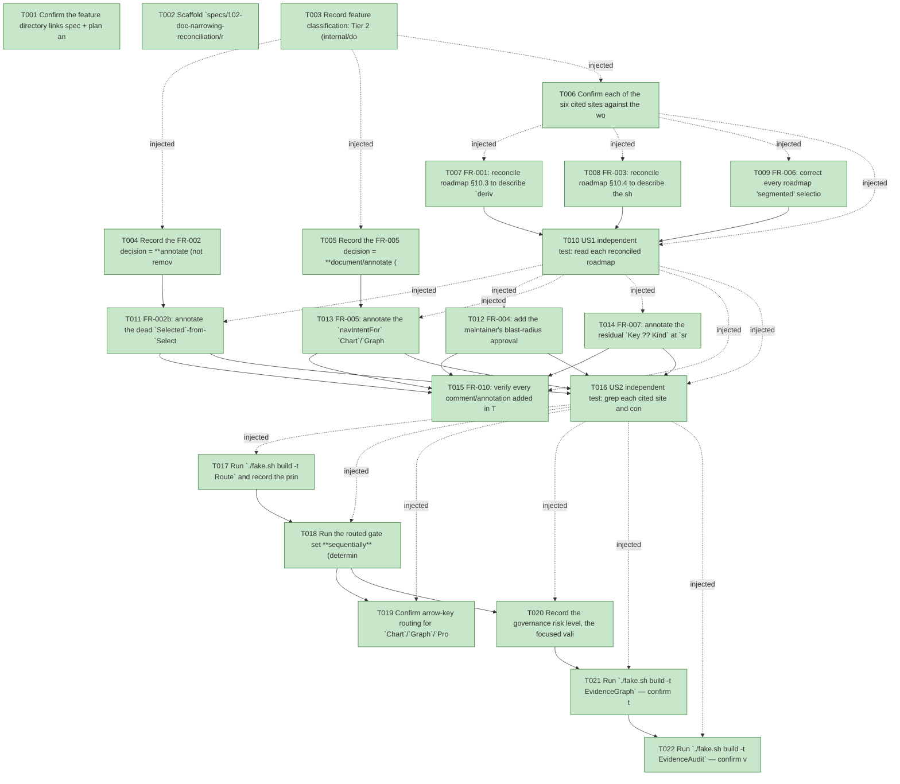

# Task Graph — 102-doc-narrowing-reconciliation

## ✓ Graph is acyclic and consistent

## Skill Match Assessments

| Task | Candidate | Confidence | Signals | Reviewer disposition | Diagnostic |
|------|-----------|------------|---------|----------------------|------------|
| T001 | (none) | none |  | accepted-empty | T001: skillist trusted as declared; no owns-based capability requirement |
| T002 | (none) | none |  | accepted-empty | T002: skillist trusted as declared; no owns-based capability requirement |
| T003 | (none) | none |  | accepted-empty | T003: skillist trusted as declared; no owns-based capability requirement |
| T004 | (none) | none |  | accepted-empty | T004: skillist trusted as declared; no owns-based capability requirement |
| T005 | (none) | none |  | accepted-empty | T005: skillist trusted as declared; no owns-based capability requirement |
| T006 | (none) | none |  | accepted-empty | T006: skillist trusted as declared; no owns-based capability requirement |
| T007 | (none) | none |  | accepted-empty | T007: skillist trusted as declared; no owns-based capability requirement |
| T008 | (none) | none |  | accepted-empty | T008: skillist trusted as declared; no owns-based capability requirement |
| T009 | (none) | none |  | accepted-empty | T009: skillist trusted as declared; no owns-based capability requirement |
| T010 | (none) | none |  | accepted-empty | T010: skillist trusted as declared; no owns-based capability requirement |
| T011 | (none) | none |  | accepted-empty | T011: skillist trusted as declared; no owns-based capability requirement |
| T012 | (none) | none |  | accepted-empty | T012: skillist trusted as declared; no owns-based capability requirement |
| T013 | (none) | none |  | accepted-empty | T013: skillist trusted as declared; no owns-based capability requirement |
| T014 | (none) | none |  | accepted-empty | T014: skillist trusted as declared; no owns-based capability requirement |
| T015 | (none) | none |  | accepted-empty | T015: skillist trusted as declared; no owns-based capability requirement |
| T016 | (none) | none |  | accepted-empty | T016: skillist trusted as declared; no owns-based capability requirement |
| T017 | (none) | none |  | accepted-empty | T017: skillist trusted as declared; no owns-based capability requirement |
| T018 | (none) | none |  | accepted-empty | T018: skillist trusted as declared; no owns-based capability requirement |
| T019 | (none) | none |  | accepted-empty | T019: skillist trusted as declared; no owns-based capability requirement |
| T020 | (none) | none |  | accepted-empty | T020: skillist trusted as declared; no owns-based capability requirement |
| T021 | speckit-evidence-graph | high | owns:graph-validation | accepted | T021: owns graph-validation requires skill speckit-evidence-graph; trigger_group=owns; matched_trigger=owns:graph-validation |
| T022 | speckit-evidence-audit | high | owns:evidence-audit | accepted | T022: owns evidence-audit requires skill speckit-evidence-audit; trigger_group=owns; matched_trigger=owns:evidence-audit |

## Status counts (effective)

| Status | Count |
|--------|-------|
| [X] done | 22 |
| [S] synthetic | 0 |
| [S*] auto-synthetic | 0 |
| accepted [SEH] synthetic | 0 |
| unaccepted synthetic | 0 |

## Graph



## ASCII view

```
T001 [X] Confirm the feature directory links spec + plan and the working tree matches the plan's verified-source-sites table (six cited narrowings present at the cited lines)
T002 [X] Scaffold `specs/102-doc-narrowing-reconciliation/readiness/` audit-enforced placeholders discoverable before implementation: `governance-risk-levels.md`, `aggregate-hang-diagnostics.md`, `runtime-limitations.md`, `generated-validation.md`, `window-visibility.md` (not-applicable — non-visual, no screenshots), `evidence-graph.md`, `evidence-audit.md` — each naming its authoritative command, artifact path, failure class, and next action
T003 [X] Record feature classification: Tier 2 (internal/documentation), affected layers `FS.Skia.UI.Controls` + `FS.Skia.UI.Layout` + repo report, public-API impact = none (zero `.fsi` delta under default choices), **Principle IV (MVU/effect) is not applicable** (no `Model`/`Msg`/`Effect`/`update` added or altered), and evidence obligations = routed gate set green + parity/golden unchanged + existing suites unchanged + `EvidenceGraph`/`EvidenceAudit` with 0 synthetic
T004 [X] Record the FR-002 decision = **annotate (not remove)** in `research.md`/`plan.md` with rationale (signature finding: the dead `Selected` branch drops no parameter, so removal would also be zero-`.fsi`-delta; annotate chosen as lowest-risk so no `deriveVisualState` test moves) — SC-006
T005 [X] Record the FR-005 decision = **document/annotate (not drop, not enable routing)** in `research.md`/`plan.md` with rationale (FR-008 banner constraint wins; enabling default `NavRange`s would move a parity row and is out of R8 scope) — SC-006
T006 [X] Confirm each of the six cited sites against the working tree and record the verification in `research.md` (roadmap §10.3/§10.4 + "segmented"; `ControlRuntime.fs` dead branch; `Layout.fs` Yoga comment; `Focus.fs` value-role branch; `Control.fs:1131` preview id)
T007 [X] FR-001: reconcile roadmap §10.3 to describe `deriveVisualState` as realizing only the 5-level runtime tail (`Pressed > Selected > Focused > Hover > Normal`), attributing the head semantic states and consumer-out-ranks-derived arbitration to `applyRuntimeVisualState` (the two-function split the `.fsi` already documents)
T008 [X] FR-003: reconcile roadmap §10.4 to describe the shipped R2 cache — a computed-`Bounds` cache keyed by structural `LayoutNodeId` — and remove the "intrinsic-size memo keyed by retained identity" claim, cross-referencing feature 101's recorded intrinsic-size-memo deferral (FR-008 of 101)
T009 [X] FR-006: correct every roadmap "segmented" selection-role mention (`:938`, `:1041`) to name the `AccessibilityRole`s that actually exist (no nonexistent `Segmented` role implied)
T010 [X] US1 independent test: read each reconciled roadmap section against its cited source lines and confirm zero remaining prose-vs-implementation contradiction for the three report items (SC-002); record the diff as the reconciliation evidence
T011 [X] FR-002b: annotate the dead `Selected`-from-`Selection` derivation in `src/Controls/ControlRuntime.fs` (`deriveVisualState`, branch at `:206-207`) as forward-looking, stating the live host (`ControlsElmish`) does not populate `Selection`, so only consumer-set `Selected` fires today — annotation only, no logic change
T012 [X] FR-004: add the maintainer's blast-radius approval rationale ("blast-radius nil, Controls integer geometry unaffected") to the Yoga point-scale-rounding disable comment in `src/Layout/Layout.fs:7-12`, alongside the existing INV-1 correctness motive
T013 [X] FR-005: annotate the `navIntentFor` `Chart`/`Graph`/`Progress` value-role branch in `src/Controls/Focus.fs:123-129` as classed-but-not-routed-by-default (because `Accessibility.defaultFor` gives those roles no `NavRange`) — note only, routing unchanged
T014 [X] FR-007: annotate the residual `Key ?? Kind` at `src/Controls/Control.fs:1131` as the legacy 080 single-control **preview** path, distinct from the R3-unified `Key ?? path` dispatch/recovery id (feature 098), so it is not mistaken for the divergence R3 removed
T015 [X] FR-010: verify every comment/annotation added in T011–T014 is purely descriptive and carries no gate-significant token or literal evidence filename that could trip the window-visibility or diff-scan audits
T016 [X] US2 independent test: grep each cited site and confirm the annotation is present and accurate (SC-001) — each independently inspectable; record the source diffs as evidence
T017 [X] Run `./fake.sh build -t Route` and record the printed tier + minimal gate list in `readiness/generated-validation.md` (expect escalation to controls-public-surface per feature 101); run only the gates it prints
T018 [X] Run the routed gate set **sequentially** (deterministic order, no concurrent FAKE); confirm rendering output, parity/golden evidence, and the R1/R2/R4/R5 property + unit suites (Controls / Elmish / Layout) are green and unchanged, and that no public `.fsi`/surface baseline moved (SC-003, SC-005). A moved or edited test is a red flag that a comment was parsed as a behavior token (FR-010) — investigate, do not accept
T019 [X] Confirm arrow-key routing for `Chart`/`Graph`/`Progress` is unchanged (still not routed by default) — the existing navigation suite passes without modification (SC-004)
T020 [X] Record the governance risk level, the focused validation run for it, whether broad validation was required, and any non-authoritative aggregate result (e.g. `GeneratedProductCheck` environment-class failure) in `readiness/governance-risk-levels.md` + `readiness/aggregate-hang-diagnostics.md`
T021 [X] Run `./fake.sh build -t EvidenceGraph` — confirm the echoed `feature-directory`/`tasks=<n>` match this feature, no cycles, no dangling refs, no `[S*]` surprises; write `readiness/evidence-graph.md`
T022 [X] Run `./fake.sh build -t EvidenceAudit` — confirm verdict PASS with **0 synthetic**; write `readiness/evidence-audit.md` with a verdict token and ensure `readiness/generated-validation.md` records package-resolution=resolved / package-mismatch=false
```

## Injected checkpoint edges (Phase N+1 → Phase N) — FR-007

- T003 → T004  (auto-injected Phase-checkpoint edge)
- T003 → T005  (auto-injected Phase-checkpoint edge)
- T003 → T006  (auto-injected Phase-checkpoint edge)
- T006 → T007  (auto-injected Phase-checkpoint edge)
- T006 → T008  (auto-injected Phase-checkpoint edge)
- T006 → T009  (auto-injected Phase-checkpoint edge)
- T006 → T010  (auto-injected Phase-checkpoint edge)
- T010 → T011  (auto-injected Phase-checkpoint edge)
- T010 → T012  (auto-injected Phase-checkpoint edge)
- T010 → T013  (auto-injected Phase-checkpoint edge)
- T010 → T014  (auto-injected Phase-checkpoint edge)
- T010 → T015  (auto-injected Phase-checkpoint edge)
- T010 → T016  (auto-injected Phase-checkpoint edge)
- T016 → T017  (auto-injected Phase-checkpoint edge)
- T016 → T018  (auto-injected Phase-checkpoint edge)
- T016 → T019  (auto-injected Phase-checkpoint edge)
- T016 → T020  (auto-injected Phase-checkpoint edge)
- T016 → T021  (auto-injected Phase-checkpoint edge)
- T016 → T022  (auto-injected Phase-checkpoint edge)

## Resolved skillist ids — FR-007

Resolved skillist-id set (2): speckit-evidence-audit, speckit-evidence-graph

## Skillist id → SKILL.md path

speckit-evidence-audit → .agents/skills/speckit-evidence-audit/SKILL.md
speckit-evidence-graph → .agents/skills/speckit-evidence-graph/SKILL.md

## Skillist id → unresolved / flagged

_(none — every declared skillist id resolves to exactly one installed skill)_

