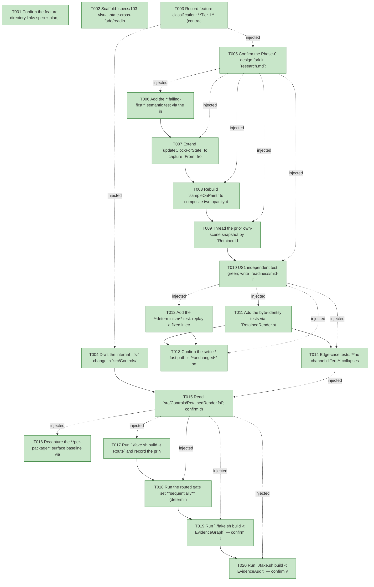

# Task Graph — 103-visual-state-cross-fade

## ✓ Graph is acyclic and consistent

## Skill Match Assessments

| Task | Candidate | Confidence | Signals | Reviewer disposition | Diagnostic |
|------|-----------|------------|---------|----------------------|------------|
| T001 | (none) | none |  | accepted-empty | T001: skillist trusted as declared; no owns-based capability requirement |
| T002 | (none) | none |  | declared | T002: skillist trusted as declared; no owns-based capability requirement |
| T003 | (none) | none |  | accepted-empty | T003: skillist trusted as declared; no owns-based capability requirement |
| T004 | (none) | none |  | declared | T004: skillist trusted as declared; no owns-based capability requirement |
| T005 | (none) | none |  | declared | T005: skillist trusted as declared; no owns-based capability requirement |
| T006 | (none) | none |  | declared | T006: skillist trusted as declared; no owns-based capability requirement |
| T007 | (none) | none |  | declared | T007: skillist trusted as declared; no owns-based capability requirement |
| T008 | (none) | none |  | declared | T008: skillist trusted as declared; no owns-based capability requirement |
| T009 | (none) | none |  | declared | T009: skillist trusted as declared; no owns-based capability requirement |
| T010 | (none) | none |  | declared | T010: skillist trusted as declared; no owns-based capability requirement |
| T011 | (none) | none |  | declared | T011: skillist trusted as declared; no owns-based capability requirement |
| T012 | (none) | none |  | declared | T012: skillist trusted as declared; no owns-based capability requirement |
| T013 | (none) | none |  | declared | T013: skillist trusted as declared; no owns-based capability requirement |
| T014 | (none) | none |  | declared | T014: skillist trusted as declared; no owns-based capability requirement |
| T015 | (none) | none |  | declared | T015: skillist trusted as declared; no owns-based capability requirement |
| T016 | (none) | none |  | accepted-empty | T016: skillist trusted as declared; no owns-based capability requirement |
| T017 | (none) | none |  | accepted-empty | T017: skillist trusted as declared; no owns-based capability requirement |
| T018 | (none) | none |  | accepted-empty | T018: skillist trusted as declared; no owns-based capability requirement |
| T019 | speckit-evidence-graph | high | owns:graph-validation | accepted | T019: owns graph-validation requires skill speckit-evidence-graph; trigger_group=owns; matched_trigger=owns:graph-validation |
| T020 | speckit-evidence-audit | high | owns:evidence-audit | accepted | T020: owns evidence-audit requires skill speckit-evidence-audit; trigger_group=owns; matched_trigger=owns:evidence-audit |

## Status counts (effective)

| Status | Count |
|--------|-------|
| [X] done | 20 |
| [S] synthetic | 0 |
| [S*] auto-synthetic | 0 |
| accepted [SEH] synthetic | 0 |
| unaccepted synthetic | 0 |

## Graph



## ASCII view

```
T001 [X] Confirm the feature directory links spec + plan, then confirm the four root-cause sites are present at the cited lines: `fadeAnimation` (fixed opacity-only `Animation`, `src/Controls/RetainedRender.fs:~94`), `updateClockForState` (state-change detector with no endpoint knowledge, `:~123`), `sampleOnPaint` (opacity-only overlay, `:~153`), and the `AnimationClock` type doc that over-advertises a color channel (`src/Controls/RetainedRender.fsi:~40-51`)
T002 [X] Scaffold `specs/103-visual-state-cross-fade/readiness/` audit-enforced placeholders discoverable before implementation — `governance-risk-levels.md`, `aggregate-hang-diagnostics.md`, `runtime-limitations.md`, `generated-validation.md`, `visual-evidence-honesty.md`, `window-visibility.md` (not-applicable — assembly is GPU-free byte-identity/interpolation evidence, no persistent window or screenshots), `real-image-evidence.md` (not-applicable — deterministic scene assembly, no captured images), `at-rest-byte-identity.md`, `final-frame-identity.md`, `mid-flight-interpolation.md`, `determinism.md`, `evidence-graph.md`, `evidence-audit.md` — each naming its authoritative command, artifact path, failure class, and next action
T003 [X] Record feature classification: **Tier 1** (contracted), affected layer `FS.Skia.UI.Controls` (`RetainedRender` internals), public-API impact = **none** (public `runInteractiveApp`/consumer surface unchanged; only the internal `AnimationClock` `.fsi` field + doc), **Principle IV (MVU/effect) not applicable** (no `Model`/`Msg`/`Effect`/`update` added — reuses the feature-099 host-tick → `advance` → assemble seam), and the five evidence obligations (at-rest, final-frame, mid-flight, determinism, graph+audit with 0 synthetic)
T004 [X] Draft the internal `.fsi` change in `src/Controls/RetainedRender.fsi`: the **internal** `AnimationClock` type gains a `From : FS.Skia.UI.Scene.Scene list` prior-snapshot field, and its doc-comment is reconciled to describe the **snapshot-composite** cross-fade and drop the unfulfilled standalone Scene-`Color`-tween claim (FR-009). The **public** surface stays byte-identical
T005 [X] Confirm the Phase-0 design fork in `research.md`: `Animation.applyAt` **never applies the `Color` tween** (samples opacity/transform only) and a single Scene `Color` tween cannot represent the multi-channel `Foreground`/`Fill`/`Stroke` paint `Style.resolve` produces — so the cross-fade is realized by **compositing the two cached static own-scene snapshots** via the public opacity tween, and record the retarget-on-second-change and doc-reconciliation (FR-009) decisions
T006 [X] Add the **failing-first** semantic test via the internal `RetainedRender.step` surface (`<InternalsVisibleTo>`): drive a control whose `Style.resolve` output differs between `Normal` and `Hover`/`Focused` in a token-derived color channel through `Normal → Hover` with a fixed injected-delta sequence, sample an intermediate frame, and assert a color channel value lies **strictly between** the prior and next resolved-style endpoints. Red initially (the new appearance only fades in from transparent) (SC-001 / INV-3)
T007 [X] Extend `updateClockForState` to capture `From` from the **matched prior retained node's `Fragment.OwnScene`** at transition start, and on a **mid-flight retarget** seed `From` from the previous target's own snapshot with `Elapsed = 0` (FR-001, FR-007)
T008 [X] Rebuild `sampleOnPaint` to composite two opacity-driven layers via the **public** `Animation.applyAt`: the `From` prior layer fades out (`1 → 0`) **under** the next own-scene fading in (`0 → 1`); `From = []` degenerates to today's fade-in (a safe degenerate case, not a special path) (FR-002)
T009 [X] Thread the prior own-scene snapshot by `RetainedId` through the assemble walk; the composite branch is entered **only** when `clockActive clock` is true (a settled clock paints `ownStatic` verbatim) (FR-002, preserves the settle path for INV-2)
T010 [X] US1 independent test green; write `readiness/mid-flight-interpolation.md` — an intermediate composited color of a both-states-painted region strictly between the `Normal` and `Hover` endpoints (with `Animation.lerpColor` endpoints as the strictly-between reference; mid-flight is animation, not golden) (SC-001 / INV-3)
T011 [X] Add the byte-identity tests via `RetainedRender.step`: (a) **at-rest** — with no clock in flight the assembled scene equals the cached `SubtreeScene` and **no** animation attribute is emitted (SC-002 / INV-1); (b) **final-frame** — advance a transition past its duration with a large injected delta and assert the frame is byte-identical to the statically snapped render of the new state for **every** animated channel (SC-003 / INV-2)
T012 [X] Add the **determinism** test: replay a fixed injected-delta sequence (repo has no `testProperty` — use `Check.One`, `[[feature-099-live-animation-clock]]`) and assert an identical sampled-frame sequence; a non-positive delta is a no-op (never rewinds) and a past-duration delta settles canonically with no overshoot in any channel (SC-004 / INV-4)
T013 [X] Confirm the settle / fast path is **unchanged** so FR-004/FR-005 hold by construction (the cross-fade is an assembly-time overlay gated to mid-flight frames only); write `readiness/at-rest-byte-identity.md`, `readiness/final-frame-identity.md`, and `readiness/determinism.md`
T014 [X] Edge-case tests: **no channel differs** collapses the tween to a no-op with no spurious repaint; a **held** state stays a `Keep` after settle (the `Reconcile.attrValueEqual` `VisualStateValue` equality case from feature 099 stays intact — single scoped repaint, not per-frame); a settled **return-to-`Normal`** clock is still **dropped** so the identity returns to byte-identical at-rest output, now also discarding `From` (FR-008, INV-5/INV-6, SC-006)
T015 [X] Read `src/Controls/RetainedRender.fsi`; confirm the reconciled `AnimationClock` doc names **exactly** the channels the implementation drives (the opacity tween + the snapshot composite), that every advertised channel is exercised by a test in this feature, and that the dropped standalone color-tween claim is gone — no doc-advertised channel left undriven (FR-009 / SC-005 / INV-7)
T016 [X] Recapture the **per-package** surface baseline via `PerPackageSurface.captureCurrent` for the moved internal `AnimationClock` `.fsi` field/doc (`RefreshSurfaceBaselines` does **not** regenerate per-package snapshots — `[[per-package-baseline-not-in-refresh-target]]`)
T017 [X] Run `./fake.sh build -t Route` and record the printed tier + minimal gate list in `readiness/generated-validation.md` (expect escalation to `controls-public-surface` per feature 101); run only the gates it prints
T018 [X] Run the routed gate set **sequentially** (deterministic order, no concurrent FAKE); confirm rendering output, the Controls + Elmish suites, and the 099/101 property + unit suites are green and unchanged, the held-state single-repaint invariant holds, and no **public** `.fsi`/surface baseline moved; record the governance risk level, focused validation run, whether broad validation was required, and any non-authoritative aggregate result in `readiness/governance-risk-levels.md` + `readiness/aggregate-hang-diagnostics.md` (SC-006)
T019 [X] Run `./fake.sh build -t EvidenceGraph` — confirm the echoed `feature-directory`/`tasks=<n>` match this feature, no cycles, no dangling refs, no `[S*]` surprises; write `readiness/evidence-graph.md`
T020 [X] Run `./fake.sh build -t EvidenceAudit` — confirm verdict PASS with **0 synthetic**; write `readiness/evidence-audit.md` with a verdict token and ensure `readiness/generated-validation.md` records `package-resolution=resolved` / `package-mismatch=false`
```

## Injected checkpoint edges (Phase N+1 → Phase N) — FR-007

- T003 → T004  (auto-injected Phase-checkpoint edge)
- T003 → T005  (auto-injected Phase-checkpoint edge)
- T005 → T006  (auto-injected Phase-checkpoint edge)
- T005 → T007  (auto-injected Phase-checkpoint edge)
- T005 → T008  (auto-injected Phase-checkpoint edge)
- T005 → T009  (auto-injected Phase-checkpoint edge)
- T005 → T010  (auto-injected Phase-checkpoint edge)
- T010 → T011  (auto-injected Phase-checkpoint edge)
- T010 → T012  (auto-injected Phase-checkpoint edge)
- T010 → T013  (auto-injected Phase-checkpoint edge)
- T010 → T014  (auto-injected Phase-checkpoint edge)
- T014 → T015  (auto-injected Phase-checkpoint edge)
- T015 → T016  (auto-injected Phase-checkpoint edge)
- T015 → T017  (auto-injected Phase-checkpoint edge)
- T015 → T018  (auto-injected Phase-checkpoint edge)
- T015 → T019  (auto-injected Phase-checkpoint edge)
- T015 → T020  (auto-injected Phase-checkpoint edge)

## Resolved skillist ids — FR-007

Resolved skillist-id set (6): fs-skia-evidence-mode, fs-skia-reconciliation, fs-skia-scene, fs-skia-testing, speckit-evidence-audit, speckit-evidence-graph

## Skillist id → SKILL.md path

fs-skia-evidence-mode → .agents/skills/fs-skia-evidence-mode/SKILL.md
fs-skia-reconciliation → .agents/skills/fs-skia-reconciliation/SKILL.md
fs-skia-scene → src/Scene/skill/SKILL.md
fs-skia-testing → src/Testing/skill/SKILL.md
speckit-evidence-audit → .agents/skills/speckit-evidence-audit/SKILL.md
speckit-evidence-graph → .agents/skills/speckit-evidence-graph/SKILL.md

## Skillist id → unresolved / flagged

_(none — every declared skillist id resolves to exactly one installed skill)_

