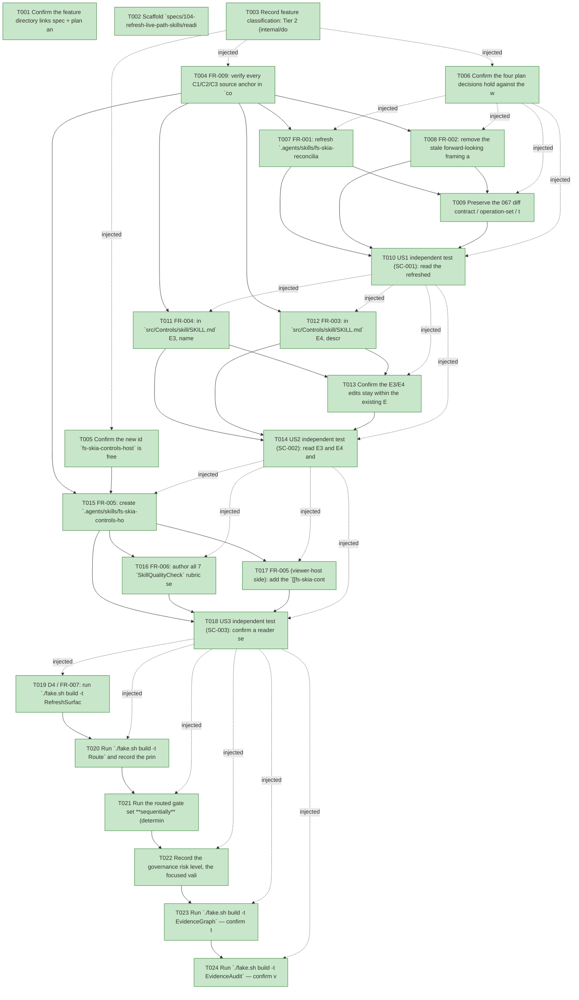

# Task Graph — 104-refresh-live-path-skills

## ✓ Graph is acyclic and consistent

## Skill Match Assessments

| Task | Candidate | Confidence | Signals | Reviewer disposition | Diagnostic |
|------|-----------|------------|---------|----------------------|------------|
| T001 | (none) | none |  | accepted-empty | T001: skillist trusted as declared; no owns-based capability requirement |
| T002 | (none) | none |  | accepted-empty | T002: skillist trusted as declared; no owns-based capability requirement |
| T003 | (none) | none |  | accepted-empty | T003: skillist trusted as declared; no owns-based capability requirement |
| T004 | (none) | none |  | accepted-empty | T004: skillist trusted as declared; no owns-based capability requirement |
| T005 | (none) | none |  | accepted-empty | T005: skillist trusted as declared; no owns-based capability requirement |
| T006 | (none) | none |  | accepted-empty | T006: skillist trusted as declared; no owns-based capability requirement |
| T007 | (none) | none |  | declared | T007: skillist trusted as declared; no owns-based capability requirement |
| T008 | (none) | none |  | declared | T008: skillist trusted as declared; no owns-based capability requirement |
| T009 | (none) | none |  | declared | T009: skillist trusted as declared; no owns-based capability requirement |
| T010 | (none) | none |  | declared | T010: skillist trusted as declared; no owns-based capability requirement |
| T011 | (none) | none |  | declared | T011: skillist trusted as declared; no owns-based capability requirement |
| T012 | (none) | none |  | declared | T012: skillist trusted as declared; no owns-based capability requirement |
| T013 | (none) | none |  | declared | T013: skillist trusted as declared; no owns-based capability requirement |
| T014 | (none) | none |  | declared | T014: skillist trusted as declared; no owns-based capability requirement |
| T015 | (none) | none |  | declared | T015: skillist trusted as declared; no owns-based capability requirement |
| T016 | (none) | none |  | declared | T016: skillist trusted as declared; no owns-based capability requirement |
| T017 | (none) | none |  | declared | T017: skillist trusted as declared; no owns-based capability requirement |
| T018 | (none) | none |  | declared | T018: skillist trusted as declared; no owns-based capability requirement |
| T019 | (none) | none |  | accepted-empty | T019: skillist trusted as declared; no owns-based capability requirement |
| T020 | (none) | none |  | accepted-empty | T020: skillist trusted as declared; no owns-based capability requirement |
| T021 | (none) | none |  | accepted-empty | T021: skillist trusted as declared; no owns-based capability requirement |
| T022 | (none) | none |  | accepted-empty | T022: skillist trusted as declared; no owns-based capability requirement |
| T023 | speckit-evidence-graph | high | owns:graph-validation | accepted | T023: owns graph-validation requires skill speckit-evidence-graph; trigger_group=owns; matched_trigger=owns:graph-validation |
| T024 | speckit-evidence-audit | high | owns:evidence-audit | accepted | T024: owns evidence-audit requires skill speckit-evidence-audit; trigger_group=owns; matched_trigger=owns:evidence-audit |

## Status counts (effective)

| Status | Count |
|--------|-------|
| [X] done | 24 |
| [S] synthetic | 0 |
| [S*] auto-synthetic | 0 |
| accepted [SEH] synthetic | 0 |
| unaccepted synthetic | 0 |

## Graph



## ASCII view

```
T001 [X] Confirm the feature directory links spec + plan and that the three skill targets exist where the plan's "Artifacts touched" table names them (`.agents/skills/fs-skia-reconciliation/SKILL.md` present, `src/Controls/skill/SKILL.md` present, `.agents/skills/fs-skia-controls-host/` absent = to-create) — verified: reconciliation + Controls skills present, `fs-skia-controls-host` absent (to-create)
T002 [X] Scaffold `specs/104-refresh-live-path-skills/readiness/` audit-enforced placeholders discoverable before implementation: `governance-risk-levels.md`, `aggregate-hang-diagnostics.md`, `runtime-limitations.md`, `generated-validation.md`, `window-visibility.md` (not-applicable — non-visual skill docs, no screenshots/window launch) + the full window-visibility satellite set (`interactive-visible-window.md`, `close-reason-separation.md`, `window-state-diagnostics.md`, `window-options.md`, `real-image-evidence.md`), `skill-loading-evidence.md`, `evidence-graph.md`, `evidence-audit.md` — each naming its authoritative command, artifact path, failure class, and next action
T003 [X] Record feature classification: Tier 2 (internal/documentation), affected artifacts = `.agents/skills/fs-skia-reconciliation` + `src/Controls/skill` + NEW `.agents/skills/fs-skia-controls-host` + generated `.claude/skills/**` & `skillist-reference.md`, public-API impact = none (zero `.fsi` delta, FR-008), **Principle IV (MVU/effect) is not applicable** (no `Model`/`Msg`/`Effect`/`update` added or altered — the host's MVU boundary is *documented*, not modified), and evidence obligations = `SkillQualityCheck`/`SkillSyncCheck` green + `RefreshSurfaceBaselines` regeneration + routed gate set green + `EvidenceGraph`/`EvidenceAudit` with 0 synthetic — recorded in `readiness/governance-risk-levels.md` + `readiness/runtime-limitations.md`
T004 [X] FR-009: verify every C1/C2/C3 source anchor in `contracts/currency-claims.md` is present on `main` at the cited lines — `src/Controls/RetainedRender.fsi` (`AnimationClock`, `LayoutResult` bounds cache, `RemeasuredNodeCount`, `sampleOnPaint`), `src/Controls/Focus.fsi` (`route(role, keyboard, navRange, key, isTab, shift)`, closed `NavIntent`), `src/Controls/ControlRuntime.fsi` (public `deriveVisualState`, internal `applyRuntimeVisualState`), `src/Controls.Elmish/ControlsElmish.fsi` (`runInteractiveApp`, `routeFocusedKey`, `retainedHitTest`) — record the verification in `research.md` (R7: all anchors present/current on `main`)
T005 [X] Confirm the new id `fs-skia-controls-host` is free in BOTH the `.agents/skills/<id>` and the `src/*/skill` package-skill namespaces (single `SkillSyncCheck` namespace — the `fs-skia-viewer-host` rename precedent), so US3 introduces no collision; record the check in `research.md` (R8: free in both namespaces)
T006 [X] Confirm the four plan decisions hold against the working tree: D1 (refresh `fs-skia-reconciliation` in place, no new sibling), D2 (US3 is an `.agents` domain skill `fs-skia-controls-host`, not a `src/Controls.Elmish/skill` package skill — package skills are not mirrored into `.claude/**`), D3 (no constitution edit — its registry omits `fs-skia-reconciliation`/`fs-skia-viewer-host`), D4 (regenerate, never hand-edit, `.claude/**` + `skillist-reference.md`) — recorded in `research.md` R9
T007 [X] FR-001: refresh `.agents/skills/fs-skia-reconciliation/SKILL.md` disposition to current-through-103, adding a "Live retained render path (096–103)" account covering C1 claims — status current through 103 not frozen at 091 (C1#1); `RetainedRender.step` threads a previous-frame `LayoutResult` bounds cache, unchanged subtrees reuse bounds (C1#2); `WorkReductionRecord.RemeasuredNodeCount` reports the post-propagation re-measure set, 097/101 (C1#3); per-identity `AnimationClock {Anim;Elapsed;Target;From}` advanced by an injected host delta (no wall-clock) and sampled on paint, settled/absent ⇒ byte-identical at rest, 099 (C1#4); the paint cross-fade is a two-snapshot composite — prior `From` fading out under next own-scene fading in via `sampleOnPaint`, not a `Color` tween, 103 (C1#5); runtime visual state is stamped pre-reconcile by `applyRuntimeVisualState`, `updateClockForState` decides start/retarget/advance/drop, 096 (C1#6)
T008 [X] FR-002: remove the stale forward-looking framing at `fs-skia-reconciliation/SKILL.md:33-35` ("further work (E3 style, E4 focus, virtualization) *builds atop* the wired path") and replace it with shipped-truth — those landed as 093/094 and 096–103; no statement may imply 096–103 are future/not-yet-shipped work
T009 [X] Preserve the 067 diff contract / operation-set / totality-determinism-identity-at-rest-round-trip invariants and the `module internal` disposition (zero public-surface delta); confirm all 7 `SkillQualityCheck` rubric sections survive; add the `[[fs-skia-controls-host]]` back-link to the Related section (FR-005 cross-link — reconciliation side)
T010 [X] US1 independent test (SC-001): read the refreshed skill cold and check every live-path disposition claim against `src/Controls/RetainedRender.fsi`, `Reconcile.fsi`, and the live host in `src/Controls.Elmish/ControlsElmish.fs`; confirm each statement is true on `main` today and that no claim frames 096–103 as unshipped; record the diff as the currency evidence
T011 [X] FR-004: in `src/Controls/skill/SKILL.md` E3, name the runtime visual-state entry point added in feature 096 — public `deriveVisualState model controlId : VisualState` (the closed precedence tail the resolver consumes, C2#1) and internal `applyRuntimeVisualState` which stamps the derived state pre-reconcile while consumers read state via `deriveVisualState` (C2#2) — placed where a reader looks for runtime visual state
T012 [X] FR-003: in `src/Controls/skill/SKILL.md` E4, describe `Focus.route` as it ships after feature 100 — inputs `role`, `keyboard`, `navRange`, `key`, `isTab`, `shift` returning `KeyRouting` (C2#3) and the closed `NavIntent` = `ValueStep of delta` | `SelectionMove of Direction` | `GridMove of rowDelta*colDelta` carried by `KeyRouting.Navigate` (C2#4); remove the pre-100 "classifies a delivered key against the focused control" prose at `:124-127` and its two-line example at `:129-132` (the `### E4` heading at `:122` stays)
T013 [X] Confirm the E3/E4 edits stay within the existing E3/E4 headings, that no code example references a signature that no longer exists, and that the skill still passes all 7 `SkillQualityCheck` rubric sections (Sources/Related/mandate/examples retained)
T014 [X] US2 independent test (SC-002): read E3 and E4 and check them against `src/Controls/Focus.fsi` and the visual-state surface (`ControlRuntime.fsi`) on `main` — `Focus.route`'s description matches its current signature and the `NavIntent` model, `deriveVisualState` is named where runtime visual state is taught, and zero examples reference a superseded signature
T015 [X] FR-005: create `.agents/skills/fs-skia-controls-host/SKILL.md` (id `fs-skia-controls-host`) covering the maintainer-facing `Controls.Elmish` interactive-host seam — C3 claims: `runInteractiveApp` live entry + host record `Init/Update/View/MapKey/MapPointer/Tick/Theme` (C3#1); host holds the `RetainedRender` structure in interpreter-edge ref state and produces each frame via `RetainedRender.step` carrying `StateByIdentity`/`Layout`/`Theme` (C3#2); `host.Tick` advances each identity's `AnimationClock` by the injected delta before render, sample-on-paint composites the cross-fade (C3#3); visual state assembled from pointer/focus and stamped via `applyRuntimeVisualState` pre-reconcile each frame (C3#4); key delivery via internal `routeFocusedKey` (E1 text seam → `Focus.route` activation/navigation/Tab → fallthrough to `host.MapKey`) (C3#5); pointer hit-testing via `retainedHitTest` resolving to a stable identity (C3#6)
T016 [X] FR-006: author all 7 `SkillQualityCheck` rubric sections in the new skill — Scope, Driven-library API, a runnable example, ≥2 research URLs, the persistent-problem mandate phrase "official online docs first" (one line), `[[related]]` links, and Sources — with cross-links `[[fs-skia-reconciliation]]` (the retained structure it drives), `[[fs-skia-viewer-host]]` (the consumer-facing counterpart), and `[[fs-skia-ui-widgets]]` (the controls it hosts)
T017 [X] FR-005 (viewer-host side): add the `[[fs-skia-controls-host]]` back-link to `.agents/skills/fs-skia-viewer-host/SKILL.md` Related section (the reconciliation back-link landed in T009), keeping the consumer-facing scope unchanged — a cross-link, not a redesign (spec A2)
T018 [X] US3 independent test (SC-003): confirm a reader searching the corpus for the interactive host finds exactly one dedicated `Controls.Elmish` host skill, distinct from the consumer-facing `fs-skia-viewer-host`, that passes the rubric and cross-links (rather than duplicates) the reconciliation and viewer-host skills
T019 [X] D4 / FR-007: run `./fake.sh build -t RefreshSurfaceBaselines` to regenerate `.claude/skills/**` byte-identical to `.agents/skills/**` (including the NEW `.claude/skills/fs-skia-controls-host/SKILL.md`) and `template/base/docs/skillist-reference.md` (registering the new `fs-skia-controls-host` id); never hand-edit `.claude/**`
T020 [X] Run `./fake.sh build -t Route` and record the printed tier + minimal gate list in `readiness/generated-validation.md` (expect the skill gates `SkillQualityCheck`/`SkillSyncCheck` and — because US2 edits `src/Controls/**` — possibly the escalated controls-public-surface set + `EvidenceGraph` + `EvidenceAudit`, per the 102 precedent); run only the gates it prints
T021 [X] Run the routed gate set **sequentially** (deterministic order, no concurrent FAKE); confirm `SkillQualityCheck` PASS for every in-scope skill (7 sections each), `SkillSyncCheck` reports no `.agents`↔`.claude` drift (mirror byte-identical), `Dev` is green, and the FR-008/SC-005 proof holds — `git diff --stat` shows zero `src/**/*.fsi` lines and the only `src/**` file touched is `src/Controls/skill/SKILL.md` (Markdown), with no product test file changed (SC-004, SC-005). A moved or edited test is a red flag that a skill token was parsed as a behavior change — investigate, do not accept
T022 [X] Record the governance risk level, the focused validation run for it, whether broad validation was required (`Route --enforce` named no missing artifact), and any non-authoritative aggregate result (e.g. a `GeneratedProductCheck` environment-class failure) in `readiness/governance-risk-levels.md` + `readiness/aggregate-hang-diagnostics.md`; confirm `readiness/window-visibility.md` records the non-applicable verdict (no window launch / no screenshots in a docs-only change)
T023 [X] Run `./fake.sh build -t EvidenceGraph` — confirm the echoed `feature-directory`/`tasks=<n>` match this feature, no cycles, no dangling refs, no `[S*]` surprises; write `readiness/evidence-graph.md`
T024 [X] Run `./fake.sh build -t EvidenceAudit` — confirm verdict PASS with **0 synthetic**; write `readiness/evidence-audit.md` with a verdict token and ensure `readiness/generated-validation.md` records package-resolution=resolved / package-mismatch=false
```

## Injected checkpoint edges (Phase N+1 → Phase N) — FR-007

- T003 → T004  (auto-injected Phase-checkpoint edge)
- T003 → T005  (auto-injected Phase-checkpoint edge)
- T003 → T006  (auto-injected Phase-checkpoint edge)
- T006 → T007  (auto-injected Phase-checkpoint edge)
- T006 → T008  (auto-injected Phase-checkpoint edge)
- T006 → T009  (auto-injected Phase-checkpoint edge)
- T006 → T010  (auto-injected Phase-checkpoint edge)
- T010 → T011  (auto-injected Phase-checkpoint edge)
- T010 → T012  (auto-injected Phase-checkpoint edge)
- T010 → T013  (auto-injected Phase-checkpoint edge)
- T010 → T014  (auto-injected Phase-checkpoint edge)
- T014 → T015  (auto-injected Phase-checkpoint edge)
- T014 → T016  (auto-injected Phase-checkpoint edge)
- T014 → T017  (auto-injected Phase-checkpoint edge)
- T014 → T018  (auto-injected Phase-checkpoint edge)
- T018 → T019  (auto-injected Phase-checkpoint edge)
- T018 → T020  (auto-injected Phase-checkpoint edge)
- T018 → T021  (auto-injected Phase-checkpoint edge)
- T018 → T022  (auto-injected Phase-checkpoint edge)
- T018 → T023  (auto-injected Phase-checkpoint edge)
- T018 → T024  (auto-injected Phase-checkpoint edge)

## Resolved skillist ids — FR-007

Resolved skillist-id set (5): fs-skia-reconciliation, fs-skia-ui-widgets, fs-skia-viewer-host, speckit-evidence-audit, speckit-evidence-graph

## Skillist id → SKILL.md path

fs-skia-reconciliation → .agents/skills/fs-skia-reconciliation/SKILL.md
fs-skia-ui-widgets → src/Controls/skill/SKILL.md
fs-skia-viewer-host → .agents/skills/fs-skia-viewer-host/SKILL.md
speckit-evidence-audit → .agents/skills/speckit-evidence-audit/SKILL.md
speckit-evidence-graph → .agents/skills/speckit-evidence-graph/SKILL.md

## Skillist id → unresolved / flagged

_(none — every declared skillist id resolves to exactly one installed skill)_

