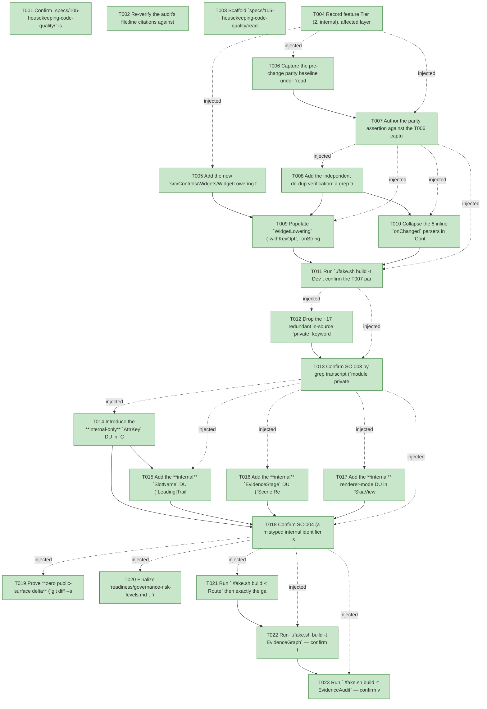

# Task Graph — 105-housekeeping-code-quality

## ✓ Graph is acyclic and consistent

## Skill Match Assessments

| Task | Candidate | Confidence | Signals | Reviewer disposition | Diagnostic |
|------|-----------|------------|---------|----------------------|------------|
| T001 | (none) | none |  | accepted-empty | T001: skillist trusted as declared; no owns-based capability requirement |
| T002 | (none) | none |  | accepted-empty | T002: skillist trusted as declared; no owns-based capability requirement |
| T003 | (none) | none |  | accepted-empty | T003: skillist trusted as declared; no owns-based capability requirement |
| T004 | (none) | none |  | accepted-empty | T004: skillist trusted as declared; no owns-based capability requirement |
| T005 | (none) | none |  | declared | T005: skillist trusted as declared; no owns-based capability requirement |
| T006 | (none) | none |  | declared | T006: skillist trusted as declared; no owns-based capability requirement |
| T007 | (none) | none |  | declared | T007: skillist trusted as declared; no owns-based capability requirement |
| T008 | (none) | none |  | declared | T008: skillist trusted as declared; no owns-based capability requirement |
| T009 | (none) | none |  | declared | T009: skillist trusted as declared; no owns-based capability requirement |
| T010 | (none) | none |  | declared | T010: skillist trusted as declared; no owns-based capability requirement |
| T011 | (none) | none |  | declared | T011: skillist trusted as declared; no owns-based capability requirement |
| T012 | (none) | none |  | declared | T012: skillist trusted as declared; no owns-based capability requirement |
| T013 | (none) | none |  | declared | T013: skillist trusted as declared; no owns-based capability requirement |
| T014 | (none) | none |  | declared | T014: skillist trusted as declared; no owns-based capability requirement |
| T015 | (none) | none |  | declared | T015: skillist trusted as declared; no owns-based capability requirement |
| T016 | (none) | none |  | declared | T016: skillist trusted as declared; no owns-based capability requirement |
| T017 | (none) | none |  | declared | T017: skillist trusted as declared; no owns-based capability requirement |
| T018 | (none) | none |  | declared | T018: skillist trusted as declared; no owns-based capability requirement |
| T019 | (none) | none |  | accepted-empty | T019: skillist trusted as declared; no owns-based capability requirement |
| T020 | (none) | none |  | accepted-empty | T020: skillist trusted as declared; no owns-based capability requirement |
| T021 | (none) | none |  | declared | T021: skillist trusted as declared; no owns-based capability requirement |
| T022 | speckit-evidence-graph | high | owns:graph-validation | accepted | T022: owns graph-validation requires skill speckit-evidence-graph; trigger_group=owns; matched_trigger=owns:graph-validation |
| T023 | speckit-evidence-audit | high | owns:evidence-audit | accepted | T023: owns evidence-audit requires skill speckit-evidence-audit; trigger_group=owns; matched_trigger=owns:evidence-audit |

## Status counts (effective)

| Status | Count |
|--------|-------|
| [X] done | 23 |
| [S] synthetic | 0 |
| [S*] auto-synthetic | 0 |
| accepted [SEH] synthetic | 0 |
| unaccepted synthetic | 0 |

## Graph



## ASCII view

```
T001 [X] Confirm `specs/105-housekeeping-code-quality/` is the active feature (`.specify/feature.json`), link spec + plan, and validate the `105-housekeeping-code-quality` branch
T002 [X] Re-verify the audit's file:line citations against the current working tree (the plan notes line numbers shifted: `onChanged` at `Control.fs:1606/1611/1616/1621/1628/1633/1639/1683`, `slotRegions` at `Control.fs:99`, `StandardAttributeName` at `Types.fs:80`/`Types.fsi:86`, `RetainedRender` privates at `73/87/100/113/123`) so every edit lands on the real site
T003 [X] Scaffold `specs/105-housekeeping-code-quality/readiness/` with audit-enforced placeholder files discoverable before implementation: `evidence-graph.md`, `evidence-audit.md`, `governance-risk-levels.md`, `aggregate-hang-diagnostics.md`, `runtime-limitations.md`, `generated-guidance-validation.md`, plus the zero-`.fsi`-delta and parity-proof artifacts — each naming its authoritative command, artifact path, failure class, and next action
T004 [X] Record feature Tier (2, internal), affected layer (Controls/Scene/SkiaViewer `.fs` bodies), public-API impact (none — zero public `.fsi` delta), Elmish/MVU applicability (**N/A** — no stateful/I/O behavior changes), and the evidence obligations (routed gates green, parity, suites green, zero surface delta, `EvidenceGraph` + `EvidenceAudit` verdict)
T005 [X] Add the new `src/Controls/Widgets/WidgetLowering.fs` as `module internal WidgetLowering` (no `.fsi`) and insert `<Compile Include="Widgets/WidgetLowering.fs" />` into `Controls.fsproj` between `CustomControl.fs` and `Widgets/Primitives.fs` so it compiles before every consuming widget module (compile-order edge case)
T006 [X] Capture the pre-change parity baseline under `readiness/`: the `sprintf "%A"` of the lowered `Control<'msg>` for every widget whose lowering uses a consolidated helper, plus the serialized Scene-stage (`"scene"`/`"renderer"`), `RendererMode`, and slot (`leading`/`trailing`/`header`/`footer`) strings (`Control<'msg>` has no structural equality — `%A` is the established 096/097/101 pattern)
T007 [X] Author the parity assertion against the T006 captured baseline over the consolidated helpers and serialized boundaries (green by construction for this behavior-preserving refactor — there is no genuine red→green; it goes red only if a consolidation perturbs attribute order, event-kind strings, key application, slot lowering, or a serialized string) (P1/P2; enforces SC-006)
T008 [X] Add the independent de-dup verification: a grep transcript asserting exactly one body for `withKeyOpt`, `onString`, `onStringList`, and that `Control.fs` keeps a single `Double.TryParse` inside `tryParseFloat` and zero inline `onChanged` copies (SC-001/SC-002), and confirm the T007 parity assertion exercises every consolidated-helper widget
T009 [X] Populate `WidgetLowering` (`withKeyOpt`, `onString`, `onStringList`, the `a11y` accessibility-metadata builder, `intentToString`) and rewire the 9 `withKeyOpt` + 4 `onString` + 1 `onStringList` copies plus the `intentStyle`→string and accessibility-metadata duplications across the 10 widget modules to reference the shared home; remove the copies (FR-001/FR-002/FR-004)
T010 [X] Collapse the 8 inline `onChanged` parsers in `Control.fs` into `onChangedBool` / `onChangedFloat` / `onChangedString` at module scope over a named `tryParseFloat : string -> float option`, eliminating the twice-duplicated 217-char nested-`Double.TryParse` lambda (FR-003)
T011 [X] Run `./fake.sh build -t Dev`, confirm the T007 parity assertion stays green and the Controls + Controls.Elmish Expecto suites pass with no test edits forced, and capture the SC-001/SC-002 grep transcript
T012 [X] Drop the ~17 redundant in-source `private` keywords the audit certifies redundant (the audit's ~16 plus the 10th `LegacyControls` module): the 10 `module private *Lowering` declarations → `module`, the 3 `let private` in `Reconcile` (`attrValueEqual`/`diffAttrs`/`isKeepOp`), and the 4 `let private` in `RetainedRender` (`childPath`/`clockDuration`/`fadeAnimation`/`currentOpacity`). Retain every "hidden by `<X>.fsi`" comment and leave the keep-list untouched — `module internal SceneRenderer`, the `InternalsVisibleTo` test seams, and the `let private` helpers inside the exposed `ControlInternals` (FR-005/FR-006)
T013 [X] Confirm SC-003 by grep transcript (`module private` count = 0 in `src/Controls/Widgets/`, only the uncited `let private` remain in `Reconcile`/`RetainedRender`, `module internal SceneRenderer` still present, every former site keeps its documenting comment) and re-run `./fake.sh build -t Dev` green
T014 [X] Introduce the **internal-only** `AttrKey` DU in `Control.fs` with a `name : AttrKey -> string` projection (building on feature 101's `[<Literal>]` attr names) and a typed `tryKey` reader, and route the closed control-intrinsic attribute reads in `Control.fs` and `DataGrid.fs` through it; the public `StandardAttributeName` DU stays unchanged (D3, FR-007/FR-012); string-keyed `tryLast`/`hasAttr` remain for genuinely dynamic names
T015 [X] Add the **internal** `SlotName` DU (`Leading|Trailing|Header|Footer`) used by `slotRegions`/`lowerSlots`, parsing the carrier string once at the consumption edge; the public `AttrValue.SlotFillsValue : (string * Control<'msg>) list` carrier stays unchanged — no public `SlotName` surface (FR-008, preserves feature 095's omission)
T016 [X] Add the **internal** `EvidenceStage` DU (`Scene|Renderer`) in `Scene.fs` driving the internal comparison, with the public `BlockedStage`/`DiagnosticCategory` record fields written `string` via a single `stage -> string` projection so the evidence text stays byte-identical `"scene"`/`"renderer"` (FR-009)
T017 [X] Add the **internal** renderer-mode DU in `SkiaViewer.fs`, parsing `request.RendererMode` once at the dispatch edge into a closed set (`default`/`skia`/`deterministic-scene`/`unsupported-host`/`metadata-hash`/`pixel-readback`) and making the case-insensitive `match` exhaustive; every public `RendererMode` output/serialized field stays an unchanged string (FR-009, §5C)
T018 [X] Confirm SC-004 (a mistyped internal identifier is a compile error — the DU matches compile only against the closed set), re-run `./fake.sh build -t Dev` with the parity assertion green (P2 serialized strings byte-identical), and confirm the keep-as-string identifiers (`ControlKind`, public diagnostic/mode fields, consumer metadata keys, `ControlEvent.Kind`) are untouched (FR-010)
T019 [X] Prove **zero public-surface delta** (`git diff --stat origin/main...HEAD -- 'src/**/*.fsi'` empty — SC-007) and that the deferred / keep-as-string items are untouched in the diff (no `ControlId` wrapper, no `ControlKind` change, no public diagnostic/mode field conversion, no `AttrValue` custom-equality change, no file split — SC-008/FR-013); and confirm no retained or added comment in the diff introduces a literal evidence filename or bare gate token that a governance gate (window-visibility/diff-scan) could parse as a status/behavior token (FR-014)
T020 [X] Finalize `readiness/governance-risk-levels.md`, `readiness/aggregate-hang-diagnostics.md`, and `readiness/runtime-limitations.md`: record the selected medium risk level, the focused validation for it, when broad validation is required, and how non-authoritative aggregate results are recorded
T021 [X] Run `./fake.sh build -t Route` then exactly the gates it prints, FAKE-backed targets **sequentially** in the documented order (`Dev` → any escalated `controls-public-surface` set → `GeneratedGuidanceCheck`/`TemplateCheck`/`GeneratedProductCheck` if printed); capture the focused-gates log and confirm the Controls + Controls.Elmish suites are green with no parity/golden row moves (SC-005)
T022 [X] Run `./fake.sh build -t EvidenceGraph` — confirm the echoed `feature-directory=specs/105-housekeeping-code-quality` and `tasks=<n>` match, no cycles, no dangling refs, no `[S*]` surprises; write `readiness/evidence-graph.md`
T023 [X] Run `./fake.sh build -t EvidenceAudit` — confirm verdict PASS with **0 synthetic** tasks and no diff-scan blockers; write `readiness/evidence-audit.md` with the verdict token
```

## Injected checkpoint edges (Phase N+1 → Phase N) — FR-007

- T004 → T005  (auto-injected Phase-checkpoint edge)
- T004 → T006  (auto-injected Phase-checkpoint edge)
- T004 → T007  (auto-injected Phase-checkpoint edge)
- T007 → T008  (auto-injected Phase-checkpoint edge)
- T007 → T009  (auto-injected Phase-checkpoint edge)
- T007 → T010  (auto-injected Phase-checkpoint edge)
- T007 → T011  (auto-injected Phase-checkpoint edge)
- T011 → T012  (auto-injected Phase-checkpoint edge)
- T011 → T013  (auto-injected Phase-checkpoint edge)
- T013 → T014  (auto-injected Phase-checkpoint edge)
- T013 → T015  (auto-injected Phase-checkpoint edge)
- T013 → T016  (auto-injected Phase-checkpoint edge)
- T013 → T017  (auto-injected Phase-checkpoint edge)
- T013 → T018  (auto-injected Phase-checkpoint edge)
- T018 → T019  (auto-injected Phase-checkpoint edge)
- T018 → T020  (auto-injected Phase-checkpoint edge)
- T018 → T021  (auto-injected Phase-checkpoint edge)
- T018 → T022  (auto-injected Phase-checkpoint edge)
- T018 → T023  (auto-injected Phase-checkpoint edge)

## Resolved skillist ids — FR-007

Resolved skillist-id set (6): fs-skia-evidence-mode, fs-skia-reconciliation, fs-skia-typed-controls, fs-skia-viewer-host, speckit-evidence-audit, speckit-evidence-graph

## Skillist id → SKILL.md path

fs-skia-evidence-mode → .agents/skills/fs-skia-evidence-mode/SKILL.md
fs-skia-reconciliation → .agents/skills/fs-skia-reconciliation/SKILL.md
fs-skia-typed-controls → .agents/skills/fs-skia-typed-controls/SKILL.md
fs-skia-viewer-host → .agents/skills/fs-skia-viewer-host/SKILL.md
speckit-evidence-audit → .agents/skills/speckit-evidence-audit/SKILL.md
speckit-evidence-graph → .agents/skills/speckit-evidence-graph/SKILL.md

## Skillist id → unresolved / flagged

_(none — every declared skillist id resolves to exactly one installed skill)_

