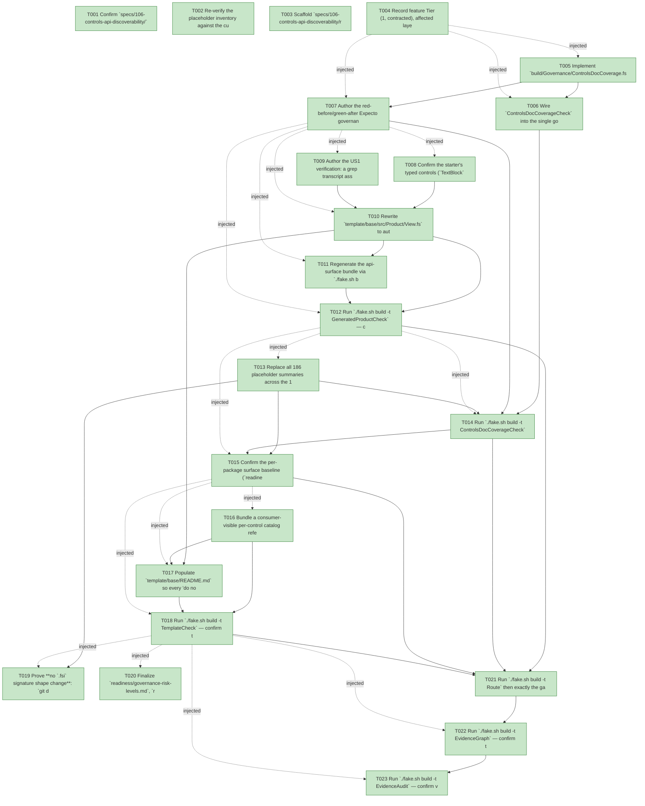

# Task Graph — 106-controls-api-discoverability

## ✓ Graph is acyclic and consistent

## Skill Match Assessments

| Task | Candidate | Confidence | Signals | Reviewer disposition | Diagnostic |
|------|-----------|------------|---------|----------------------|------------|
| T001 | (none) | none |  | accepted-empty | T001: skillist trusted as declared; no owns-based capability requirement |
| T002 | (none) | none |  | accepted-empty | T002: skillist trusted as declared; no owns-based capability requirement |
| T003 | (none) | none |  | accepted-empty | T003: skillist trusted as declared; no owns-based capability requirement |
| T004 | (none) | none |  | accepted-empty | T004: skillist trusted as declared; no owns-based capability requirement |
| T005 | (none) | none |  | declared | T005: skillist trusted as declared; no owns-based capability requirement |
| T006 | (none) | none |  | declared | T006: skillist trusted as declared; no owns-based capability requirement |
| T007 | (none) | none |  | declared | T007: skillist trusted as declared; no owns-based capability requirement |
| T008 | (none) | none |  | declared | T008: skillist trusted as declared; no owns-based capability requirement |
| T009 | (none) | none |  | declared | T009: skillist trusted as declared; no owns-based capability requirement |
| T010 | (none) | none |  | declared | T010: skillist trusted as declared; no owns-based capability requirement |
| T011 | (none) | none |  | declared | T011: skillist trusted as declared; no owns-based capability requirement |
| T012 | (none) | none |  | declared | T012: skillist trusted as declared; no owns-based capability requirement |
| T013 | (none) | none |  | declared | T013: skillist trusted as declared; no owns-based capability requirement |
| T014 | (none) | none |  | declared | T014: skillist trusted as declared; no owns-based capability requirement |
| T015 | (none) | none |  | declared | T015: skillist trusted as declared; no owns-based capability requirement |
| T016 | (none) | none |  | declared | T016: skillist trusted as declared; no owns-based capability requirement |
| T017 | (none) | none |  | declared | T017: skillist trusted as declared; no owns-based capability requirement |
| T018 | (none) | none |  | declared | T018: skillist trusted as declared; no owns-based capability requirement |
| T019 | (none) | none |  | accepted-empty | T019: skillist trusted as declared; no owns-based capability requirement |
| T020 | (none) | none |  | accepted-empty | T020: skillist trusted as declared; no owns-based capability requirement |
| T021 | (none) | none |  | declared | T021: skillist trusted as declared; no owns-based capability requirement |
| T022 | speckit-evidence-graph | high | owns:graph-validation | accepted | T022: owns graph-validation requires skill speckit-evidence-graph; trigger_group=owns; matched_trigger=owns:graph-validation |
| T023 | speckit-evidence-audit | high | owns:evidence-audit | accepted | T023: owns evidence-audit requires skill speckit-evidence-audit; trigger_group=owns; matched_trigger=owns:evidence-audit |

## Status counts (effective)

| Status | Count |
|--------|-------|
| [X] done | 23 |
| [S] synthetic | 0 |
| [S*] auto-synthetic | 0 |
| accepted [SEH] synthetic | 0 |
| unaccepted synthetic | 0 |

## Graph



## ASCII view

```
T001 [X] Confirm `specs/106-controls-api-discoverability/` is the active feature (`.specify/feature.json`), link spec + plan, and validate the `106-controls-api-discoverability` branch
T002 [X] Re-verify the placeholder inventory against the current tree: 186 `"Public contract function exposed by this FS.Skia.UI package."` summaries across the 13 Controls `.fsi` files (`Control.fsi` 88, `Attributes.fsi` 25, `Diagnostics.fsi` 16, `Catalog.fsi` 11, `Charts.fsi` 10, `DataGrid.fsi` 8, `Theme.fsi`/`RichText.fsi`/`Accessibility.fsi` 5 each, `ControlRuntime.fsi`/`TextInput.fsi` 4 each, `Collections.fsi` 3, `CustomControl.fsi` 2), and confirm the `Widgets/*.fsi` typed surface carries 0 placeholders (positive exemplar, research D1)
T003 [X] Scaffold `specs/106-controls-api-discoverability/readiness/` with audit-enforced placeholder files discoverable before implementation: `doc-coverage.md`, `generated-product.md`, `template-check.md`, `surface-baselines.md`, `evidence-graph.md`, `evidence-audit.md`, `governance-risk-levels.md`, `aggregate-hang-diagnostics.md`, `runtime-limitations.md`, `generated-guidance-validation.md` — each naming its authoritative command, artifact path, failure class, and next action
T004 [X] Record feature Tier (1, contracted), affected layer (Controls public `.fsi` doc-only, template starter/README/catalog bundle, governance home), public-API impact (no `.fsi` signature shape change; `///` docs added; new `ControlsDocCoverageCheck` gate routed), Elmish/MVU applicability (**N/A** — pure analysis gate, no stateful/I/O product workflow), and the evidence obligations (doc-coverage 0 findings, surface-baseline currency, `GeneratedProductCheck`, `TemplateCheck`, `EvidenceGraph` + `EvidenceAudit` verdict)
T005 [X] Implement `build/Governance/ControlsDocCoverage.fs` as a pure analysis: `DocFinding` record (`File`/`Line`/`Identifier`/`Reason` (`Placeholder`|`Empty`|`DuplicateOnly`)/`Detail`) + `analyze : unit -> DocFinding list` that enumerates `src/Controls/**/*.fsi` (reusing `FS.Skia.UI.SkillSupport.Globbing`), attaches each leading `///` block to the next `val`/`type`/`member` declaration (`Parsing`-style line grammar), and flags the placeholder / empty / duplicate-only predicate (research D2/D3); no file I/O inside `analyze` (MVU/effect boundary N/A)
T006 [X] Wire `ControlsDocCoverageCheck` into the single governance home following the `DesignTokenDrift` precedent (research D4): `Targets.fs` (`Target` DU + `allTargets` + `name` map + `directPrerequisites` = `[]` + `routableGates`), `Routing.fs` (add to the controls-public-surface rule's required gates), and `Engine/Update.fs` + `Engine/Interpret.fs` (the effect that runs `analyze` and renders `readiness/doc-coverage.md`); `validation.contract.yml` + `AgentValidation.knownGates` are derived/regenerated by `RefreshSurfaceBaselines`, never hand-edited (`TargetMetadataDrift` enforces currency)
T007 [X] Author the red-before/green-after Expecto governance test for `ControlsDocCoverage.analyze` over `.fsi` fixtures (authored alongside T005 so the RED fixture proves the analyzer's failure mode before the live surface is rewritten — the inverted T005→T007 numbering is a build-tooling analyzer, not a product-surface change): a planted-placeholder fixture returns a `Placeholder` finding (RED proves the gate detects the real failure mode), a **short but meaningful** substantive-summary fixture returns 0 findings (GREEN, anti-false-positive — proves the gate does NOT fire on legitimately brief summaries per the spec edge case), and a generic-sentence-shared-across-many-members fixture returns a `DuplicateOnly` finding (anti-evasion, research D2)
T008 [X] Confirm the starter's typed controls (`TextBlock` display, `TextBox` input with `OnChanged`, `Button` with `OnClick`) are each covered by `tests/Controls.Tests/TypedLoweringTests.fs` (typed `view` lowers structurally equal to the legacy builder); add a parity case only if the starter introduces a typed control not yet in the suite (research D8). **Note the `TextBox` signature divergence**: `TextBox.defaults: ControlId -> TextBoxProps<'msg>` and `TextBox.view: props -> model: TextInputModel -> Widget<'msg>` (unlike `TextBlock`/`Button` whose `defaults` is a bare value and `view` takes only `props`); ensure the parity case exercises the `TextBox.view props model` form the starter will use, not the bare `{ defaults with … } |> view` form
T009 [X] Author the US1 verification: a grep transcript asserting 0 legacy `Module.create [ ... ]` attr-list constructions in `template/base/src/Product/View.fs` (SC-003), plus the "add a control kind not shown in the starter using only `defaults with` + IntelliSense → compiles and renders" walkthrough mapped to SC-001
T010 [X] Rewrite `template/base/src/Product/View.fs` to author every control through `FS.Skia.UI.Controls.Typed`, demonstrating the FR-002 variety (display `TextBlock`, interactive `TextBox` with `OnChanged`, `Button` with `OnClick = Some msg`) and showing the `OnClick = None` → "binds nothing" idiom in a comment (FR-001/FR-002, edge case). **Use each module's real signature, not one uniform idiom**: `TextBlock`/`Button` use `{ Module.defaults with Field = ... } |> Module.view`; the interactive `TextBox` uses `TextBox.view { TextBox.defaults "<id>" with Value = ...; OnChanged = ... } <textModel>`, where `<textModel>` is the retained per-identity `TextInputModel` the live host already tracks (the starter must show where that model comes from — do not invent a literal). The typed `view` returns `Widget<'msg>`, so confirm the rewritten `controlsExampleView` still type-checks as the view `ControlsElmish.program` consumes (compose/lower the `Widget` tree the way the legacy tree is consumed today); `GeneratedProductCheck` (T012) proves the wiring compiles + renders. Any starter control not yet in the typed front door stays on the legacy builder with a one-line pointer to the typed path
T011 [X] Regenerate the api-surface bundle via `./fake.sh build -t RefreshSurfaceBaselines` and confirm `template/base/docs/api-surface/Controls/` contains the typed `Widgets/*.fsi` signatures the starter relies on and passes `ApiSurfaceGen.currency` (verify-and-keep-current, research D6; FR-004/SC-006)
T012 [X] Run `./fake.sh build -t GeneratedProductCheck` — confirm the regenerated starter compiles and renders the same controls with no behavior regression (FR-003); write `readiness/generated-product.md`
T013 [X] Replace all 186 placeholder summaries across the 13 Controls `.fsi` files with substantive per-member `///` docs per `contracts/doc-comment-standard.md`: attribute builders state what the attribute does + value meaning/units + accepting control kind(s) + omitted-optional lowering; per-control entries state what the control is + required attrs + key events + the typed `Props` cross-reference; `Catalog.fsi` functions state what they return + how to enumerate a control's contract; public types state what they represent (FR-005/FR-006/FR-008/FR-009); no `.fsi` signature shape change. **Each rewritten summary MUST carry a member-specific token** (a backticked identifier and/or a value/units description) so substantively-distinct members never collapse into the `DuplicateOnly ≥8-identical` predicate (data-model D1) — avoid boilerplate-shaped phrasing shared verbatim across many attribute builders
T014 [X] Run `./fake.sh build -t ControlsDocCoverageCheck` (now green over the real surface) — confirm `analyze()` returns `[]` over `src/Controls/**`, and write `readiness/doc-coverage.md` recording the enumerated surface (`findings=0` over N members across M files), so the documented surface cannot regress to boilerplate (SC-002, FR-007)
T015 [X] Confirm the per-package surface baseline (`readiness/per-package-surface/FS.Skia.UI.Controls.fsi.txt`) stays byte-stable after the doc-only `.fsi` edits (`PerPackageSurface.normalize` strips `//`-prefixed lines) while the api-surface *bundle* is regenerated current; write `readiness/surface-baselines.md` (research D5)
T016 [X] Bundle a consumer-visible per-control catalog reference into the generated project under `template/base/docs/` (derived from the `catalog.yml` the package already ships in `contentFiles/`, or the `CatalogDocsGen` per-control markdown the generated repo produces), and update `.template.config/template.json` if the manifest must list the new content file (FR-011, research D7)
T017 [X] Populate `template/base/README.md` so every "do not use reflection / read the source-shaped API reference" line resolves to a concrete, populated target: the typed starter (`View.fs`), the `docs/api-surface/Controls/*.fsi` bundle, the documented `Catalog.*` discovery API (`requiredAttributes`/`supportedAttributes`/`supportedEvents`/`knownControlKinds`/`markdownSummary`), the bundled catalog reference, and the interactive host authoring seam (`runInteractiveApp`, the `fs-skia-controls-host` surface) so authoring a controls app is discoverable end to end (FR-010/FR-012/FR-013, SC-005)
T018 [X] Run `./fake.sh build -t TemplateCheck` — confirm the bundled catalog reference and the README discovery pointer are present in the generated project, and walk the SC-004 path (from the README reach the `Catalog.*` API and the catalog reference, determine a named control's complete supported-attribute set without reflection); **also walk the not-yet-typed control case** — pick a control that lacks a typed module and confirm the catalog reference + discovery API still report its full attribute contract and do **not** mark it unsupported merely because it has no typed `Props` (spec edge case "must not imply a control is unsupported"); write `readiness/template-check.md`
T019 [X] Prove **no `.fsi` signature shape change**: `git diff origin/main...HEAD -- 'src/Controls/**/*.fsi'` shows only `///` comment-line changes (no added/removed/retyped `val`/`type`/`member`), and confirm no added/retained doc comment introduces a literal evidence filename or bare gate token that a governance scan (window-visibility / diff-scan) could misparse as a status/behavior token
T020 [X] Finalize `readiness/governance-risk-levels.md`, `readiness/aggregate-hang-diagnostics.md`, `readiness/runtime-limitations.md`, and `readiness/generated-guidance-validation.md`: record the selected medium risk level, the focused validation for it, when broad validation is required, and how non-authoritative aggregate results are recorded
T021 [X] Run `./fake.sh build -t Route` then exactly the gates it prints, FAKE-backed targets **sequentially** in the documented order (`Dev` → the escalated `controls-public-surface` set incl. `ControlsDocCoverageCheck` + `TargetMetadataDrift` → `GeneratedGuidanceCheck` / `TemplateCheck` / `GeneratedProductCheck` if printed); capture the focused-gates log and confirm the Controls + Controls.Elmish suites are green
T022 [X] Run `./fake.sh build -t EvidenceGraph` — confirm the echoed `feature-directory=specs/106-controls-api-discoverability` and `tasks=<n>` match, no cycles, no dangling refs, no `[S*]` surprises; write `readiness/evidence-graph.md`
T023 [X] Run `./fake.sh build -t EvidenceAudit` — confirm verdict PASS with **0 synthetic** tasks and no diff-scan blockers; write `readiness/evidence-audit.md` with the verdict token
```

## Injected checkpoint edges (Phase N+1 → Phase N) — FR-007

- T004 → T005  (auto-injected Phase-checkpoint edge)
- T004 → T006  (auto-injected Phase-checkpoint edge)
- T004 → T007  (auto-injected Phase-checkpoint edge)
- T007 → T008  (auto-injected Phase-checkpoint edge)
- T007 → T009  (auto-injected Phase-checkpoint edge)
- T007 → T010  (auto-injected Phase-checkpoint edge)
- T007 → T011  (auto-injected Phase-checkpoint edge)
- T007 → T012  (auto-injected Phase-checkpoint edge)
- T012 → T013  (auto-injected Phase-checkpoint edge)
- T012 → T014  (auto-injected Phase-checkpoint edge)
- T012 → T015  (auto-injected Phase-checkpoint edge)
- T015 → T016  (auto-injected Phase-checkpoint edge)
- T015 → T017  (auto-injected Phase-checkpoint edge)
- T015 → T018  (auto-injected Phase-checkpoint edge)
- T018 → T019  (auto-injected Phase-checkpoint edge)
- T018 → T020  (auto-injected Phase-checkpoint edge)
- T018 → T022  (auto-injected Phase-checkpoint edge)
- T018 → T023  (auto-injected Phase-checkpoint edge)

## Resolved skillist ids — FR-007

Resolved skillist-id set (9): fs-skia-controls-host, fs-skia-template-update, fs-skia-typed-controls, fsdocs-api-doc, fsharp-build-orchestration, fsharp-io-globbing, fsharp-parsing, speckit-evidence-audit, speckit-evidence-graph

## Skillist id → SKILL.md path

fs-skia-controls-host → .agents/skills/fs-skia-controls-host/SKILL.md
fs-skia-template-update → .agents/skills/fs-skia-template-update/SKILL.md
fs-skia-typed-controls → .agents/skills/fs-skia-typed-controls/SKILL.md
fsdocs-api-doc → .agents/skills/fsdocs-api-doc/SKILL.md
fsharp-build-orchestration → .agents/skills/fsharp-build-orchestration/SKILL.md
fsharp-io-globbing → .agents/skills/fsharp-io-globbing/SKILL.md
fsharp-parsing → .agents/skills/fsharp-parsing/SKILL.md
speckit-evidence-audit → .agents/skills/speckit-evidence-audit/SKILL.md
speckit-evidence-graph → .agents/skills/speckit-evidence-graph/SKILL.md

## Skillist id → unresolved / flagged

_(none — every declared skillist id resolves to exactly one installed skill)_

