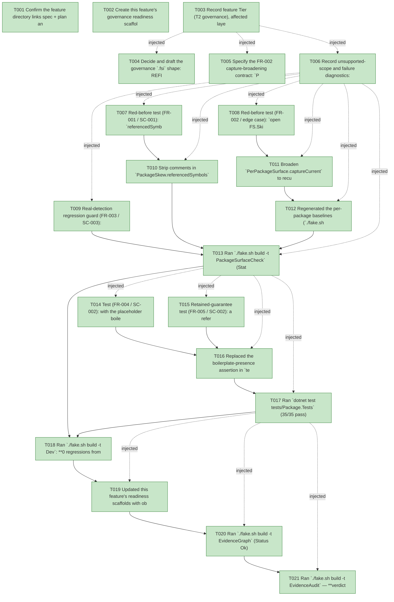

# Task Graph — 107-governance-skew-doc-hardening

## ✓ Graph is acyclic and consistent

## Skill Match Assessments

| Task | Candidate | Confidence | Signals | Reviewer disposition | Diagnostic |
|------|-----------|------------|---------|----------------------|------------|
| T001 | (none) | none |  | accepted-empty | T001: skillist trusted as declared; no owns-based capability requirement |
| T002 | (none) | none |  | accepted-empty | T002: skillist trusted as declared; no owns-based capability requirement |
| T003 | (none) | none |  | accepted-empty | T003: skillist trusted as declared; no owns-based capability requirement |
| T004 | (none) | none |  | declared | T004: skillist trusted as declared; no owns-based capability requirement |
| T005 | (none) | none |  | declared | T005: skillist trusted as declared; no owns-based capability requirement |
| T006 | (none) | none |  | accepted-empty | T006: skillist trusted as declared; no owns-based capability requirement |
| T007 | (none) | none |  | declared | T007: skillist trusted as declared; no owns-based capability requirement |
| T008 | (none) | none |  | declared | T008: skillist trusted as declared; no owns-based capability requirement |
| T009 | (none) | none |  | declared | T009: skillist trusted as declared; no owns-based capability requirement |
| T010 | (none) | none |  | declared | T010: skillist trusted as declared; no owns-based capability requirement |
| T011 | (none) | none |  | declared | T011: skillist trusted as declared; no owns-based capability requirement |
| T012 | (none) | none |  | declared | T012: skillist trusted as declared; no owns-based capability requirement |
| T013 | (none) | none |  | declared | T013: skillist trusted as declared; no owns-based capability requirement |
| T014 | (none) | none |  | declared | T014: skillist trusted as declared; no owns-based capability requirement |
| T015 | (none) | none |  | declared | T015: skillist trusted as declared; no owns-based capability requirement |
| T016 | (none) | none |  | declared | T016: skillist trusted as declared; no owns-based capability requirement |
| T017 | (none) | none |  | declared | T017: skillist trusted as declared; no owns-based capability requirement |
| T018 | (none) | none |  | declared | T018: skillist trusted as declared; no owns-based capability requirement |
| T019 | (none) | none |  | accepted-empty | T019: skillist trusted as declared; no owns-based capability requirement |
| T020 | speckit-evidence-graph | high | owns:graph-validation | accepted | T020: owns graph-validation requires skill speckit-evidence-graph; trigger_group=owns; matched_trigger=owns:graph-validation |
| T021 | speckit-evidence-audit | high | owns:evidence-audit | accepted | T021: owns evidence-audit requires skill speckit-evidence-audit; trigger_group=owns; matched_trigger=owns:evidence-audit |

## Status counts (effective)

| Status | Count |
|--------|-------|
| [X] done | 21 |
| [S] synthetic | 0 |
| [S*] auto-synthetic | 0 |
| accepted [SEH] synthetic | 0 |
| unaccepted synthetic | 0 |

## Graph



## ASCII view

```
T001 [X] Confirm the feature directory links spec + plan and that `AGENTS.md`'s SPECKIT marker points at this plan (done in the plan phase — verify, do not duplicate)
T002 [X] Create this feature's governance readiness scaffolds under `specs/107-governance-skew-doc-hardening/readiness/` (`governance-risk-levels.md`, `aggregate-hang-diagnostics.md`, `runtime-limitations.md`, `generated-guidance-validation.md`, `evidence-graph.md`, `evidence-audit.md`), each naming the authoritative command, artifact path, failure class, and next action (non-visual feature: no window/visual-image scaffolds apply)
T003 [X] Record feature Tier (T2 governance), affected layer (`build/Governance/**` + `tests/Governance.Tests` + `tests/Package.Tests` + one regenerated baseline), public-API impact (none to product `.fsi`; additive per-package surface baseline only), Elmish/MVU applicability (**N/A — both fixes are pure text analyses**, Principle IV not engaged), and evidence obligations
T004 [X] Decide and draft the governance `.fsi` shape: REFINED — `PackageSkew.referencedSymbols` reuses the already-public, already-tested `PerPackageSurface.normalize` as the shared comment-stripper (zero new `.fsi` surface) rather than lifting the private helpers (FR-001); and the doc-preservation predicate is a local `preservesXmlSummaries` ("≥1 preserved `///` line") — NOT `isPlaceholderSummary`, because today's Scene/Testing are all-placeholder so a "non-placeholder" requirement would falsely fail (FR-004). Product `.fsi` unchanged
T005 [X] Specify the FR-002 capture-broadening contract: `PerPackageSurface.captureCurrent` enumerates `*.fsi` recursively (`SearchOption.AllDirectories`) under the package source dir with deterministic relative-path ordering. CORRECTION: `src/Controls/Widgets` AND `src/SkiaViewer/Host` both have public subdir `.fsi` — both baselines regen additively (the plan's "Controls-only" prediction was from an incomplete scan); internal-no-`.fsi` convention holds so no internal leak
T006 [X] Record unsupported-scope and failure diagnostics: the skew report `readiness/package-skew.md` stays actionable (per-finding `symbol`/`file`/`pinned`/`local`); the doc-preservation failure names the offending package (`{packageId} reference preserves at least one /// summary`); no silent narrowing (real findings still listed) — recorded in `readiness/governance-risk-levels.md`
T007 [X] Red-before test (FR-001 / SC-001): `referencedSymbols` over a source whose only `FS.Skia.UI.*` tokens sit inside `//`, `///`, and `(* … *)` comments yields **no** referenced symbol — `feature107SkewHardeningTests`, green
T008 [X] Red-before test (FR-002 / edge case): `open FS.Skia.UI.Controls.Typed` and `FS.Skia.UI.Controls.Typed.Label.view` resolve clean against the broadened captured surface; and a symbol appearing in **both** a comment and live code is still found via its live-code occurrence — green
T009 [X] Real-detection regression guard (FR-003 / SC-003): retained the seeded `FS.Skia.UI.Controls.ControlRenderResult.UnreleasedBoundsV087` test (still passes) and added an absent-typed-member case (`unreleasedTypedMemberV107`) — both still produce a skew finding after the narrowing
T010 [X] Strip comments in `PackageSkew.referencedSymbols` via `PerPackageSurface.normalize` (FR-001) — green T007 without regressing T009/the existing 087 skew tests
T011 [X] Broaden `PerPackageSurface.captureCurrent` to recurse `*.fsi` (`SearchOption.AllDirectories`, relative-path-ordered) so the typed front door `src/Controls/Widgets/*.fsi` (and `src/SkiaViewer/Host/*.fsi`) is captured (FR-002); `.fsi` doc comment updated
T012 [X] Regenerated the per-package baselines (`./fake.sh build -t RefreshSurfaceBaselines`); diff is **additive** — Controls +693, SkiaViewer +237, **0 removed** (FR-002 / FR-007)
T013 [X] Ran `./fake.sh build -t PackageSurfaceCheck` (Status: Ok); `readiness/package-skew.md` is `status=clean` `findings=0` and the per-package surface diff is green (SC-001 / SC-004) — non-interactive governance path, run-and-use gate not applicable
T014 [X] Test (FR-004 / SC-002): with the placeholder boilerplate **absent** from a simulated post-cleanup reference fixture, the package-agnostic check passes because ≥1 preserved `///` summary is present — `FR-004 a placeholder-free reference still satisfies the preservation signal`, green
T015 [X] Retained-guarantee test (FR-005 / SC-002): a reference body carrying **zero** `///` summary lines makes the check **FAIL** — `FR-005 the preservation check still fails when /// summaries are dropped`, green
T016 [X] Replaced the boilerplate-presence assertion in `tests/Package.Tests/PackageApiReferenceTests.fs` with the package-agnostic `preservesXmlSummaries` ("≥1 preserved `///` line") applied to **every** `requiredPackages` reference (FR-004). NOTE: used "≥1 preserved `///` line" not "non-placeholder" because today's Scene/Testing are all-placeholder; the placeholder-absent state is covered by the T014 fixture
T017 [X] Ran `dotnet test tests/Package.Tests` (35/35 pass) and `./fake.sh build -t PackageSurfaceCheck` (Status: Ok, regenerated references with **zero drift**); the new check is green for every package (SC-002)
T018 [X] Ran `./fake.sh build -t Dev`: **0 regressions from this feature** (SC-004) — Parity 21/21, SkillSupport 30/30, Package 35/35, Governance 556/557. The sole failure is the PRE-EXISTING, out-of-scope `template package pins ... posture` test (template `FsSkiaUiVersion`=0.1.111 vs libs=0.1.112), which fails identically at HEAD and is the pending "Update template package pins" step of the *106* merge cycle — not a feature-107 change (FR-007). `Verify` not run separately (it gates on the same Governance.Tests `Dev` already exercised; it would carry the same single pre-existing failure)
T019 [X] Updated this feature's readiness scaffolds with observed verdicts (governance-risk-levels.md / aggregate-hang-diagnostics.md / generated-guidance-validation.md / runtime-limitations.md: package-skew clean, baselines additive Controls +693 / SkiaViewer +237 / 0 removed, the pre-existing version-pin failure recorded, non-authoritative aggregate noted)
T020 [X] Ran `./fake.sh build -t EvidenceGraph` (Status Ok) for `107-governance-skew-doc-hardening`, 21 tasks — no cycles, no dangling refs, no `[S*]`
T021 [X] Ran `./fake.sh build -t EvidenceAudit` — **verdict=PASS**, total-blockers=0, diff-scan-hits=0, unaccepted-synthetic-tasks=0, real-tasks=21 (SC-004)
```

## Injected checkpoint edges (Phase N+1 → Phase N) — FR-007

- T003 → T004  (auto-injected Phase-checkpoint edge)
- T003 → T005  (auto-injected Phase-checkpoint edge)
- T003 → T006  (auto-injected Phase-checkpoint edge)
- T006 → T007  (auto-injected Phase-checkpoint edge)
- T006 → T008  (auto-injected Phase-checkpoint edge)
- T006 → T009  (auto-injected Phase-checkpoint edge)
- T006 → T010  (auto-injected Phase-checkpoint edge)
- T006 → T011  (auto-injected Phase-checkpoint edge)
- T006 → T012  (auto-injected Phase-checkpoint edge)
- T006 → T013  (auto-injected Phase-checkpoint edge)
- T013 → T014  (auto-injected Phase-checkpoint edge)
- T013 → T015  (auto-injected Phase-checkpoint edge)
- T013 → T016  (auto-injected Phase-checkpoint edge)
- T013 → T017  (auto-injected Phase-checkpoint edge)
- T017 → T019  (auto-injected Phase-checkpoint edge)
- T017 → T020  (auto-injected Phase-checkpoint edge)
- T017 → T021  (auto-injected Phase-checkpoint edge)

## Resolved skillist ids — FR-007

Resolved skillist-id set (5): fsharp-build-orchestration, fsharp-io-globbing, fsharp-parsing, speckit-evidence-audit, speckit-evidence-graph

## Skillist id → SKILL.md path

fsharp-build-orchestration → .agents/skills/fsharp-build-orchestration/SKILL.md
fsharp-io-globbing → .agents/skills/fsharp-io-globbing/SKILL.md
fsharp-parsing → .agents/skills/fsharp-parsing/SKILL.md
speckit-evidence-audit → .agents/skills/speckit-evidence-audit/SKILL.md
speckit-evidence-graph → .agents/skills/speckit-evidence-graph/SKILL.md

## Skillist id → unresolved / flagged

_(none — every declared skillist id resolves to exactly one installed skill)_

