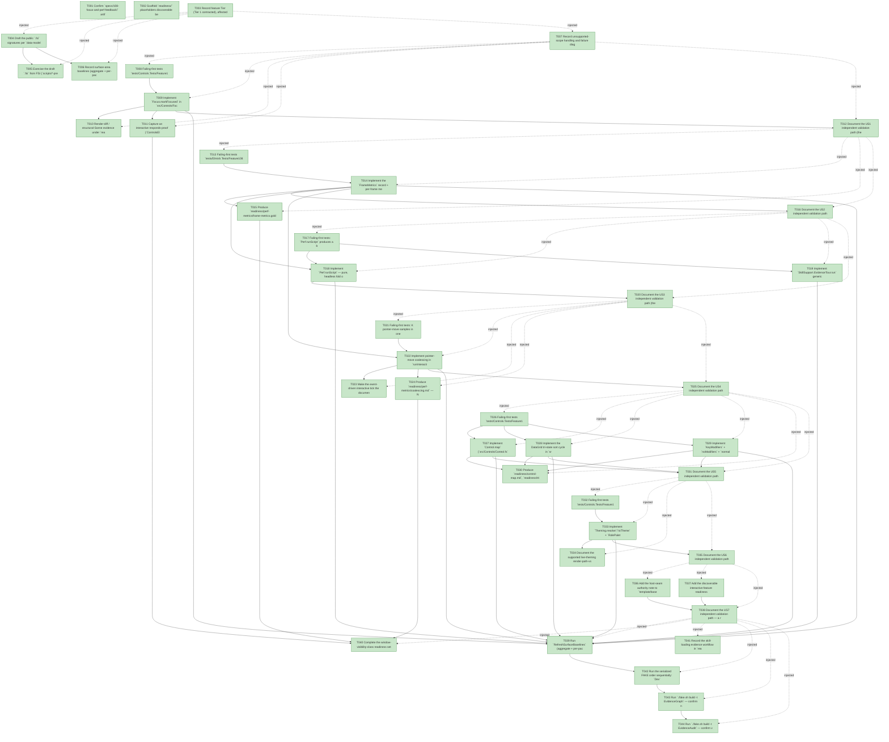

# Task Graph — 108-focus-and-perf-feedback

## ✓ Graph is acyclic and consistent

## Skill Match Assessments

| Task | Candidate | Confidence | Signals | Reviewer disposition | Diagnostic |
|------|-----------|------------|---------|----------------------|------------|
| T001 | (none) | none |  | accepted-empty | T001: skillist trusted as declared; no owns-based capability requirement |
| T002 | (none) | none |  | declared | T002: skillist trusted as declared; no owns-based capability requirement |
| T003 | (none) | none |  | accepted-empty | T003: skillist trusted as declared; no owns-based capability requirement |
| T004 | (none) | none |  | declared | T004: skillist trusted as declared; no owns-based capability requirement |
| T005 | (none) | none |  | declared | T005: skillist trusted as declared; no owns-based capability requirement |
| T006 | (none) | none |  | accepted-empty | T006: skillist trusted as declared; no owns-based capability requirement |
| T007 | (none) | none |  | declared | T007: skillist trusted as declared; no owns-based capability requirement |
| T008 | (none) | none |  | declared | T008: skillist trusted as declared; no owns-based capability requirement |
| T009 | (none) | none |  | declared | T009: skillist trusted as declared; no owns-based capability requirement |
| T010 | (none) | none |  | declared | T010: skillist trusted as declared; no owns-based capability requirement |
| T011 | (none) | none |  | declared | T011: skillist trusted as declared; no owns-based capability requirement |
| T012 | (none) | none |  | accepted-empty | T012: skillist trusted as declared; no owns-based capability requirement |
| T013 | (none) | none |  | declared | T013: skillist trusted as declared; no owns-based capability requirement |
| T014 | (none) | none |  | declared | T014: skillist trusted as declared; no owns-based capability requirement |
| T015 | (none) | none |  | declared | T015: skillist trusted as declared; no owns-based capability requirement |
| T016 | (none) | none |  | accepted-empty | T016: skillist trusted as declared; no owns-based capability requirement |
| T017 | (none) | none |  | declared | T017: skillist trusted as declared; no owns-based capability requirement |
| T018 | (none) | none |  | declared | T018: skillist trusted as declared; no owns-based capability requirement |
| T019 | (none) | none |  | declared | T019: skillist trusted as declared; no owns-based capability requirement |
| T020 | (none) | none |  | accepted-empty | T020: skillist trusted as declared; no owns-based capability requirement |
| T021 | (none) | none |  | declared | T021: skillist trusted as declared; no owns-based capability requirement |
| T022 | (none) | none |  | declared | T022: skillist trusted as declared; no owns-based capability requirement |
| T023 | (none) | none |  | declared | T023: skillist trusted as declared; no owns-based capability requirement |
| T024 | (none) | none |  | declared | T024: skillist trusted as declared; no owns-based capability requirement |
| T025 | (none) | none |  | accepted-empty | T025: skillist trusted as declared; no owns-based capability requirement |
| T026 | (none) | none |  | declared | T026: skillist trusted as declared; no owns-based capability requirement |
| T027 | (none) | none |  | declared | T027: skillist trusted as declared; no owns-based capability requirement |
| T028 | (none) | none |  | declared | T028: skillist trusted as declared; no owns-based capability requirement |
| T029 | (none) | none |  | declared | T029: skillist trusted as declared; no owns-based capability requirement |
| T030 | (none) | none |  | declared | T030: skillist trusted as declared; no owns-based capability requirement |
| T031 | (none) | none |  | accepted-empty | T031: skillist trusted as declared; no owns-based capability requirement |
| T032 | (none) | none |  | declared | T032: skillist trusted as declared; no owns-based capability requirement |
| T033 | (none) | none |  | declared | T033: skillist trusted as declared; no owns-based capability requirement |
| T034 | (none) | none |  | declared | T034: skillist trusted as declared; no owns-based capability requirement |
| T035 | (none) | none |  | accepted-empty | T035: skillist trusted as declared; no owns-based capability requirement |
| T036 | (none) | none |  | declared | T036: skillist trusted as declared; no owns-based capability requirement |
| T037 | (none) | none |  | declared | T037: skillist trusted as declared; no owns-based capability requirement |
| T038 | (none) | none |  | accepted-empty | T038: skillist trusted as declared; no owns-based capability requirement |
| T039 | (none) | none |  | accepted-empty | T039: skillist trusted as declared; no owns-based capability requirement |
| T040 | (none) | none |  | declared | T040: skillist trusted as declared; no owns-based capability requirement |
| T041 | speckit-implement | high | owns:implementation-loading | accepted | T041: owns implementation-loading requires skill speckit-implement; trigger_group=owns; matched_trigger=owns:implementation-loading |
| T042 | (none) | none |  | declared | T042: skillist trusted as declared; no owns-based capability requirement |
| T043 | speckit-evidence-graph | high | owns:graph-validation | accepted | T043: owns graph-validation requires skill speckit-evidence-graph; trigger_group=owns; matched_trigger=owns:graph-validation |
| T044 | speckit-evidence-audit | high | owns:evidence-audit | accepted | T044: owns evidence-audit requires skill speckit-evidence-audit; trigger_group=owns; matched_trigger=owns:evidence-audit |

## Status counts (effective)

| Status | Count |
|--------|-------|
| [X] done | 44 |
| [S] synthetic | 0 |
| [S*] auto-synthetic | 0 |
| accepted [SEH] synthetic | 0 |
| unaccepted synthetic | 0 |

## Graph



## ASCII view

```
T001 [X] Confirm `specs/108-focus-and-perf-feedback/` artifacts (spec, plan, research, data-model, contracts, quickstart, checklists) are present and link spec + plan from this task list
T002 [X] Scaffold `readiness/` placeholders discoverable before implementation — `focus-ring/`, `perf-metrics/` (`frame-metrics.golden`, `coalescing.md`), `responds-proof/`, the window-visibility-class set (`interactive-visible-window.md`, `close-reason-separation.md`, `window-state-diagnostics.md`, `window-options.md`, `real-image-evidence.md`, `generated-validation.md`), plus `skill-loading.md`, `readiness-contract.md`, `aggregate-hang-diagnostics.md`, `governance-risk-levels.md`, `runtime-limitations.md`, `generated-guidance-validation.md`, and `evidence-audit.md`; each names the authoritative command, artifact path, failure class, and next action
T003 [X] Record feature Tier (Tier 1 contracted), affected packages (Controls, Controls.Elmish, KeyboardInput, SkillSupport), public-API impact, MVU applicability, and evidence obligations in `readiness/governance-risk-levels.md`
T004 [X] Draft the public `.fsi` signatures per `data-model.md`/`contracts/`: `Focus.markFocused`; `Control.map` / `Widget.map`; DataGrid tri-state sort; `Theming.resolve`/`toTheme` + `RolePalette` (new `Theming.fsi`); `KeyModifiers` + `normalizeEventWithModifiers`; `FrameMetrics` / `FrameInput` / `Perf.runScript` + additive `MapKeyChord` / `OnFrameMetrics` host fields; `EvidenceTour.run` (new). No access modifiers on `.fs` top-level bindings; `val internal` for cross-assembly-internal helpers
T005 [X] Exercise the draft `.fsi` from FSI (`scripts/*-prelude.fsx` or ad-hoc), including representative focus-stamp and host-field construction paths, and capture the transcript to `readiness/fsi-session.txt`
T006 [X] Record surface-area baselines (aggregate + per-package `.fsi.txt`) for the new/changed public modules before implementation moves them
T007 [X] Record unsupported-scope handling and failure diagnostics in `readiness/runtime-limitations.md` — deferred damage-rect/hover-local/backend motion compression; offscreen + responds-proof is the documented evidence path, live Vulkan window not required
T008 [X] Failing-first tests `tests/Controls.Tests/Feature108Focus*`: `Focus.markFocused` stamps exactly one `Focused` on the identity (`Key ?? path`) for keyed **and** unkeyed focusable controls; `markFocused None tree` is structural-Scene-identical to `tree` (SC-012); structural/non-focusable elements are skipped (FR-004); a consumer-set non-Normal state (e.g. Disabled) wins (SC-001/002, FR-001..005)
T009 [X] Implement `Focus.markFocused` in `src/Controls/Focus.fs`/`.fsi` — `Focus.order`/`traverse`-driven, `Key ?? structural path` identity (feature 098), stamps `VisualState.Focused` on exactly the matching control, byte-identical when `None`
T010 [X] Render-diff / structural-Scene evidence under `readiness/focus-ring/` proving exactly the focused control carries the ring for each focusable kind (button, slider, text box, radio group, switch) **including an unkeyed focusable control** (SC-001/002)
T011 [X] Capture an interactive responds-proof (`ControlsElmish.respondsProofOf` / `captureRespondsProof`) for focus-on-key under `readiness/responds-proof/`
T012 [X] Document the US1 independent validation path (the multi-control focus-traversal walkthrough) in `readiness/focus-ring/README.md`
T013 [X] Failing-first tests `tests/Elmish.Tests/Feature108Metrics*`: `FrameMetrics` count fields are byte-stable across repeated runs of one script; an idle frame reports `RemeasuredNodeCount = 0` and `ViewRebuilt = false`; a pure-hover frame reports no full rebuild; a `Tick` frame that drives an **active animation cross-fade** reports `ViewRebuilt = false` and a bounded (overlay-assembly, non-whole-tree) `RemeasuredNodeCount` — the cross-fade overlay path is not counted as a false full rebuild (spec Edge Case); `FrameDuration` excluded from the golden (SC-003/005/012, FR-006/007/008)
T014 [X] Implement the `FrameMetrics` record + per-frame metric accumulation in the host loop and the additive `OnFrameMetrics` sink (inert default → at-rest byte-identical) in `src/Controls.Elmish/ControlsElmish.fs`/`.fsi`; update every `InteractiveAppHost` construction site (samples, FSI preludes, generated host) for the new field
T015 [X] Produce `readiness/perf-metrics/frame-metrics.golden` — byte-stable count golden over a scripted input sequence (timing reported separately, excluded) (SC-003)
T016 [X] Document the US2 independent validation path
T017 [X] Failing-first tests: `Perf.runScript` produces a byte-stable `FrameMetrics list` for a scripted `FrameInput` sequence; `tests/SkillSupport.Tests/Feature108*` asserts `EvidenceTour.run` byte-stable outcome; assertions expressible for pure-hover-no-rebuild and idle-zero-remeasure (SC-003/005, FR-009/010)
T018 [X] Implement `Perf.runScript` — pure, headless fold of an ordered `FrameInput` script over the host's pure update + `RetainedRender.step`, one frame per step, sharing the coalescing/step code path with `runInteractiveApp`
T019 [X] Implement `SkillSupport.EvidenceTour.run` generic ordered-`Msg` fold combinator in new `src/SkillSupport/EvidenceTour.fs`/`.fsi`, beside the shipped `SkillSupport.Random`
T020 [X] Document the US3 independent validation path (the deterministic driver walkthrough)
T021 [X] Failing-first tests: K pointer-move samples in one frame → `PointerMovesProcessed ≤ 1` and `PointerSamplesReceived = K` (SC-004); a drag spanning samples preserves the coalesced path (FR-012); a click interleaved with moves is processed within one frame (SC-006); an idle event-driven tick advances animation clocks from the injected delta with no rebuild (FR-013)
T022 [X] Implement pointer-move coalescing in `runInteractiveApp` + the shared stepper — moves only (`HoverEnter`/`HoverLeave`/`DragMove`), keep latest position, retain drag path; discrete interactions (press/release/click/drag begin/end/cancel/scroll/secondary) never coalesced or dropped; per-frame coalescing accumulator with a `// mutable: hot path / per frame` disclosure (FR-011/012)
T023 [X] Make the event-driven interactive tick the documented default — no frame work scheduled when no input arrives, while active animation clocks still advance from the injected delta (FR-013)
T024 [X] Produce `readiness/perf-metrics/coalescing.md` — N moves → 1 processed move, drag-path fidelity preserved, click-during-move processed within one frame (SC-004/006)
T025 [X] Document the US4 independent validation path
T026 [X] Failing-first tests `tests/Controls.Tests/Feature108Map*` + `tests/KeyboardInput.Tests/Feature108*`: `Control.map`/`Widget.map` lower structurally equal to authoring directly in `'b` and preserve keys/focus identity (`%A` projection, `Check.One`) (SC-007); DataGrid sort cycles asc → desc → none on the third toggle (SC-008); `normalizeEventWithModifiers` parses `Ctrl/Alt/Shift/Meta` prefixes (any order, case-insensitive) to base key + `KeyModifiers`, unmodified keys byte-identical (SC-009, FR-014/015/016)
T027 [X] Implement `Control.map` (`src/Controls/Control.fs`/`.fsi`) and `Widget.map` (`= ofControl ∘ Control.map f ∘ toControl`) — change only the message type, preserve `Kind`/`Key`/`Content`/`Accessibility`/`Children` shape and focus identity (FR-014)
T028 [X] Implement the DataGrid tri-state sort cycle in `src/Controls/DataGrid.fs` (`None → Asc → Desc → None`; a different column restarts at `Asc`; `DataGridSortChanged None` fires on the clearing transition) with no `.fsi` type change (FR-015)
T029 [X] Implement `KeyModifiers` + `noModifiers` + `normalizeEventWithModifiers` in `src/KeyboardInput/KeyboardInput.fs`/`.fsi` and the additive `MapKeyChord` field on `InteractiveAppHost` (consulted before `MapKey`, inert default) in `ControlsElmish`; update every construction site (FR-016)
T030 [X] Produce `readiness/control-map.md`, `readiness/tri-state-sort.md`, and `readiness/modifier-chord.md` proofs (SC-007/008/009)
T031 [X] Document the US5 independent validation path
T032 [X] Failing-first tests `tests/Controls.Tests/Feature108Theming*`: `Theming.resolve` (mode + accent → `RolePalette`) and `Theming.toTheme` (role palette → `Theme`); `Color.Contrast.ratio` matches the WCAG relative-luminance reference for known pairs and the AA thresholds (≥4.5:1 normal, ≥3:1 large) are checkable (SC-010, FR-017/018)
T033 [X] Implement `Theming.resolve`/`toTheme` + `RolePalette` in new `src/Controls/Theming.fs`/`.fsi`, reusing `FS.Skia.UI.Color.Contrast.ratio` (no Color `.fsi` change) (FR-017)
T034 [X] Document the supported live-theming render-path-vs-reuse-key split (model-derived paint theme on the render path, static `host.Theme` for the reuse key) and capture `readiness/theming-contrast.md` with the WCAG reference pairs + demo (FR-018, SC-010)
T035 [X] Document the US6 independent validation path
T036 [X] Add the host-seam authority note to `template/base/docs/scaffold-map.md` (FR-019) — the `Controls.Elmish` `runInteractiveApp` / `InteractiveAppHost` / `PointerInteraction` seam is "present in package, not in `docs/api-surface/` — authority is the `fs-skia-controls-host` skill + `ControlsElmish.fsi`," alongside the typed-front-door absence note
T037 [X] Add the discoverable interactive-feature readiness checklist (`template/base/docs/interactive-readiness.md` and/or a skill section) enumerating the window-visibility-class readiness files + required `key=value` tokens an interactive `EvidenceAudit` demands; update `.template.config/template.json` file lists if a new doc file is added (FR-020)
T038 [X] Document the US7 independent validation path — a reader can identify the host-seam authority and enumerate the readiness files/tokens from in-repo docs alone before running `EvidenceAudit` (SC-011)
T039 [X] Run `RefreshSurfaceBaselines` (aggregate + per-package surface baselines, skill tree if a section was added) and recapture per-package `.fsi.txt` (`PerPackageSurface.captureCurrent`) for every edited module; confirm `./fake.sh build -t Route --enforce` passes with required evidence present
T040 [X] Complete the window-visibility-class readiness set with honest values — `interactive-visible-window.md`, `close-reason-separation.md`, `window-state-diagnostics.md`, `window-options.md`, `real-image-evidence.md`, and `generated-validation.md` (`package-resolution=resolved`, `package-mismatch=false`)
T041 [X] Record the skill-loading evidence workflow in `readiness/skill-loading.md` — one skill-loading note per `[X]` task, the red-green evidence log, graph before/after paths around each status change, governance risk levels, and non-authoritative aggregate reporting
T042 [X] Run the serialized FAKE order sequentially: `Dev` → `GeneratedGuidanceCheck` → `TemplateCheck` → `GeneratedProductCheck` (shared `.fake` state; rerun sequentially on any race-like failure)
T043 [X] Run `./fake.sh build -t EvidenceGraph` — confirm no cycles, no dangling refs, no `[S*]` surprises; record before/after graph paths
T044 [X] Run `./fake.sh build -t EvidenceAudit` — confirm verdict PASS (0 synthetic) and `evidence-audit.md` carries its verdict token
```

## Injected checkpoint edges (Phase N+1 → Phase N) — FR-007

- T003 → T004  (auto-injected Phase-checkpoint edge)
- T003 → T005  (auto-injected Phase-checkpoint edge)
- T003 → T006  (auto-injected Phase-checkpoint edge)
- T003 → T007  (auto-injected Phase-checkpoint edge)
- T007 → T008  (auto-injected Phase-checkpoint edge)
- T007 → T009  (auto-injected Phase-checkpoint edge)
- T007 → T010  (auto-injected Phase-checkpoint edge)
- T007 → T011  (auto-injected Phase-checkpoint edge)
- T007 → T012  (auto-injected Phase-checkpoint edge)
- T012 → T013  (auto-injected Phase-checkpoint edge)
- T012 → T014  (auto-injected Phase-checkpoint edge)
- T012 → T015  (auto-injected Phase-checkpoint edge)
- T012 → T016  (auto-injected Phase-checkpoint edge)
- T016 → T017  (auto-injected Phase-checkpoint edge)
- T016 → T018  (auto-injected Phase-checkpoint edge)
- T016 → T019  (auto-injected Phase-checkpoint edge)
- T016 → T020  (auto-injected Phase-checkpoint edge)
- T020 → T021  (auto-injected Phase-checkpoint edge)
- T020 → T022  (auto-injected Phase-checkpoint edge)
- T020 → T023  (auto-injected Phase-checkpoint edge)
- T020 → T024  (auto-injected Phase-checkpoint edge)
- T020 → T025  (auto-injected Phase-checkpoint edge)
- T025 → T026  (auto-injected Phase-checkpoint edge)
- T025 → T027  (auto-injected Phase-checkpoint edge)
- T025 → T028  (auto-injected Phase-checkpoint edge)
- T025 → T029  (auto-injected Phase-checkpoint edge)
- T025 → T030  (auto-injected Phase-checkpoint edge)
- T025 → T031  (auto-injected Phase-checkpoint edge)
- T031 → T032  (auto-injected Phase-checkpoint edge)
- T031 → T033  (auto-injected Phase-checkpoint edge)
- T031 → T034  (auto-injected Phase-checkpoint edge)
- T031 → T035  (auto-injected Phase-checkpoint edge)
- T035 → T036  (auto-injected Phase-checkpoint edge)
- T035 → T037  (auto-injected Phase-checkpoint edge)
- T035 → T038  (auto-injected Phase-checkpoint edge)
- T038 → T039  (auto-injected Phase-checkpoint edge)
- T038 → T040  (auto-injected Phase-checkpoint edge)
- T038 → T041  (auto-injected Phase-checkpoint edge)
- T038 → T042  (auto-injected Phase-checkpoint edge)
- T038 → T043  (auto-injected Phase-checkpoint edge)
- T038 → T044  (auto-injected Phase-checkpoint edge)

## Resolved skillist ids — FR-007

Resolved skillist-id set (10): fs-skia-controls-host, fs-skia-design-tokens, fs-skia-elmish, fs-skia-evidence-mode, fs-skia-keyboard-input, fs-skia-template-update, fs-skia-ui-widgets, speckit-evidence-audit, speckit-evidence-graph, speckit-implement

## Skillist id → SKILL.md path

fs-skia-controls-host → .agents/skills/fs-skia-controls-host/SKILL.md
fs-skia-design-tokens → .agents/skills/fs-skia-design-tokens/SKILL.md
fs-skia-elmish → src/Elmish/skill/SKILL.md
fs-skia-evidence-mode → .agents/skills/fs-skia-evidence-mode/SKILL.md
fs-skia-keyboard-input → src/KeyboardInput/skill/SKILL.md
fs-skia-template-update → .agents/skills/fs-skia-template-update/SKILL.md
fs-skia-ui-widgets → src/Controls/skill/SKILL.md
speckit-evidence-audit → .agents/skills/speckit-evidence-audit/SKILL.md
speckit-evidence-graph → .agents/skills/speckit-evidence-graph/SKILL.md
speckit-implement → .agents/skills/speckit-implement/SKILL.md

## Skillist id → unresolved / flagged

_(none — every declared skillist id resolves to exactly one installed skill)_

