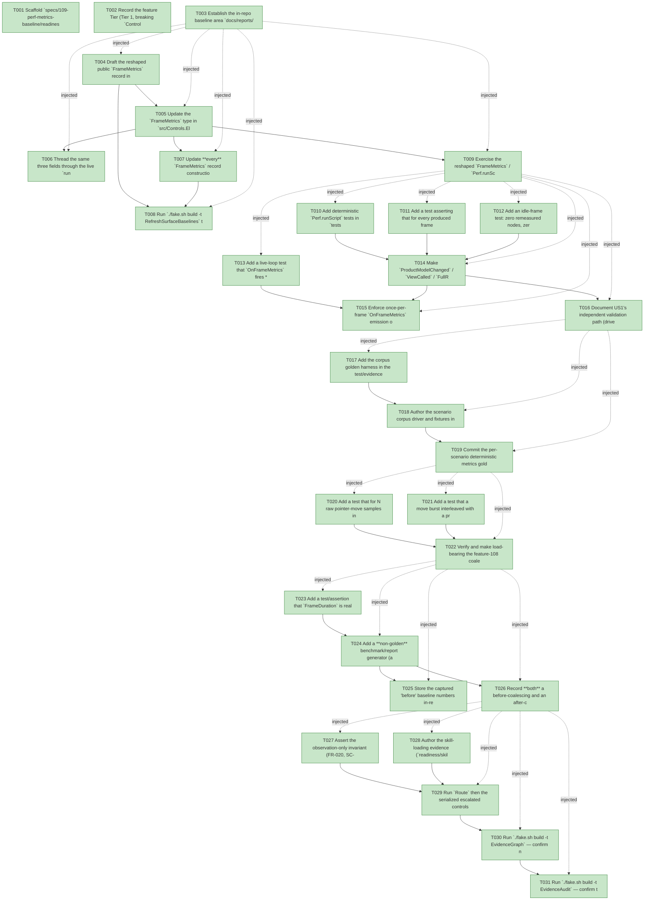

# Task Graph — 109-perf-metrics-baseline

## ✓ Graph is acyclic and consistent

## Skill Match Assessments

| Task | Candidate | Confidence | Signals | Reviewer disposition | Diagnostic |
|------|-----------|------------|---------|----------------------|------------|
| T001 | (none) | none |  | accepted-empty | T001: skillist trusted as declared; no owns-based capability requirement |
| T002 | (none) | none |  | accepted-empty | T002: skillist trusted as declared; no owns-based capability requirement |
| T003 | (none) | none |  | declared | T003: skillist trusted as declared; no owns-based capability requirement |
| T004 | (none) | none |  | declared | T004: skillist trusted as declared; no owns-based capability requirement |
| T005 | (none) | none |  | declared | T005: skillist trusted as declared; no owns-based capability requirement |
| T006 | (none) | none |  | declared | T006: skillist trusted as declared; no owns-based capability requirement |
| T007 | (none) | none |  | declared | T007: skillist trusted as declared; no owns-based capability requirement |
| T008 | (none) | none |  | declared | T008: skillist trusted as declared; no owns-based capability requirement |
| T009 | (none) | none |  | accepted-empty | T009: skillist trusted as declared; no owns-based capability requirement |
| T010 | (none) | none |  | declared | T010: skillist trusted as declared; no owns-based capability requirement |
| T011 | (none) | none |  | declared | T011: skillist trusted as declared; no owns-based capability requirement |
| T012 | (none) | none |  | declared | T012: skillist trusted as declared; no owns-based capability requirement |
| T013 | (none) | none |  | declared | T013: skillist trusted as declared; no owns-based capability requirement |
| T014 | (none) | none |  | declared | T014: skillist trusted as declared; no owns-based capability requirement |
| T015 | (none) | none |  | declared | T015: skillist trusted as declared; no owns-based capability requirement |
| T016 | (none) | none |  | accepted-empty | T016: skillist trusted as declared; no owns-based capability requirement |
| T017 | (none) | none |  | declared | T017: skillist trusted as declared; no owns-based capability requirement |
| T018 | (none) | none |  | declared | T018: skillist trusted as declared; no owns-based capability requirement |
| T019 | (none) | none |  | declared | T019: skillist trusted as declared; no owns-based capability requirement |
| T020 | (none) | none |  | declared | T020: skillist trusted as declared; no owns-based capability requirement |
| T021 | (none) | none |  | declared | T021: skillist trusted as declared; no owns-based capability requirement |
| T022 | (none) | none |  | declared | T022: skillist trusted as declared; no owns-based capability requirement |
| T023 | (none) | none |  | declared | T023: skillist trusted as declared; no owns-based capability requirement |
| T024 | (none) | none |  | declared | T024: skillist trusted as declared; no owns-based capability requirement |
| T025 | (none) | none |  | declared | T025: skillist trusted as declared; no owns-based capability requirement |
| T026 | (none) | none |  | declared | T026: skillist trusted as declared; no owns-based capability requirement |
| T027 | (none) | none |  | declared | T027: skillist trusted as declared; no owns-based capability requirement |
| T028 | (none) | none |  | declared | T028: skillist trusted as declared; no owns-based capability requirement |
| T029 | (none) | none |  | declared | T029: skillist trusted as declared; no owns-based capability requirement |
| T030 | speckit-evidence-graph | high | owns:graph-validation | accepted | T030: owns graph-validation requires skill speckit-evidence-graph; trigger_group=owns; matched_trigger=owns:graph-validation |
| T031 | speckit-evidence-audit | high | owns:evidence-audit | accepted | T031: owns evidence-audit requires skill speckit-evidence-audit; trigger_group=owns; matched_trigger=owns:evidence-audit |

## Status counts (effective)

| Status | Count |
|--------|-------|
| [X] done | 31 |
| [S] synthetic | 0 |
| [S*] auto-synthetic | 0 |
| accepted [SEH] synthetic | 0 |
| unaccepted synthetic | 0 |

## Graph



## ASCII view

```
T001 [X] Scaffold `specs/109-perf-metrics-baseline/readiness/` with the audit-enforced placeholder files discoverable before implementation: `governance-risk-levels.md`, `aggregate-hang-diagnostics.md`, `runtime-limitations.md`, `generated-validation.md`, `skill-loading-evidence.md`, `evidence-graph.md`, `evidence-audit.md`, plus `window-visibility.md` and `real-image-evidence.md` not-applicable stubs (observation-only feature, no window launch). Each names its authoritative command, artifact path, failure class, and next action.
T002 [X] Record the feature Tier (Tier 1, breaking `ControlsElmish.fsi`), affected layer (`FS.Skia.UI.Controls.Elmish` observability surface only), public-API impact (remove `ViewRebuilt`; add `ProductModelChanged`, `ViewCalled`, `FullRenderCount`), Elmish/MVU applicability (MVU semantics unchanged — observation only), the small/medium/broad governance risk levels, and the required evidence obligations into `readiness/`.
T003 [X] Establish the in-repo baseline area `docs/reports/_baselines/` for this feature (a `109-` baseline record skeleton) and the deterministic-evidence honesty note that timing/allocation are human-facing only and never gate (counts gate, timing informs).
T004 [X] Draft the reshaped public `FrameMetrics` record in `src/Controls.Elmish/ControlsElmish.fsi`: **remove** `ViewRebuilt`; **add** `ProductModelChanged: bool` and `ViewCalled: bool` (FR-001/FR-002), **add** `FullRenderCount: int` (FR-015); keep `RemeasuredNodeCount`, `PointerSamplesReceived`, `PointerMovesProcessed`, `FrameDuration`. Write a `///` XML-doc line on every changed/new field giving its single precise meaning (doc-preservation gate; SC-011), with the attribute-before-doc-before-type ordering the XML-doc gate requires.
T005 [X] Update the `FrameMetrics` type in `src/Controls.Elmish/ControlsElmish.fs` to match the new `.fsi`, and thread the real facts through `Perf.runScript`: `ProductModelChanged` = a product message changed the model; `ViewCalled` = `host.View size model` actually ran for the frame (true on the animation-only tick path where it runs with no product message); `FullRenderCount` = count of full `host.View` + `Control.renderTree` rebuilds for the frame. Keep deterministic counts byte-stable; do not alter render/layout/dispatch behavior (FR-020).
T006 [X] Thread the same three fields through the live `runInteractiveApp` emit path (`emitFrameMetrics`) so the live `OnFrameMetrics` sink reports the same code-path facts as `Perf.runScript`, preserving inert at-rest defaults.
T007 [X] Update **every** `FrameMetrics` record construction/read site in the same change so the build stays green: the existing tests that construct or read `ViewRebuilt` (`tests/Elmish.Tests/Feature108MetricsTests.fs`, `Feature090DispatchTests.fs`, `Feature098DispatchTests.fs`) — replacing `ViewRebuilt` with the new fields. Confirm (per plan research D8) that the `OnFrameMetrics = ignore` sites (`template/base/src/Product/EvidenceCommands.fs`, `tests/SkiaViewer.Tests/Feature085InteractiveHostTests.fs`) set a host *field*, **not** a `FrameMetrics` record, and therefore need no edit; and that no `scripts/*-prelude.fsx` FSI prelude constructs a `FrameMetrics` (grep-clean), so none needs updating.
T008 [X] Run `./fake.sh build -t RefreshSurfaceBaselines` to regenerate `readiness/surface-baselines/FS.Skia.UI.Controls.Elmish.txt` and `readiness/per-package-surface/FS.Skia.UI.Controls.Elmish.fsi.txt` for the field change, and confirm the only shipped-surface delta is the `FrameMetrics` fields (no other API moved).
T009 [X] Exercise the reshaped `FrameMetrics` / `Perf.runScript` surface from FSI against the built library and capture the transcript to `readiness/fsi-session.txt`, showing the new fields populated for representative frames.
T010 [X] Add deterministic `Perf.runScript` tests in `tests/Elmish.Tests/` for the three scripted frames of the Independent Test: (a) a frame with no product message → `ProductModelChanged = false`; (b) a product message that changes the model with no visual difference → `ProductModelChanged = true` with `RemeasuredNodeCount`/`FullRenderCount` reporting the *actual* work, no field implying more (FR-003/FR-004); (c) a host-owned hover/focus/animation change with no product message → `ProductModelChanged = false` while `ViewCalled` and the real per-frame work are reported truthfully (FR-005) (SC-001).
T011 [X] Add a test asserting that for every produced frame each field's meaning is single and precise — `ProductModelChanged` and `ViewCalled` can diverge (animation-only tick: `ProductModelChanged = false`, `ViewCalled = true`) — so no surviving field conflates "model changed" with "view ran" (SC-011).
T012 [X] Add an idle-frame test: zero remeasured nodes, zero pointer moves processed, `ViewCalled = false`, unless an active animation clock or explicit tick requires work (FR-006, SC-004).
T013 [X] Add a live-loop test that `OnFrameMetrics` fires **exactly once** per produced frame (not once per incidental flush boundary, not with ambiguous aggregated counts) (FR-007, SC-010).
T014 [X] Make `ProductModelChanged` / `ViewCalled` / `FullRenderCount` truthful across all `Perf.runScript` frame arms (coalesced-move, idle, tick/animation, key, discrete-pointer) so each reports its real code path — in particular `ViewCalled = true` on the animation-only tick where `renderStep` runs with no product message, and the pointer-routing `host.View` call is accounted for honestly in `FullRenderCount` (FR-001..FR-006).
T015 [X] Enforce once-per-frame `OnFrameMetrics` emission on the live `runInteractiveApp` loop (FR-007) and document the precise meaning of each `FrameMetrics` field (the reviewer-nameable single meaning, SC-011) in `readiness/`.
T016 [X] Document US1's independent validation path (drive the three scripted frames through `Perf.runScript`; assert view/model fields match the code path in every case) in `readiness/`.
T017 [X] Add the corpus golden harness in the test/evidence project: for each scenario, drive it through `Perf.runScript`, assert the per-frame count/boolean metrics against a committed golden, and re-run to confirm byte-for-byte identity (timing fields excluded) (FR-014, SC-005).
T018 [X] Author the scenario corpus driver and fixtures in **test/evidence projects only** (no new shipped `Controls.Elmish` API) covering FR-013: hover sweep across 100 / 1000 / 5000 simple controls; DataGrid at 100 / 1000 / 10000 rows against the **current fully-materialized** path (pre-virtualization baseline, not "fixed" here); deep nested layout of repeated labels and buttons; text entry in a focused field while unrelated controls animate; theme switch across a moderate dashboard; continuous drag/freehand path of hundreds of raw samples.
T019 [X] Commit the per-scenario deterministic metrics goldens (counts + booleans only) under the feature evidence area, and make the evidence answer in counts, per scripted interaction, how many times `host.View` ran, how many full renders occurred, and how many nodes were remeasured (FR-015, SC-006). The baseline MUST explicitly state which phase counters are **not yet captured** (paint / composite / hit-test arrive in later phases — silent omission is not acceptable).
T020 [X] Add a test that for N raw pointer-move samples in one frame (including any deferred/queued from a prior boundary) the reported `PointerSamplesReceived = N` and `PointerMovesProcessed ≤ 1` (FR-008/FR-009, SC-002).
T021 [X] Add a test that a move burst interleaved with a press, release, click, and scroll drops **none** of the discrete interactions (FR-010, SC-003), and a test that a continuous drag/freehand gesture of hundreds of samples keeps its raw path available to path-consuming consumers (FR-011).
T022 [X] Verify and make load-bearing the feature-108 coalescing on both `Perf.runScript` and the live `runInteractiveApp` loop: `PointerSamplesReceived` counts raw native samples including deferred moves (FR-008), bursts collapse to ≤ 1 processed move (FR-009), discrete press/release/click/scroll are never coalesced or dropped (FR-010), and the raw drag path remains obtainable for path-consuming routing/repaint (FR-011) — without changing dispatch behavior.
T023 [X] Add a test/assertion that `FrameDuration` is real wall-clock timing for live diagnostics and is **excluded** from every deterministic golden assertion (FR-012), and that timing/allocation fields are absent from the deterministic goldens (SC-009).
T024 [X] Add a **non-golden** benchmark/report generator (a local report command in the test/evidence project) that captures per-scenario timing and allocation fields, kept strictly separate from the deterministic goldens (FR-016).
T025 [X] Store the captured "before" baseline numbers in-repo under `docs/reports/_baselines/` (FR-017) and define the regression thresholds in deterministic **counts first, timing second** (FR-018), recording that none of the timing/allocation fields appears in any golden (SC-009).
T026 [X] Record **both** a before-coalescing and an after-coalescing feature-108 baseline for a hover/pointer-move burst under `docs/reports/_baselines/`, so the coalescing benefit is evidenced rather than asserted (FR-019, SC-007).
T027 [X] Assert the observation-only invariant (FR-020, SC-008): at-rest rendered output, control geometry, dispatch behavior, and the default (non-observing) host path are byte-identical to the pre-feature state — the `FrameMetrics` field change and `FullRenderCount` addition change the observability surface only, no rendered pixel / layout box / dispatch outcome.
T028 [X] Author the skill-loading evidence (`readiness/skill-loading-evidence.md`, one row per (task, skill)), the window-visibility not-applicable set (this feature launches no window), the `readiness/evidence-audit.md` verdict token, and the `readiness/generated-validation.md` package-resolution tokens (`package-resolution=resolved`, `package-mismatch=false`).
T029 [X] Run `Route` then the serialized escalated controls-public-surface gate order (`Dev` → `GeneratedGuidanceCheck` → `TemplateCheck` → `GeneratedProductCheck`) sequentially (shared `.fake` state — never concurrent), recording focused per-target verdicts and any non-authoritative aggregate result as advisory in `readiness/aggregate-hang-diagnostics.md`.
T030 [X] Run `./fake.sh build -t EvidenceGraph` — confirm no cycles, no dangling refs, and no `[S*]` surprises; confirm the echoed `feature-directory=specs/109-perf-metrics-baseline` and `tasks=<n>` match this feature.
T031 [X] Run `./fake.sh build -t EvidenceAudit` — confirm the verdict is PASS (no `[S]`/`[S*]`, no diff-scan hits) or document every `--accept-synthetic` override.
```

## Injected checkpoint edges (Phase N+1 → Phase N) — FR-007

- T003 → T004  (auto-injected Phase-checkpoint edge)
- T003 → T005  (auto-injected Phase-checkpoint edge)
- T003 → T006  (auto-injected Phase-checkpoint edge)
- T003 → T007  (auto-injected Phase-checkpoint edge)
- T003 → T008  (auto-injected Phase-checkpoint edge)
- T003 → T009  (auto-injected Phase-checkpoint edge)
- T009 → T010  (auto-injected Phase-checkpoint edge)
- T009 → T011  (auto-injected Phase-checkpoint edge)
- T009 → T012  (auto-injected Phase-checkpoint edge)
- T009 → T013  (auto-injected Phase-checkpoint edge)
- T009 → T014  (auto-injected Phase-checkpoint edge)
- T009 → T015  (auto-injected Phase-checkpoint edge)
- T009 → T016  (auto-injected Phase-checkpoint edge)
- T016 → T017  (auto-injected Phase-checkpoint edge)
- T016 → T018  (auto-injected Phase-checkpoint edge)
- T016 → T019  (auto-injected Phase-checkpoint edge)
- T019 → T020  (auto-injected Phase-checkpoint edge)
- T019 → T021  (auto-injected Phase-checkpoint edge)
- T019 → T022  (auto-injected Phase-checkpoint edge)
- T022 → T023  (auto-injected Phase-checkpoint edge)
- T022 → T024  (auto-injected Phase-checkpoint edge)
- T022 → T025  (auto-injected Phase-checkpoint edge)
- T022 → T026  (auto-injected Phase-checkpoint edge)
- T026 → T027  (auto-injected Phase-checkpoint edge)
- T026 → T028  (auto-injected Phase-checkpoint edge)
- T026 → T029  (auto-injected Phase-checkpoint edge)
- T026 → T030  (auto-injected Phase-checkpoint edge)
- T026 → T031  (auto-injected Phase-checkpoint edge)

## Resolved skillist ids — FR-007

Resolved skillist-id set (9): fs-skia-controls-host, fs-skia-evidence-mode, fs-skia-reconciliation, fs-skia-template-update, fs-skia-testing, fs-skia-ui-widgets, fsharp-build-orchestration, speckit-evidence-audit, speckit-evidence-graph

## Skillist id → SKILL.md path

fs-skia-controls-host → .agents/skills/fs-skia-controls-host/SKILL.md
fs-skia-evidence-mode → .agents/skills/fs-skia-evidence-mode/SKILL.md
fs-skia-reconciliation → .agents/skills/fs-skia-reconciliation/SKILL.md
fs-skia-template-update → .agents/skills/fs-skia-template-update/SKILL.md
fs-skia-testing → src/Testing/skill/SKILL.md
fs-skia-ui-widgets → src/Controls/skill/SKILL.md
fsharp-build-orchestration → .agents/skills/fsharp-build-orchestration/SKILL.md
speckit-evidence-audit → .agents/skills/speckit-evidence-audit/SKILL.md
speckit-evidence-graph → .agents/skills/speckit-evidence-graph/SKILL.md

## Skillist id → unresolved / flagged

_(none — every declared skillist id resolves to exactly one installed skill)_

