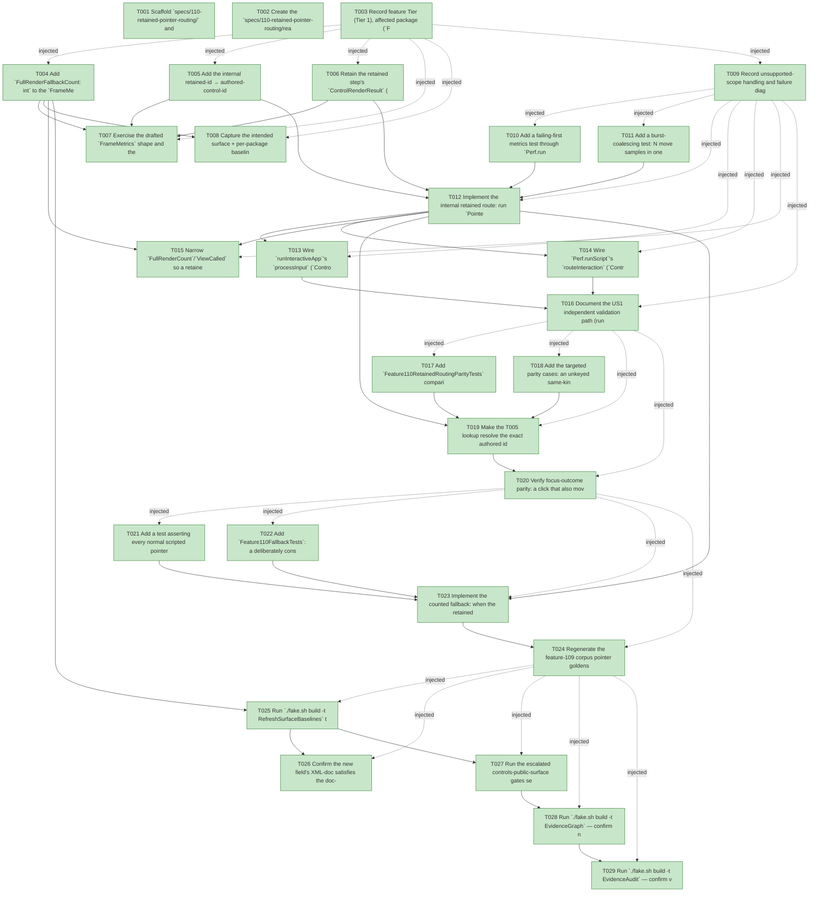

# Task Graph — 110-retained-pointer-routing

## ✓ Graph is acyclic and consistent

## Skill Match Assessments

| Task | Candidate | Confidence | Signals | Reviewer disposition | Diagnostic |
|------|-----------|------------|---------|----------------------|------------|
| T001 | (none) | none |  | accepted-empty | T001: skillist trusted as declared; no owns-based capability requirement |
| T002 | (none) | none |  | accepted-empty | T002: skillist trusted as declared; no owns-based capability requirement |
| T003 | (none) | none |  | accepted-empty | T003: skillist trusted as declared; no owns-based capability requirement |
| T004 | (none) | none |  | declared | T004: skillist trusted as declared; no owns-based capability requirement |
| T005 | (none) | none |  | declared | T005: skillist trusted as declared; no owns-based capability requirement |
| T006 | (none) | none |  | declared | T006: skillist trusted as declared; no owns-based capability requirement |
| T007 | (none) | none |  | declared | T007: skillist trusted as declared; no owns-based capability requirement |
| T008 | (none) | none |  | declared | T008: skillist trusted as declared; no owns-based capability requirement |
| T009 | (none) | none |  | accepted-empty | T009: skillist trusted as declared; no owns-based capability requirement |
| T010 | (none) | none |  | declared | T010: skillist trusted as declared; no owns-based capability requirement |
| T011 | (none) | none |  | declared | T011: skillist trusted as declared; no owns-based capability requirement |
| T012 | (none) | none |  | declared | T012: skillist trusted as declared; no owns-based capability requirement |
| T013 | (none) | none |  | declared | T013: skillist trusted as declared; no owns-based capability requirement |
| T014 | (none) | none |  | declared | T014: skillist trusted as declared; no owns-based capability requirement |
| T015 | (none) | none |  | declared | T015: skillist trusted as declared; no owns-based capability requirement |
| T016 | (none) | none |  | accepted-empty | T016: skillist trusted as declared; no owns-based capability requirement |
| T017 | (none) | none |  | declared | T017: skillist trusted as declared; no owns-based capability requirement |
| T018 | (none) | none |  | declared | T018: skillist trusted as declared; no owns-based capability requirement |
| T019 | (none) | none |  | declared | T019: skillist trusted as declared; no owns-based capability requirement |
| T020 | (none) | none |  | declared | T020: skillist trusted as declared; no owns-based capability requirement |
| T021 | (none) | none |  | declared | T021: skillist trusted as declared; no owns-based capability requirement |
| T022 | (none) | none |  | declared | T022: skillist trusted as declared; no owns-based capability requirement |
| T023 | (none) | none |  | declared | T023: skillist trusted as declared; no owns-based capability requirement |
| T024 | (none) | none |  | declared | T024: skillist trusted as declared; no owns-based capability requirement |
| T025 | (none) | none |  | declared | T025: skillist trusted as declared; no owns-based capability requirement |
| T026 | (none) | none |  | declared | T026: skillist trusted as declared; no owns-based capability requirement |
| T027 | (none) | none |  | declared | T027: skillist trusted as declared; no owns-based capability requirement |
| T028 | speckit-evidence-graph | high | owns:graph-validation | accepted | T028: owns graph-validation requires skill speckit-evidence-graph; trigger_group=owns; matched_trigger=owns:graph-validation |
| T029 | speckit-evidence-audit | high | owns:evidence-audit | accepted | T029: owns evidence-audit requires skill speckit-evidence-audit; trigger_group=owns; matched_trigger=owns:evidence-audit |

## Status counts (effective)

| Status | Count |
|--------|-------|
| [X] done | 29 |
| [S] synthetic | 0 |
| [S*] auto-synthetic | 0 |
| accepted [SEH] synthetic | 0 |
| unaccepted synthetic | 0 |

## Graph



## ASCII view

```
T001 [X] Scaffold `specs/110-retained-pointer-routing/` and confirm spec + plan + research + data-model + contracts + quickstart are linked and current
T002 [X] Create the `specs/110-retained-pointer-routing/readiness/` scaffolds discoverable before implementation — `evidence-audit.md`, `evidence-graph.md`, `skill-loading-evidence.md`, `governance-risk-levels.md`, `aggregate-hang-diagnostics.md`, `runtime-limitations.md`, `generated-validation.md`, and the window-visibility not-applicable set — each naming its authoritative command, artifact path, failure class, and next action
T003 [X] Record feature Tier (Tier 1), affected package (`FS.Skia.UI.Controls.Elmish` + internal `FS.Skia.UI.Controls` retained surface), public-API impact (`FrameMetrics` field), Elmish/MVU applicability (unchanged — N/A with rationale above), and the required evidence obligations (parity oracle, forced fallback, regenerated goldens, baselines, XML-doc)
T004 [X] Add `FullRenderFallbackCount: int` to the `FrameMetrics` record in `ControlsElmish.fsi` with XML-doc, mirror it in the `.fs` definition, and update **every** construction site so the build compiles (`emitFrameMetrics` ~`ControlsElmish.fs:804`, `zero` ~`1076`, move ~`1107`, tick ~`1144`, key ~`1162`, discrete ~`1178`) plus the test serializer `Feature109CorpusTests.fs:153`
T005 [X] Add the internal retained-id → authored-control-id lookup to `RetainedRender` (`RetainedRender.fsi` internal seam + `RetainedRender.fs`), built from the step output and reproducing `Control.nearestAuthored`'s keyed-OR-in-`BoundIds` resolution from retained identity (feature 098 scheme)
T006 [X] Retain the retained step's `ControlRenderResult` (`s.Render`) in a live-loop ref (seeded from `r0.Render` on first frame, `ControlsElmish.fs:763-773`) and carry it alongside the threaded retained value in `Perf.runScript` (`ControlsElmish.fs:1042-1053`) so routing reads `EventBindings`/`BoundIds`/`Bounds` without a fresh render
T007 [X] Exercise the drafted `FrameMetrics` shape and the internal retained seam from FSI (prelude or ad-hoc), capturing the session transcript to `readiness/fsi-session.txt`
T008 [X] Capture the intended surface + per-package baseline shape for the `FrameMetrics` change (the authoritative regen happens in T025) and note it in `readiness/`
T009 [X] Record unsupported-scope handling and failure diagnostics: Phase 3+ of the report is OUT; document that the full-render path is preserved as oracle/fallback and that the fallback degrades to correct dispatch (never silent mis-dispatch)
T010 [X] Add a failing-first metrics test through `Perf.runScript` asserting a routed move and a routed press/click each perform **zero** routing full renders — `FullRenderCount` is not incremented for routing and `ViewCalled` stays false on a pure routing frame (SC-001, SC-002)
T011 [X] Add a burst-coalescing test: N move samples in one frame report `PointerMovesProcessed <= 1` with zero routing full renders, and no discrete press/release/click/scroll is dropped; **also** assert drag/freehand **path fidelity** for a path-consuming consumer is retained through the retained route (the per-sample path the consumer observes is unchanged from the 108/109 baseline) (SC-009, FR-012)
T012 [X] Implement the internal retained route: run `Pointer.update` over the retained frame's **cached** `LayoutResult`, resolve each interaction via `retainedHitTest` → the T005 lookup → the retained frame's `EventBindings`, with the unchanged `MapPointer` fallback for unbound interactions — performing no `host.View` + `Control.renderTree` for routing
T013 [X] Wire `runInteractiveApp`'s `processInput` (`ControlsElmish.fs:816-837`) onto the retained route, keeping the already-retained focus-on-click `resolveFocus` path
T014 [X] Wire `Perf.runScript`'s `routeInteraction` (`ControlsElmish.fs:1058-1066`) onto the retained route over the threaded retained frame instead of re-rendering
T015 [X] Narrow `FullRenderCount`/`ViewCalled` so a retained routing frame increments neither, and thread the frame-local `FullRenderFallbackCount` accumulator through `emitFrameMetrics` and every `Perf.runScript` frame branch (FR-008)
T016 [X] Document the US1 independent validation path (run the move-then-click perf script; assert routing full renders are zero with correct hit + messages) in `readiness/`
T017 [X] Add `Feature110RetainedRoutingParityTests` comparing the retained route against the preserved `routeInteractivePointer` oracle over keyed / unkeyed-same-kind-sibling / composite / nested scenes: dispatched message list, matched control identity, and focus outcome are equal (structural comparison, no value equality) (SC-003)
T018 [X] Add the targeted parity cases: an unkeyed same-kind sibling hit selects the same sibling and fires the same binding, and a composite control whose binding is authored above the hit node dispatches the same authored binding (SC-004, FR-003/FR-005)
T019 [X] Make the T005 lookup resolve the exact authored id `nearestAuthored` would (composite-binding-above-hit climb; distinct retained ids for unkeyed siblings) so the parity tests pass
T020 [X] Verify focus-outcome parity: a click that also moves focus yields the same focused identity via the retained path as the oracle (FR-006 focus clause)
T021 [X] Add a test asserting every normal scripted pointer scenario in the corpus reports `FullRenderFallbackCount = 0` for every frame (SC-005)
T022 [X] Add `Feature110FallbackTests`: a deliberately constructed unroutable case increments `FullRenderFallbackCount` by one and the fallback dispatch still equals the oracle's (SC-006). Real evidence — the fallback runs the preserved oracle (real product code), so this is not synthetic
T023 [X] Implement the counted fallback: when the retained route cannot resolve an event from the retained frame, fall back to the preserved `routeInteractivePointer` oracle and increment `FullRenderFallbackCount` (FR-007/FR-009)
T024 [X] Regenerate the feature-109 corpus pointer goldens (`PERF_CORPUS_REGEN=1`) so routing full-render counts drop to zero, and record the before/after delta in `readiness/`; **also** confirm the at-rest **rendered output + control geometry** byte-identity clause of FR-011/SC-008 — assert no rendered-scene/geometry golden delta against the pre-feature state (the standing Scene-parity golden suite run under `Dev`/T027 is the authority) and record that authority decision in `readiness/byte-identity-authority.md` (SC-007, SC-008, FR-010, FR-011)
T025 [X] Run `./fake.sh build -t RefreshSurfaceBaselines` to regenerate the surface + per-package baselines for the `FrameMetrics` field, and update any remaining `FrameMetrics` construction/read sites it flags (samples, FSI preludes)
T026 [X] Confirm the new field's XML-doc satisfies the doc-preservation gate and the public `routeInteractivePointer` signature is unchanged (oracle/fallback preserved)
T027 [X] Run the escalated controls-public-surface gates sequentially — `Dev`, `GeneratedGuidanceCheck`, `TemplateCheck`, `GeneratedProductCheck` — and record the focused governance risk level + non-authoritative aggregate notes in `readiness/`
T028 [X] Run `./fake.sh build -t EvidenceGraph` — confirm no cycles, no dangling refs, no `[S*]` surprises, and the echoed `feature-directory`/`tasks=<n>` match this feature
T029 [X] Run `./fake.sh build -t EvidenceAudit` — confirm verdict PASS with no remaining `[S]`/`[S*]` and no diff-scan hits, or document every `--accept-synthetic` override
```

## Injected checkpoint edges (Phase N+1 → Phase N) — FR-007

- T003 → T004  (auto-injected Phase-checkpoint edge)
- T003 → T005  (auto-injected Phase-checkpoint edge)
- T003 → T006  (auto-injected Phase-checkpoint edge)
- T003 → T007  (auto-injected Phase-checkpoint edge)
- T003 → T008  (auto-injected Phase-checkpoint edge)
- T003 → T009  (auto-injected Phase-checkpoint edge)
- T009 → T010  (auto-injected Phase-checkpoint edge)
- T009 → T011  (auto-injected Phase-checkpoint edge)
- T009 → T012  (auto-injected Phase-checkpoint edge)
- T009 → T013  (auto-injected Phase-checkpoint edge)
- T009 → T014  (auto-injected Phase-checkpoint edge)
- T009 → T015  (auto-injected Phase-checkpoint edge)
- T009 → T016  (auto-injected Phase-checkpoint edge)
- T016 → T017  (auto-injected Phase-checkpoint edge)
- T016 → T018  (auto-injected Phase-checkpoint edge)
- T016 → T019  (auto-injected Phase-checkpoint edge)
- T016 → T020  (auto-injected Phase-checkpoint edge)
- T020 → T021  (auto-injected Phase-checkpoint edge)
- T020 → T022  (auto-injected Phase-checkpoint edge)
- T020 → T023  (auto-injected Phase-checkpoint edge)
- T020 → T024  (auto-injected Phase-checkpoint edge)
- T024 → T025  (auto-injected Phase-checkpoint edge)
- T024 → T026  (auto-injected Phase-checkpoint edge)
- T024 → T027  (auto-injected Phase-checkpoint edge)
- T024 → T028  (auto-injected Phase-checkpoint edge)
- T024 → T029  (auto-injected Phase-checkpoint edge)

## Resolved skillist ids — FR-007

Resolved skillist-id set (7): fs-skia-controls-host, fs-skia-evidence-mode, fs-skia-reconciliation, fs-skia-template-update, fs-skia-ui-widgets, speckit-evidence-audit, speckit-evidence-graph

## Skillist id → SKILL.md path

fs-skia-controls-host → .agents/skills/fs-skia-controls-host/SKILL.md
fs-skia-evidence-mode → .agents/skills/fs-skia-evidence-mode/SKILL.md
fs-skia-reconciliation → .agents/skills/fs-skia-reconciliation/SKILL.md
fs-skia-template-update → .agents/skills/fs-skia-template-update/SKILL.md
fs-skia-ui-widgets → src/Controls/skill/SKILL.md
speckit-evidence-audit → .agents/skills/speckit-evidence-audit/SKILL.md
speckit-evidence-graph → .agents/skills/speckit-evidence-graph/SKILL.md

## Skillist id → unresolved / flagged

_(none — every declared skillist id resolves to exactly one installed skill)_

