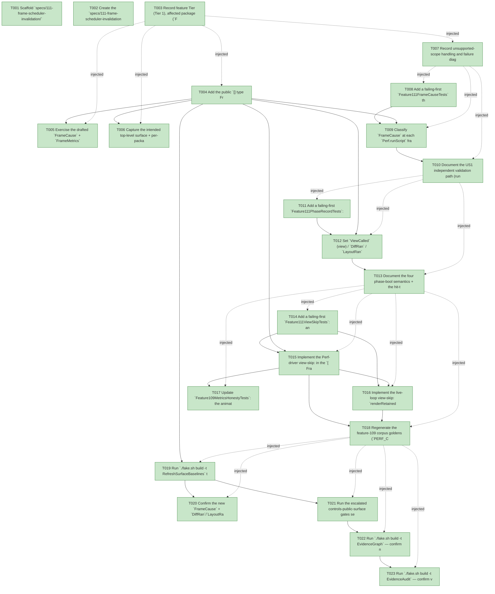

# Task Graph — 111-frame-scheduler-invalidation

## ✓ Graph is acyclic and consistent

## Skill Match Assessments

| Task | Candidate | Confidence | Signals | Reviewer disposition | Diagnostic |
|------|-----------|------------|---------|----------------------|------------|
| T001 | (none) | none |  | accepted-empty | T001: skillist trusted as declared; no owns-based capability requirement |
| T002 | (none) | none |  | accepted-empty | T002: skillist trusted as declared; no owns-based capability requirement |
| T003 | (none) | none |  | accepted-empty | T003: skillist trusted as declared; no owns-based capability requirement |
| T004 | (none) | none |  | declared | T004: skillist trusted as declared; no owns-based capability requirement |
| T005 | (none) | none |  | declared | T005: skillist trusted as declared; no owns-based capability requirement |
| T006 | (none) | none |  | declared | T006: skillist trusted as declared; no owns-based capability requirement |
| T007 | (none) | none |  | accepted-empty | T007: skillist trusted as declared; no owns-based capability requirement |
| T008 | (none) | none |  | declared | T008: skillist trusted as declared; no owns-based capability requirement |
| T009 | (none) | none |  | declared | T009: skillist trusted as declared; no owns-based capability requirement |
| T010 | (none) | none |  | accepted-empty | T010: skillist trusted as declared; no owns-based capability requirement |
| T011 | (none) | none |  | declared | T011: skillist trusted as declared; no owns-based capability requirement |
| T012 | (none) | none |  | declared | T012: skillist trusted as declared; no owns-based capability requirement |
| T013 | (none) | none |  | accepted-empty | T013: skillist trusted as declared; no owns-based capability requirement |
| T014 | (none) | none |  | declared | T014: skillist trusted as declared; no owns-based capability requirement |
| T015 | (none) | none |  | declared | T015: skillist trusted as declared; no owns-based capability requirement |
| T016 | (none) | none |  | declared | T016: skillist trusted as declared; no owns-based capability requirement |
| T017 | (none) | none |  | declared | T017: skillist trusted as declared; no owns-based capability requirement |
| T018 | (none) | none |  | declared | T018: skillist trusted as declared; no owns-based capability requirement |
| T019 | (none) | none |  | declared | T019: skillist trusted as declared; no owns-based capability requirement |
| T020 | (none) | none |  | declared | T020: skillist trusted as declared; no owns-based capability requirement |
| T021 | (none) | none |  | declared | T021: skillist trusted as declared; no owns-based capability requirement |
| T022 | speckit-evidence-graph | high | owns:graph-validation | accepted | T022: owns graph-validation requires skill speckit-evidence-graph; trigger_group=owns; matched_trigger=owns:graph-validation |
| T023 | speckit-evidence-audit | high | owns:evidence-audit | accepted | T023: owns evidence-audit requires skill speckit-evidence-audit; trigger_group=owns; matched_trigger=owns:evidence-audit |

## Status counts (effective)

| Status | Count |
|--------|-------|
| [X] done | 23 |
| [S] synthetic | 0 |
| [S*] auto-synthetic | 0 |
| accepted [SEH] synthetic | 0 |
| unaccepted synthetic | 0 |

## Graph



## ASCII view

```
T001 [X] Scaffold `specs/111-frame-scheduler-invalidation/` and confirm spec + plan + research + data-model + contracts + quickstart are linked and current
T002 [X] Create the `specs/111-frame-scheduler-invalidation/readiness/` scaffolds discoverable before implementation — `evidence-audit.md`, `evidence-graph.md`, `skill-loading-evidence.md`, `governance-risk-levels.md`, `aggregate-hang-diagnostics.md`, `runtime-limitations.md`, `generated-validation.md`, `byte-identity-authority.md`, `view-free-delta.md`, and the window-visibility not-applicable set — each naming its authoritative command, artifact path, failure class, and next action
T003 [X] Record feature Tier (Tier 1), affected package (`FS.Skia.UI.Controls.Elmish` + internal `FS.Skia.UI.Controls` retained surface), public-API impact (new `FrameCause` DU + `FrameMetrics` `DiffRan`/`LayoutRan`/`PaintRan` + narrowed `ViewCalled`), Elmish/MVU applicability (unchanged — N/A with the rationale above), and the required evidence obligations (cause classification, phase record, view-skip byte-identity, regenerated goldens, baselines, XML-doc)
T004 [X] Add the public `[<RequireQualifiedAccess>] type FrameCause` DU and the `FrameCause` + `DiffRan` + `LayoutRan` + `PaintRan` fields to `FrameMetrics` in `ControlsElmish.fsi` (XML-doc each; narrow the `ViewCalled` doc), mirror them in the `.fs` definition, and thread them through **every** construction site so the build compiles — Perf `zero` (~`ControlsElmish.fs:1231`), coalesced move (~`1247`), tick (~`1273`), key (~`1307`), discrete (~`1325`), and live `emitFrameMetrics` (~`918`) — plus the test serializer `Feature109CorpusTests.fs:153` (cause classified per branch; phase bools per the CURRENT pipeline; the animation-tick view-skip is deferred to US3) (FR-001/FR-002/FR-007/FR-010)
T005 [X] Exercise the drafted `FrameCause` + `FrameMetrics` shape from FSI (a move/idle frame through `Perf.runScript`), capturing the session transcript to `readiness/fsi-session.txt`
T006 [X] Capture the intended top-level surface + per-package baseline shape for the new `FrameCause` type + fields (the authoritative regen happens in T019) and note it in `readiness/`
T007 [X] Record unsupported-scope handling and failure diagnostics: Phase 4+ is OUT; the full-tree runtime visual-state stamp is preserved (FR-009); the view-skip is gated on an unchanged `(model, size)` and degrades to a re-view fallback (never a stale/incorrect frame)
T008 [X] Add a failing-first `Feature111FrameCauseTests` through `Perf.runScript`: an idle / coalesced-move-burst / discrete-click / key / animation-only-tick script reports `FrameCause` `Idle` / `PointerMove` / `PointerDiscrete` / `Key` / `Tick` respectively, byte-stable across repeated runs (FR-001/SC-001, SC-005)
T009 [X] Classify `FrameCause` at each `Perf.runScript` frame branch and at the live `mapPointer` (Moved → `PointerMove`; discrete → `PointerDiscrete`) and `wrappedTick` (`Tick`) seams; `Resize`/`Theme` remain live-only causes (no corpus frame produces them). Make T008 pass (FR-001)
T010 [X] Document the US1 independent validation path (run the mixed script; assert each frame's `FrameCause`) in `readiness/`
T011 [X] Add a failing-first `Feature111PhaseRecordTests`: an idle frame reports all four phase bools `false` (FR-005); an animation-only tick reports `ViewCalled = false` and `PaintRan = true`; a geometry-changing model frame reports `ViewCalled`/`DiffRan`/`LayoutRan`/`PaintRan` all `true`; a model frame with no visual diff reports `LayoutRan = false` (FR-002/SC-002, SC-004)
T012 [X] Set `ViewCalled` (view) / `DiffRan` / `LayoutRan` / `PaintRan` explicitly per frame at every construction site — `DiffRan` = a new view tree was reconciled; `LayoutRan` = `RemeasuredNodeCount > 0` set at construction (not inferred at read time); `PaintRan` = a model render or animation overlay was assembled. Make T011 pass (FR-002)
T013 [X] Document the four phase-bool semantics + the hit-test-is-not-a-phase-field rationale (clarified 2026-06-12) in `readiness/`
T014 [X] Add a failing-first `Feature111ViewSkipTests`: an animation-only tick and a model-unchanged frame perform **no** `host.View` (`ViewCalled = false`, `FullRenderCount = 0`) while the rendered scene is **byte-identical** to the pre-feature output; a model-changing frame still runs the view (`ViewCalled = true`) (FR-003/FR-004/SC-003, SC-004, SC-007). **Also** assert the frame-rate-work clause (FR-006/SC-008): a continuous-drag burst and a continuous-animation tick sequence each report `PointerMovesProcessed <= 1` and zero per-sample `host.View` rebuilds (the move burst `FullRenderCount = 0`; every animation-only tick view-free), and no discrete press/release/click/scroll is dropped — the feature-108/110 coalescing fidelity is preserved through the scheduler
T015 [X] Implement the Perf-driver view-skip: in the `[ FrameInput.Tick delta ]` branch, an animation-only tick (`hadAnimation && not hasMsgs`) re-samples the overlay by stepping `prev.Root.Control` (the retained tree = `host.View` of the unchanged model) with **no** `host.View` → `ViewCalled = false`, `FullRenderCount` loses the tick's `1`, `PaintRan = true`; a consumer `Tick` message stays a model frame (FR-003/FR-004)
T016 [X] Implement the live-loop view-skip: `renderRetained` caches the un-stamped `host.View size model` output keyed by `(model-reference, size)` and reuses it when `obj.ReferenceEquals(model, cachedModel) && size = cachedSize`, still running `applyRuntimeVisualState` + `RetainedRender.step` and skipping only `host.View`; any key mismatch (incl. every value-type model) re-views (byte-identical fallback) (FR-003)
T017 [X] Update `Feature109MetricsHonestyTests`: the animation-only-tick assertion flips `ViewCalled` to `false` and asserts `PaintRan = true` + the new phase record (scope narrowed, not weakened); confirm the `ViewCalled = (FullRenderCount > 0)` invariant still holds (FR-011)
T018 [X] Regenerate the feature-109 corpus goldens (`PERF_CORPUS_REGEN=1`) so every line carries `FrameCause` + the three phase bools and the `text-entry-while-animating` tick frames are view-free (`ViewCalled false`, `FullRenderCount 0`, `PaintRan true`); record the before/after delta in `readiness/view-free-delta.md`; **also** confirm the at-rest rendered-output + geometry byte-identity clause (FR-008/SC-007) — assert no rendered-scene/geometry golden delta against the pre-feature state (the standing Scene-parity golden suite under `Dev`/T021 is the authority) and record that authority decision in `readiness/byte-identity-authority.md` (FR-008/FR-010/SC-006)
T019 [X] Run `./fake.sh build -t RefreshSurfaceBaselines` to regenerate the top-level surface baseline (gains the `FrameCause` type + cases) and the per-package surface (FrameMetrics fields), and update any remaining `FrameMetrics` construction/read sites it flags (samples, FSI preludes)
T020 [X] Confirm the new `FrameCause` + `DiffRan`/`LayoutRan`/`PaintRan` XML-doc satisfies the doc-preservation gate, the `ViewCalled` doc is narrowed, and no public function signature changed
T021 [X] Run the escalated controls-public-surface gates sequentially as `Route` prints them — `Dev`, `GeneratedGuidanceCheck`, `TemplateCheck`, `GeneratedProductCheck`, the package/per-package surface diffs, and the controls catalog/doc/interaction/rendering checks — and record the focused governance risk level + non-authoritative aggregate notes in `readiness/`
T022 [X] Run `./fake.sh build -t EvidenceGraph` — confirm no cycles, no dangling refs, no `[S*]` surprises, and the echoed `feature-directory`/`tasks=<n>` match this feature
T023 [X] Run `./fake.sh build -t EvidenceAudit` — confirm verdict PASS with no remaining `[S]`/`[S*]` and no diff-scan hits, or document every `--accept-synthetic` override
```

## Injected checkpoint edges (Phase N+1 → Phase N) — FR-007

- T003 → T004  (auto-injected Phase-checkpoint edge)
- T003 → T005  (auto-injected Phase-checkpoint edge)
- T003 → T006  (auto-injected Phase-checkpoint edge)
- T003 → T007  (auto-injected Phase-checkpoint edge)
- T007 → T008  (auto-injected Phase-checkpoint edge)
- T007 → T009  (auto-injected Phase-checkpoint edge)
- T007 → T010  (auto-injected Phase-checkpoint edge)
- T010 → T011  (auto-injected Phase-checkpoint edge)
- T010 → T012  (auto-injected Phase-checkpoint edge)
- T010 → T013  (auto-injected Phase-checkpoint edge)
- T013 → T014  (auto-injected Phase-checkpoint edge)
- T013 → T015  (auto-injected Phase-checkpoint edge)
- T013 → T016  (auto-injected Phase-checkpoint edge)
- T013 → T017  (auto-injected Phase-checkpoint edge)
- T013 → T018  (auto-injected Phase-checkpoint edge)
- T018 → T019  (auto-injected Phase-checkpoint edge)
- T018 → T020  (auto-injected Phase-checkpoint edge)
- T018 → T021  (auto-injected Phase-checkpoint edge)
- T018 → T022  (auto-injected Phase-checkpoint edge)
- T018 → T023  (auto-injected Phase-checkpoint edge)

## Resolved skillist ids — FR-007

Resolved skillist-id set (6): fs-skia-controls-host, fs-skia-evidence-mode, fs-skia-reconciliation, fs-skia-template-update, speckit-evidence-audit, speckit-evidence-graph

## Skillist id → SKILL.md path

fs-skia-controls-host → .agents/skills/fs-skia-controls-host/SKILL.md
fs-skia-evidence-mode → .agents/skills/fs-skia-evidence-mode/SKILL.md
fs-skia-reconciliation → .agents/skills/fs-skia-reconciliation/SKILL.md
fs-skia-template-update → .agents/skills/fs-skia-template-update/SKILL.md
speckit-evidence-audit → .agents/skills/speckit-evidence-audit/SKILL.md
speckit-evidence-graph → .agents/skills/speckit-evidence-graph/SKILL.md

## Skillist id → unresolved / flagged

_(none — every declared skillist id resolves to exactly one installed skill)_

