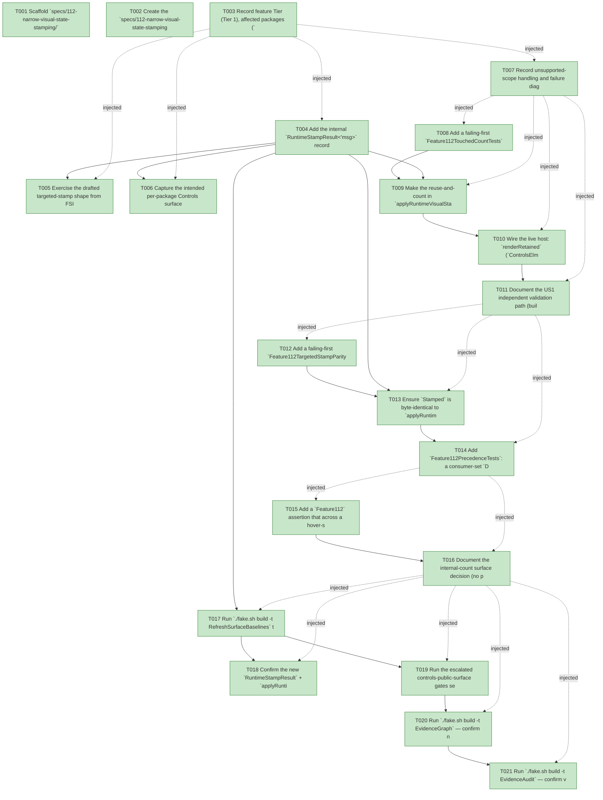

# Task Graph — 112-narrow-visual-state-stamping

## ✓ Graph is acyclic and consistent

## Skill Match Assessments

| Task | Candidate | Confidence | Signals | Reviewer disposition | Diagnostic |
|------|-----------|------------|---------|----------------------|------------|
| T001 | (none) | none |  | accepted-empty | T001: skillist trusted as declared; no owns-based capability requirement |
| T002 | (none) | none |  | accepted-empty | T002: skillist trusted as declared; no owns-based capability requirement |
| T003 | (none) | none |  | accepted-empty | T003: skillist trusted as declared; no owns-based capability requirement |
| T004 | (none) | none |  | declared | T004: skillist trusted as declared; no owns-based capability requirement |
| T005 | (none) | none |  | declared | T005: skillist trusted as declared; no owns-based capability requirement |
| T006 | (none) | none |  | declared | T006: skillist trusted as declared; no owns-based capability requirement |
| T007 | (none) | none |  | accepted-empty | T007: skillist trusted as declared; no owns-based capability requirement |
| T008 | (none) | none |  | declared | T008: skillist trusted as declared; no owns-based capability requirement |
| T009 | (none) | none |  | declared | T009: skillist trusted as declared; no owns-based capability requirement |
| T010 | (none) | none |  | declared | T010: skillist trusted as declared; no owns-based capability requirement |
| T011 | (none) | none |  | accepted-empty | T011: skillist trusted as declared; no owns-based capability requirement |
| T012 | (none) | none |  | declared | T012: skillist trusted as declared; no owns-based capability requirement |
| T013 | (none) | none |  | declared | T013: skillist trusted as declared; no owns-based capability requirement |
| T014 | (none) | none |  | declared | T014: skillist trusted as declared; no owns-based capability requirement |
| T015 | (none) | none |  | declared | T015: skillist trusted as declared; no owns-based capability requirement |
| T016 | (none) | none |  | accepted-empty | T016: skillist trusted as declared; no owns-based capability requirement |
| T017 | (none) | none |  | declared | T017: skillist trusted as declared; no owns-based capability requirement |
| T018 | (none) | none |  | declared | T018: skillist trusted as declared; no owns-based capability requirement |
| T019 | (none) | none |  | declared | T019: skillist trusted as declared; no owns-based capability requirement |
| T020 | speckit-evidence-graph | high | owns:graph-validation | accepted | T020: owns graph-validation requires skill speckit-evidence-graph; trigger_group=owns; matched_trigger=owns:graph-validation |
| T021 | speckit-evidence-audit | high | owns:evidence-audit | accepted | T021: owns evidence-audit requires skill speckit-evidence-audit; trigger_group=owns; matched_trigger=owns:evidence-audit |

## Status counts (effective)

| Status | Count |
|--------|-------|
| [X] done | 21 |
| [S] synthetic | 0 |
| [S*] auto-synthetic | 0 |
| accepted [SEH] synthetic | 0 |
| unaccepted synthetic | 0 |

## Graph



## ASCII view

```
T001 [X] Scaffold `specs/112-narrow-visual-state-stamping/` and confirm spec + plan + research + data-model + contracts + quickstart are linked and current
T002 [X] Create the `specs/112-narrow-visual-state-stamping/readiness/` scaffolds discoverable before implementation — `evidence-audit.md`, `evidence-graph.md`, `skill-loading-evidence.md`, `governance-risk-levels.md`, `aggregate-hang-diagnostics.md`, `runtime-limitations.md`, `generated-validation.md`, `byte-identity-authority.md`, `touched-node-delta.md`, and the window-visibility not-applicable set — each naming its authoritative command, artifact path, failure class, and next action
T003 [X] Record feature Tier (Tier 1), affected packages (`FS.Skia.UI.Controls` `ControlRuntime` + `FS.Skia.UI.Controls.Elmish` live seam), public-API impact (internal `RuntimeStampResult` + `applyRuntimeVisualStateTargeted`; no public signature change; `RuntimeStateTouchedNodeCount` internal), Elmish/MVU + interactive-UI applicability (both N/A with the rationale above), and the required evidence obligations (parity vs oracle, touched count, precedence, baselines, XML-doc)
T004 [X] Add the internal `RuntimeStampResult<'msg>` record (`Stamped` + `RuntimeStateTouchedNodeCount`) and `val internal applyRuntimeVisualStateTargeted: prev -> cur -> prevStamped -> fresh -> RuntimeStampResult<'msg>` to `ControlRuntime.fsi` (XML-doc each), and implement the parallel-walk in `ControlRuntime.fs`: zip `prevStamped` and `fresh`, compute `finalState M node = consumer-set state if non-Normal else deriveVisualState M id`, REUSE the `prevStamped` node when `finalCur = finalPrev` and no descendant changed, else REBUILD from the `fresh` node with `finalCur` stamped (via `setVisualState`, or no `visualState` attr at `Normal`), counting rebuilt nodes (FR-001/FR-007). **Also** add a pure, internal, deterministically-testable **path-selection** helper `val internal runtimeStampFor: prior: (ControlRuntimeModel * Control<'msg>) option -> cur: ControlRuntimeModel -> fresh: Control<'msg> -> RuntimeStampResult<'msg>` that returns the **targeted** result when `prior = Some(prevModel, prevStamped)` and the structures align, else the **full-oracle** result over `fresh` (`applyRuntimeVisualState cur fresh`, count = node count) — this encapsulates the live route choice so FR-002's selection is testable without driving the live loop (FR-002/FR-006). Build compiles
T005 [X] Exercise the drafted targeted-stamp shape from FSI (build a tree + prev/cur models, call `applyRuntimeVisualStateTargeted`, print the touched count), capturing the session transcript to `readiness/fsi-session.txt`
T006 [X] Capture the intended per-package Controls surface baseline shape for the new internal `ControlRuntime` seam (the authoritative regen happens in T017) and note it in `readiness/`
T007 [X] Record unsupported-scope handling and failure diagnostics: Phase 5+ is OUT; the full-tree `applyRuntimeVisualState` oracle is preserved (FR-005); narrowing the reconciler DIFF (vs the stamp) is OUT; features 110/111 (retained routing, scheduler/view-skip) are unchanged (FR-009); the targeted path degrades to the full oracle on a model-change/first/misaligned frame (never a stale render, FR-006); Principle IV + interactive-UI gate N/A
T008 [X] Add a failing-first `Feature112TouchedCountTests` in `tests/Controls.Tests`: over a tree of many controls, a hover move A→B and a focus move A→B each report `RuntimeStateTouchedNodeCount` equal to the A + B + ancestor-path node count (far below the total); a no-change frame (hover persists on the same control, and a fully at-rest frame) reports `0` and reuses every subtree (SC-001/SC-003/SC-006/FR-004)
T009 [X] Make the reuse-and-count in `applyRuntimeVisualStateTargeted` correct: a node whose `finalState` is unchanged AND whose descendants are unchanged returns the `prevStamped` instance untouched (contributes `0`); a changed node rebuilds its path and counts `+1` per rebuilt node. Make T008 pass (FR-001/FR-004/FR-007)
T010 [X] Wire the live host: `renderRetained` (`ControlsElmish.fs:912-920`) calls the pure `ControlRuntime.runtimeStampFor` helper (T004) — passing `Some(lastRuntimeModel, prev.Root.Control)` only on a model-unchanged frame (`viewFor` cache hit + `retained` present), else `None` (model-change / first frame → full oracle) — using `.Stamped` as `next` for `RetainedRender.step` and surfacing `.RuntimeStateTouchedNodeCount` best-effort; add a `lastRuntimeModel` ref updated each frame; confirm the live loop still renders (Dev / standing Scene-parity suite). Routing the live decision through the pure helper makes the model-unchanged-vs-oracle selection deterministically testable (FR-002/FR-006)
T011 [X] Document the US1 independent validation path (build a tree, move hover/focus, assert the touched count « N and no-change = 0) in `readiness/`
T012 [X] Add a failing-first `Feature112TargetedStampParityTests`: for keyed / nested / unkeyed-same-kind-sibling / consumer-set trees and hover-move / focus-move / press-toggle transitions, the targeted stamp's `Stamped` rendered scene (via `Control.renderTree`) and the resolved per-control visual states equal the preserved full-tree `applyRuntimeVisualState` oracle's (structural `Scene` equality; controls have no value equality) (SC-002/FR-005). **Also** assert the live **path-selection** deterministically via `ControlRuntime.runtimeStampFor` (T004): `prior = Some(prevModel, prevStamped)` over an aligned structure takes the targeted route (its scene equals the oracle), and `prior = None` (first/model-change frame) takes the full-oracle route — so FR-002's route choice is covered without driving the live loop (FR-002/FR-006)
T013 [X] Ensure `Stamped` is byte-identical to `applyRuntimeVisualState cur fresh` for every node (a reused node already carries `finalCur`; a rebuilt node is `fresh + finalCur`; `Normal` emits NO `visualState` attribute — byte-identity at rest). Make T012 pass (FR-005/FR-008/SC-002)
T014 [X] Add `Feature112PrecedenceTests`: a consumer-set `Disabled`/`Selected` control keeps its state under targeting (its `finalState` is the consumer state under both models, so it is never re-stamped by a derived hover/focus), and a derived `Normal` emits nothing (FR-003/SC-004)
T015 [X] Add a `Feature112` assertion that across a hover-sweep sequence over a large tree the touched-node counts are proportional to the affected controls, not the control count (SC-006), and that the count is the regression guard — a (temporary, in-test) whole-tree stamp makes the count jump to the node count, proving the metric detects the regression (FR-007)
T016 [X] Document the internal-count surface decision (no public `FrameMetrics` field, clarified 2026-06-12) and the touched-node before/after delta (whole-tree N → affected-paths count) in `readiness/touched-node-delta.md`
T017 [X] Run `./fake.sh build -t RefreshSurfaceBaselines` to regenerate the per-package Controls surface (gains the internal `RuntimeStampResult` type + `applyRuntimeVisualStateTargeted` val) and confirm the top-level public Controls surface baseline is unchanged (the seam is `internal`); update any remaining sites it flags
T018 [X] Confirm the new `RuntimeStampResult` + `applyRuntimeVisualStateTargeted` XML-doc satisfies the doc-preservation gate, the full-tree `applyRuntimeVisualState` oracle's signature/doc are unchanged, and no public function signature changed
T019 [X] Run the escalated controls-public-surface gates sequentially as `Route` prints them — `Dev`, `GeneratedGuidanceCheck`, `TemplateCheck`, `GeneratedProductCheck`, the package/per-package surface diffs, and the controls catalog/doc/interaction/rendering checks — and record the focused governance risk level + non-authoritative aggregate notes in `readiness/`
T020 [X] Run `./fake.sh build -t EvidenceGraph` — confirm no cycles, no dangling refs, no `[S*]` surprises, and the echoed `feature-directory`/`tasks=<n>` match this feature
T021 [X] Run `./fake.sh build -t EvidenceAudit` — confirm verdict PASS with no remaining `[S]`/`[S*]` and no diff-scan hits, or document every `--accept-synthetic` override
```

## Injected checkpoint edges (Phase N+1 → Phase N) — FR-007

- T003 → T004  (auto-injected Phase-checkpoint edge)
- T003 → T005  (auto-injected Phase-checkpoint edge)
- T003 → T006  (auto-injected Phase-checkpoint edge)
- T003 → T007  (auto-injected Phase-checkpoint edge)
- T007 → T008  (auto-injected Phase-checkpoint edge)
- T007 → T009  (auto-injected Phase-checkpoint edge)
- T007 → T010  (auto-injected Phase-checkpoint edge)
- T007 → T011  (auto-injected Phase-checkpoint edge)
- T011 → T012  (auto-injected Phase-checkpoint edge)
- T011 → T013  (auto-injected Phase-checkpoint edge)
- T011 → T014  (auto-injected Phase-checkpoint edge)
- T014 → T015  (auto-injected Phase-checkpoint edge)
- T014 → T016  (auto-injected Phase-checkpoint edge)
- T016 → T017  (auto-injected Phase-checkpoint edge)
- T016 → T018  (auto-injected Phase-checkpoint edge)
- T016 → T019  (auto-injected Phase-checkpoint edge)
- T016 → T020  (auto-injected Phase-checkpoint edge)
- T016 → T021  (auto-injected Phase-checkpoint edge)

## Resolved skillist ids — FR-007

Resolved skillist-id set (6): fs-skia-controls-host, fs-skia-evidence-mode, fs-skia-template-update, fs-skia-ui-widgets, speckit-evidence-audit, speckit-evidence-graph

## Skillist id → SKILL.md path

fs-skia-controls-host → .agents/skills/fs-skia-controls-host/SKILL.md
fs-skia-evidence-mode → .agents/skills/fs-skia-evidence-mode/SKILL.md
fs-skia-template-update → .agents/skills/fs-skia-template-update/SKILL.md
fs-skia-ui-widgets → src/Controls/skill/SKILL.md
speckit-evidence-audit → .agents/skills/speckit-evidence-audit/SKILL.md
speckit-evidence-graph → .agents/skills/speckit-evidence-graph/SKILL.md

## Skillist id → unresolved / flagged

_(none — every declared skillist id resolves to exactly one installed skill)_

