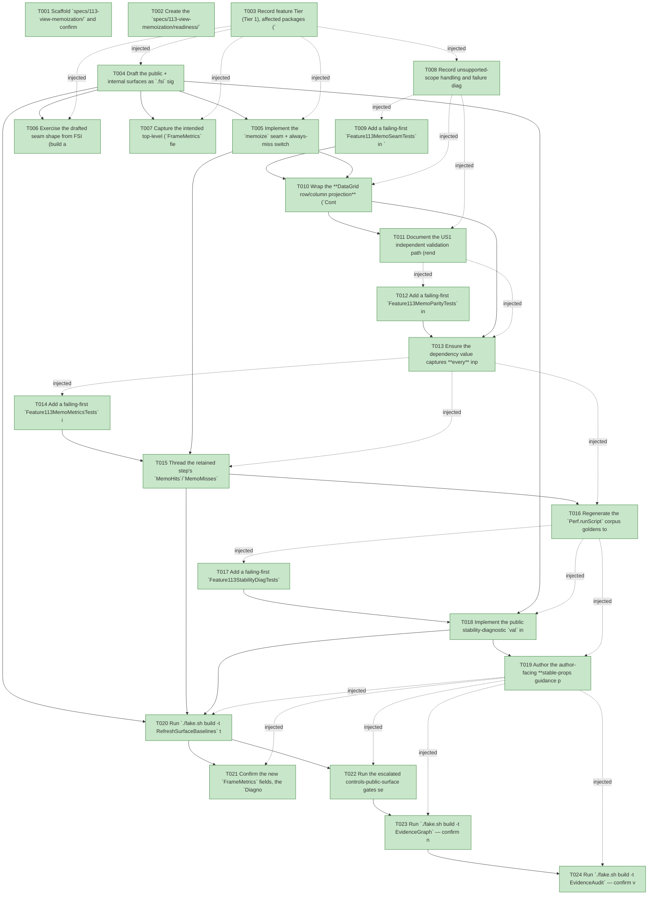

# Task Graph — 113-view-memoization

## ✓ Graph is acyclic and consistent

## Skill Match Assessments

| Task | Candidate | Confidence | Signals | Reviewer disposition | Diagnostic |
|------|-----------|------------|---------|----------------------|------------|
| T001 | (none) | none |  | accepted-empty | T001: skillist trusted as declared; no owns-based capability requirement |
| T002 | (none) | none |  | accepted-empty | T002: skillist trusted as declared; no owns-based capability requirement |
| T003 | (none) | none |  | accepted-empty | T003: skillist trusted as declared; no owns-based capability requirement |
| T004 | (none) | none |  | declared | T004: skillist trusted as declared; no owns-based capability requirement |
| T005 | (none) | none |  | declared | T005: skillist trusted as declared; no owns-based capability requirement |
| T006 | (none) | none |  | declared | T006: skillist trusted as declared; no owns-based capability requirement |
| T007 | (none) | none |  | accepted-empty | T007: skillist trusted as declared; no owns-based capability requirement |
| T008 | (none) | none |  | accepted-empty | T008: skillist trusted as declared; no owns-based capability requirement |
| T009 | (none) | none |  | declared | T009: skillist trusted as declared; no owns-based capability requirement |
| T010 | (none) | none |  | declared | T010: skillist trusted as declared; no owns-based capability requirement |
| T011 | (none) | none |  | accepted-empty | T011: skillist trusted as declared; no owns-based capability requirement |
| T012 | (none) | none |  | declared | T012: skillist trusted as declared; no owns-based capability requirement |
| T013 | (none) | none |  | declared | T013: skillist trusted as declared; no owns-based capability requirement |
| T014 | (none) | none |  | declared | T014: skillist trusted as declared; no owns-based capability requirement |
| T015 | (none) | none |  | declared | T015: skillist trusted as declared; no owns-based capability requirement |
| T016 | (none) | none |  | declared | T016: skillist trusted as declared; no owns-based capability requirement |
| T017 | (none) | none |  | declared | T017: skillist trusted as declared; no owns-based capability requirement |
| T018 | (none) | none |  | declared | T018: skillist trusted as declared; no owns-based capability requirement |
| T019 | (none) | none |  | declared | T019: skillist trusted as declared; no owns-based capability requirement |
| T020 | (none) | none |  | declared | T020: skillist trusted as declared; no owns-based capability requirement |
| T021 | (none) | none |  | declared | T021: skillist trusted as declared; no owns-based capability requirement |
| T022 | (none) | none |  | declared | T022: skillist trusted as declared; no owns-based capability requirement |
| T023 | speckit-evidence-graph | high | owns:graph-validation | accepted | T023: owns graph-validation requires skill speckit-evidence-graph; trigger_group=owns; matched_trigger=owns:graph-validation |
| T024 | speckit-evidence-audit | high | owns:evidence-audit | accepted | T024: owns evidence-audit requires skill speckit-evidence-audit; trigger_group=owns; matched_trigger=owns:evidence-audit |

## Status counts (effective)

| Status | Count |
|--------|-------|
| [X] done | 24 |
| [S] synthetic | 0 |
| [S*] auto-synthetic | 0 |
| accepted [SEH] synthetic | 0 |
| unaccepted synthetic | 0 |

## Graph



## ASCII view

```
T001 [X] Scaffold `specs/113-view-memoization/` and confirm spec + plan + research + data-model + contracts (`memoization-seam.md`, `stability-diagnostic.md`) + quickstart + checklist are linked and current
T002 [X] Create the `specs/113-view-memoization/readiness/` scaffolds discoverable before implementation — `evidence-audit.md`, `evidence-graph.md`, `skill-loading-evidence.md`, `governance-risk-levels.md`, `aggregate-hang-diagnostics.md`, `runtime-limitations.md`, `generated-validation.md`, `byte-identity-authority.md`, `memo-metrics-authority.md`, and the window-visibility not-applicable set — each naming its authoritative command, artifact path, failure class, and next action
T003 [X] Record feature Tier (Tier 1), affected packages (`FS.Skia.UI.Controls` — internal `RetainedRender` memo seam + cache types, the DataGrid projection site in `Control.fs`, the public `Diagnostics` stability-report `val`; `FS.Skia.UI.Controls.Elmish` — public `FrameMetrics` `MemoHitCount`/`MemoMissCount`), public-API impact (breaking `FrameMetrics` `.fsi` + new public `Diagnostics` `val` + internal memo seam reached via `InternalsVisibleTo`), Elmish/MVU + interactive-UI applicability (both N/A with the rationale above), and the required evidence obligations (memo hit/miss/cold, memo-on/memo-off scene parity + no-staleness, deterministic count goldens, stability-diagnostic flag/no-flag, stable-props page, baselines, XML-doc)
T004 [X] Draft the public + internal surfaces as `.fsi` signatures (XML-doc each): in `src/Controls/RetainedRender.fsi` add `type internal MemoEntry` (`Dependency: obj` — a **boxed** deterministic value compared by F# structural `=`, never object identity, FR-005; `Subtree: Scene list` — the lowered fragment, a reference type so a hit returns the **same instance**, specialized to `Scene list` this rung because the DataGrid projection is the sole memoized site; widening the stored subtree type travels with the deferred `Style.resolve` site), `type internal MemoCache` (`Map<ControlId, MemoEntry>`), `type internal MemoOutcome` (`Hit | Miss`), the memo slot on the retained per-identity state (or a sibling memo map on `RetainedRender`), `val internal memoize` (`ControlId -> dep -> thunk -> MemoCache -> subtree * MemoCache * MemoOutcome`), and the always-miss switch (FR-008); in `src/Controls.Elmish/ControlsElmish.fsi` add the public `MemoHitCount: int` / `MemoMissCount: int` `FrameMetrics` fields; in `src/Controls/Diagnostics.fsi` add the public stability-diagnostic `val` returning `ControlDiagnostic list`. Build compiles (signatures only)
T005 [X] Implement the `memoize` seam + always-miss switch in `src/Controls/RetainedRender.fs`: a `Hit` returns the stored `Subtree` instance without running the thunk and an `entry exists + dep equal`; an unequal/cold dep runs the thunk and stores `{ Dependency = dep; Subtree = result }` under the `ControlId` (C1–C4); thread the frame's aggregated `MemoHits`/`MemoMisses` onto the `step` result record alongside `WorkReductionRecord`/`RemeasuredNodeCount` (C7); always-miss mode forces every call to `Miss` with nothing reused (C4/FR-008). Build compiles
T006 [X] Exercise the drafted seam shape from FSI (build a tree + a `ControlId`, call `memoize` with an equal then a changed dependency over a thunk instrumented to record invocation, print the `MemoOutcome` and reuse) and capture the session transcript to `readiness/fsi-session.txt`
T007 [X] Capture the intended top-level (`FrameMetrics` fields) + per-package (`Diagnostics` `val`, internal memo seam/types) surface baseline shape (the authoritative regen happens in T020) and note it in `readiness/`
T008 [X] Record unsupported-scope handling and failure diagnostics: Phase 6+ is OUT (virtualization, paint/damage caches, layout caches, backend review); no public `Control.memo`/`Widget.memo` primitive (deferred); no enforced stability gate (report-only); only a representative memoized site (DataGrid projection), not the full 52-control migration; the seam misses (never reuses) on an unequal/unknown dependency, so a too-coarse dependency is caught by the memo-on/memo-off parity test, never a stale render (FR-007); features 110/111/112 unchanged (FR-015); Principle IV + interactive-UI gate N/A
T009 [X] Add a failing-first `Feature113MemoSeamTests` in `tests/Controls.Tests` (reaching the internal seam via `InternalsVisibleTo "Controls.Tests"`): a steady-state stable dependency → `Hit` with the subtree reference-reused and the thunk **not** run (instrument the thunk to assert non-invocation); a changed dependency → `Miss` + fresh subtree; a cold first frame (no prior entry) → `Miss`; the seam **never** reuses across an unequal/unknown dependency (FR-001/FR-004/FR-005, C1–C3, SC-001)
T010 [X] Wrap the **DataGrid row/column projection** (`Control.fs` `gridGeom` / the `cells → Scene` projection, ~`Control.fs:550`) in the `memoize` seam keyed by the DataGrid's `ControlId` + a deterministic dependency value capturing every input that can change the projection (cell/column data + theme/geometry); a steady-state frame (unchanged data + theme) hits and reuses the prior projected subtree. Make T009 pass (FR-003/FR-004)
T011 [X] Document the US1 independent validation path (render the same model twice through `Perf.runScript` for a scenario with a memoizable DataGrid whose data + theme are unchanged; second frame records the hit and reuses the subtree) in `readiness/`
T012 [X] Add a failing-first `Feature113MemoParityTests` in `tests/Controls.Tests`: for representative scenarios and frame sequences, each frame's rendered scene built with memoization active equals the scene built memo-off (forced always-miss) — structural `Scene` equality (controls have no value equality) — and equals the pre-feature baseline (FR-006, C5, SC-002); include a scenario that mutates the memoized DataGrid's real inputs and assert the memoized build reflects the change (a `Miss` occurs; no stale subtree reused) (FR-007, C6, SC-003)
T013 [X] Ensure the dependency value captures **every** input that can change the memoized subtree so memo-on ≡ memo-off for every frame and a real-input change produces a `Miss` and a fresh subtree (no staleness); confirm always-miss mode is byte-identical to the pre-feature baseline. Make T012 pass (FR-006/FR-007/FR-008, SC-002/SC-003)
T014 [X] Add a failing-first `Feature113MemoMetricsTests` in `tests/Elmish.Tests` over `ControlsElmish.Perf.runScript`: a steady-state scenario (memoized control's inputs unchanged across frames) accrues `MemoHitCount > 0` with `MemoMissCount = 0` for that site on the steady frames; a perturbed scenario (inputs changed each frame) and a cold first frame accrue `MemoMissCount`; an idle frame that evaluates no memoizable control reports both `0`. Counts are deterministic and golden-asserted (FR-009/FR-010, C7/C8, SC-004)
T015 [X] Thread the retained step's `MemoHits`/`MemoMisses` into `FrameMetrics.MemoHitCount`/`MemoMissCount` in `src/Controls.Elmish/ControlsElmish.fs` — the `zero` record carries both `0` and **every** per-frame construction site (pointer-move, tick, key, idle, model branches) sets them from the last retained-step record; surface them through `Perf.runScript` and the live `OnFrameMetrics` sink. Make T014 pass (FR-009/FR-010)
T016 [X] Regenerate the `Perf.runScript` corpus goldens to carry the two new metric fields (`PERF_CORPUS_REGEN=1 dotnet test tests/Elmish.Tests --filter Feature109CorpusTests`) and confirm the regenerated goldens show the expected hits/misses/idle-0/0 and the rendered scenes are otherwise unchanged (additive only)
T017 [X] Add a failing-first `Feature113StabilityDiagTests` in `tests/Controls.Tests`: a fixture tree built twice with stable attributes/events → the stability-diagnostic report returns **no** findings; the same tree with an injected always-new attribute / per-frame closure → the report **flags** that input as a reuse-breaking instability, naming the control (`ControlId` + `ControlKind`) and the offending attribute/event (FR-011/FR-012, SC-005)
T018 [X] Implement the public stability-diagnostic `val` in `src/Controls/Diagnostics.fs` — a two-build parallel walk of the same logical (sub)tree returning one `ControlDiagnostic` per attribute/event that compared **unequal** despite no semantic change (rebuilt `UntypedValue`, per-frame closure, rebuilt list, unstable key), reusing the existing `ControlDiagnostic` vocabulary (add a `ControlDiagnosticCode` for the instability class if needed); empty list ⇒ stable. Make T017 pass (FR-011/FR-012)
T019 [X] Author the author-facing **stable-props guidance page** at `docs/controls/stable-props.md` naming the concrete reuse-breaking patterns (rebuilt `UntypedValue`, per-frame event closures, rebuilt lists, unstable keys) and how to make each input stable (FR-013/SC-005)
T020 [X] Run `./fake.sh build -t RefreshSurfaceBaselines` to regenerate the top-level public surface baseline (the new `FrameMetrics.MemoHitCount`/`MemoMissCount` fields) and the per-package Controls/Controls.Elmish baselines (the public `Diagnostics` `val`; the internal memo seam + cache/entry types); update any construction sites or sample preludes it flags
T021 [X] Confirm the new `FrameMetrics` fields, the `Diagnostics` `val`, and the internal memo seam/types satisfy the doc-preservation / XML-doc gate, and that no unrelated public function signature changed
T022 [X] Run the escalated controls-public-surface gates sequentially as `Route` prints them — `Dev`, `GeneratedGuidanceCheck`, `TemplateCheck`, `GeneratedProductCheck`, the package/per-package surface diffs, `FsiTranscripts`, the controls catalog/doc/interaction/rendering checks, and `TemplateDrift` — and record the focused governance risk level + non-authoritative aggregate notes in `readiness/`
T023 [X] Run `./fake.sh build -t EvidenceGraph` — confirm no cycles, no dangling refs, no `[S*]` surprises, and the echoed `feature-directory`/`tasks=<n>` match this feature
T024 [X] Run `./fake.sh build -t EvidenceAudit` — confirm verdict PASS with no remaining `[S]`/`[S*]` and no diff-scan hits, or document every `--accept-synthetic` override
```

## Injected checkpoint edges (Phase N+1 → Phase N) — FR-007

- T003 → T004  (auto-injected Phase-checkpoint edge)
- T003 → T005  (auto-injected Phase-checkpoint edge)
- T003 → T006  (auto-injected Phase-checkpoint edge)
- T003 → T007  (auto-injected Phase-checkpoint edge)
- T003 → T008  (auto-injected Phase-checkpoint edge)
- T008 → T009  (auto-injected Phase-checkpoint edge)
- T008 → T010  (auto-injected Phase-checkpoint edge)
- T008 → T011  (auto-injected Phase-checkpoint edge)
- T011 → T012  (auto-injected Phase-checkpoint edge)
- T011 → T013  (auto-injected Phase-checkpoint edge)
- T013 → T014  (auto-injected Phase-checkpoint edge)
- T013 → T015  (auto-injected Phase-checkpoint edge)
- T013 → T016  (auto-injected Phase-checkpoint edge)
- T016 → T017  (auto-injected Phase-checkpoint edge)
- T016 → T018  (auto-injected Phase-checkpoint edge)
- T016 → T019  (auto-injected Phase-checkpoint edge)
- T019 → T020  (auto-injected Phase-checkpoint edge)
- T019 → T021  (auto-injected Phase-checkpoint edge)
- T019 → T022  (auto-injected Phase-checkpoint edge)
- T019 → T023  (auto-injected Phase-checkpoint edge)
- T019 → T024  (auto-injected Phase-checkpoint edge)

## Resolved skillist ids — FR-007

Resolved skillist-id set (7): fs-skia-controls-host, fs-skia-evidence-mode, fs-skia-reconciliation, fs-skia-template-update, fs-skia-ui-widgets, speckit-evidence-audit, speckit-evidence-graph

## Skillist id → SKILL.md path

fs-skia-controls-host → .agents/skills/fs-skia-controls-host/SKILL.md
fs-skia-evidence-mode → .agents/skills/fs-skia-evidence-mode/SKILL.md
fs-skia-reconciliation → .agents/skills/fs-skia-reconciliation/SKILL.md
fs-skia-template-update → .agents/skills/fs-skia-template-update/SKILL.md
fs-skia-ui-widgets → src/Controls/skill/SKILL.md
speckit-evidence-audit → .agents/skills/speckit-evidence-audit/SKILL.md
speckit-evidence-graph → .agents/skills/speckit-evidence-graph/SKILL.md

## Skillist id → unresolved / flagged

_(none — every declared skillist id resolves to exactly one installed skill)_

