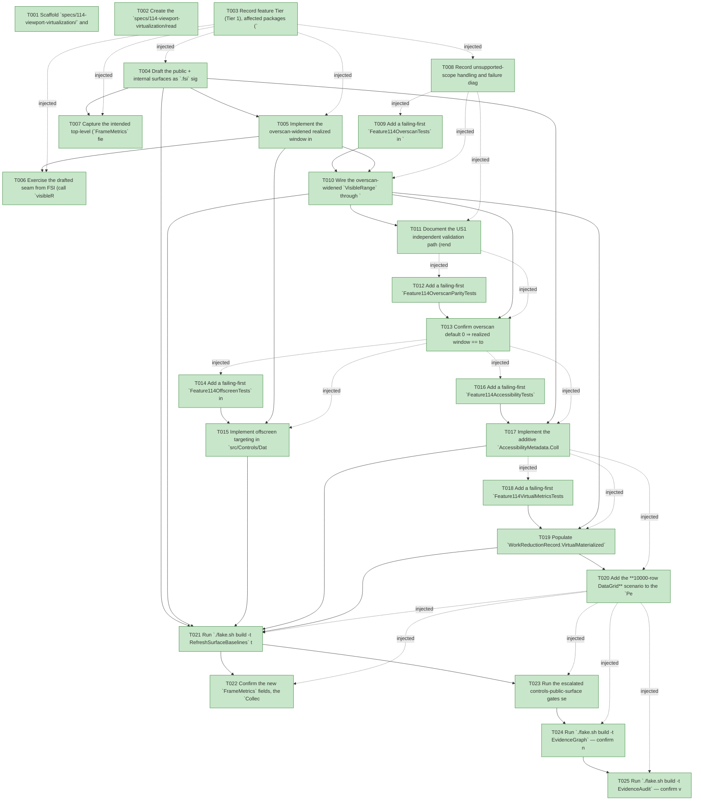

# Task Graph — 114-viewport-virtualization

## ✓ Graph is acyclic and consistent

## Skill Match Assessments

| Task | Candidate | Confidence | Signals | Reviewer disposition | Diagnostic |
|------|-----------|------------|---------|----------------------|------------|
| T001 | (none) | none |  | accepted-empty | T001: skillist trusted as declared; no owns-based capability requirement |
| T002 | (none) | none |  | accepted-empty | T002: skillist trusted as declared; no owns-based capability requirement |
| T003 | (none) | none |  | accepted-empty | T003: skillist trusted as declared; no owns-based capability requirement |
| T004 | (none) | none |  | declared | T004: skillist trusted as declared; no owns-based capability requirement |
| T005 | (none) | none |  | declared | T005: skillist trusted as declared; no owns-based capability requirement |
| T006 | (none) | none |  | declared | T006: skillist trusted as declared; no owns-based capability requirement |
| T007 | (none) | none |  | accepted-empty | T007: skillist trusted as declared; no owns-based capability requirement |
| T008 | (none) | none |  | accepted-empty | T008: skillist trusted as declared; no owns-based capability requirement |
| T009 | (none) | none |  | declared | T009: skillist trusted as declared; no owns-based capability requirement |
| T010 | (none) | none |  | declared | T010: skillist trusted as declared; no owns-based capability requirement |
| T011 | (none) | none |  | accepted-empty | T011: skillist trusted as declared; no owns-based capability requirement |
| T012 | (none) | none |  | declared | T012: skillist trusted as declared; no owns-based capability requirement |
| T013 | (none) | none |  | declared | T013: skillist trusted as declared; no owns-based capability requirement |
| T014 | (none) | none |  | declared | T014: skillist trusted as declared; no owns-based capability requirement |
| T015 | (none) | none |  | declared | T015: skillist trusted as declared; no owns-based capability requirement |
| T016 | (none) | none |  | declared | T016: skillist trusted as declared; no owns-based capability requirement |
| T017 | (none) | none |  | declared | T017: skillist trusted as declared; no owns-based capability requirement |
| T018 | (none) | none |  | declared | T018: skillist trusted as declared; no owns-based capability requirement |
| T019 | (none) | none |  | declared | T019: skillist trusted as declared; no owns-based capability requirement |
| T020 | (none) | none |  | declared | T020: skillist trusted as declared; no owns-based capability requirement |
| T021 | (none) | none |  | declared | T021: skillist trusted as declared; no owns-based capability requirement |
| T022 | (none) | none |  | declared | T022: skillist trusted as declared; no owns-based capability requirement |
| T023 | (none) | none |  | declared | T023: skillist trusted as declared; no owns-based capability requirement |
| T024 | speckit-evidence-graph | high | owns:graph-validation | accepted | T024: owns graph-validation requires skill speckit-evidence-graph; trigger_group=owns; matched_trigger=owns:graph-validation |
| T025 | speckit-evidence-audit | high | owns:evidence-audit | accepted | T025: owns evidence-audit requires skill speckit-evidence-audit; trigger_group=owns; matched_trigger=owns:evidence-audit |

## Status counts (effective)

| Status | Count |
|--------|-------|
| [X] done | 25 |
| [S] synthetic | 0 |
| [S*] auto-synthetic | 0 |
| accepted [SEH] synthetic | 0 |
| unaccepted synthetic | 0 |

## Graph



## ASCII view

```
T001 [X] Scaffold `specs/114-viewport-virtualization/` and confirm spec + plan + research + data-model + contracts (`virtualization-contract.md`, `offscreen-addressability.md`) + quickstart + checklist are linked and current
T002 [X] Create the `specs/114-viewport-virtualization/readiness/` scaffolds discoverable before implementation — `evidence-audit.md`, `evidence-graph.md`, `skill-loading-evidence.md`, `governance-risk-levels.md`, `aggregate-hang-diagnostics.md`, `runtime-limitations.md`, `generated-validation.md`, `byte-identity-authority.md`, `virtual-metrics-authority.md`, and the window-visibility not-applicable set — each naming its authoritative command, artifact path, failure class, and next action
T003 [X] Record feature Tier (Tier 1), affected packages (`FS.Skia.UI.Controls` — `Collections.visibleRange` overscan param + `CollectionModel`/`DataGridModel` `Overscan` field, DataGrid offscreen `SelectRow`/`ToggleRow`/`FocusCell`/`ScrollRowsTo` targeting, `AccessibilityMetadata` total/position, the internal `WorkReductionRecord` `VirtualMaterialized`/`VirtualTotal` counts; `FS.Skia.UI.Controls.Elmish` — the public `FrameMetrics` `VirtualItemsMaterialized`/`VirtualItemsTotal` fields), public-API impact (breaking `FrameMetrics` `.fsi` + additive `Collections`/`DataGrid`/`Types` surface + internal count seam reached via `InternalsVisibleTo`), Elmish/MVU + interactive-UI applicability (both N/A with the rationale above), and the required evidence obligations (bounded + non-scaling materialization 100/1000/10000, default-0 byte-identity, opt-in overscan edge-clamp correctness, offscreen focus/selection + boundary-crossing nav, a11y total + focused position, deterministic `VirtualItems*` goldens + idle 0/0, the 10000-row corpus scenario, baselines, XML-doc, 113 composition over the overscan-widened row set)
T004 [X] Draft the public + internal surfaces as `.fsi` signatures (XML-doc each): in `src/Controls/Collections.fsi` add a trailing `overscan` parameter to `visibleRange` (additive) and an `Overscan: int` field on `CollectionModel` (default 0); on `DataGrid` add the `Overscan: int` field to `DataGridModel` (and its `.fsi` if present); in `src/Controls/Types.fsi` add `type CollectionPosition = { TotalItems: int; FocusedIndex: int option }` and an additive `Collection: CollectionPosition option` field on `AccessibilityMetadata` (precedent: feature 100's `Navigation: NavRange option`); in `src/Controls/RetainedRender.fsi` add the internal `VirtualMaterialized: int` / `VirtualTotal: int` fields to `WorkReductionRecord`; in `src/Controls.Elmish/ControlsElmish.fsi` add the public `VirtualItemsMaterialized: int` / `VirtualItemsTotal: int` `FrameMetrics` fields. Build compiles (signatures only)
T005 [X] Implement the overscan-widened realized window in `src/Controls/Collections.fs` `visibleRange`: from the overscan-0 slice `(f, c, t)` and `N >= 0` compute `first' = max 0 (f - N)`, `last' = min (t - 1) (f + c - 1 + N)`, `count' = if t <= 0 then 0 else last' - first' + 1`, clamp negative `N` to 0; `N = 0` reproduces today's slice byte-identically (`FirstIndex + Count <= Total`, `0 <= FirstIndex`). Build compiles
T006 [X] Exercise the drafted seam from FSI (call `visibleRange` with overscan 0 then `N`, at the top edge, the bottom edge, and a small `Total <= visible + 2N`; print each `VisibleRange` to show the default-0 byte-identity, the symmetric widening, and the edge clamp) and capture the session transcript to `readiness/fsi-session.txt`
T007 [X] Capture the intended top-level (`FrameMetrics` fields) + per-package (`Collections`/`DataGrid` `Overscan`, `Types` `CollectionPosition`/`AccessibilityMetadata.Collection`, internal `WorkReductionRecord` counts) surface baseline shape (the authoritative regen happens in T021) and note it in `readiness/`
T008 [X] Record unsupported-scope handling and failure diagnostics: OUT this rung — variable/measured row heights + row/column/text measurement caches (Phase 8), paint caches / damage rectangles / Skia picture boundaries (Phase 7), layout hot-path / text-measurement caches & layout-boundary hints (Phase 8), `SkiaViewer` backend / render-thread / compositor review (Phase 9), generalizing virtualization to non-DataGrid list/collection surfaces (DataGrid is the representative; the shared `Collections` model MAY carry overscan for future reuse), horizontal/column virtualization (rows only); uniform fixed `RowHeight` only (FR-018); features 110/111/112/113 unchanged (FR-017); Principle IV + interactive-UI gate N/A
T009 [X] Add a failing-first `Feature114OverscanTests` in `tests/Controls.Tests` (reaching internal seams via `InternalsVisibleTo "Controls.Tests"`): build a DataGrid with a bounded viewport realizing `V` rows and assert the realized-window count (= materialized `data-grid-row` nodes) `<= V + 2*overscan` at `Total ∈ {100, 1000, 10000}` and is **identical** across those totals (does not scale, FR-003, SC-001); a grid whose `Total <= V + 2*overscan` realizes the whole set (`materialized = Total`, transparent, FR-004); the realized window is edge-clamped at top/bottom (no index `< 0`, none `>= Total`, FR-002/FR-007)
T010 [X] Wire the overscan-widened `VisibleRange` through `DataGrid.range` / `Collections.withRange` (pass `model.Overscan` into `visibleRange`) so `DataGrid.visibleRows rows visibleRange |> List.map (rowControl columns)` (`DataGrid.fs:214`/`:223`) materializes exactly the realized window; add `Overscan = 0` at **every** construction site (`Collections.init`, `Collections.withRange`, DataGrid model construction, `ReplaceRowCount` recompute, samples `ControlsGallery`/`DemoReel`, FSI preludes `scripts/*-prelude.fsx`). Make T009 pass (FR-001/FR-002/FR-003/FR-004)
T011 [X] Document the US1 independent validation path (render a 100-, 1000-, and 10000-row DataGrid scenario with the same bounded viewport + overscan; assert the materialized count is bounded by `V + 2*overscan` and identical across totals while the logical total scales) in `readiness/us1-validation.md`
T012 [X] Add a failing-first `Feature114OverscanParityTests` in `tests/Controls.Tests`: with overscan at its default (0) the realized rows, control geometry, and rendered scene for the corpus DataGrid scenarios are **byte-identical** to the pre-feature baseline — structural `Scene` equality (controls have no value equality) — and `VirtualItemsMaterialized` equals the prior realized-row count (FR-006, SC-002); with opt-in overscan `N` exactly the visible rows plus up to `N` correct adjacent logical rows materialize, the visible rows are unchanged, and overscan is clamped at the top/bottom edges with no fabricated/duplicated rows (FR-007, SC-003)
T013 [X] Confirm overscan default 0 ⇒ realized window == today's visible slice byte-identical (FR-006) and that opt-in overscan materializes only real edge-clamped adjacent rows without shifting the visible region (FR-007); verify scrolling the realized window reuses row containers where the keyed diff permits (stable `row.Key` → reuse; this feature MUST NOT regress it, FR-008). Make T012 pass (FR-006/FR-007/FR-008, SC-002/SC-003/SC-007)
T014 [X] Add a failing-first `Feature114OffscreenTests` in `tests/Controls.Tests`: focusing/selecting/toggling an **offscreen** logical row by key records it on the logical model and **relocates** the realized window to it without materializing every intervening row (the materialized count stays `<= V + 2*overscan`, FR-009/FR-010, SC-004); keyboard navigation moving focus past the last realized row lands on the correct next **logical** row and advances the realized window to include it (FR-011, SC-005); the FR-003 bound holds throughout (the window relocates, it does not expand)
T015 [X] Implement offscreen targeting in `src/Controls/DataGrid.fs`: `SelectRow`/`ToggleRow`/`FocusCell`/`ScrollRowsTo` on a (possibly offscreen) logical key/index update the logical model and compute the scroll offset that brings the target index into the realized window, then recompute `VisibleRange` via `DataGrid.range` / `Collections.withRange` with `model.Overscan` (relocate, never expand); boundary-crossing focus advances the focused logical index by one and relocates. Dispatch outcomes for already-materialized rows stay byte-identical (FR-016). Make T014 pass (FR-009/FR-010/FR-011)
T016 [X] Add a failing-first `Feature114AccessibilityTests` in `tests/Controls.Tests`: a virtualized DataGrid's `AccessibilityMetadata.Collection` reports `TotalItems` = the logical `RowCount` and `FocusedIndex` = the focused row's logical index (from `FocusedCell.RowKey`), independent of how many rows are materialized (FR-012, SC-005); a non-collection control reports `Collection = None` so at-rest a11y for existing controls is byte-identical
T017 [X] Implement the additive `AccessibilityMetadata.Collection` / `CollectionPosition` population in `src/Controls/Types.fs` + the DataGrid a11y path — computed from the **logical** model (`RowCount` for `TotalItems`, the focused logical index for `FocusedIndex`), never the materialized slice; `None` for all non-collection controls. Make T016 pass (FR-012)
T018 [X] Add a failing-first `Feature114VirtualMetricsTests` in `tests/Elmish.Tests` over `ControlsElmish.Perf.runScript`: a frame that builds a virtualized DataGrid records `VirtualItemsMaterialized <= visibleCount + 2*overscan` and `VirtualItemsTotal = RowCount`, deterministically and golden-asserted; a frame that evaluates no virtualized control reports both `0`; multiple virtualized controls in one frame aggregate the counts; the materialized count does not scale with total across 100/1000/10000 (FR-013/FR-014, SC-006)
T019 [X] Populate `WorkReductionRecord.VirtualMaterialized`/`VirtualTotal` in the retained `step` (`RetainedRender.fs:426`) by a read-only walk of the lowered tree — `VirtualMaterialized` = count of `data-grid-row` kind nodes, `VirtualTotal` = sum of the `Total` on each `data-grid` node's `VisibleRange` (byte-identical render, counting only) — then thread them into `FrameMetrics.VirtualItemsMaterialized`/`VirtualItemsTotal` in `src/Controls.Elmish/ControlsElmish.fs`: the `zero` record carries both `0` and **every** per-frame construction site (`:1376`, `:1425`, `:1449`, `:1472`) lifts them from `lastWorkReduction` (`:858`), exactly as `MemoHitCount`/`MemoMissCount`; surface through `Perf.runScript` and the live `OnFrameMetrics` sink. Make T018 pass (FR-013/FR-014)
T020 [X] Add the **10000-row DataGrid** scenario to the `Perf.runScript` corpus (alongside the existing 100/1000-row variants) and regenerate the corpus goldens (`PERF_CORPUS_REGEN=1`) so they carry the two new metric fields and the 10000-row golden asserts `VirtualItemsMaterialized <= visible + overscan` while `VirtualItemsTotal = 10000` (materialization does not scale with total); confirm the rendered scenes are otherwise unchanged (additive only) (FR-015, SC-001)
T021 [X] Run `./fake.sh build -t RefreshSurfaceBaselines` to regenerate the top-level public surface baseline (the new `FrameMetrics.VirtualItemsMaterialized`/`VirtualItemsTotal` fields) and the per-package Controls/Controls.Elmish baselines (the `Collections`/`DataGrid` `Overscan`, the `Types` `CollectionPosition`/`AccessibilityMetadata.Collection`, the internal `WorkReductionRecord` counts); update any construction sites or sample preludes it flags
T022 [X] Confirm the new `FrameMetrics` fields, the `Collections`/`DataGrid` overscan surface, the `Types` a11y total/position, and the internal `WorkReductionRecord` counts satisfy the doc-preservation / XML-doc gate, and that no unrelated public function signature changed (only `visibleRange` gains its additive trailing `overscan` parameter)
T023 [X] Run the escalated controls-public-surface gates sequentially as `Route` prints them — `Dev`, `GeneratedGuidanceCheck`, `TemplateCheck`, `GeneratedProductCheck`, the package/per-package surface diffs, `FsiTranscripts`, the controls catalog/doc/interaction/rendering checks, and `TemplateDrift` — confirming the standing Scene-parity golden suite (at-rest byte-identity, FR-006/SC-007) under `Dev` passes, and record the focused governance risk level + non-authoritative aggregate notes in `readiness/`
T024 [X] Run `./fake.sh build -t EvidenceGraph` — confirm no cycles, no dangling refs, no `[S*]` surprises, and the echoed `feature-directory`/`tasks=<n>` match this feature
T025 [X] Run `./fake.sh build -t EvidenceAudit` — confirm verdict PASS with no remaining `[S]`/`[S*]` and no diff-scan hits, or document every `--accept-synthetic` override
```

## Injected checkpoint edges (Phase N+1 → Phase N) — FR-007

- T003 → T004  (auto-injected Phase-checkpoint edge)
- T003 → T005  (auto-injected Phase-checkpoint edge)
- T003 → T006  (auto-injected Phase-checkpoint edge)
- T003 → T007  (auto-injected Phase-checkpoint edge)
- T003 → T008  (auto-injected Phase-checkpoint edge)
- T008 → T009  (auto-injected Phase-checkpoint edge)
- T008 → T010  (auto-injected Phase-checkpoint edge)
- T008 → T011  (auto-injected Phase-checkpoint edge)
- T011 → T012  (auto-injected Phase-checkpoint edge)
- T011 → T013  (auto-injected Phase-checkpoint edge)
- T013 → T014  (auto-injected Phase-checkpoint edge)
- T013 → T015  (auto-injected Phase-checkpoint edge)
- T013 → T016  (auto-injected Phase-checkpoint edge)
- T013 → T017  (auto-injected Phase-checkpoint edge)
- T017 → T018  (auto-injected Phase-checkpoint edge)
- T017 → T019  (auto-injected Phase-checkpoint edge)
- T017 → T020  (auto-injected Phase-checkpoint edge)
- T020 → T021  (auto-injected Phase-checkpoint edge)
- T020 → T022  (auto-injected Phase-checkpoint edge)
- T020 → T023  (auto-injected Phase-checkpoint edge)
- T020 → T024  (auto-injected Phase-checkpoint edge)
- T020 → T025  (auto-injected Phase-checkpoint edge)

## Resolved skillist ids — FR-007

Resolved skillist-id set (8): fs-skia-controls-host, fs-skia-evidence-mode, fs-skia-keyboard-input, fs-skia-reconciliation, fs-skia-template-update, fs-skia-ui-widgets, speckit-evidence-audit, speckit-evidence-graph

## Skillist id → SKILL.md path

fs-skia-controls-host → .agents/skills/fs-skia-controls-host/SKILL.md
fs-skia-evidence-mode → .agents/skills/fs-skia-evidence-mode/SKILL.md
fs-skia-keyboard-input → src/KeyboardInput/skill/SKILL.md
fs-skia-reconciliation → .agents/skills/fs-skia-reconciliation/SKILL.md
fs-skia-template-update → .agents/skills/fs-skia-template-update/SKILL.md
fs-skia-ui-widgets → src/Controls/skill/SKILL.md
speckit-evidence-audit → .agents/skills/speckit-evidence-audit/SKILL.md
speckit-evidence-graph → .agents/skills/speckit-evidence-graph/SKILL.md

## Skillist id → unresolved / flagged

_(none — every declared skillist id resolves to exactly one installed skill)_

