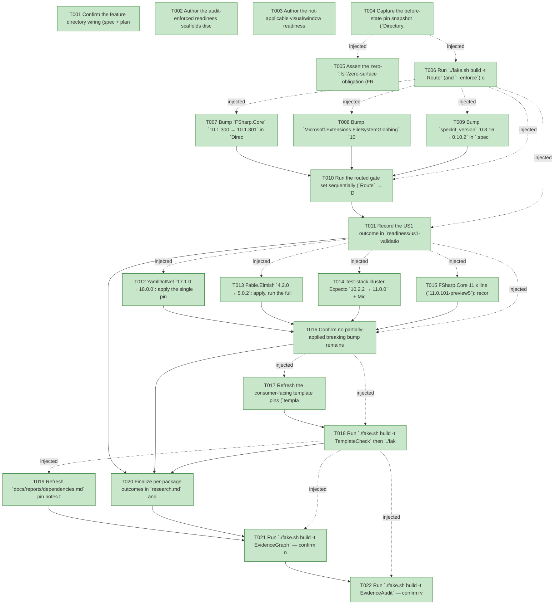

# Task Graph — 115-dependency-updates

## ✓ Graph is acyclic and consistent

## Skill Match Assessments

| Task | Candidate | Confidence | Signals | Reviewer disposition | Diagnostic |
|------|-----------|------------|---------|----------------------|------------|
| T001 | (none) | none |  | accepted-empty | T001: skillist trusted as declared; no owns-based capability requirement |
| T002 | (none) | none |  | accepted-empty | T002: skillist trusted as declared; no owns-based capability requirement |
| T003 | (none) | none |  | accepted-empty | T003: skillist trusted as declared; no owns-based capability requirement |
| T004 | (none) | none |  | accepted-empty | T004: skillist trusted as declared; no owns-based capability requirement |
| T005 | (none) | none |  | accepted-empty | T005: skillist trusted as declared; no owns-based capability requirement |
| T006 | (none) | none |  | accepted-empty | T006: skillist trusted as declared; no owns-based capability requirement |
| T007 | (none) | none |  | accepted-empty | T007: skillist trusted as declared; no owns-based capability requirement |
| T008 | (none) | none |  | accepted-empty | T008: skillist trusted as declared; no owns-based capability requirement |
| T009 | (none) | none |  | accepted-empty | T009: skillist trusted as declared; no owns-based capability requirement |
| T010 | (none) | none |  | accepted-empty | T010: skillist trusted as declared; no owns-based capability requirement |
| T011 | (none) | none |  | accepted-empty | T011: skillist trusted as declared; no owns-based capability requirement |
| T012 | (none) | none |  | accepted-empty | T012: skillist trusted as declared; no owns-based capability requirement |
| T013 | (none) | none |  | accepted-empty | T013: skillist trusted as declared; no owns-based capability requirement |
| T014 | (none) | none |  | accepted-empty | T014: skillist trusted as declared; no owns-based capability requirement |
| T015 | (none) | none |  | accepted-empty | T015: skillist trusted as declared; no owns-based capability requirement |
| T016 | (none) | none |  | accepted-empty | T016: skillist trusted as declared; no owns-based capability requirement |
| T017 | (none) | none |  | declared | T017: skillist trusted as declared; no owns-based capability requirement |
| T018 | (none) | none |  | declared | T018: skillist trusted as declared; no owns-based capability requirement |
| T019 | (none) | none |  | accepted-empty | T019: skillist trusted as declared; no owns-based capability requirement |
| T020 | (none) | none |  | accepted-empty | T020: skillist trusted as declared; no owns-based capability requirement |
| T021 | speckit-evidence-graph | high | owns:graph-validation | accepted | T021: owns graph-validation requires skill speckit-evidence-graph; trigger_group=owns; matched_trigger=owns:graph-validation |
| T022 | speckit-evidence-audit | high | owns:evidence-audit | accepted | T022: owns evidence-audit requires skill speckit-evidence-audit; trigger_group=owns; matched_trigger=owns:evidence-audit |

## Status counts (effective)

| Status | Count |
|--------|-------|
| [X] done | 22 |
| [S] synthetic | 0 |
| [S*] auto-synthetic | 0 |
| accepted [SEH] synthetic | 0 |
| unaccepted synthetic | 0 |

## Graph



## ASCII view

```
T001 [X] Confirm the feature directory wiring (spec + plan + research + data-model + quickstart present) and record Tier, affected paths, public-API impact (none), Elmish/MVU applicability (none for safe bumps), and the real-evidence obligations in `readiness/unsupported-scope.md`
T002 [X] Author the audit-enforced readiness scaffolds discoverable before implementation: `readiness/governance-risk-levels.md`, `readiness/aggregate-hang-diagnostics.md`, `readiness/runtime-limitations.md`, `readiness/generated-validation.md` (package-resolution=resolved, package-mismatch=false), `readiness/evidence-graph.md`, and `readiness/evidence-audit.md` (verdict token). Each names its authoritative command, artifact path, failure class, and next action
T003 [X] Author the not-applicable visual/window readiness set (this feature renders nothing): `readiness/visual-evidence-honesty.md`, `readiness/window-visibility.md`, `readiness/real-image-evidence.md`, `readiness/generated-guidance-validation.md` — each marked not-applicable (version/governance-only change, no scene/window/screenshot surface) with the reason
T004 [X] Capture the before-state pin snapshot (`Directory.Packages.props`, `.specify/init-options.json` `speckit_version`, `dotnet --list-sdks`) into `readiness/before-pins.md` as the baseline the after-state diffs against
T005 [X] Assert the zero-`.fsi`/zero-surface obligation (FR-003): record in `readiness/contract-impact.md` that no `.fsi`, surface baseline, golden, or sample contract is intended to change, and that the surface/golden gates are the enforcing assertion
T006 [X] Run `./fake.sh build -t Route` (and `--enforce`) on the clean tree to record the authoritative escalated gate list and a green baseline into `readiness/focused-gates.md` before any pin changes
T007 [X] Bump `FSharp.Core` `10.1.300 → 10.1.301` in `Directory.Packages.props`
T008 [X] Bump `Microsoft.Extensions.FileSystemGlobbing` `10.0.8 → 10.0.9` in `Directory.Packages.props`
T009 [X] Bump `speckit_version` `0.8.16 → 0.10.2` in `.specify/init-options.json`. This is a recorded-version edit: the repo's skill/command tree is canonical under `.agents/**` and the `.claude/**` tree is generated **from it** (not vendored from spec-kit upstream), so the bump does not pull upstream assets. Only if a `.agents/**` source asset is actually touched, regenerate the `.claude` tree with `./fake.sh build -t RefreshSurfaceBaselines` and let `SkillSyncCheck` confirm currency — do not hand-edit generated trees (SC-005)
T010 [X] Run the routed gate set sequentially (`Route` → `Dev` → `GeneratedGuidanceCheck` → `TemplateCheck` → `GeneratedProductCheck` → `EvidenceGraph` → `EvidenceAudit`) and confirm all printed gates green with **zero** surface-baseline, golden, and generated-product diff; capture logs under `readiness/logs/` (SC-001, SC-002, FR-002, FR-003)
T011 [X] Record the US1 outcome in `readiness/us1-validation.md`: the four safe bumps `applied`, the .NET SDK float (`10.0.301`, no `global.json`) acknowledged for completeness, and `speckit_version` matching the version in use (FR-001, FR-007)
T012 [X] YamlDotNet `17.1.0 → 18.0.0`: apply the single pin, run the full routed gate set, then either keep it (`adopted`, all gates green, no source change) or `git checkout -- Directory.Packages.props` and record `deferred(<failing gate + symptom>)`. No half-applied state may remain (FR-004, FR-005)
T013 [X] Fable.Elmish `4.2.0 → 5.0.2`: apply, run the full routed gate set, then adopt (gates green, no source change) or revert and record the deferral reason — highest blast radius (Controls.Elmish MVU runtime) (FR-004, FR-005)
T014 [X] Test-stack cluster Expecto `10.2.2 → 11.0.0` + Microsoft.NET.Test.Sdk `17.11.1 → 18.6.0` + YoloDev.Expecto.TestSdk `0.15.3 → 1.0.0`: bump the three together (they interlock), run the full routed gate set, then adopt the whole cluster or revert the whole cluster and record the reason — never a partial cluster (FR-004, FR-005)
T015 [X] FSharp.Core 11.x line (`11.0.101-preview5`): record `deferred` as out-of-scope (tied to a newer F#/SDK, not drop-in on `net10.0`); not attempted, per spec
T016 [X] Confirm no partially-applied breaking bump remains (`git status` / `git diff Directory.Packages.props` shows only adopted pins) and record the per-bump adopt/defer dispositions in `readiness/us2-validation.md` (SC-003, FR-005)
T017 [X] Refresh the consumer-facing template pins (`template/**`) only if the adopted bumps make a generated project inconsistent, via the `fs-skia-template-update` skill (regenerate pins; do not hand-edit beyond what the skill governs) (FR-006)
T018 [X] Run `./fake.sh build -t TemplateCheck` then `./fake.sh build -t GeneratedProductCheck` and confirm a freshly generated `dotnet new fs-skia-ui` project restores and builds against the updated pins; capture evidence in `readiness/us3-validation.md` (SC-004, FR-006)
T019 [X] Refresh `docs/reports/dependencies.md` pin notes to match the final pins and run `./fake.sh build -t DependencyReport` so its generated output reflects the new central-package versions
T020 [X] Finalize per-package outcomes in `research.md` and `data-model.md` (each row `applied` / `adopted` / `deferred(reason)` / `unchanged`), and confirm the out-of-scope deferrals (SkiaSharp 4.147 preview line, FAKE lock at 6.1.4, FSharp.Core 11.x) are recorded (SC-003)
T021 [X] Run `./fake.sh build -t EvidenceGraph` — confirm no cycles, no dangling refs, no `[S*]` surprises; refresh `readiness/task-graph.md`
T022 [X] Run `./fake.sh build -t EvidenceAudit` — confirm verdict PASS with **zero** synthetic markers (none are used); record the verdict token in `readiness/evidence-audit.md`
```

## Injected checkpoint edges (Phase N+1 → Phase N) — FR-007

- T004 → T005  (auto-injected Phase-checkpoint edge)
- T004 → T006  (auto-injected Phase-checkpoint edge)
- T006 → T007  (auto-injected Phase-checkpoint edge)
- T006 → T008  (auto-injected Phase-checkpoint edge)
- T006 → T009  (auto-injected Phase-checkpoint edge)
- T006 → T010  (auto-injected Phase-checkpoint edge)
- T006 → T011  (auto-injected Phase-checkpoint edge)
- T011 → T012  (auto-injected Phase-checkpoint edge)
- T011 → T013  (auto-injected Phase-checkpoint edge)
- T011 → T014  (auto-injected Phase-checkpoint edge)
- T011 → T015  (auto-injected Phase-checkpoint edge)
- T011 → T016  (auto-injected Phase-checkpoint edge)
- T016 → T017  (auto-injected Phase-checkpoint edge)
- T016 → T018  (auto-injected Phase-checkpoint edge)
- T018 → T019  (auto-injected Phase-checkpoint edge)
- T018 → T021  (auto-injected Phase-checkpoint edge)
- T018 → T022  (auto-injected Phase-checkpoint edge)

## Resolved skillist ids — FR-007

Resolved skillist-id set (3): fs-skia-template-update, speckit-evidence-audit, speckit-evidence-graph

## Skillist id → SKILL.md path

fs-skia-template-update → .agents/skills/fs-skia-template-update/SKILL.md
speckit-evidence-audit → .agents/skills/speckit-evidence-audit/SKILL.md
speckit-evidence-graph → .agents/skills/speckit-evidence-graph/SKILL.md

## Skillist id → unresolved / flagged

_(none — every declared skillist id resolves to exactly one installed skill)_

