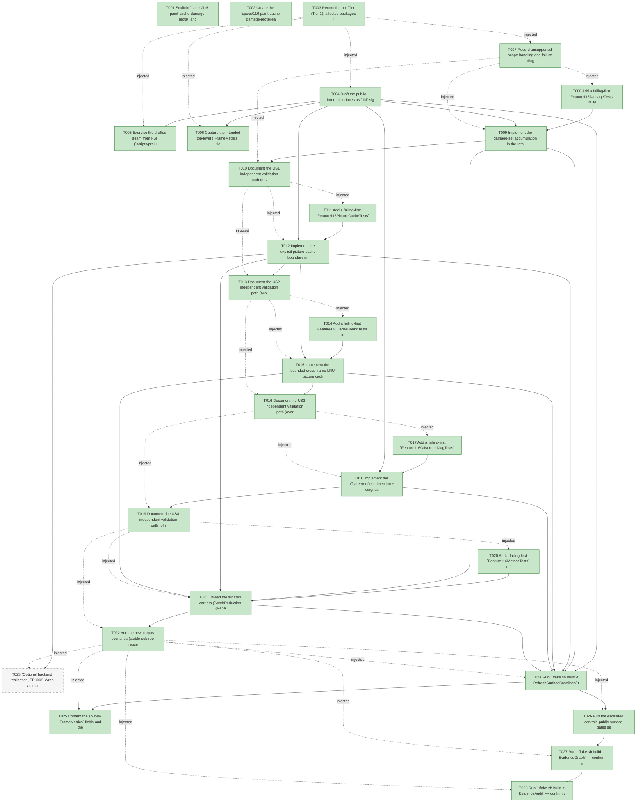

# Task Graph — 116-paint-cache-damage-rects

## ✓ Graph is acyclic and consistent

## Skill Match Assessments

| Task | Candidate | Confidence | Signals | Reviewer disposition | Diagnostic |
|------|-----------|------------|---------|----------------------|------------|
| T001 | (none) | none |  | accepted-empty | T001: skillist trusted as declared; no owns-based capability requirement |
| T002 | (none) | none |  | accepted-empty | T002: skillist trusted as declared; no owns-based capability requirement |
| T003 | (none) | none |  | accepted-empty | T003: skillist trusted as declared; no owns-based capability requirement |
| T004 | (none) | none |  | declared | T004: skillist trusted as declared; no owns-based capability requirement |
| T005 | (none) | none |  | declared | T005: skillist trusted as declared; no owns-based capability requirement |
| T006 | (none) | none |  | accepted-empty | T006: skillist trusted as declared; no owns-based capability requirement |
| T007 | (none) | none |  | accepted-empty | T007: skillist trusted as declared; no owns-based capability requirement |
| T008 | (none) | none |  | declared | T008: skillist trusted as declared; no owns-based capability requirement |
| T009 | (none) | none |  | declared | T009: skillist trusted as declared; no owns-based capability requirement |
| T010 | (none) | none |  | accepted-empty | T010: skillist trusted as declared; no owns-based capability requirement |
| T011 | (none) | none |  | declared | T011: skillist trusted as declared; no owns-based capability requirement |
| T012 | (none) | none |  | declared | T012: skillist trusted as declared; no owns-based capability requirement |
| T013 | (none) | none |  | accepted-empty | T013: skillist trusted as declared; no owns-based capability requirement |
| T014 | (none) | none |  | declared | T014: skillist trusted as declared; no owns-based capability requirement |
| T015 | (none) | none |  | declared | T015: skillist trusted as declared; no owns-based capability requirement |
| T016 | (none) | none |  | accepted-empty | T016: skillist trusted as declared; no owns-based capability requirement |
| T017 | (none) | none |  | declared | T017: skillist trusted as declared; no owns-based capability requirement |
| T018 | (none) | none |  | declared | T018: skillist trusted as declared; no owns-based capability requirement |
| T019 | (none) | none |  | accepted-empty | T019: skillist trusted as declared; no owns-based capability requirement |
| T020 | (none) | none |  | declared | T020: skillist trusted as declared; no owns-based capability requirement |
| T021 | (none) | none |  | declared | T021: skillist trusted as declared; no owns-based capability requirement |
| T022 | (none) | none |  | declared | T022: skillist trusted as declared; no owns-based capability requirement |
| T023 | (none) | none |  | declared | T023: skillist trusted as declared; no owns-based capability requirement |
| T024 | (none) | none |  | declared | T024: skillist trusted as declared; no owns-based capability requirement |
| T025 | (none) | none |  | accepted-empty | T025: skillist trusted as declared; no owns-based capability requirement |
| T026 | (none) | none |  | declared | T026: skillist trusted as declared; no owns-based capability requirement |
| T027 | speckit-evidence-graph | high | owns:graph-validation | accepted | T027: owns graph-validation requires skill speckit-evidence-graph; trigger_group=owns; matched_trigger=owns:graph-validation |
| T028 | speckit-evidence-audit | high | owns:evidence-audit | accepted | T028: owns evidence-audit requires skill speckit-evidence-audit; trigger_group=owns; matched_trigger=owns:evidence-audit |

## Status counts (effective)

| Status | Count |
|--------|-------|
| [X] done | 27 |
| [S] synthetic | 0 |
| [S*] auto-synthetic | 0 |
| [-] skipped | 1 |
| accepted [SEH] synthetic | 0 |
| unaccepted synthetic | 0 |

## Graph



## ASCII view

```
T001 [X] Scaffold `specs/116-paint-cache-damage-rects/` and confirm spec + plan + research + data-model + contracts (`damage-metrics-contract.md`, `picture-cache-contract.md`, `offscreen-effect-diagnostic.md`) + quickstart + checklist are linked and current
T002 [X] Create the `specs/116-paint-cache-damage-rects/readiness/` scaffolds discoverable before implementation — `evidence-audit.md`, `evidence-graph.md`, `skill-loading-evidence.md`, `governance-risk-levels.md`, `aggregate-hang-diagnostics.md`, `runtime-limitations.md`, `generated-validation.md`, `byte-identity-authority.md`, `damage-metrics-authority.md`, `picture-cache-authority.md`, and the window-visibility not-applicable set — each naming its authoritative command, artifact path, failure class, and next action
T003 [X] Record feature Tier (Tier 1), affected packages (`FS.Skia.UI.Controls` — the internal `RetainedRender` damage-set computation, the widened picture-cache correctness key + hit/miss counting, the bounded cross-frame LRU picture cache + `PictureCacheEnabled` always-miss flag, the offscreen-effect diagnostic, and the `WorkReductionRecord` carrier fields; `Types` — the additive `ControlDiagnosticCode` offscreen case; `FS.Skia.UI.Controls.Elmish` — the six public `FrameMetrics` fields; `FS.Skia.UI.SkiaViewer` — the optional `SceneRenderer` SKPicture record/replay), public-API impact (breaking `FrameMetrics` `.fsi` + additive `Types` diagnostics surface + internal `RetainedRender`/`WorkReductionRecord` seam reached via `InternalsVisibleTo`), Elmish/MVU + interactive-UI applicability (both N/A with the rationale above), and the required evidence obligations (localized-vs-frame-spanning vs idle-zero damage, per-keyed-input miss + hit byte-identity + always-miss oracle, bounded `PictureCacheEntryCount` + deterministic eviction + evicted-entry re-miss, offscreen-diagnostic fires/does-not-fire, the six deterministic `FrameMetrics` goldens, at-rest byte-identity via the Scene-parity suite, baselines, XML-doc, 113/114 composition)
T004 [X] Draft the public + internal surfaces as `.fsi` signatures (XML-doc each): in `src/Controls.Elmish/ControlsElmish.fsi` add the six public `FrameMetrics` fields `RepaintedNodeCount: int` / `DirtyRectCount: int` / `DirtyArea: int` / `PictureCacheHitCount: int` / `PictureCacheMissCount: int` / `PictureCacheEntryCount: int`; in `src/Controls/Types.fsi` add the additive advisory `ControlDiagnosticCode` offscreen-composition case (precedent `KeyCollision` `Types.fsi:154`); in `src/Controls/RetainedRender.fsi` add the internal `WorkReductionRecord` carriers `RepaintedNodeCount` / `DirtyRectCount` / `DirtyArea` / `PictureCacheHits` / `PictureCacheMisses` / `PictureCacheEntryCount` plus the internal bounded `PictureCache` store + the `PictureCacheEnabled: bool` always-miss flag on `RetainedRender` (mirroring `MemoEnabled`). Build compiles (signatures only)
T005 [X] Exercise the drafted seam from FSI (`scripts/prelude.fsx` or ad-hoc): construct a `FrameMetrics` carrying the six new fields and show the `Perf.runScript` shape, toggle the `PictureCacheEnabled` oracle, and print the `ControlDiagnosticCode` offscreen case; capture the session transcript to `readiness/fsi-session.txt`
T006 [X] Capture the intended top-level (`FrameMetrics` fields + `ControlDiagnosticCode` case) + per-package (Controls `Types`/`RetainedRender` internal carriers, Controls.Elmish `FrameMetrics`) surface baseline shape (the authoritative regen happens in T024) and note it in `readiness/`
T007 [X] Record unsupported-scope handling and failure diagnostics: OUT this rung — layout hot-path / text-measurement caches & layout-boundary hints / structural flattening (Phase 8); `SkiaViewer` frame-scheduling, readback separation, scene-submission/layer-skipping, render-thread/compositor split (Phase 9, beyond the byte-identical SKPicture record/replay this rung adds); non-axis-aligned or sub-pixel damage rectangles (axis-aligned integer only); draw-call batching (Qt-style); damage-driven partial-present (this rung adds the damage *signal*, not damage-scoped presentation); features 109–114 unchanged (FR-015); Principle IV + interactive-UI gate N/A
T008 [X] Add a failing-first `Feature116DamageTests` in `tests/Controls.Tests` (reaching internal seams via `InternalsVisibleTo "Controls.Tests"`): a single-control hover/visual-state change reports a small `RepaintedNodeCount` (the changed node(s) + any genuinely-shifted ancestors), a small `DirtyRectCount`, and a `DirtyArea` covering only the changed control's box(es) — not the whole frame (FR-001/FR-002, SC-001); a theme switch that invalidates all paint reports frame-spanning damage (every node repainted, area ≈ frame, FR-002); an idle frame reports `RepaintedNodeCount = 0` / `DirtyRectCount = 0` / `DirtyArea = 0` (FR-003); `DirtyArea`/`DirtyRectCount` are deterministic integers across runs (FR-004)
T009 [X] Implement the damage-set accumulation in the retained `step` (`src/Controls/RetainedRender.fs`): each repaint branch (`paintFresh` `:494` / `buildFresh` `:500` / `carry`-recompute `:515`) plus each genuinely-shifted node contributes its `RenderFragment.Box`; compute `RepaintedNodeCount` (repainted-node count), `DirtyRectCount` (distinct repainted boxes, deduped), and `DirtyArea` (summed integer `w*h` over distinct boxes) and populate the `WorkReductionRecord` carriers; emitted `SubtreeScene` byte-identical at rest. Make T008 pass (FR-001/FR-002/FR-003/FR-004)
T010 [X] Document the US1 independent validation path (drive a single-control hover, a theme switch, and an idle frame through `Perf.runScript`; assert small-vs-frame-spanning-vs-zero damage proportional to the change) in `readiness/us1-validation.md`
T011 [X] Add a failing-first `Feature116PictureCacheTests` in `tests/Controls.Tests`: a subtree unchanged in every render-affecting input across two frames is a `PictureCacheHitCount` hit (reused, not repainted) whose rendered scene is byte-identical to the first (FR-005/FR-007, SC-002); perturbing **exactly one** keyed input in turn (theme | box | clip | opacity | transform | font/text | visual-state) each independently forces a `PictureCacheMissCount` miss with correct fresh output, proving no keyed input is omitted (FR-006, SC-002); the same scenarios run with the picture cache **disabled** (the `PictureCacheEnabled` always-miss oracle, mirroring 113's `MemoEnabled`) render byte-identically to the cache-enabled build — cache-on ≡ cache-off (FR-007, SC-003)
T012 [X] Implement the explicit picture-cache boundary in `src/Controls/RetainedRender.fs`: name the existing fragment-reuse condition (`box = pr.Fragment.Box && not themeChanged` `:540`) the picture-cache boundary and **widen** it to the full correctness key (theme, box, clip, opacity, transform, font/text, visual-state — read from the lowered `Control`/attrs already diffed by `Reconcile`); count `PictureCacheHits`/`PictureCacheMisses` on `WorkReductionRecord`; add the `PictureCacheEnabled` always-miss flag (false ⇒ every subtree repaints, hits = 0, scene byte-identical). A hit emits the identical fragment instance (byte-identical `SubtreeScene` at rest). Make T011 pass (FR-005/FR-006/FR-007)
T013 [X] Document the US2 independent validation path (two-frame stable-subtree hit byte-identity + per-keyed-input miss matrix + always-miss oracle equivalence) in `readiness/us2-validation.md`
T014 [X] Add a failing-first `Feature116CacheBoundTests` in `tests/Controls.Tests`: drive a scenario populating more distinct cacheable subtrees than the cap (e.g. scrolling a large grid past many distinct row identities) and assert `PictureCacheEntryCount <= cap` at all times (FR-009, SC-004); eviction is deterministic — the same input sequence yields the same surviving entries (FR-010, SC-004); an evicted entry recomputes as a `PictureCacheMissCount` miss (fresh, correct paint) when next needed, never a stale hit (FR-010, SC-004)
T015 [X] Implement the bounded cross-frame LRU picture cache in `src/Controls/RetainedRender.fs`: a fixed entry cap (constant; above the corpus stable-subtree count, below the eviction scenario's distinct-identity count) with deterministic LRU eviction ordered by the frame's deterministic traversal order (no wall-clock), keyed by the T012 correctness key; populate `WorkReductionRecord.PictureCacheEntryCount` (`<= cap`) per frame; an evicted entry re-misses. Raw byte size stays a non-golden diagnostic. Make T014 pass (FR-009/FR-010)
T016 [X] Document the US3 independent validation path (over-cap eviction-pressure scenario, deterministic surviving-entry assertion, evicted-entry re-miss correctness, entry-count bound) in `readiness/us3-validation.md`
T017 [X] Add a failing-first `Feature116OffscreenDiagTests` in `tests/Controls.Tests`: a control whose paint requires offscreen composition (a non-opaque opacity group over a multi-node subtree | a clip | a drop-shadow/image-filter) surfaces an advisory offscreen-effect `ControlDiagnostic` naming the control/effect through the existing `Diagnostics` channel (FR-011, SC-005); a control with no offscreen-forcing effect surfaces none (FR-011, SC-005); in both cases rendered output is byte-identical to the pre-feature state (advisory only, never altering paint, FR-011, SC-005)
T018 [X] Implement the offscreen-effect detection + diagnostic emission: add the additive advisory `ControlDiagnosticCode` offscreen case to `src/Controls/Types.fs` and emit a `ControlDiagnostic` (severity advisory, message naming the control + the offscreen-forcing effect) on the retained step result (`RetainedRender.fs:720`, emission precedent `firstFrameCollisions` `:265-292`) by matching the lowered scene/attrs (opacity group over a multi-node subtree | `ClipNode` | drop-shadow/image-filter; detection sites `SceneRenderer.fs:356-367`/`:28-30`/`:125`). Never fails a build, never alters rendered output. Make T017 pass (FR-011)
T019 [X] Document the US4 independent validation path (offscreen-forcing control fires the advisory diagnostic; plain control does not; output byte-identical either way) in `readiness/us4-validation.md`
T020 [X] Add a failing-first `Feature116MetricsTests` in `tests/Elmish.Tests` over `ControlsElmish.Perf.runScript`: every corpus frame records `RepaintedNodeCount`, `DirtyRectCount`, `DirtyArea`, `PictureCacheHitCount`, `PictureCacheMissCount`, and `PictureCacheEntryCount` deterministically and golden-asserted (FR-012, SC-006); an idle frame reports damage = `0/0/0` and hit/miss = `0` (a steady cache may retain entries, so `PictureCacheEntryCount` reflects live size, FR-012); the counts aggregate correctly over multiple subtrees / the virtualized (114) row set (FR-015, SC-007); a regression that repaints a stable subtree, widens localized damage to the whole frame, or blows the cache cap fails a golden (FR-012, SC-006)
T021 [X] Thread the six step carriers (`WorkReduction.{RepaintedNodeCount, DirtyRectCount, DirtyArea, PictureCacheHits, PictureCacheMisses, PictureCacheEntryCount}`) into `FrameMetrics` in `src/Controls.Elmish/ControlsElmish.fs` exactly as `MemoHitCount`/`MemoMissCount` (113) and `VirtualItems*` (114): the `zero` record carries `0` and **every** per-frame construction site lifts them from `lastWorkReduction`; surface through `Perf.runScript` and the live `OnFrameMetrics` sink; plumb the `PictureCacheEnabled` oracle for the tests. Make T020 pass (FR-012)
T022 [X] Add the new corpus scenarios (stable-subtree reuse + cache-cap eviction, alongside idle / localized hover / theme switch) to the `Perf.runScript` corpus and regenerate the corpus goldens (`PERF_CORPUS_REGEN=1`) so they carry the six new metric fields; confirm the rendered scenes are otherwise unchanged (additive only) (FR-013, SC-006)
T023 [-] (Optional backend realization, FR-008) Wrap a stable cached boundary in the existing `Scene.Picture` / `PictureNode` so `src/SkiaViewer/SceneRenderer.fs` records/replays a real `SKPicture` for an unchanged boundary (passthrough `:393` stays the at-rest fallback); contract is **byte-identical raster**, proven by the standing Scene-parity / raster evidence path — it does **not** change the deterministic flat `SubtreeScene` the goldens assert (FR-008). If real backend realization is infeasible this rung, mark `[-]` with rationale (the optional MAY) rather than forcing it. **Deferred `[-]` (rationale)**: FR-008 is an explicit optional MAY; the deterministic, golden-asserted contract this rung delivers is the hit/miss counts + damage metrics at the scene-list level (US2/US5), complete and green without touching `SceneRenderer`. A real `SKPicture` record/replay is a backend raster optimization with a byte-identical-pixels contract that changes no asserted surface; it is left to the Phase-9 `SkiaViewer` backend review (`readiness/unsupported-scope.md`). No `src/SkiaViewer/**` source was edited, keeping the change set to the Controls/Controls.Elmish packages + regenerated baselines/goldens.
T024 [X] Run `./fake.sh build -t RefreshSurfaceBaselines` to regenerate the top-level public surface baseline (the six new `FrameMetrics` fields + the `ControlDiagnosticCode` offscreen case) and the per-package Controls/Controls.Elmish baselines (the internal `WorkReductionRecord` carriers + the `Types` diagnostics case); update any construction sites or sample preludes it flags
T025 [X] Confirm the six new `FrameMetrics` fields and the new `ControlDiagnosticCode` case satisfy the doc-preservation / XML-doc gate, and that no unrelated public function signature changed (additive `FrameMetrics` fields + additive diagnostics case only; the `RetainedRender`/`WorkReductionRecord`/picture-cache additions stay internal)
T026 [X] Run the escalated controls-public-surface gates sequentially as `Route` prints them — `Dev`, `GeneratedGuidanceCheck`, `TemplateCheck`, `GeneratedProductCheck`, the package/per-package surface diffs, `FsiTranscripts`, the controls catalog/doc/interaction/rendering checks, and `TemplateDrift` — confirming the standing Scene-parity golden suite (at-rest byte-identity, FR-014/SC-007) under `Dev` passes, and record the focused governance risk level + non-authoritative aggregate notes in `readiness/`
T027 [X] Run `./fake.sh build -t EvidenceGraph` — confirm no cycles, no dangling refs, no `[S*]` surprises, and the echoed `feature-directory`/`tasks=<n>` match this feature
T028 [X] Run `./fake.sh build -t EvidenceAudit` — confirm verdict PASS with no remaining `[S]`/`[S*]` and no diff-scan hits, or document every `--accept-synthetic` override
```

## Injected checkpoint edges (Phase N+1 → Phase N) — FR-007

- T003 → T004  (auto-injected Phase-checkpoint edge)
- T003 → T005  (auto-injected Phase-checkpoint edge)
- T003 → T006  (auto-injected Phase-checkpoint edge)
- T003 → T007  (auto-injected Phase-checkpoint edge)
- T007 → T008  (auto-injected Phase-checkpoint edge)
- T007 → T009  (auto-injected Phase-checkpoint edge)
- T007 → T010  (auto-injected Phase-checkpoint edge)
- T010 → T011  (auto-injected Phase-checkpoint edge)
- T010 → T012  (auto-injected Phase-checkpoint edge)
- T010 → T013  (auto-injected Phase-checkpoint edge)
- T013 → T014  (auto-injected Phase-checkpoint edge)
- T013 → T015  (auto-injected Phase-checkpoint edge)
- T013 → T016  (auto-injected Phase-checkpoint edge)
- T016 → T017  (auto-injected Phase-checkpoint edge)
- T016 → T018  (auto-injected Phase-checkpoint edge)
- T016 → T019  (auto-injected Phase-checkpoint edge)
- T019 → T020  (auto-injected Phase-checkpoint edge)
- T019 → T021  (auto-injected Phase-checkpoint edge)
- T019 → T022  (auto-injected Phase-checkpoint edge)
- T022 → T023  (auto-injected Phase-checkpoint edge)
- T022 → T024  (auto-injected Phase-checkpoint edge)
- T022 → T025  (auto-injected Phase-checkpoint edge)
- T022 → T026  (auto-injected Phase-checkpoint edge)
- T022 → T027  (auto-injected Phase-checkpoint edge)
- T022 → T028  (auto-injected Phase-checkpoint edge)

## Resolved skillist ids — FR-007

Resolved skillist-id set (9): fs-skia-controls-host, fs-skia-evidence-mode, fs-skia-reconciliation, fs-skia-scene, fs-skia-skiaviewer, fs-skia-template-update, fs-skia-ui-widgets, speckit-evidence-audit, speckit-evidence-graph

## Skillist id → SKILL.md path

fs-skia-controls-host → .agents/skills/fs-skia-controls-host/SKILL.md
fs-skia-evidence-mode → .agents/skills/fs-skia-evidence-mode/SKILL.md
fs-skia-reconciliation → .agents/skills/fs-skia-reconciliation/SKILL.md
fs-skia-scene → src/Scene/skill/SKILL.md
fs-skia-skiaviewer → src/SkiaViewer/skill/SKILL.md
fs-skia-template-update → .agents/skills/fs-skia-template-update/SKILL.md
fs-skia-ui-widgets → src/Controls/skill/SKILL.md
speckit-evidence-audit → .agents/skills/speckit-evidence-audit/SKILL.md
speckit-evidence-graph → .agents/skills/speckit-evidence-graph/SKILL.md

## Skillist id → unresolved / flagged

_(none — every declared skillist id resolves to exactly one installed skill)_

