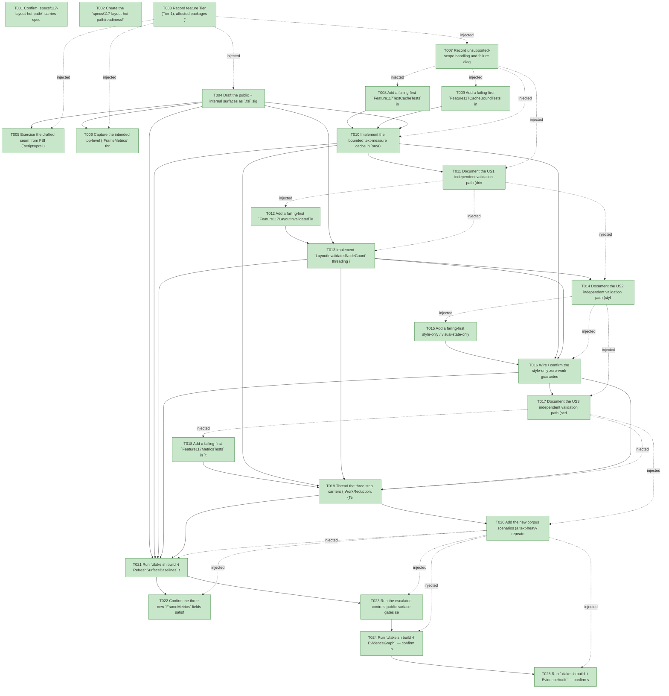

# Task Graph — 117-layout-hot-path

## ✓ Graph is acyclic and consistent

## Skill Match Assessments

| Task | Candidate | Confidence | Signals | Reviewer disposition | Diagnostic |
|------|-----------|------------|---------|----------------------|------------|
| T001 | (none) | none |  | accepted-empty | T001: skillist trusted as declared; no owns-based capability requirement |
| T002 | (none) | none |  | accepted-empty | T002: skillist trusted as declared; no owns-based capability requirement |
| T003 | (none) | none |  | accepted-empty | T003: skillist trusted as declared; no owns-based capability requirement |
| T004 | (none) | none |  | declared | T004: skillist trusted as declared; no owns-based capability requirement |
| T005 | (none) | none |  | declared | T005: skillist trusted as declared; no owns-based capability requirement |
| T006 | (none) | none |  | accepted-empty | T006: skillist trusted as declared; no owns-based capability requirement |
| T007 | (none) | none |  | accepted-empty | T007: skillist trusted as declared; no owns-based capability requirement |
| T008 | (none) | none |  | declared | T008: skillist trusted as declared; no owns-based capability requirement |
| T009 | (none) | none |  | declared | T009: skillist trusted as declared; no owns-based capability requirement |
| T010 | (none) | none |  | declared | T010: skillist trusted as declared; no owns-based capability requirement |
| T011 | (none) | none |  | accepted-empty | T011: skillist trusted as declared; no owns-based capability requirement |
| T012 | (none) | none |  | declared | T012: skillist trusted as declared; no owns-based capability requirement |
| T013 | (none) | none |  | declared | T013: skillist trusted as declared; no owns-based capability requirement |
| T014 | (none) | none |  | accepted-empty | T014: skillist trusted as declared; no owns-based capability requirement |
| T015 | (none) | none |  | declared | T015: skillist trusted as declared; no owns-based capability requirement |
| T016 | (none) | none |  | declared | T016: skillist trusted as declared; no owns-based capability requirement |
| T017 | (none) | none |  | accepted-empty | T017: skillist trusted as declared; no owns-based capability requirement |
| T018 | (none) | none |  | declared | T018: skillist trusted as declared; no owns-based capability requirement |
| T019 | (none) | none |  | declared | T019: skillist trusted as declared; no owns-based capability requirement |
| T020 | (none) | none |  | declared | T020: skillist trusted as declared; no owns-based capability requirement |
| T021 | (none) | none |  | declared | T021: skillist trusted as declared; no owns-based capability requirement |
| T022 | (none) | none |  | accepted-empty | T022: skillist trusted as declared; no owns-based capability requirement |
| T023 | (none) | none |  | declared | T023: skillist trusted as declared; no owns-based capability requirement |
| T024 | speckit-evidence-graph | high | owns:graph-validation | accepted | T024: owns graph-validation requires skill speckit-evidence-graph; trigger_group=owns; matched_trigger=owns:graph-validation |
| T025 | speckit-evidence-audit | high | owns:evidence-audit | accepted | T025: owns evidence-audit requires skill speckit-evidence-audit; trigger_group=owns; matched_trigger=owns:evidence-audit |

## Status counts (effective)

| Status | Count |
|--------|-------|
| [X] done | 25 |
| [S] synthetic | 0 |
| [S*] auto-synthetic | 0 |
| accepted [SEH] synthetic | 0 |
| unaccepted synthetic | 0 |

## Graph



## ASCII view

```
T001 [X] Confirm `specs/117-layout-hot-path/` carries spec + plan + research + data-model + contracts (`text-measure-cache-contract.md`, `layout-invalidated-metric-contract.md`) + quickstart + checklist (`checklists/requirements.md`) and that they are linked and current
T002 [X] Create the `specs/117-layout-hot-path/readiness/` scaffolds discoverable before implementation — `evidence-audit.md`, `evidence-graph.md`, `skill-loading-evidence.md`, `governance-risk-levels.md`, `aggregate-hang-diagnostics.md`, `runtime-limitations.md`, `generated-validation.md`, `byte-identity-authority.md`, `text-cache-authority.md`, and the window-visibility not-applicable set — each naming its authoritative command, artifact path, failure class, and next action
T003 [X] Record feature Tier (Tier 1), affected packages (`FS.Skia.UI.Controls` — the internal bounded text-measure cache + `TextCacheEnabled` always-miss flag interposed over `Scene.measureText` at the six `Control.fs` call sites + `fittedFontSize`, the `WorkReductionRecord` hit/miss + layout-invalidated carriers, and the dirty-set-size threading; `FS.Skia.UI.Controls.Elmish` — the three public `FrameMetrics` fields), public-API impact (breaking `FrameMetrics` `.fsi` + internal `RetainedRender`/`WorkReductionRecord` seam reached via `InternalsVisibleTo`), Elmish/MVU + interactive-UI applicability (both N/A with the rationale above), and the required evidence obligations (cold-miss→warm-hit, per-keyed-input miss + hit byte-identity + always-miss oracle, bounded cap + deterministic eviction + evicted-entry re-miss, empty/whitespace + fitted-caption, layout-invalidated `<= RemeasuredNodeCount` + idle/style-only `= 0`, the three deterministic `FrameMetrics` goldens, at-rest byte-identity via the Scene-parity suite, baselines, XML-doc, drift-guard-still-empty, 113/114/116 composition)
T004 [X] Draft the public + internal surfaces as `.fsi` signatures (XML-doc each, attribute-before-doc-before-type ordering): in `src/Controls.Elmish/ControlsElmish.fsi` add the three public `FrameMetrics` fields `TextMeasureCacheHitCount: int` / `TextMeasureCacheMissCount: int` / `LayoutInvalidatedNodeCount: int`; in `src/Controls/RetainedRender.fsi` add the internal `WorkReductionRecord` carriers `TextMeasureCacheHits` / `TextMeasureCacheMisses` / `LayoutInvalidatedNodeCount` plus the internal `TextMeasureKey` cache-key record, the internal bounded `TextMeasureCache` store, and the `TextCacheEnabled: bool` always-miss flag on `RetainedRender` (mirroring `MemoEnabled` `:81`/`.fsi:130` and `PictureCacheEnabled` `:87`/`.fsi:145`). Build compiles (signatures only)
T005 [X] Exercise the drafted seam from FSI (`scripts/prelude.fsx` or ad-hoc): construct a `FrameMetrics` carrying the three new fields and show the `Perf.runScript` shape, toggle the `TextCacheEnabled` oracle, and print a `TextMeasureKey` round-trip; capture the session transcript to `readiness/fsi-session.txt`
T006 [X] Capture the intended top-level (`FrameMetrics` three fields) + per-package (Controls `RetainedRender` internal cache/flag/carriers, Controls.Elmish `FrameMetrics`) surface baseline shape (the authoritative regen happens in T021) and note it in `readiness/`
T007 [X] Record unsupported-scope handling and failure diagnostics: OUT this rung — structural-wrapper flattening (report task 4, semantic-change risk, no byte-identical guarantee); intrinsic / multi-pass layout introduction and any multi-pass metric (report optional task 5 — no such path exists, this rung must not create one, FR-009; the single-measure-pass contract is verified negatively — by the absence of any new multi-pass metric plus the still-empty layout drift guard asserted in T012); `SkiaViewer` frame-scheduling / readback separation / scene-submission / layer-skipping / render-thread / compositor split (Phase 9); GPU / layer caching; any timing-based pass/fail gate (the metrics are counts, not durations); the text-cache raw entry-count / byte-size is an internal invariant proven by test, not a public `FrameMetrics` field (unlike 116's `PictureCacheEntryCount`); features 109–116 unchanged; Principle IV + interactive-UI gate N/A
T008 [X] Add a failing-first `Feature117TextCacheTests` in `tests/Controls.Tests` (reaching internal seams via `InternalsVisibleTo "Controls.Tests"`): a cold first measurement of a key is a miss, a second identical-key measurement is a hit served without re-invoking `Scene.measureText` (FR-001, SC-002→SC-001); perturbing **exactly one** keyed input in turn (text | font family | font size | font weight) each independently forces a miss with the correct fresh `TextMetrics`, proving no keyed input is omitted (FR-002); a hit's returned `TextMetrics` is byte-identical to the un-cached measure (FR-004, SC-004); the same scenarios run with the cache **disabled** (the `TextCacheEnabled` always-miss oracle) produce identical measured width/height and identical layout — cache-on ≡ cache-off (FR-004, SC-004); empty and whitespace text measure and cache without error and stay byte-identical (edge case); a `fittedFontSize` auto-fit caption's distinct candidate sizes are distinct keys, the cache helps across frames, and the chosen fitted size is unchanged (edge case)
T009 [X] Add a failing-first `Feature117CacheBoundTests` in `tests/Controls.Tests`: drive a scenario measuring more distinct strings than the cap and assert `Entries.Count <= cap` at all times (FR-003, SC-005); eviction is deterministic — the same input order yields the same surviving entries and the same hit/miss/eviction sequence (FR-003, SC-005); an evicted entry re-misses (fresh, correct measure) when next needed, never a stale hit (FR-003, SC-005)
T010 [X] Implement the bounded text-measure cache in `src/Controls/RetainedRender.fs` (+ wiring at the six `Control.fs` `measureText` call sites: `fittedFontSize` `:239`, `buttonGeom` `:786`, `badgeGeom` `:821`, `textFieldGeom` `:966`, `textAreaFieldGeom` `:996`, `richTextGeom` `:1017`): a `TextMeasureKey` ( text, family, size, weight ) keyed lookup — resident key returns the cached `TextMetrics` and counts a hit; an absent/evicted key calls `Scene.measureText`, inserts (evicting LRU at cap, deterministic traversal-ordered recency like 116), and counts a miss; populate the `WorkReductionRecord` hit/miss carriers; the `TextCacheEnabled = false` oracle forces every request to re-measure (hits = 0, byte-identical output/layout). Emitted `SubtreeScene`, layout boxes, and fitted font sizes byte-identical at rest. Make T008 + T009 pass (FR-001/FR-002/FR-003/FR-004)
T011 [X] Document the US1 independent validation path (drive a repeated-caption text-heavy layout cold→warm through `Perf.runScript`; assert warm-frame hits + zero misses, cold-frame misses; per-keyed-input miss matrix; always-miss oracle equivalence) in `readiness/us1-validation.md`
T012 [X] Add a failing-first `Feature117LayoutInvalidatedTests` in `tests/Controls.Tests`: an idle frame reports `LayoutInvalidatedNodeCount = 0` (FR-006); a style-only / visual-state-only frame reports `LayoutInvalidatedNodeCount = 0` and `RemeasuredNodeCount = 0` (FR-006/FR-007, SC-003); a geometry-changing frame (width/height/orientation) reports a bounded, explainable `LayoutInvalidatedNodeCount` that is `<= RemeasuredNodeCount` — fixed-size-ancestor propagation expands the pre-pinning dirty set into the re-measured boundary subtree (direction corrected 2026-06-13) (FR-006, SC-006); the feature 101 drift guard (`layoutDriftReport` over `layoutAffectingAttrNames` `Control.fs:1252`) still reports **empty** drift — this rung adds no new geometry-driving attribute (FR-008)
T013 [X] Implement `LayoutInvalidatedNodeCount` threading in `src/Controls/RetainedRender.fs`: surface `Set.count` of the dirty set produced by `layoutDirtySet` (`:497-504`) and fed to `evaluateIncremental` (`Control.fs:1307`), as a `WorkReductionRecord` carrier distinct from the post-pinning `RemeasuredNodeCount` (`layoutResult.Invalidated |> List.length` `:575`); `invalidated <= remeasured` always holds (the pre-pinning dirty set is a subset of the post-pinning re-measured boundary subtrees; direction corrected 2026-06-13). Reporting-only, no layout-box change, byte-identical at rest. Make T012 pass (FR-006/FR-007/FR-008)
T014 [X] Document the US2 independent validation path (style-only frame zero invalidated/zero remeasured; geometry frame bounded invalidated `<= RemeasuredNodeCount`; drift guard empty) in `readiness/us2-validation.md`
T015 [X] Add a failing-first style-only / visual-state-only zero-work assertion (in `Feature117LayoutInvalidatedTests` or a sibling in `tests/Controls.Tests`): a hover / focus / press / animation-tick frame over a text-bearing control re-measures **zero** layout nodes (`RemeasuredNodeCount = 0`), reports **zero** `LayoutInvalidatedNodeCount`, and produces **zero** text-measure cache misses for unchanged text (every measurement served from the warm cache), while remaining byte-identical at rest (FR-007, SC-003)
T016 [X] Wire / confirm the style-only zero-work guarantee on the retained step (`src/Controls/RetainedRender.fs`): a visual-state-only update routes through incremental layout with an empty dirty set (zero invalidated, zero remeasured) and unchanged text serves text-cache hits (zero misses); this is largely an assertion over behavior 096/112/113 already produce, formalized here as a deterministic gate. Make T015 pass (FR-007)
T017 [X] Document the US3 independent validation path (scripted hover/focus/visual-state frame asserts zero remeasure / zero invalidated / zero text-cache miss, byte-identical output) in `readiness/us3-validation.md`
T018 [X] Add a failing-first `Feature117MetricsTests` in `tests/Elmish.Tests` over `ControlsElmish.Perf.runScript`: the three `FrameMetrics` fields (`TextMeasureCacheHitCount`, `TextMeasureCacheMissCount`, `LayoutInvalidatedNodeCount`) are recorded deterministically and golden-asserted (FR-005/FR-006/FR-010); a cold text-heavy frame reports misses then a warm frame reports hits + zero misses (SC-001/SC-002); a style-only frame reports zero misses / zero invalidated / zero remeasured (FR-007, SC-003); an idle frame reports all three `= 0` (FR-005/FR-006); the counts aggregate correctly over the virtualized (114) row set (FR-008); a regression that re-shapes identical text or silently widens the dirty set fails a golden (FR-005/FR-006)
T019 [X] Thread the three step carriers (`WorkReduction.{TextMeasureCacheHits, TextMeasureCacheMisses, LayoutInvalidatedNodeCount}`) into `FrameMetrics` in `src/Controls.Elmish/ControlsElmish.fs` exactly as `MemoHitCount`/`MemoMissCount` (113), `VirtualItems*` (114), and `PictureCache*` (116): the `zero` record (`:1366-1388`) carries `0` and **every** per-frame construction site (`:1421-1442` move, `:1478-1496` tick, key/pointer frames) lifts them from `lastWorkReduction`; surface through `Perf.runScript` and the live `OnFrameMetrics` sink (`:1003`); plumb the `TextCacheEnabled` oracle for the tests. Make T018 pass (FR-005/FR-006)
T020 [X] Add the new corpus scenarios (a text-heavy repeated-caption cold→warm layout, a style-only / visual-state zero-work frame, and a cache-cap eviction layout) to the `Perf.runScript` corpus and regenerate the corpus goldens (`PERF_CORPUS_REGEN=1`) so they carry the three new metric fields; confirm the rendered scenes are otherwise unchanged (additive only) (FR-010, SC-006)
T021 [X] Run `./fake.sh build -t RefreshSurfaceBaselines` to regenerate the top-level public surface baseline (the three new `FrameMetrics` fields) and the per-package Controls/Controls.Elmish baselines (the internal `RetainedRender` text-measure-cache + `TextCacheEnabled` flag + `WorkReductionRecord` carriers); update any `FrameMetrics` construction sites or sample preludes it flags
T022 [X] Confirm the three new `FrameMetrics` fields satisfy the doc-preservation / XML-doc gate (`///` before each field, attribute-before-doc-before-type), and that no unrelated public function signature changed (additive `FrameMetrics` fields only; the `RetainedRender`/`WorkReductionRecord`/text-measure-cache additions stay internal)
T023 [X] Run the escalated controls-public-surface gates sequentially as `Route` prints them — `Dev`, `GeneratedGuidanceCheck`, `TemplateCheck`, `GeneratedProductCheck`, the package/per-package surface diffs, `FsiTranscripts`, the controls catalog/doc/interaction/rendering checks, and `TemplateDrift` — confirming the standing Scene-parity golden suite (at-rest byte-identity, FR-004/SC-004) under `Dev` passes, and record the focused governance risk level + non-authoritative aggregate notes in `readiness/`
T024 [X] Run `./fake.sh build -t EvidenceGraph` — confirm no cycles, no dangling refs, no `[S*]` surprises, and the echoed `feature-directory`/`tasks=<n>` match this feature
T025 [X] Run `./fake.sh build -t EvidenceAudit` — confirm verdict PASS with no remaining `[S]`/`[S*]` and no diff-scan hits, or document every `--accept-synthetic` override (SC-007)
```

## Injected checkpoint edges (Phase N+1 → Phase N) — FR-007

- T003 → T004  (auto-injected Phase-checkpoint edge)
- T003 → T005  (auto-injected Phase-checkpoint edge)
- T003 → T006  (auto-injected Phase-checkpoint edge)
- T003 → T007  (auto-injected Phase-checkpoint edge)
- T007 → T008  (auto-injected Phase-checkpoint edge)
- T007 → T009  (auto-injected Phase-checkpoint edge)
- T007 → T010  (auto-injected Phase-checkpoint edge)
- T007 → T011  (auto-injected Phase-checkpoint edge)
- T011 → T012  (auto-injected Phase-checkpoint edge)
- T011 → T013  (auto-injected Phase-checkpoint edge)
- T011 → T014  (auto-injected Phase-checkpoint edge)
- T014 → T015  (auto-injected Phase-checkpoint edge)
- T014 → T016  (auto-injected Phase-checkpoint edge)
- T014 → T017  (auto-injected Phase-checkpoint edge)
- T017 → T018  (auto-injected Phase-checkpoint edge)
- T017 → T019  (auto-injected Phase-checkpoint edge)
- T017 → T020  (auto-injected Phase-checkpoint edge)
- T020 → T021  (auto-injected Phase-checkpoint edge)
- T020 → T022  (auto-injected Phase-checkpoint edge)
- T020 → T023  (auto-injected Phase-checkpoint edge)
- T020 → T024  (auto-injected Phase-checkpoint edge)
- T020 → T025  (auto-injected Phase-checkpoint edge)

## Resolved skillist ids — FR-007

Resolved skillist-id set (7): fs-skia-controls-host, fs-skia-evidence-mode, fs-skia-reconciliation, fs-skia-template-update, fs-skia-ui-widgets, speckit-evidence-audit, speckit-evidence-graph

## Skillist id → SKILL.md path

fs-skia-controls-host → .agents/skills/fs-skia-controls-host/SKILL.md
fs-skia-evidence-mode → .agents/skills/fs-skia-evidence-mode/SKILL.md
fs-skia-reconciliation → .agents/skills/fs-skia-reconciliation/SKILL.md
fs-skia-template-update → .agents/skills/fs-skia-template-update/SKILL.md
fs-skia-ui-widgets → src/Controls/skill/SKILL.md
speckit-evidence-audit → .agents/skills/speckit-evidence-audit/SKILL.md
speckit-evidence-graph → .agents/skills/speckit-evidence-graph/SKILL.md

## Skillist id → unresolved / flagged

_(none — every declared skillist id resolves to exactly one installed skill)_

