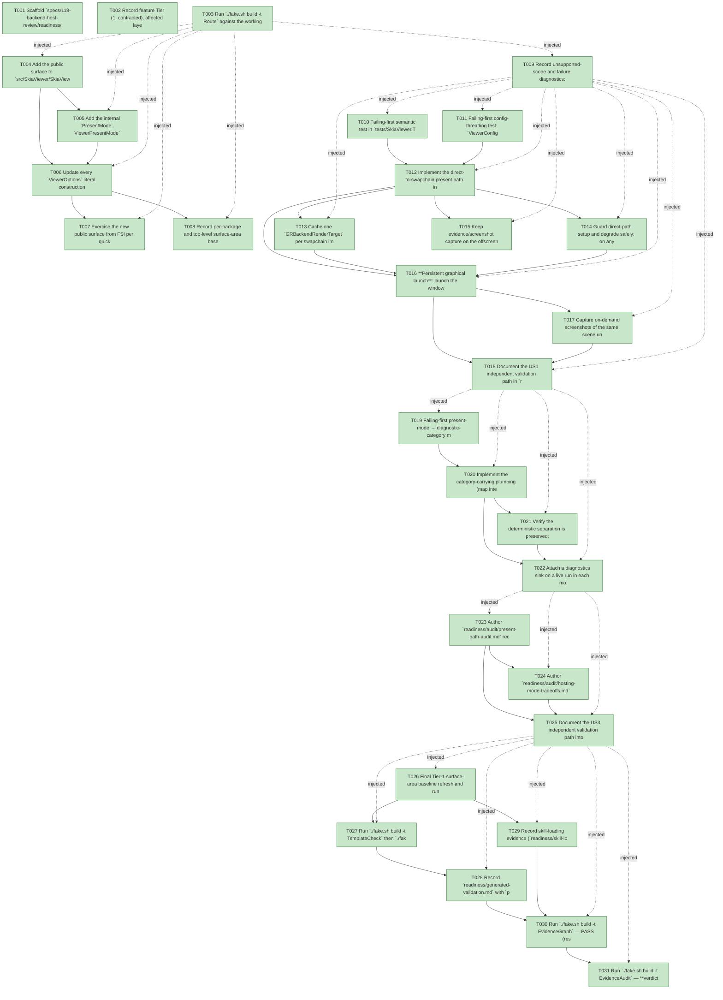

# Task Graph — 118-backend-host-review

## ✓ Graph is acyclic and consistent

## Skill Match Assessments

| Task | Candidate | Confidence | Signals | Reviewer disposition | Diagnostic |
|------|-----------|------------|---------|----------------------|------------|
| T001 | (none) | none |  | accepted-empty | T001: skillist trusted as declared; no owns-based capability requirement |
| T002 | (none) | none |  | accepted-empty | T002: skillist trusted as declared; no owns-based capability requirement |
| T003 | (none) | none |  | accepted-empty | T003: skillist trusted as declared; no owns-based capability requirement |
| T004 | (none) | none |  | declared | T004: skillist trusted as declared; no owns-based capability requirement |
| T005 | (none) | none |  | declared | T005: skillist trusted as declared; no owns-based capability requirement |
| T006 | (none) | none |  | declared | T006: skillist trusted as declared; no owns-based capability requirement |
| T007 | (none) | none |  | declared | T007: skillist trusted as declared; no owns-based capability requirement |
| T008 | (none) | none |  | declared | T008: skillist trusted as declared; no owns-based capability requirement |
| T009 | (none) | none |  | declared | T009: skillist trusted as declared; no owns-based capability requirement |
| T010 | (none) | none |  | declared | T010: skillist trusted as declared; no owns-based capability requirement |
| T011 | (none) | none |  | declared | T011: skillist trusted as declared; no owns-based capability requirement |
| T012 | (none) | none |  | declared | T012: skillist trusted as declared; no owns-based capability requirement |
| T013 | (none) | none |  | declared | T013: skillist trusted as declared; no owns-based capability requirement |
| T014 | (none) | none |  | declared | T014: skillist trusted as declared; no owns-based capability requirement |
| T015 | (none) | none |  | declared | T015: skillist trusted as declared; no owns-based capability requirement |
| T016 | (none) | none |  | declared | T016: skillist trusted as declared; no owns-based capability requirement |
| T017 | (none) | none |  | declared | T017: skillist trusted as declared; no owns-based capability requirement |
| T018 | (none) | none |  | declared | T018: skillist trusted as declared; no owns-based capability requirement |
| T019 | (none) | none |  | declared | T019: skillist trusted as declared; no owns-based capability requirement |
| T020 | (none) | none |  | declared | T020: skillist trusted as declared; no owns-based capability requirement |
| T021 | (none) | none |  | declared | T021: skillist trusted as declared; no owns-based capability requirement |
| T022 | (none) | none |  | declared | T022: skillist trusted as declared; no owns-based capability requirement |
| T023 | (none) | none |  | declared | T023: skillist trusted as declared; no owns-based capability requirement |
| T024 | (none) | none |  | declared | T024: skillist trusted as declared; no owns-based capability requirement |
| T025 | (none) | none |  | declared | T025: skillist trusted as declared; no owns-based capability requirement |
| T026 | (none) | none |  | declared | T026: skillist trusted as declared; no owns-based capability requirement |
| T027 | (none) | none |  | declared | T027: skillist trusted as declared; no owns-based capability requirement |
| T028 | (none) | none |  | declared | T028: skillist trusted as declared; no owns-based capability requirement |
| T029 | (none) | none |  | accepted-empty | T029: skillist trusted as declared; no owns-based capability requirement |
| T030 | speckit-evidence-graph | high | owns:graph-validation | accepted | T030: owns graph-validation requires skill speckit-evidence-graph; trigger_group=owns; matched_trigger=owns:graph-validation |
| T031 | speckit-evidence-audit | high | owns:evidence-audit | accepted | T031: owns evidence-audit requires skill speckit-evidence-audit; trigger_group=owns; matched_trigger=owns:evidence-audit |

## Status counts (effective)

| Status | Count |
|--------|-------|
| [X] done | 31 |
| [S] synthetic | 0 |
| [S*] auto-synthetic | 0 |
| accepted [SEH] synthetic | 0 |
| unaccepted synthetic | 0 |

## Graph



## ASCII view

```
T001 [X] Scaffold `specs/118-backend-host-review/readiness/` with audit-enforced placeholder files discoverable before implementation: `governance-risk-levels.md`, `aggregate-hang-diagnostics.md`, `runtime-limitations.md`, `visual-evidence-honesty.md`, `window-visibility.md`, `generated-guidance-validation.md`, `real-image-evidence.md`, `unsupported-scope.md`, `selected-skills.md`, `skill-loading-evidence.md`, `generated-validation.md`, `evidence-graph.md`, `evidence-audit.md`, plus `audit/` and `smoke/` subdirs for the FR-009 docs and FR-001/003/005/007 smoke artifacts
T002 [X] Record feature Tier (1, contracted), affected layer (`FS.Skia.UI.SkiaViewer` backend/host), public-API impact (`ViewerPresentMode` DU + `ViewerOptions.PresentMode` field), MVU/Elmish applicability (not newly applicable — config, not a transition), and the evidence obligations (audit + hosting-mode doc, direct-mode smoke/screenshots, default byte-identity, safe-fallback, golden-absence) into `readiness/`
T003 [X] Run `./fake.sh build -t Route` against the working-tree diff and record the authoritative routed gate set (expected: escalated SkiaViewer public-surface set + `TemplateCheck` + `GeneratedProductCheck`); confirm `--enforce` names no missing evidence artifact, into `readiness/focused-gates.md`
T004 [X] Add the public surface to `src/SkiaViewer/SkiaViewer.fsi`: `[<RequireQualifiedAccess>] type ViewerPresentMode = OffscreenReadback | DirectToSwapchain` (attribute → `///` → type ordering) and the `PresentMode: ViewerPresentMode` field on `ViewerOptions`, each public field/case `///`-documented per the XML-doc gate; mirror the additions in `SkiaViewer.fs`
T005 [X] Add the internal `PresentMode: ViewerPresentMode` field to `ViewerConfiguration` (`Host/Diagnostics.fsi`/`.fs`) and thread it from `ViewerOptions.PresentMode` in `Host.Viewer.defaultConfiguration` (Viewer.fs) and the config-build site (`SkiaViewer.fs:~1231`) into `renderFrame`
T006 [X] Update every `ViewerOptions` literal construction site with `PresentMode = ViewerPresentMode.OffscreenReadback` (breaking record-shape add): `template/base/src/Product/EvidenceCommands.fs` (×2), `samples/{BasicViewer,EffectsGallery,ParityGallery,DemoReel}/Program.fs`, `tests/SkiaViewer.Tests/**` (~30 literals), `tests/Elmish.Tests/Tests.fs`, `tests/ControlsPreview.Harness/PreviewRender.fs`, `specs/085*/086*/090*` readiness harnesses + `.fsx` preludes, and the internal "Generated App" literal (`SkiaViewer.fs:~2899`); `with`-expression sites are exempt
T007 [X] Exercise the new public surface from FSI per quickstart — resolve `ViewerPresentMode.OffscreenReadback`/`.DirectToSwapchain`, type-check the defaulted `ViewerOptions` literal and the `{ options with PresentMode = ... }` opt-in — and capture the session transcript to `readiness/fsi-session.txt`
T008 [X] Record per-package and top-level surface-area baselines for the changed `SkiaViewer.fsi` via `./fake.sh build -t RefreshSurfaceBaselines` and capture the surface delta into `readiness/`
T009 [X] Record unsupported-scope and failure diagnostics: `runtime-limitations.md` (headless/no-Vulkan/software-only → present mode moot, classification unchanged), `unsupported-scope.md` (deferred render-thread/compositor/layer-cache/timing-gate per FR-010/FR-011), `governance-risk-levels.md`, and `aggregate-hang-diagnostics.md` (non-authoritative aggregate handling)
T010 [X] Failing-first semantic test in `tests/SkiaViewer.Tests/Feature118*Tests.fs`: a default-constructed `ViewerOptions` carries `PresentMode = ViewerPresentMode.OffscreenReadback` (SC-001 byte-identity default)
T011 [X] Failing-first config-threading test: `ViewerConfiguration.PresentMode` mirrors the supplied `ViewerOptions.PresentMode` through `defaultConfiguration` / the config-build site
T012 [X] Implement the direct-to-swapchain present path in `Host/Vulkan.fs`: build `GRVkImageInfo` from the acquired swapchain image, wrap in `GRBackendRenderTarget` (sample count 1), `SKSurface.Create(context, rt, TopLeft, colorType)`, `drawScene` (the same routine the offscreen path uses), flush with the present-target layout — no `ReadPixels`, no per-frame staging buffer/command pool, no per-frame `vkQueueWaitIdle` (FR-002/SC-002)
T013 [X] Cache one `GRBackendRenderTarget` per swapchain image index on `SwapchainState`, select by acquired `imageIndex` each frame, and recreate/dispose the per-image targets on swapchain recreation (resize / minimize / device-lost recovery) so resize stays correct under both modes (FR-006/SC-006)
T014 [X] Guard direct-path setup and degrade safely: on any init/wrap failure (unsupported format/color-type, interop failure, sample-count mismatch) fall back to the proven readback path for that frame onward, emit a `Warning` diagnostic with the cause, never crash or present a corrupt frame (FR-005/SC-005) — a real error path forced on a real backend, not a mock
T015 [X] Keep evidence/screenshot capture on the offscreen `renderSceneToPixels` readback routine **on demand only** (when a capture is requested), decoupled from per-frame present, so capture works under both modes and direct present never disables visual evidence (FR-004/SC-004)
T016 [X] **Persistent graphical launch**: launch the windowed viewer in `DirectToSwapchain` mode from the default executable path against a real Vulkan backend (a persistent interactive window, not bounded smoke or metadata-only), confirming the direct path presents live frames; record the persistent-launch evidence under `readiness/`
T017 [X] Capture on-demand screenshots of the same scene under both present modes and assert visual equivalence (FR-003/SC-003), and capture default-mode visual + window-diagnostics byte-identity vs the pre-feature baseline (FR-001/SC-001) into `readiness/real-image-evidence.md`
T018 [X] Document the US1 independent validation path in `readiness/smoke/direct-mode-smoke.md`, `readiness/smoke/default-byte-identity.md`, `readiness/smoke/safe-fallback.md`, `readiness/visual-evidence-honesty.md`, and `readiness/window-visibility.md` (authoritative command, artifact path, failure class, next action each)
T019 [X] Failing-first present-mode → diagnostic-category mapping test asserting the live backend diagnostic publishes `Category = Swapchain` (or `Frame`), **not** `Renderer` (FR-007), and that no existing swapchain/frame-stage diagnostic regresses if the broad `Stage → Category` mapping is chosen
T020 [X] Implement the category-carrying plumbing (map internal `RenderDiagnostic.Stage` → `ViewerDiagnosticCategory` in `LegacyDiagnosticReported`, `SkiaViewer.fs:~1290`, or a dedicated present-mode carrier — decide against T019) and emit the **live-only, non-golden** present-mode/readback diagnostic over the existing `ViewerDiagnosticEvent` channel via `ViewerDiagnosticsOptions.Sink` (FR-007)
T021 [X] Verify the deterministic separation is preserved: **no** `FrameMetrics` field added, `Perf.runScript` metric goldens unchanged, and the backend diagnostic never enters the headless metric path (FR-008/SC-007) — record the golden-absence as a positive evidence point
T022 [X] Attach a diagnostics sink on a live run in each mode and document that direct-mode reports zero per-frame readback while default-mode reports readback (FR-007 independent test) into `readiness/us2-validation.md`
T023 [X] Author `readiness/audit/present-path-audit.md` recording the present-path findings with concrete `Vulkan.fs` call sites: `renderSceneToPixels` readback (:904/:934), per-frame `copyPixelsToSwapchainImage` staging+pool (:945), per-frame `vkQueueWaitIdle` stall (:1054), the shared live/evidence readback routine, and the prior absence of any direct-to-swapchain path (FR-009)
T024 [X] Author `readiness/audit/hosting-mode-tradeoffs.md` enumerating every host mode (`runInteractiveApp`, `runApp`, `runInteractiveViewer`, the bounded evidence runs `runBounded`/`runForFrames`/`runUntilFirstFrame`, and headless `Perf.runScript`) with performance tradeoffs, and stating explicitly that deterministic evidence/readback runs are correctness proof and **not** a live performance proxy (FR-009)
T025 [X] Document the US3 independent validation path into `readiness/us3-validation.md` — confirm both audit artifacts exist, enumerate every host mode, record the readback/stall call sites, and carry the "evidence mode is not live performance proof" statement (SC-008)
T026 [X] Final Tier-1 surface-area baseline refresh and run the routed SkiaViewer public-surface gate set Route prints (T003) sequentially in deterministic order (`Dev` first); record the focused-gate results — Route printed `Dev, PackageSurfaceCheck, PerPackageSurfaceDiff, FsiTranscripts, TemplateCheck, GeneratedProductCheck, ControlsCatalogDocsCheck, ControlFidelityCheck, GeneratedGuidanceCheck, SkillContractPathCheck, TemplateDrift, EvidenceGraph, EvidenceAudit`; all PASS except GeneratedProductCheck (see T027)
T027 [X] Run `./fake.sh build -t TemplateCheck` then `./fake.sh build -t GeneratedProductCheck` (sequentially) — TemplateCheck **PASS**. GeneratedProductCheck **fails ONLY on the documented template pin-lag**: the generated product's `EvidenceCommands.fs` references the new `PresentMode` field but compiles against the published `FS.Skia.UI.SkiaViewer 0.1.124-preview.1`, which predates it (FS0039/FS1129). Non-authoritative pre-merge (`generated-validation.md` `authoritative=false`); resolved by the `speckit-merge` version bump + pin advance. The template `open`s `FS.Skia.UI.SkiaViewer` so it resolves post-bump.
T028 [X] Record `readiness/generated-validation.md` with `package-resolution=resolved` and `package-mismatch=false` (no package identity/dependency change)
T029 [X] Record skill-loading evidence (`readiness/skill-loading-evidence.md`, one row per task/skill) and `readiness/selected-skills.md` confirming the declared `skillist` set was loaded
T030 [X] Run `./fake.sh build -t EvidenceGraph` — PASS (resolved feature dir + task count match, no cycles, no dangling refs, no `[S*]` surprises)
T031 [X] Run `./fake.sh build -t EvidenceAudit` — **verdict=PASS**, 0 synthetic, 0 blockers; verdict token recorded in `readiness/evidence-audit.md` (SC-009)
```

## Injected checkpoint edges (Phase N+1 → Phase N) — FR-007

- T003 → T004  (auto-injected Phase-checkpoint edge)
- T003 → T005  (auto-injected Phase-checkpoint edge)
- T003 → T006  (auto-injected Phase-checkpoint edge)
- T003 → T007  (auto-injected Phase-checkpoint edge)
- T003 → T008  (auto-injected Phase-checkpoint edge)
- T003 → T009  (auto-injected Phase-checkpoint edge)
- T009 → T010  (auto-injected Phase-checkpoint edge)
- T009 → T011  (auto-injected Phase-checkpoint edge)
- T009 → T012  (auto-injected Phase-checkpoint edge)
- T009 → T013  (auto-injected Phase-checkpoint edge)
- T009 → T014  (auto-injected Phase-checkpoint edge)
- T009 → T015  (auto-injected Phase-checkpoint edge)
- T009 → T016  (auto-injected Phase-checkpoint edge)
- T009 → T017  (auto-injected Phase-checkpoint edge)
- T009 → T018  (auto-injected Phase-checkpoint edge)
- T018 → T019  (auto-injected Phase-checkpoint edge)
- T018 → T020  (auto-injected Phase-checkpoint edge)
- T018 → T021  (auto-injected Phase-checkpoint edge)
- T018 → T022  (auto-injected Phase-checkpoint edge)
- T022 → T023  (auto-injected Phase-checkpoint edge)
- T022 → T024  (auto-injected Phase-checkpoint edge)
- T022 → T025  (auto-injected Phase-checkpoint edge)
- T025 → T026  (auto-injected Phase-checkpoint edge)
- T025 → T027  (auto-injected Phase-checkpoint edge)
- T025 → T028  (auto-injected Phase-checkpoint edge)
- T025 → T029  (auto-injected Phase-checkpoint edge)
- T025 → T030  (auto-injected Phase-checkpoint edge)
- T025 → T031  (auto-injected Phase-checkpoint edge)

## Resolved skillist ids — FR-007

Resolved skillist-id set (6): fs-skia-evidence-mode, fs-skia-skiaviewer, fs-skia-template-update, fs-skia-viewer-host, speckit-evidence-audit, speckit-evidence-graph

## Skillist id → SKILL.md path

fs-skia-evidence-mode → .agents/skills/fs-skia-evidence-mode/SKILL.md
fs-skia-skiaviewer → src/SkiaViewer/skill/SKILL.md
fs-skia-template-update → .agents/skills/fs-skia-template-update/SKILL.md
fs-skia-viewer-host → .agents/skills/fs-skia-viewer-host/SKILL.md
speckit-evidence-audit → .agents/skills/speckit-evidence-audit/SKILL.md
speckit-evidence-graph → .agents/skills/speckit-evidence-graph/SKILL.md

## Skillist id → unresolved / flagged

_(none — every declared skillist id resolves to exactly one installed skill)_

