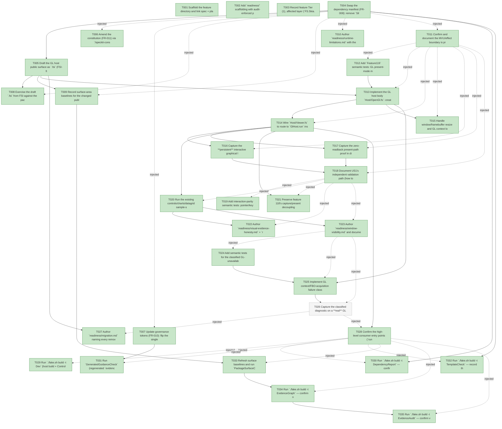

# Task Graph — 119-opengl-present-backend

## ✓ Graph is acyclic and consistent

## Skill Match Assessments

| Task | Candidate | Confidence | Signals | Reviewer disposition | Diagnostic |
|------|-----------|------------|---------|----------------------|------------|
| T001 | (none) | none |  | accepted-empty | T001: skillist trusted as declared; no owns-based capability requirement |
| T002 | (none) | none |  | accepted-empty | T002: skillist trusted as declared; no owns-based capability requirement |
| T003 | (none) | none |  | accepted-empty | T003: skillist trusted as declared; no owns-based capability requirement |
| T004 | (none) | none |  | declared | T004: skillist trusted as declared; no owns-based capability requirement |
| T005 | (none) | none |  | declared | T005: skillist trusted as declared; no owns-based capability requirement |
| T006 | speckit-constitution | high | owns:constitution | accepted | T006: owns constitution requires skill speckit-constitution; trigger_group=owns; matched_trigger=owns:constitution |
| T007 | (none) | none |  | declared | T007: skillist trusted as declared; no owns-based capability requirement |
| T008 | (none) | none |  | declared | T008: skillist trusted as declared; no owns-based capability requirement |
| T009 | (none) | none |  | declared | T009: skillist trusted as declared; no owns-based capability requirement |
| T010 | (none) | none |  | declared | T010: skillist trusted as declared; no owns-based capability requirement |
| T011 | (none) | none |  | declared | T011: skillist trusted as declared; no owns-based capability requirement |
| T012 | (none) | none |  | declared | T012: skillist trusted as declared; no owns-based capability requirement |
| T013 | (none) | none |  | declared | T013: skillist trusted as declared; no owns-based capability requirement |
| T014 | (none) | none |  | declared | T014: skillist trusted as declared; no owns-based capability requirement |
| T015 | (none) | none |  | declared | T015: skillist trusted as declared; no owns-based capability requirement |
| T016 | (none) | none |  | declared | T016: skillist trusted as declared; no owns-based capability requirement |
| T017 | (none) | none |  | declared | T017: skillist trusted as declared; no owns-based capability requirement |
| T018 | (none) | none |  | declared | T018: skillist trusted as declared; no owns-based capability requirement |
| T019 | (none) | none |  | declared | T019: skillist trusted as declared; no owns-based capability requirement |
| T020 | (none) | none |  | declared | T020: skillist trusted as declared; no owns-based capability requirement |
| T021 | (none) | none |  | declared | T021: skillist trusted as declared; no owns-based capability requirement |
| T022 | (none) | none |  | declared | T022: skillist trusted as declared; no owns-based capability requirement |
| T023 | (none) | none |  | declared | T023: skillist trusted as declared; no owns-based capability requirement |
| T024 | (none) | none |  | declared | T024: skillist trusted as declared; no owns-based capability requirement |
| T025 | (none) | none |  | declared | T025: skillist trusted as declared; no owns-based capability requirement |
| T026 | (none) | none |  | declared | T026: skillist trusted as declared; no owns-based capability requirement |
| T027 | (none) | none |  | declared | T027: skillist trusted as declared; no owns-based capability requirement |
| T028 | (none) | none |  | declared | T028: skillist trusted as declared; no owns-based capability requirement |
| T029 | (none) | none |  | declared | T029: skillist trusted as declared; no owns-based capability requirement |
| T030 | (none) | none |  | declared | T030: skillist trusted as declared; no owns-based capability requirement |
| T031 | (none) | none |  | declared | T031: skillist trusted as declared; no owns-based capability requirement |
| T032 | (none) | none |  | declared | T032: skillist trusted as declared; no owns-based capability requirement |
| T033 | (none) | none |  | declared | T033: skillist trusted as declared; no owns-based capability requirement |
| T034 | speckit-evidence-graph | high | owns:graph-validation | accepted | T034: owns graph-validation requires skill speckit-evidence-graph; trigger_group=owns; matched_trigger=owns:graph-validation |
| T035 | speckit-evidence-audit | high | owns:evidence-audit | accepted | T035: owns evidence-audit requires skill speckit-evidence-audit; trigger_group=owns; matched_trigger=owns:evidence-audit |

## Status counts (effective)

| Status | Count |
|--------|-------|
| [X] done | 34 |
| [S] synthetic | 0 |
| [S*] auto-synthetic | 0 |
| [-] skipped | 1 |
| accepted [SEH] synthetic | 0 |
| unaccepted synthetic | 0 |

## Graph



## ASCII view

```
T001 [X] Scaffold the feature directory and link spec + plan; confirm `.specify/feature.json` resolves `119-opengl-present-backend`
T002 [X] Add `readiness/` scaffolding with audit-enforced placeholder files discoverable before implementation: `runtime-limitations.md`, `governance-risk-levels.md`, `aggregate-hang-diagnostics.md`, `visual-evidence-honesty.md`, `window-visibility.md`, `real-image-evidence.md`, `generated-validation.md`, `evidence-audit.md`, `migration.md`, and `smoke/`/`sample-smoke/`/`fsi/` dirs — each naming its authoritative command, artifact path, failure class, next action
T003 [X] Record feature Tier (1), affected layer (`FS.Skia.UI.SkiaViewer` host), public-API impact (breaking `Host/Vulkan.fsi` + diagnostic DUs), MVU applicability (edge-only swap), and evidence obligations into the readiness notes
T004 [X] Swap the dependency manifest (FR-008): remove `Silk.NET.Vulkan` + `Silk.NET.Vulkan.Extensions.KHR` from `Directory.Packages.props` and `src/SkiaViewer/SkiaViewer.fsproj`; add `Silk.NET.OpenGL` `2.23.0`; keep `Silk.NET.Windowing*`/`Silk.NET.Input`/`SkiaSharp*`
T005 [X] Draft the GL host public surface as `.fsi` (FSI-first, Principle I): `Host/OpenGl.fsi` (`GlResources`/`GlStartup`/`GlHost.run`), reconcile `ViewerDiagnosticCategory` (`Vulkan`→`OpenGl`, `Swapchain`→`Framebuffer`) and `ViewerRunBlockedStage` (`Swapchain`→`GlContext`, retain `Readback`) in `SkiaViewer.fsi`, and re-document `PresentMode.fsi` cases for GL (FR-007) — per `contracts/gl-host-surface.md`
T006 [X] Amend the constitution (FR-011) via `/speckit-constitution`: replace the Vulkan-backend mandate and the "Vulkan smoke" clause in `Project-specific constraints` with the OpenGL backend; keep `build/Governance/GovernedBlocks.fs` fragment in sync
T007 [X] Update governance tokens (FR-010): flip the single-sourced `runtime-limitations.md` token `"Vulkan"`→`"OpenGL"` in `build/Governance/Evidence/EvidenceFormatSchema.fs` `readinessContractChecks`, the generated seed in `GeneratedProduct.fs:970`, `build/Governance/README.md`, and the docs/ADR/architecture/report prose; regenerate `.claude` peers via `RefreshSurfaceBaselines`
T008 [X] Exercise the draft `.fsi` from FSI against the packed/loaded surface (`GlResources`/`GlStartup`, each `ViewerPresentMode`, `ViewerOptions`) and capture the transcript to `readiness/fsi/gl-host-session.txt`
T009 [X] Record surface-area baselines for the changed public modules (`RefreshSurfaceBaselines`) — top-level + per-package `SkiaViewer` surface
T010 [X] Author `readiness/runtime-limitations.md` with the GL token set (`.NET 10 desktop`, `OpenGL`, `SkiaSharp preview`, `unsupported macOS/mobile/browser`, `no software-renderer fallback`) and record unsupported-scope handling + GL failure-diagnostic classification
T011 [X] Confirm and document the MVU/effect boundary is preserved: viewer `Model`/`Msg`/`Effect`/`init`/pure `update` unchanged, only the interpreter edge swapped; note the injected-`Tick` clock and retained-render step are untouched
T012 [X] Add `Feature119` semantic tests: GL present-mode mapping (`DirectToSwapchain` default, `OffscreenReadback` fallback) and the zero-readback assertion (per-frame readback count == 0 in direct mode) — failing-first before the GL host exists (SC-001)
T013 [X] Implement the GL host body `Host/OpenGl.fs`: create the GL context (`GRGlInterface`/`GRContext.CreateGl`), wrap FBO 0 (`GRGlFramebufferInfo` → `GRBackendRenderTarget` → `SKSurface`, `GRSurfaceOrigin.BottomLeft`/`Rgba8888`), draw the existing `SceneRenderer` scene, `Flush`, then toolkit `SwapBuffers` — no readback/staging/command-pool/queue-stall
T014 [X] Wire `Host/Viewer.fs` to route to `GlHost.run` instead of `VulkanHost.run` and flip the applied default `ViewerOptions.PresentMode` to `DirectToSwapchain`; high-level entry points keep their shape
T015 [X] Handle window/framebuffer resize and GL context loss (FR-006): recreate the render-target + `SKSurface` at the new framebuffer pixel size with no GPU-resource leak; classify context loss honestly (high-DPI/Wayland sized from framebuffer pixels)
T016 [X] Capture the **persistent** interactive graphical launch on a GPU-passthrough machine (default executable path, real window, continuous render, working pointer/keyboard) → `readiness/supported-host-persistent-launch.txt`
T017 [X] Capture the zero-readback present-path proof in direct mode using counts/booleans (no timing gate) → `readiness/smoke/zero-readback-present.md` (unblocks feature 118 SC-002)
T018 [X] Document US1's independent validation path (how to reproduce direct present + the zero-readback proof) in the readiness notes
T019 [X] Add interaction-parity semantic tests: pointer/keyboard routing, focus handling, and the animation clock behave identically across the backend swap (SC-003)
T020 [X] Run the existing controls/charts/datagrid sample-smoke and screenshot/evidence captures under the GL backend and confirm they match the established baselines → `readiness/sample-smoke/*` (SC-002)
T021 [X] Preserve feature 118's capture/present decoupling (FR-004): the on-demand screenshot/evidence routine stays the `OffscreenReadback` offscreen path, independent of the live direct-present path; assert identical capture results
T022 [X] Author `readiness/visual-evidence-honesty.md` + `readiness/real-image-evidence.md` (artifact paths, sha/byte-parity vs baseline, intentional-deviation log)
T023 [X] Author `readiness/window-visibility.md` and document US2's independent validation path
T024 [X] Add semantic tests for the classified GL-unavailable diagnostic: missing/broken GL context → benign `UnsupportedEnvironment`; post-context failure → blocking defect; never a false success (SC-004)
T025 [X] Implement GL context/FBO-acquisition failure classification in `Host/Diagnostics.fs` (GL stages), reusing the existing benign/blocking host-warning classifier; emit a structured diagnostic naming the failed GL stage (Principle VII)
T026 [-] Capture the classified diagnostic on a **real** GL-unavailable environment (headless/no-passthrough shell) → `readiness/smoke/unsupported-gl-diagnostic.md` (real evidence, no synthetic)
T027 [X] Author `readiness/migration.md` naming every removed/renamed public member with its GL replacement: `VulkanResources`/`VulkanStartup`/`VulkanHost`, `ViewerDiagnosticCategory.Vulkan`/`Swapchain`, `ViewerRunBlockedStage.Swapchain`, and the re-mapped `ViewerPresentMode` semantics (FR-009)
T028 [X] Confirm the high-level consumer entry points (`runInteractiveApp` / `runInteractiveViewer` / `ViewerOptions`) compile unchanged against the new surface, with FSI/compile evidence (SC-005)
T029 [X] Run `./fake.sh build -t Dev` (host build + Controls/Elmish/Feature119 tests) and record the red→green evidence log
T030 [X] Run `./fake.sh build -t DependencyReport` — confirm `Silk.NET.Vulkan*` gone, `Silk.NET.OpenGL` present; regenerated `docs/reports/dependencies.md` (FR-008); note the two archived 085/086 harness `.fsproj`s are out of scope
T031 [X] Run `GeneratedGuidanceCheck` (regenerated `evidence-formats.md` token currency) then `GeneratedProductCheck` (generated `runtime-limitations.md` = OpenGL) sequentially
T032 [X] Run `./fake.sh build -t TemplateCheck` — record the expected template pin-lag failure pre-merge and document the deferral to the `/fs-skia-template-update` follow-up track (not in this merge scope)
T033 [X] Refresh surface baselines and run `PackageSurfaceCheck`/`PerPackageSurfaceDiff` (Tier 1 breaking delta = intended `SkiaViewer` change and nothing else); author `readiness/governance-risk-levels.md` + `readiness/aggregate-hang-diagnostics.md`
T034 [X] Run `./fake.sh build -t EvidenceGraph` — confirm no cycles, no dangling refs, no `[S*]` surprises; record graph before/after paths
T035 [X] Run `./fake.sh build -t EvidenceAudit` — confirm verdict PASS, 0 synthetic, no diff-scan hits; `generated-validation.md` package-resolution=resolved (SC-006)
```

## Injected checkpoint edges (Phase N+1 → Phase N) — FR-007

- T004 → T006  (auto-injected Phase-checkpoint edge)
- T004 → T007  (auto-injected Phase-checkpoint edge)
- T004 → T008  (auto-injected Phase-checkpoint edge)
- T004 → T009  (auto-injected Phase-checkpoint edge)
- T004 → T010  (auto-injected Phase-checkpoint edge)
- T004 → T011  (auto-injected Phase-checkpoint edge)
- T011 → T012  (auto-injected Phase-checkpoint edge)
- T011 → T013  (auto-injected Phase-checkpoint edge)
- T011 → T014  (auto-injected Phase-checkpoint edge)
- T011 → T015  (auto-injected Phase-checkpoint edge)
- T011 → T016  (auto-injected Phase-checkpoint edge)
- T011 → T017  (auto-injected Phase-checkpoint edge)
- T011 → T018  (auto-injected Phase-checkpoint edge)
- T018 → T019  (auto-injected Phase-checkpoint edge)
- T018 → T020  (auto-injected Phase-checkpoint edge)
- T018 → T021  (auto-injected Phase-checkpoint edge)
- T018 → T022  (auto-injected Phase-checkpoint edge)
- T018 → T023  (auto-injected Phase-checkpoint edge)
- T023 → T024  (auto-injected Phase-checkpoint edge)
- T023 → T025  (auto-injected Phase-checkpoint edge)
- T023 → T026  (auto-injected Phase-checkpoint edge)
- T026 → T027  (auto-injected Phase-checkpoint edge)
- T026 → T028  (auto-injected Phase-checkpoint edge)
- T028 → T029  (auto-injected Phase-checkpoint edge)
- T028 → T030  (auto-injected Phase-checkpoint edge)
- T028 → T031  (auto-injected Phase-checkpoint edge)
- T028 → T032  (auto-injected Phase-checkpoint edge)
- T028 → T033  (auto-injected Phase-checkpoint edge)
- T028 → T034  (auto-injected Phase-checkpoint edge)
- T028 → T035  (auto-injected Phase-checkpoint edge)

## Resolved skillist ids — FR-007

Resolved skillist-id set (9): fs-skia-elmish, fs-skia-evidence-mode, fs-skia-skiaviewer, fs-skia-template-update, fsharp-build-orchestration, fsharp-code-generation, speckit-constitution, speckit-evidence-audit, speckit-evidence-graph

## Skillist id → SKILL.md path

fs-skia-elmish → src/Elmish/skill/SKILL.md
fs-skia-evidence-mode → .agents/skills/fs-skia-evidence-mode/SKILL.md
fs-skia-skiaviewer → src/SkiaViewer/skill/SKILL.md
fs-skia-template-update → .agents/skills/fs-skia-template-update/SKILL.md
fsharp-build-orchestration → .agents/skills/fsharp-build-orchestration/SKILL.md
fsharp-code-generation → .agents/skills/fsharp-code-generation/SKILL.md
speckit-constitution → .agents/skills/speckit-constitution/SKILL.md
speckit-evidence-audit → .agents/skills/speckit-evidence-audit/SKILL.md
speckit-evidence-graph → .agents/skills/speckit-evidence-graph/SKILL.md

## Skillist id → unresolved / flagged

_(none — every declared skillist id resolves to exactly one installed skill)_

