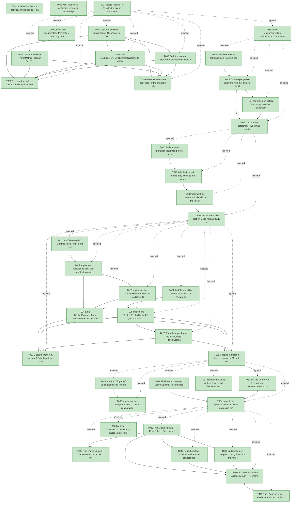

# Task Graph — 120-backend-paint-replay-cache

## ✓ Graph is acyclic and consistent

## Skill Match Assessments

| Task | Candidate | Confidence | Signals | Reviewer disposition | Diagnostic |
|------|-----------|------------|---------|----------------------|------------|
| T001 | (none) | none |  | accepted-empty | T001: skillist trusted as declared; no owns-based capability requirement |
| T002 | (none) | none |  | accepted-empty | T002: skillist trusted as declared; no owns-based capability requirement |
| T003 | (none) | none |  | accepted-empty | T003: skillist trusted as declared; no owns-based capability requirement |
| T004 | (none) | none |  | declared | T004: skillist trusted as declared; no owns-based capability requirement |
| T005 | (none) | none |  | declared | T005: skillist trusted as declared; no owns-based capability requirement |
| T006 | (none) | none |  | declared | T006: skillist trusted as declared; no owns-based capability requirement |
| T007 | (none) | none |  | declared | T007: skillist trusted as declared; no owns-based capability requirement |
| T008 | (none) | none |  | declared | T008: skillist trusted as declared; no owns-based capability requirement |
| T009 | (none) | none |  | declared | T009: skillist trusted as declared; no owns-based capability requirement |
| T010 | (none) | none |  | declared | T010: skillist trusted as declared; no owns-based capability requirement |
| T011 | (none) | none |  | declared | T011: skillist trusted as declared; no owns-based capability requirement |
| T012 | (none) | none |  | declared | T012: skillist trusted as declared; no owns-based capability requirement |
| T013 | (none) | none |  | declared | T013: skillist trusted as declared; no owns-based capability requirement |
| T014 | (none) | none |  | declared | T014: skillist trusted as declared; no owns-based capability requirement |
| T015 | (none) | none |  | declared | T015: skillist trusted as declared; no owns-based capability requirement |
| T016 | (none) | none |  | declared | T016: skillist trusted as declared; no owns-based capability requirement |
| T017 | (none) | none |  | declared | T017: skillist trusted as declared; no owns-based capability requirement |
| T018 | (none) | none |  | declared | T018: skillist trusted as declared; no owns-based capability requirement |
| T019 | (none) | none |  | declared | T019: skillist trusted as declared; no owns-based capability requirement |
| T020 | (none) | none |  | declared | T020: skillist trusted as declared; no owns-based capability requirement |
| T021 | (none) | none |  | declared | T021: skillist trusted as declared; no owns-based capability requirement |
| T022 | (none) | none |  | declared | T022: skillist trusted as declared; no owns-based capability requirement |
| T023 | (none) | none |  | declared | T023: skillist trusted as declared; no owns-based capability requirement |
| T024 | (none) | none |  | declared | T024: skillist trusted as declared; no owns-based capability requirement |
| T025 | (none) | none |  | declared | T025: skillist trusted as declared; no owns-based capability requirement |
| T026 | (none) | none |  | declared | T026: skillist trusted as declared; no owns-based capability requirement |
| T027 | (none) | none |  | declared | T027: skillist trusted as declared; no owns-based capability requirement |
| T028 | (none) | none |  | declared | T028: skillist trusted as declared; no owns-based capability requirement |
| T029 | (none) | none |  | declared | T029: skillist trusted as declared; no owns-based capability requirement |
| T030 | (none) | none |  | declared | T030: skillist trusted as declared; no owns-based capability requirement |
| T031 | (none) | none |  | declared | T031: skillist trusted as declared; no owns-based capability requirement |
| T032 | (none) | none |  | declared | T032: skillist trusted as declared; no owns-based capability requirement |
| T033 | (none) | none |  | declared | T033: skillist trusted as declared; no owns-based capability requirement |
| T034 | (none) | none |  | declared | T034: skillist trusted as declared; no owns-based capability requirement |
| T035 | (none) | none |  | declared | T035: skillist trusted as declared; no owns-based capability requirement |
| T036 | (none) | none |  | declared | T036: skillist trusted as declared; no owns-based capability requirement |
| T037 | (none) | none |  | declared | T037: skillist trusted as declared; no owns-based capability requirement |
| T038 | (none) | none |  | declared | T038: skillist trusted as declared; no owns-based capability requirement |
| T039 | (none) | none |  | declared | T039: skillist trusted as declared; no owns-based capability requirement |
| T040 | speckit-evidence-graph | high | owns:graph-validation | accepted | T040: owns graph-validation requires skill speckit-evidence-graph; trigger_group=owns; matched_trigger=owns:graph-validation |
| T041 | speckit-evidence-audit | high | owns:evidence-audit | accepted | T041: owns evidence-audit requires skill speckit-evidence-audit; trigger_group=owns; matched_trigger=owns:evidence-audit |

## Status counts (effective)

| Status | Count |
|--------|-------|
| [X] done | 41 |
| [S] synthetic | 0 |
| [S*] auto-synthetic | 0 |
| accepted [SEH] synthetic | 0 |
| unaccepted synthetic | 0 |

## Graph



## ASCII view

```
T001 [X] Scaffold the feature directory and link spec + plan; confirm `.specify/feature.json` resolves `specs/120-backend-paint-replay-cache`
T002 [X] Add `readiness/` scaffolding with audit-enforced placeholder files discoverable before implementation: `governance-risk-levels.md`, `aggregate-hang-diagnostics.md`, `runtime-limitations.md`, `generated-validation.md`, `visual-evidence-honesty.md`, `window-visibility.md`, `real-image-evidence.md`, `skill-loading-evidence.md`, `focused-gates.md`, `evidence-graph.md`, `evidence-audit.md`, and the `smoke/`, `fsi/`, `perf-corpus/` dirs — each naming its authoritative command, artifact path, failure class, and next action
T003 [X] Record feature Tier (1), affected layers (`FS.Skia.UI` Scene IR, `FS.Skia.UI.Controls` RetainedRender, `FS.Skia.UI.Controls.Elmish` FrameMetrics, `FS.Skia.UI.SkiaViewer` backend), public-API impact (additive Scene case + FrameMetrics fields + docstring + new internal cache `.fsi`), MVU applicability (frame-dirty signal + conditional `RenderFrame`), and the six evidence obligations into the readiness notes
T004 [X] Draft the additive public Scene IR contract in `src/Scene/Scene.fsi` (Principle I, FSI-first): new `SceneNode.CachedSubtree of CacheBoundary` case + `CacheBoundary` record (`CacheId: uint64`, `Fingerprint: uint64`, `Scene: Scene`), documented **transparent** to every consumer except the backend painter — per `contracts/contracts.md` §1
T005 [X] Draft the additive `FrameMetrics` delta in `src/Controls.Elmish/ControlsElmish.fsi`: non-golden `PaintDuration`/`ComposeDuration: TimeSpan` + golden counters `ReplayHitCount`/`ReplayMissCount`/`ReplayRecordCount`/`ReplaySkippedNodeCount`/`ReplayCacheNativeBytes: int`, and correct the `DirtyArea` docstring to "union of distinct damage rectangles, never exceeds frame area" — per `contracts/contracts.md` §2
T006 [X] Draft `src/SkiaViewer/PictureReplayCache.fsi` (NEW `module internal`: `create`/`paintBoundary`/`stats`/`dispose`, replay-disable oracle seam) and correct the `ViewerOptions.PresentMode` docstring in `src/SkiaViewer/SkiaViewer.fsi` to name the shipped `DirectToSwapchain` default — per `contracts/contracts.md` §3, §4
T007 [X] Draft the internal `src/Controls/RetainedRender.fsi` seam (no public surface delta): `val internal hashScene` structural fingerprint, `PictureCacheKey` → `{ Box; Fingerprint: uint64 }`, `Fragment` gains internal `Fingerprint`, and the `CachedSubtree` emission seam — per `contracts/contracts.md` §5
T008 [X] Exercise the drafted `.fsi` from FSI against the loaded surface (construct a `CachedSubtree`, confirm transparent describe/measure; read the new `FrameMetrics` fields; sketch the `PictureReplayCache` create/stats shape) and capture the transcript to `readiness/fsi/session.txt`
T009 [X] Record surface-area baselines for the changed public modules (`./fake.sh build -t RefreshSurfaceBaselines`) — top-level + per-package `Scene`, `Controls.Elmish`, `SkiaViewer` surfaces (additive delta only)
T010 [X] Confirm and document the MVU/effect boundary: the internal frame-dirty signal on the viewer `Model`, the pure emit-or-skip `RenderFrame` decision in `update` (FR-004/FR-006), and the record/replay + phase-timing in the interpreter edge — existing `Msg`/`Cmd` contract preserved, no new public message
T011 [X] Author `readiness/runtime-limitations.md` and record unsupported-scope handling + safe-failure diagnostics: no damage-rect GPU clip, no render-thread/compositor split, **Windows GL not launch-verified** (Linux/Mesa-only evidence), a failed `SKPicture` record degrades to the direct walk, idle-skip degrades to painting on an uncertain dirty signal
T012 [X] Add `Feature120` semantic tests (failing-first): the live timing path reports a distinct `PaintDuration` (scene→canvas walk) and `ComposeDuration` (flush + buffer-swap), and the deterministic count goldens are byte-identical to before the timing fields were added (SC-001 / FR-002)
T013 [X] Capture per-phase durations with `Stopwatch` in `Host/OpenGl.fs` (`renderFrameDirect`/`drawScene`): time the scene paint-walk separately from flush + `SwapBuffers`, thread both into `FrameMetrics.PaintDuration`/`ComposeDuration` (`TimeSpan.Zero` on the deterministic `Perf.runScript` path)
T014 [X] Wire the non-golden live timing baseline generator to capture the new per-phase durations for the existing performance corpus scenarios into `docs/reports/_baselines/2026-06-13-paint-replay-after.md` (FR-003), emitting a `MissingCounters:` line if a phase cannot be timed (109 honesty precedent)
T015 [X] Capture the before/after live timing baseline on the Mesa corpus, confirm paint and present/compose durations are separated, and document US1's independent validation path in the readiness notes
T016 [X] Add the pure-transition test (failing-first): an unchanged frame with **no** dirty cause emits **no** `RenderFrame` effect, while an active animation clock / resize / theme / model change / work-requiring tick **does** emit it (FR-004 / FR-006)
T017 [X] Add the internal frame-dirty signal to the viewer `Model` (set by product message / resize / theme / active animation clock; cleared after present) and make `update` emit `RenderFrame` only when set or an animation clock is live — pure decision, no new public `Msg`
T018 [X] Implement the present-path idle skip in the interpreter: a skipped frame performs no surface clear, no scene walk, and no draw-call re-issue, and keeps the previously presented front buffer valid (re-present treated as "no scene work", FR-005) on the double-buffered GL surface
T019 [X] Drive the interactive host on Mesa with a steady stream of no-op frames after the first render; capture the zero-redraw proof (subsequent unchanged frames report zero paint work / zero draw-call re-issue) and confirm a forced repaint afterward is byte-identical to the first frame's readback → `readiness/smoke/idle-zero-redraw.md` (SC-002)
T020 [X] Add `Feature120` `Controls.Tests` fingerprint tests (failing-first): `hashScene` differs for any render-affecting change (geometry, color, path, text, font, opacity, transform, clip) and — the key proof — a constructed subtree that stringifies identically under the old truncating `%A` digest but differs structurally produces a **different** fingerprint (SC-005 / FR-008)
T021 [X] Add `Feature120` `SkiaViewer.Tests` for `PictureReplayCache`: hit on matching fingerprint, miss/re-record on changed fingerprint or eviction, LRU bound never exceeded, native `SKPicture` disposed on evict/replace, and the replay-disable oracle never records/replays (FR-011 / FR-013)
T022 [X] Implement `hashScene` (collision-resistant structural fold; `// mutable: hot path` accumulator) in `RetainedRender.fs`, replace the `sprintf "%A"`-based `PictureCacheKey.Picture` with `{ Box; Fingerprint }`, and memoize `Fingerprint` on the `Fragment` (computed in `paintFresh`/`buildFresh`, carried unchanged on `Keep` — cost ∝ damage, not tree size)
T023 [X] Implement the `CachedSubtree` node in `src/Scene/Scene.fs`: `describe`/diagnostics/`measure` and all IR traversals **see through** it (recurse into `Scene`), preserving deterministic goldens and at-rest byte-identity
T024 [X] Emit `CachedSubtree` from `RetainedRender` for subtrees reuse-stable on the **prior** frame only (FR-012 churny-gate; `CacheId` from `RetainedId`, `Fingerprint` from T022), and update all internal reduction / virtual-items / damage walks to see through the boundary
T025 [X] Implement `PictureReplayCache.fs` (record-on-miss via `SKPictureRecorder` at the boundary box, replay-on-hit via `DrawPicture`, `Dispose` on evict/replace, deterministic min-`Stamp` LRU eviction, native-byte accounting, replay-disable oracle) and wire `SceneRenderer.paintNode` `CachedSubtree → replay-or-record` (transparent when disabled)
T026 [X] Thread the per-frame replay counters (`ReplayHitCount`/`ReplayMissCount`/`ReplayRecordCount`/`ReplaySkippedNodeCount`/`ReplayCacheNativeBytes`) from the cache stats into `FrameMetrics` (FR-014)
T027 [X] Capture cache-on / cache-off **pixel readback parity** on Mesa for **every** performance corpus scene (byte-identical, FR-009/FR-011), and on the 10000-row DataGrid small-change frame confirm `ReplaySkippedNodeCount` is the large majority of subtree paint nodes with a lower `PaintDuration` than the replay-off baseline → `readiness/smoke/replay-readback-parity.md` (SC-003 / SC-004)
T028 [X] Capture the forced-staleness proof on Mesa (a render-affecting change — theme/text/geometry/opacity/clip — flips the fingerprint, forces re-record, and never presents stale pixels) → `readiness/smoke/forced-staleness.md`, and document US3's independent validation path (SC-005 / FR-010)
T029 [X] Add the `DirtyArea` union test (failing-first): for two overlapping repainted regions the metric equals the **union** area (not the sum) and never exceeds the frame area (SC-007 / FR-015)
T030 [X] Implement the `DirtyArea` sum → union computation in `RetainedRender.fs` (FR-015), clamped to the frame area
T031 [X] Finalize the corrected `ViewerOptions.PresentMode` docstring in `SkiaViewer.fsi` so it names the shipped `DirectToSwapchain` default (FR-016) — the `.fsi` body matching the T006 draft
T032 [X] Set the DemoReel live window `viewerOptions` to `ViewerPresentMode.DirectToSwapchain` (FR-017) in `samples/DemoReel/Program.fs`, leaving the evidence/screenshot capture path on `OffscreenReadback`
T033 [X] Remove the dead, written-never-read `lastRuntimeStateTouched` reference from the interactive host (`ControlsElmish.fs`, FR-018) — behavior-neutral, deterministic goldens unchanged
T034 [X] Launch the **persistent** DemoReel interactive window from the default executable path on a GPU-passthrough machine and confirm via the host's own present diagnostic that it presents with `readback=false` in `DirectToSwapchain` → `readiness/smoke/present-mode.md` + `readiness/window-visibility.md` (SC-008)
T035 [X] Run `./fake.sh build -t Route` then `./fake.sh build -t Dev` (Scene/Controls/Elmish/SkiaViewer + Feature120 tests); record the red→green evidence log and the selected governance risk level
T036 [X] Run `./fake.sh build -t GeneratedProductCheck` then `./fake.sh build -t TemplateCheck` sequentially; record the expected template pin-lag failure pre-merge and document the deferral to the post-merge `/fs-skia-template-update` re-pin (116–119 pattern), not in this merge scope
T037 [X] Refresh surface baselines and run the controls/package public-surface gates (`PackageSurfaceCheck`/`PerPackageSurfaceDiff`) — additive Tier-1 delta only (Scene case + FrameMetrics fields + docstring), nothing removed; author `readiness/governance-risk-levels.md` + `readiness/aggregate-hang-diagnostics.md`
T038 [X] Update the perf-corpus count goldens for the new replay counters (`ReplayHit/Miss/Record/SkippedNode/CacheNativeBytes`) and confirm the existing count lines and the timing fields stay out of goldens — deterministic surface byte-identical (FR-002)
T039 [X] Author `readiness/skill-loading-evidence.md` (one row per task/skill load) and `readiness/focused-gates.md` (the focused gate per risk level), so skill-loading and focused-validation evidence is complete before the audit
T040 [X] Run `./fake.sh build -t EvidenceGraph` — confirm no cycles, no dangling refs, no `[S*]` surprises; record graph before/after paths
T041 [X] Run `./fake.sh build -t EvidenceAudit` — confirm verdict PASS, **0 synthetic**, no diff-scan hits, `generated-validation.md` package-resolution=resolved (SC-009)
```

## Injected checkpoint edges (Phase N+1 → Phase N) — FR-007

- T003 → T004  (auto-injected Phase-checkpoint edge)
- T003 → T005  (auto-injected Phase-checkpoint edge)
- T003 → T006  (auto-injected Phase-checkpoint edge)
- T003 → T007  (auto-injected Phase-checkpoint edge)
- T003 → T008  (auto-injected Phase-checkpoint edge)
- T003 → T009  (auto-injected Phase-checkpoint edge)
- T003 → T010  (auto-injected Phase-checkpoint edge)
- T003 → T011  (auto-injected Phase-checkpoint edge)
- T011 → T012  (auto-injected Phase-checkpoint edge)
- T011 → T013  (auto-injected Phase-checkpoint edge)
- T011 → T014  (auto-injected Phase-checkpoint edge)
- T011 → T015  (auto-injected Phase-checkpoint edge)
- T015 → T016  (auto-injected Phase-checkpoint edge)
- T015 → T017  (auto-injected Phase-checkpoint edge)
- T015 → T018  (auto-injected Phase-checkpoint edge)
- T015 → T019  (auto-injected Phase-checkpoint edge)
- T019 → T020  (auto-injected Phase-checkpoint edge)
- T019 → T021  (auto-injected Phase-checkpoint edge)
- T019 → T022  (auto-injected Phase-checkpoint edge)
- T019 → T023  (auto-injected Phase-checkpoint edge)
- T019 → T024  (auto-injected Phase-checkpoint edge)
- T019 → T025  (auto-injected Phase-checkpoint edge)
- T019 → T026  (auto-injected Phase-checkpoint edge)
- T019 → T027  (auto-injected Phase-checkpoint edge)
- T019 → T028  (auto-injected Phase-checkpoint edge)
- T028 → T029  (auto-injected Phase-checkpoint edge)
- T028 → T030  (auto-injected Phase-checkpoint edge)
- T028 → T031  (auto-injected Phase-checkpoint edge)
- T028 → T032  (auto-injected Phase-checkpoint edge)
- T028 → T033  (auto-injected Phase-checkpoint edge)
- T028 → T034  (auto-injected Phase-checkpoint edge)
- T034 → T035  (auto-injected Phase-checkpoint edge)
- T034 → T036  (auto-injected Phase-checkpoint edge)
- T034 → T037  (auto-injected Phase-checkpoint edge)
- T034 → T038  (auto-injected Phase-checkpoint edge)
- T034 → T039  (auto-injected Phase-checkpoint edge)
- T034 → T040  (auto-injected Phase-checkpoint edge)
- T034 → T041  (auto-injected Phase-checkpoint edge)

## Resolved skillist ids — FR-007

Resolved skillist-id set (13): fs-skia-controls-host, fs-skia-elmish, fs-skia-evidence-mode, fs-skia-reconciliation, fs-skia-samples, fs-skia-scene, fs-skia-skiaviewer, fs-skia-template-update, fs-skia-ui-widgets, fsharp-build-orchestration, fsharp-code-generation, speckit-evidence-audit, speckit-evidence-graph

## Skillist id → SKILL.md path

fs-skia-controls-host → .agents/skills/fs-skia-controls-host/SKILL.md
fs-skia-elmish → src/Elmish/skill/SKILL.md
fs-skia-evidence-mode → .agents/skills/fs-skia-evidence-mode/SKILL.md
fs-skia-reconciliation → .agents/skills/fs-skia-reconciliation/SKILL.md
fs-skia-samples → template/fragments/samples/skill/SKILL.md
fs-skia-scene → src/Scene/skill/SKILL.md
fs-skia-skiaviewer → src/SkiaViewer/skill/SKILL.md
fs-skia-template-update → .agents/skills/fs-skia-template-update/SKILL.md
fs-skia-ui-widgets → src/Controls/skill/SKILL.md
fsharp-build-orchestration → .agents/skills/fsharp-build-orchestration/SKILL.md
fsharp-code-generation → .agents/skills/fsharp-code-generation/SKILL.md
speckit-evidence-audit → .agents/skills/speckit-evidence-audit/SKILL.md
speckit-evidence-graph → .agents/skills/speckit-evidence-graph/SKILL.md

## Skillist id → unresolved / flagged

_(none — every declared skillist id resolves to exactly one installed skill)_

