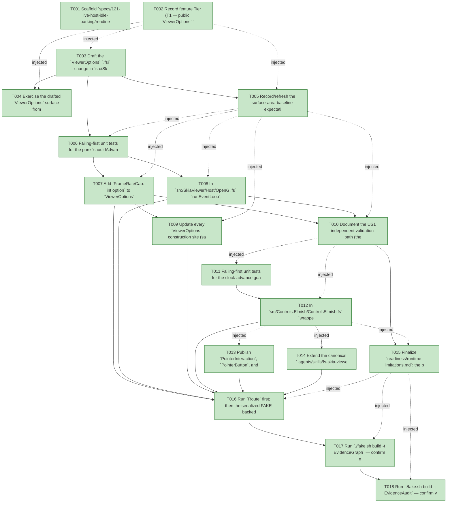

# Task Graph — 121-live-host-idle-parking

## ✓ Graph is acyclic and consistent

## Skill Match Assessments

| Task | Candidate | Confidence | Signals | Reviewer disposition | Diagnostic |
|------|-----------|------------|---------|----------------------|------------|
| T001 | (none) | none |  | accepted-empty | T001: skillist trusted as declared; no owns-based capability requirement |
| T002 | (none) | none |  | accepted-empty | T002: skillist trusted as declared; no owns-based capability requirement |
| T003 | (none) | none |  | declared | T003: skillist trusted as declared; no owns-based capability requirement |
| T004 | (none) | none |  | declared | T004: skillist trusted as declared; no owns-based capability requirement |
| T005 | (none) | none |  | accepted-empty | T005: skillist trusted as declared; no owns-based capability requirement |
| T006 | (none) | none |  | declared | T006: skillist trusted as declared; no owns-based capability requirement |
| T007 | (none) | none |  | declared | T007: skillist trusted as declared; no owns-based capability requirement |
| T008 | (none) | none |  | declared | T008: skillist trusted as declared; no owns-based capability requirement |
| T009 | (none) | none |  | accepted-empty | T009: skillist trusted as declared; no owns-based capability requirement |
| T010 | (none) | none |  | accepted-empty | T010: skillist trusted as declared; no owns-based capability requirement |
| T011 | (none) | none |  | declared | T011: skillist trusted as declared; no owns-based capability requirement |
| T012 | (none) | none |  | declared | T012: skillist trusted as declared; no owns-based capability requirement |
| T013 | (none) | none |  | declared | T013: skillist trusted as declared; no owns-based capability requirement |
| T014 | (none) | none |  | declared | T014: skillist trusted as declared; no owns-based capability requirement |
| T015 | (none) | none |  | declared | T015: skillist trusted as declared; no owns-based capability requirement |
| T016 | (none) | none |  | declared | T016: skillist trusted as declared; no owns-based capability requirement |
| T017 | speckit-evidence-graph | high | owns:graph-validation | accepted | T017: owns graph-validation requires skill speckit-evidence-graph; trigger_group=owns; matched_trigger=owns:graph-validation |
| T018 | speckit-evidence-audit | high | owns:evidence-audit | accepted | T018: owns evidence-audit requires skill speckit-evidence-audit; trigger_group=owns; matched_trigger=owns:evidence-audit |

## Status counts (effective)

| Status | Count |
|--------|-------|
| [X] done | 18 |
| [S] synthetic | 0 |
| [S*] auto-synthetic | 0 |
| accepted [SEH] synthetic | 0 |
| unaccepted synthetic | 0 |

## Graph



## ASCII view

```
T001 [X] Scaffold `specs/121-live-host-idle-parking/readiness/` placeholders discoverable before implementation (`runtime-limitations.md`, `evidence-graph.md`, `evidence-audit.md`, `generated-validation.md`), each naming its authoritative command, artifact path, failure class, and next action; link spec + plan
T002 [X] Record feature Tier (T1 — public `ViewerOptions` `.fsi` escalates), affected layers (`src/SkiaViewer`, `src/Controls.Elmish`, `docs/api-surface`, `.agents/skills`), public-API impact (additive defaulted field), and that MVU contract is unchanged (the `CloseWindow` quit path is already wired)
T003 [X] Draft the `ViewerOptions` `.fsi` change in `src/SkiaViewer/SkiaViewer.fsi` — additive defaulted `FrameRateCap: int option` plus the defaulting construction path — per `contracts/viewer-options.md`, and the signature of the extracted pure pacing decision `shouldAdvanceFrame`
T004 [X] Exercise the drafted `ViewerOptions` surface from FSI (prelude or ad-hoc), including a `FrameRateCap = Some n` / `None` construction, and capture the transcript to `readiness/fsi-session.txt`
T005 [X] Record/refresh the surface-area baseline expectation for the changed `SkiaViewer` public module so the intentional additive delta is captured (no behavior baseline change)
T006 [X] Failing-first unit tests for the pure `shouldAdvanceFrame` pacing decision: cap `n` bounds advances/second (cadence ≤ cap), a larger interval yields strictly fewer advances, the first frame always advances (SC-001); and `validateOptions` rejects `FrameRateCap = Some n, n <= 0` with a startup diagnostic (SC-005)
T007 [X] Add `FrameRateCap: int option` to `ViewerOptions` (`.fsi` + `.fs`) with the defaulting path; thread it into `ViewerConfiguration.TargetFrameRate` at `SkiaViewer.fs:1232-1236` (replacing literal `Some 60`); extend `validateOptions` to reject non-positive caps (FR-001/FR-003)
T008 [X] In `src/SkiaViewer/Host/OpenGl.fs` `runEventLoop`, extract `shouldAdvanceFrame` and gate **both** `DoUpdate()` and `DoRender()` by it so the cap bounds render cadence (FR-002), preserving `Thread.Sleep(1)` and feature-120 paint-skip
T009 [X] Update every `ViewerOptions` construction site (samples, `scripts/*-prelude.fsx`, tests) for the new field so the repo compiles; confirm omitting the cap is byte-identical (FR-008/SC-002)
T010 [X] Document the US1 independent validation path (the pacing-decision unit test + the headless-undrivable-window caveat) in `readiness/runtime-limitations.md`
T011 [X] Failing-first unit tests for the clock-advance guard: no active clock ⇒ result is reference-equal to input (no allocation, SC-003); ≥1 active clock ⇒ each active clock advances by the delta exactly as today (features 099/103 unchanged)
T012 [X] In `src/Controls.Elmish/ControlsElmish.fs` `wrappedTick`, guard the `StateByIdentity |> Map.map (advance)` with a `Map.exists (clock active)` check, leaving `retained.Value` unchanged when no clock is active (FR-004) — internal, no `.fsi` impact
T013 [X] Publish `PointerInteraction`, `PointerButton`, and `ViewerPointerPhaseKind` (and the `MapPointer`/`MapKeyChord` folding note) under `docs/api-surface/` per `contracts/api-surface.md`, and wire/extend a drift check that fails if the published shape diverges from the `.fsi` (FR-005)
T014 [X] Extend the canonical `.agents/skills/fs-skia-viewer-host` skill with present-mode selection (`DirectToSwapchain` live vs `OffscreenReadback` evidence + don't-reuse-evidence-options warning), the new frame-cap lever, the no-compositor free-run environment limit, and the reconciliation facts (live paint-skip + quit-via-`CloseWindow` already shipped); regenerate the `.claude` peer via `RefreshSurfaceBaselines` (FR-006/FR-007)
T015 [X] Finalize `readiness/runtime-limitations.md`: the persistent live window free-runs on a no-compositor host (environment limitation, not a defect), with the frame-cap as the consumer mitigation; record that no interactive-window pass is claimed (FR-008)
T016 [X] Run `Route` first; then the serialized FAKE-backed gate set it prints (`Dev` → `GeneratedGuidanceCheck` → `TemplateCheck` → `GeneratedProductCheck`) plus `RefreshSurfaceBaselines`, sequentially in deterministic order; record the non-authoritative aggregate result
T017 [X] Run `./fake.sh build -t EvidenceGraph` — confirm no cycles, no dangling refs, no `[S*]` surprises; capture before/after graph paths
T018 [X] Run `./fake.sh build -t EvidenceAudit` — confirm verdict PASS with 0 synthetic (no `--accept-synthetic` expected); write `readiness/evidence-audit.md` verdict token
```

## Injected checkpoint edges (Phase N+1 → Phase N) — FR-007

- T002 → T003  (auto-injected Phase-checkpoint edge)
- T002 → T004  (auto-injected Phase-checkpoint edge)
- T002 → T005  (auto-injected Phase-checkpoint edge)
- T005 → T006  (auto-injected Phase-checkpoint edge)
- T005 → T007  (auto-injected Phase-checkpoint edge)
- T005 → T008  (auto-injected Phase-checkpoint edge)
- T005 → T009  (auto-injected Phase-checkpoint edge)
- T005 → T010  (auto-injected Phase-checkpoint edge)
- T010 → T011  (auto-injected Phase-checkpoint edge)
- T010 → T012  (auto-injected Phase-checkpoint edge)
- T012 → T013  (auto-injected Phase-checkpoint edge)
- T012 → T014  (auto-injected Phase-checkpoint edge)
- T012 → T015  (auto-injected Phase-checkpoint edge)
- T015 → T016  (auto-injected Phase-checkpoint edge)
- T015 → T017  (auto-injected Phase-checkpoint edge)
- T015 → T018  (auto-injected Phase-checkpoint edge)

## Resolved skillist ids — FR-007

Resolved skillist-id set (6): fs-skia-controls-host, fs-skia-evidence-mode, fs-skia-skiaviewer, fs-skia-viewer-host, speckit-evidence-audit, speckit-evidence-graph

## Skillist id → SKILL.md path

fs-skia-controls-host → .agents/skills/fs-skia-controls-host/SKILL.md
fs-skia-evidence-mode → .agents/skills/fs-skia-evidence-mode/SKILL.md
fs-skia-skiaviewer → src/SkiaViewer/skill/SKILL.md
fs-skia-viewer-host → .agents/skills/fs-skia-viewer-host/SKILL.md
speckit-evidence-audit → .agents/skills/speckit-evidence-audit/SKILL.md
speckit-evidence-graph → .agents/skills/speckit-evidence-graph/SKILL.md

## Skillist id → unresolved / flagged

_(none — every declared skillist id resolves to exactly one installed skill)_

