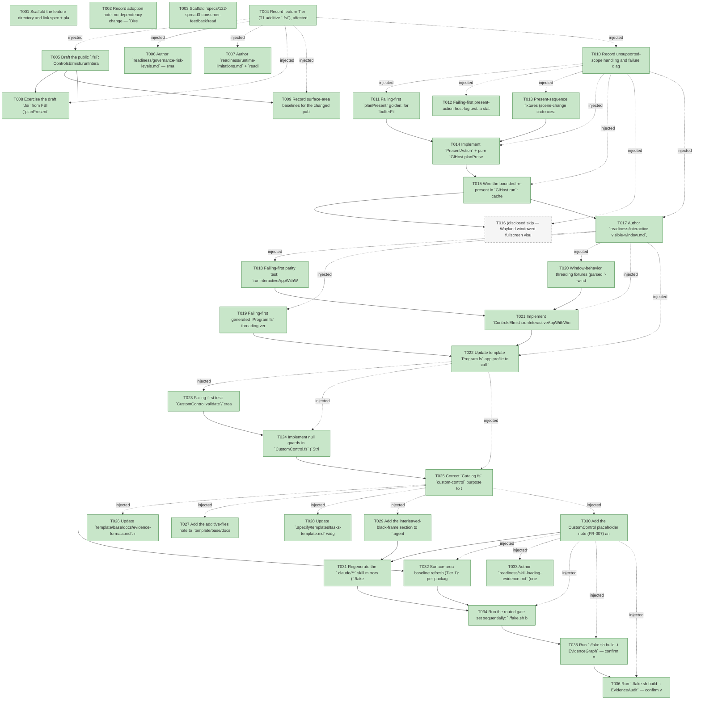

# Task Graph — 122-spread3-consumer-feedback

## ✓ Graph is acyclic and consistent

## Skill Match Assessments

| Task | Candidate | Confidence | Signals | Reviewer disposition | Diagnostic |
|------|-----------|------------|---------|----------------------|------------|
| T001 | (none) | none |  | accepted-empty | T001: skillist trusted as declared; no owns-based capability requirement |
| T002 | (none) | none |  | accepted-empty | T002: skillist trusted as declared; no owns-based capability requirement |
| T003 | (none) | none |  | accepted-empty | T003: skillist trusted as declared; no owns-based capability requirement |
| T004 | (none) | none |  | accepted-empty | T004: skillist trusted as declared; no owns-based capability requirement |
| T005 | (none) | none |  | declared | T005: skillist trusted as declared; no owns-based capability requirement |
| T006 | (none) | none |  | accepted-empty | T006: skillist trusted as declared; no owns-based capability requirement |
| T007 | (none) | none |  | declared | T007: skillist trusted as declared; no owns-based capability requirement |
| T008 | (none) | none |  | declared | T008: skillist trusted as declared; no owns-based capability requirement |
| T009 | (none) | none |  | accepted-empty | T009: skillist trusted as declared; no owns-based capability requirement |
| T010 | (none) | none |  | declared | T010: skillist trusted as declared; no owns-based capability requirement |
| T011 | (none) | none |  | declared | T011: skillist trusted as declared; no owns-based capability requirement |
| T012 | (none) | none |  | declared | T012: skillist trusted as declared; no owns-based capability requirement |
| T013 | (none) | none |  | accepted-empty | T013: skillist trusted as declared; no owns-based capability requirement |
| T014 | (none) | none |  | declared | T014: skillist trusted as declared; no owns-based capability requirement |
| T015 | (none) | none |  | declared | T015: skillist trusted as declared; no owns-based capability requirement |
| T016 | (none) | none |  | declared | T016: skillist trusted as declared; no owns-based capability requirement |
| T017 | (none) | none |  | declared | T017: skillist trusted as declared; no owns-based capability requirement |
| T018 | (none) | none |  | declared | T018: skillist trusted as declared; no owns-based capability requirement |
| T019 | (none) | none |  | declared | T019: skillist trusted as declared; no owns-based capability requirement |
| T020 | (none) | none |  | accepted-empty | T020: skillist trusted as declared; no owns-based capability requirement |
| T021 | (none) | none |  | declared | T021: skillist trusted as declared; no owns-based capability requirement |
| T022 | (none) | none |  | declared | T022: skillist trusted as declared; no owns-based capability requirement |
| T023 | (none) | none |  | declared | T023: skillist trusted as declared; no owns-based capability requirement |
| T024 | (none) | none |  | declared | T024: skillist trusted as declared; no owns-based capability requirement |
| T025 | (none) | none |  | declared | T025: skillist trusted as declared; no owns-based capability requirement |
| T026 | (none) | none |  | declared | T026: skillist trusted as declared; no owns-based capability requirement |
| T027 | (none) | none |  | accepted-empty | T027: skillist trusted as declared; no owns-based capability requirement |
| T028 | (none) | none |  | accepted-empty | T028: skillist trusted as declared; no owns-based capability requirement |
| T029 | (none) | none |  | declared | T029: skillist trusted as declared; no owns-based capability requirement |
| T030 | (none) | none |  | declared | T030: skillist trusted as declared; no owns-based capability requirement |
| T031 | (none) | none |  | declared | T031: skillist trusted as declared; no owns-based capability requirement |
| T032 | (none) | none |  | accepted-empty | T032: skillist trusted as declared; no owns-based capability requirement |
| T033 | (none) | none |  | accepted-empty | T033: skillist trusted as declared; no owns-based capability requirement |
| T034 | (none) | none |  | declared | T034: skillist trusted as declared; no owns-based capability requirement |
| T035 | speckit-evidence-graph | high | owns:graph-validation | accepted | T035: owns graph-validation requires skill speckit-evidence-graph; trigger_group=owns; matched_trigger=owns:graph-validation |
| T036 | speckit-evidence-audit | high | owns:evidence-audit | accepted | T036: owns evidence-audit requires skill speckit-evidence-audit; trigger_group=owns; matched_trigger=owns:evidence-audit |

## Status counts (effective)

| Status | Count |
|--------|-------|
| [X] done | 35 |
| [S] synthetic | 0 |
| [S*] auto-synthetic | 0 |
| [-] skipped | 1 |
| accepted [SEH] synthetic | 0 |
| unaccepted synthetic | 0 |

## Graph



## ASCII view

```
T001 [X] Scaffold the feature directory and link spec + plan (done in specify/plan; confirm `research.md`/`data-model.md`/`contracts/`/`quickstart.md` present)
T002 [X] Record adoption note: no dependency change — `Directory.Packages.props`/`DependencyReport` untouched; CustomControl property-style test uses hand-rolled deterministic loops (no FsCheck add)
T003 [X] Scaffold `specs/122-spread3-consumer-feedback/readiness/` audit-enforced placeholders (governance-risk-levels, aggregate-hang-diagnostics, runtime-limitations, generated-validation, skill-loading-evidence, interactive-visible-window, window-state-diagnostics, real-image-evidence, evidence-graph, evidence-audit) discoverable before implementation
T004 [X] Record feature Tier (T1 additive `.fsi`), affected layers (SkiaViewer host, Controls.Elmish, Controls, template, governance docs, skills), public-API impact (one additive overload + `PresentAction`/`planPresent` test seam), MVU applicability (host-loop/launch — `update` contract unchanged), and evidence obligations
T005 [X] Draft the public `.fsi`: `ControlsElmish.runInteractiveAppWithWindowBehavior` (ControlsElmish.fsi, XML-doc) and `PresentAction` DU + `GlHost.planPresent` (OpenGl.fsi test seam, attr→doc→type order)
T006 [X] Author `readiness/governance-risk-levels.md` — small/medium/broad levels; this change is **broad** (template + public `.fsi` + governance docs + skills) → maintainer-verify focused validation; record non-authoritative aggregate handling
T007 [X] Author `readiness/runtime-limitations.md` + `readiness/aggregate-hang-diagnostics.md`: Wayland windowed-fullscreen visual blink not reproducible headless; FR-004 knobs deferred; routed-gate sequential order (FAKE not concurrency-safe)
T008 [X] Exercise the draft `.fsi` from FSI (`planPresent` truth table; overload signature shape) and capture the transcript to `readiness/fsi-session.txt`
T009 [X] Record surface-area baselines for the changed public modules (Controls.Elmish top-level + SkiaViewer.Host) pre-change for the Tier-1 diff
T010 [X] Record unsupported-scope handling and failure diagnostics: present-path observability (`representedCount`/`skippedPresentCount`); offscreen path untouched
T011 [X] Failing-first `planPresent` golden: for `bufferFillDepth=3` a (change, then static…) sequence yields `[PaintAndPresent; RepresentLastGood; RepresentLastGood; SkipPresent; SkipPresent; …]` (SC-001)
T012 [X] Failing-first present-action host-log test: a static scene presents a populated buffer every frame (never an undrawn/black buffer) AND steady-state reaches `SkipPresent` (idle preserved); plus an offscreen byte-identical golden (readback path untouched) (SC-004)
T013 [X] Present-sequence fixtures (scene-change cadences: static, single-change-then-static, alternating) for T011/T012
T014 [X] Implement `PresentAction` + pure `GlHost.planPresent` in `OpenGl.fs`/`OpenGl.fsi` (reusing `shouldPresent`)
T015 [X] Wire the bounded re-present in `GlHost.run`: cache `lastGoodFrame` (`surface.Snapshot()`, dispose prior) after each paint; on `RepresentLastGood` blit the cached frame + Flush + SwapBuffers (no scene walk); track `idleRepresentsRemaining`/`representedCount`/`bufferFillDepth`; `SkipPresent` stays full idle (FR-002)
T016 [-] (disclosed skip — Wayland windowed-fullscreen visual not reproducible headless; rationale in readiness/runtime-limitations.md + real-image-evidence.md) Persistent graphical launch: confirm the live `DirectToSwapchain` host is reachable from the default executable path and exercises the new present plan; disclosed `[-]` Wayland windowed-fullscreen visual no-blink observation (not reproducible in headless/Mesa CI — rationale in `readiness/real-image-evidence.md`) (SC-001)
T017 [X] Author `readiness/interactive-visible-window.md`, `readiness/window-state-diagnostics.md`, `readiness/real-image-evidence.md` for the present-path change (key=value token form per FR-008)
T018 [X] Failing-first parity test: `runInteractiveAppWithWindowBehavior options Viewer.defaultWindowBehavior host` is byte-identical to `runInteractiveApp options host` (default path unchanged) (SC-004)
T019 [X] Failing-first generated `Program.fs` threading verification: with a window flag supplied, the app-profile launch routes through `runInteractiveAppWithWindowBehavior` (flag reaches the live launch, not only `manualWindowOptionResults`) (SC-003)
T020 [X] Window-behavior threading fixtures (parsed `--window-startup normal` → `ViewerWindowBehaviorRequest`)
T021 [X] Implement `ControlsElmish.runInteractiveAppWithWindowBehavior` (delegates to `Viewer.runInteractiveViewerWithWindowBehavior`; `runInteractiveApp` unchanged)
T022 [X] Update template `Program.fs` app profile to call `runInteractiveAppWithWindowBehavior viewerOptions windowBehaviorRequest interactiveHost` when `windowFlagSupplied args`, else `runInteractiveApp` (mirrors game branch; no-flag default byte-identical)
T023 [X] Failing-first test: `CustomControl.validate`/`create` with a real null `Id` and null `Effects` entries returns a validation diagnostic and does NOT throw (NRE) (SC-005). Real evidence — actual null values through the real functions, no mocks/fakes; reclassified from the task-gen `[SEH]` because the null input is real, representative, and feasible (so not synthetic).
T024 [X] Implement null guards in `CustomControl.fs` (`String.IsNullOrWhiteSpace` for `Id`/effects; guard the `Accessibility.defaultFor … Id` argument)
T025 [X] Correct `Catalog.fs` `custom-control` purpose to the honest statement (renderTree/preview paints a labeled placeholder; build must-show geometry from primitive controls); regenerate `docs/controls-catalog.md`; update any stale test asserting the old string (SC-005)
T026 [X] Update `template/base/docs/evidence-formats.md`: render the required tokens for `interactive-visible-window.md` (`status=…  mode=…  window-visible=…  accessible-window=…  first-frame-presented=…  self-closed-for-evidence=…`) and `generated-validation.md` (`exact-package-match=…  generated-tests-ran=…  authoritative=…  failure-class=…`) in explicit `key=value` form, noting these files are key/value-parsed (SC-006)
T027 [X] Add the additive-files note to `template/base/docs/scaffold-map.md`: new source files may be added provided the six scanned files (`Model.fs → View.fs → LayoutEvidence.fs → WindowOptions.fs → EvidenceCommands.fs → Program.fs`) keep their relative compile order (SC-007)
T028 [X] Update `.specify/templates/tasks-template.md` widgets hint: the directory is `fs-skia-ui-widgets` but the resolved `name:` in a generated product is the project-prefixed form (e.g. `<project>-widgets`) — use the resolved `name:` in `skillist` ids (SC-007)
T029 [X] Add the interleaved-black-frame section to `.agents/skills/fs-skia-viewer-host/SKILL.md` (Wayland `DirectToSwapchain`): framework now keeps swapchain buffers populated (FR-001); `--window-startup normal` now applies to controls apps (FR-005); mark the prior "size-aware view" advice as a **blur** fix only and warn the full-extent grid is an O(cells) ANR trap
T030 [X] Add the CustomControl placeholder note (FR-007) and the no-new-dependency property-test pattern note (FR-012) to `.agents/skills/fs-skia-ui-widgets/SKILL.md` and mirror into `template/product-skills/fs-skia-ui-widgets/SKILL.md`
T031 [X] Regenerate the `.claude/**` skill mirrors (`./fake.sh build -t RefreshSurfaceBaselines`) and confirm `SkillSyncCheck` green
T032 [X] Surface-area baseline refresh (Tier 1): per-package + top-level baselines for the new `runInteractiveAppWithWindowBehavior` and `PresentAction`/`planPresent`
T033 [X] Author `readiness/skill-loading-evidence.md` (one row per task,skill) + `readiness/selected-skills.md`; `readiness/generated-validation.md` (key=value form) and `readiness/evidence-graph.md`
T034 [X] Run the routed gate set sequentially: `./fake.sh build -t Dev` → `GeneratedGuidanceCheck` → `TemplateCheck` → `GeneratedProductCheck` (FAKE not concurrency-safe) + the controls/package-surface gates `Route` prints
T035 [X] Run `./fake.sh build -t EvidenceGraph` — confirm no cycles, no dangling refs, no `[S*]` surprises; record before/after `readiness/evidence-graph.md`
T036 [X] Run `./fake.sh build -t EvidenceAudit` — confirm verdict PASS, 0 synthetic; record `readiness/evidence-audit.md`
```

## Injected checkpoint edges (Phase N+1 → Phase N) — FR-007

- T004 → T005  (auto-injected Phase-checkpoint edge)
- T004 → T006  (auto-injected Phase-checkpoint edge)
- T004 → T007  (auto-injected Phase-checkpoint edge)
- T004 → T008  (auto-injected Phase-checkpoint edge)
- T004 → T009  (auto-injected Phase-checkpoint edge)
- T004 → T010  (auto-injected Phase-checkpoint edge)
- T010 → T011  (auto-injected Phase-checkpoint edge)
- T010 → T012  (auto-injected Phase-checkpoint edge)
- T010 → T013  (auto-injected Phase-checkpoint edge)
- T010 → T014  (auto-injected Phase-checkpoint edge)
- T010 → T015  (auto-injected Phase-checkpoint edge)
- T010 → T016  (auto-injected Phase-checkpoint edge)
- T010 → T017  (auto-injected Phase-checkpoint edge)
- T017 → T018  (auto-injected Phase-checkpoint edge)
- T017 → T019  (auto-injected Phase-checkpoint edge)
- T017 → T020  (auto-injected Phase-checkpoint edge)
- T017 → T021  (auto-injected Phase-checkpoint edge)
- T017 → T022  (auto-injected Phase-checkpoint edge)
- T022 → T023  (auto-injected Phase-checkpoint edge)
- T022 → T024  (auto-injected Phase-checkpoint edge)
- T022 → T025  (auto-injected Phase-checkpoint edge)
- T025 → T026  (auto-injected Phase-checkpoint edge)
- T025 → T027  (auto-injected Phase-checkpoint edge)
- T025 → T028  (auto-injected Phase-checkpoint edge)
- T025 → T029  (auto-injected Phase-checkpoint edge)
- T025 → T030  (auto-injected Phase-checkpoint edge)
- T030 → T032  (auto-injected Phase-checkpoint edge)
- T030 → T033  (auto-injected Phase-checkpoint edge)
- T030 → T034  (auto-injected Phase-checkpoint edge)
- T030 → T035  (auto-injected Phase-checkpoint edge)
- T030 → T036  (auto-injected Phase-checkpoint edge)

## Resolved skillist ids — FR-007

Resolved skillist-id set (8): fs-skia-controls-host, fs-skia-evidence-mode, fs-skia-skiaviewer, fs-skia-template-update, fs-skia-ui-widgets, fs-skia-viewer-host, speckit-evidence-audit, speckit-evidence-graph

## Skillist id → SKILL.md path

fs-skia-controls-host → .agents/skills/fs-skia-controls-host/SKILL.md
fs-skia-evidence-mode → .agents/skills/fs-skia-evidence-mode/SKILL.md
fs-skia-skiaviewer → src/SkiaViewer/skill/SKILL.md
fs-skia-template-update → .agents/skills/fs-skia-template-update/SKILL.md
fs-skia-ui-widgets → src/Controls/skill/SKILL.md
fs-skia-viewer-host → .agents/skills/fs-skia-viewer-host/SKILL.md
speckit-evidence-audit → .agents/skills/speckit-evidence-audit/SKILL.md
speckit-evidence-graph → .agents/skills/speckit-evidence-graph/SKILL.md

## Skillist id → unresolved / flagged

_(none — every declared skillist id resolves to exactly one installed skill)_

