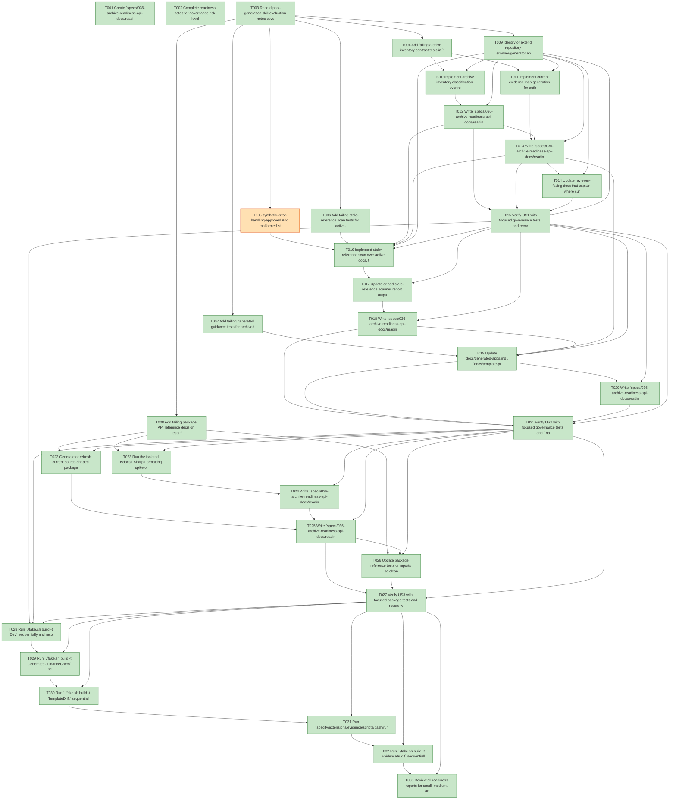

# Task Graph — 036-archive-readiness-api-docs

## ✓ Graph is acyclic and consistent

## Skill Match Assessments

| Task | Candidate | Confidence | Signals | Reviewer disposition | Diagnostic |
|------|-----------|------------|---------|----------------------|------------|
| T001 | (none) | none |  | accepted-empty | T001: skillist trusted as declared; no owns-based capability requirement |
| T002 | (none) | none |  | accepted-empty | T002: skillist trusted as declared; no owns-based capability requirement |
| T003 | (none) | none |  | declared | T003: skillist trusted as declared; no owns-based capability requirement |
| T004 | (none) | none |  | accepted-empty | T004: skillist trusted as declared; no owns-based capability requirement |
| T005 | (none) | none |  | accepted-empty | T005: skillist trusted as declared; no owns-based capability requirement |
| T006 | (none) | none |  | accepted-empty | T006: skillist trusted as declared; no owns-based capability requirement |
| T007 | (none) | none |  | accepted-empty | T007: skillist trusted as declared; no owns-based capability requirement |
| T008 | (none) | none |  | accepted-empty | T008: skillist trusted as declared; no owns-based capability requirement |
| T009 | (none) | none |  | accepted-empty | T009: skillist trusted as declared; no owns-based capability requirement |
| T010 | (none) | none |  | accepted-empty | T010: skillist trusted as declared; no owns-based capability requirement |
| T011 | (none) | none |  | accepted-empty | T011: skillist trusted as declared; no owns-based capability requirement |
| T012 | (none) | none |  | accepted-empty | T012: skillist trusted as declared; no owns-based capability requirement |
| T013 | (none) | none |  | accepted-empty | T013: skillist trusted as declared; no owns-based capability requirement |
| T014 | (none) | none |  | accepted-empty | T014: skillist trusted as declared; no owns-based capability requirement |
| T015 | (none) | none |  | accepted-empty | T015: skillist trusted as declared; no owns-based capability requirement |
| T016 | (none) | none |  | accepted-empty | T016: skillist trusted as declared; no owns-based capability requirement |
| T017 | (none) | none |  | accepted-empty | T017: skillist trusted as declared; no owns-based capability requirement |
| T018 | (none) | none |  | accepted-empty | T018: skillist trusted as declared; no owns-based capability requirement |
| T019 | (none) | none |  | declared | T019: skillist trusted as declared; no owns-based capability requirement |
| T020 | (none) | none |  | accepted-empty | T020: skillist trusted as declared; no owns-based capability requirement |
| T021 | (none) | none |  | accepted-empty | T021: skillist trusted as declared; no owns-based capability requirement |
| T022 | (none) | none |  | accepted-empty | T022: skillist trusted as declared; no owns-based capability requirement |
| T023 | (none) | none |  | accepted-empty | T023: skillist trusted as declared; no owns-based capability requirement |
| T024 | (none) | none |  | accepted-empty | T024: skillist trusted as declared; no owns-based capability requirement |
| T025 | (none) | none |  | accepted-empty | T025: skillist trusted as declared; no owns-based capability requirement |
| T026 | (none) | none |  | accepted-empty | T026: skillist trusted as declared; no owns-based capability requirement |
| T027 | (none) | none |  | accepted-empty | T027: skillist trusted as declared; no owns-based capability requirement |
| T028 | (none) | none |  | accepted-empty | T028: skillist trusted as declared; no owns-based capability requirement |
| T029 | (none) | none |  | accepted-empty | T029: skillist trusted as declared; no owns-based capability requirement |
| T030 | (none) | none |  | accepted-empty | T030: skillist trusted as declared; no owns-based capability requirement |
| T031 | (none) | none |  | declared | T031: skillist trusted as declared; no owns-based capability requirement |
| T032 | (none) | none |  | declared | T032: skillist trusted as declared; no owns-based capability requirement |
| T033 | (none) | none |  | accepted-empty | T033: skillist trusted as declared; no owns-based capability requirement |

## Status counts (effective)

| Status | Count |
|--------|-------|
| [X] done | 32 |
| [S] synthetic | 1 |
| [S*] auto-synthetic | 0 |
| accepted [SEH] synthetic | 1 |
| unaccepted synthetic | 0 |

## Synthetic Error-Handling Classification

| Task | Accepted | Label | Design source | Synthetic input class | Expected error behavior | Diagnostics |
|------|----------|-------|---------------|-----------------------|-------------------------|-------------|
| T005 | yes | yes | `specs/036-archive-readiness-api-docs/plan.md` synthetic evidence policy and `contracts/stale-reference-scan-contract.md` failure conditions | malformed scanner input | Scanner rejects missing scan-area or unresolved classification with source path, reason, and next action | (none) |

## Graph



## ASCII view

```
T001 [X] Create `specs/036-archive-readiness-api-docs/readiness/` placeholders for archive inventory, current evidence map, stale scan, API generator evaluation, fsdocs spike, generated guidance check, and verification notes
T002 [X] Complete readiness notes for governance risk levels, aggregate hang diagnostics, runtime limitations, command ordering, and non-authoritative aggregate result policy
T003 [X] Record post-generation skill evaluation notes covering matched signals, confidence, ambiguity, and valid-empty dispositions for every task
T004 [X] Add failing archive inventory contract tests in `tests/Governance.Tests/` for required sections, row fields, archival markers, preservation status, and current-gate exclusion
T005 [S] synthetic-error-handling-approved Add malformed stale-reference scanner fixture tests for missing scan-area, unresolved path classification, and actionable diagnostic rejection   ← accepted [SEH]
T006 [X] Add failing stale-reference scan tests for active-surface blocking and historical-surface informational classification
T007 [X] Add failing generated guidance tests for archived readiness wording, source-shaped `.fsi` authority, and forbidden reflection or repository-source authoring advice
T008 [X] Add failing package API reference decision tests for required packages, comparison dimensions, fsdocs blocker fields, and current generator authority
T009 [X] Identify or extend repository scanner/generator entry points for archive inventory, stale reference scan, and guidance validation without adding committed fsdocs dependencies
T010 [X] Implement archive inventory classification over real repository paths, preserving feature id, original path, archival marker, rationale, owner, preservation status, and replacement path
T011 [X] Implement current evidence map generation for authoritative gates, required readiness paths, supporting paths, verification commands, and archived path policy
T012 [X] Write `specs/036-archive-readiness-api-docs/readiness/archive-inventory.md` from real repository paths and classification policy
T013 [X] Write `specs/036-archive-readiness-api-docs/readiness/current-evidence-map.md` with current package, template, generated-product, and audit gate paths
T014 [X] Update reviewer-facing docs that explain where current evidence lives and how archived readiness may be cited as audit context only
T015 [X] Verify US1 with focused governance tests and record the command, artifact path, failure class, and next action in readiness notes
T016 [X] Implement stale-reference scan over active docs, templates, generated guidance, build reports, and the active feature with historical specs reported informationally
T017 [X] Update or add stale-reference scanner report output with source path, referenced path, scan area, severity, reason, replacement path, line, and next action
T018 [X] Write `specs/036-archive-readiness-api-docs/readiness/stale-reference-scan.md` and optional JSON findings from real active-surface inspection
T019 [X] Update `docs/generated-apps.md`, `docs/template-profile.md`, `template/base/README.md`, and `template/base/docs/product.md` with archive/current-evidence guidance
T020 [X] Write `specs/036-archive-readiness-api-docs/readiness/generated-guidance-check.md` with generated guidance validation results and replacement instructions for stale references
T021 [X] Verify US2 with focused governance tests and `./fake.sh build -t GeneratedGuidanceCheck` run sequentially, recording logs under readiness
T022 [X] Generate or refresh current source-shaped package API reference samples for `FS.Skia.UI.Scene`, `FS.Skia.UI.Controls`, and one host or adapter package
T023 [X] Run the isolated fsdocs/FSharp.Formatting spike or record a blocker with command, log path, reason, and next action
T024 [X] Write `specs/036-archive-readiness-api-docs/readiness/fsharp-formatting-spike.md` with sample output paths or documented blocker details
T025 [X] Write `specs/036-archive-readiness-api-docs/readiness/api-reference-generator-evaluation.md` comparing all required dimensions and decision values
T026 [X] Update package reference tests or reports so clean consumer discovery guarantees remain source-shaped and do not depend on reflection or repository source inspection
T027 [X] Verify US3 with focused package tests and record whether optional package/template gates remain unnecessary
T028 [X] Run `./fake.sh build -t Dev` sequentially and record focused validation status in readiness logs
T029 [X] Run `./fake.sh build -t GeneratedGuidanceCheck` sequentially after Dev and record authoritative guidance validation
T030 [X] Run `./fake.sh build -t TemplateDrift` sequentially and record template guidance drift status
T031 [X] Run `.specify/extensions/evidence/scripts/bash/run-audit.sh specs/036-archive-readiness-api-docs --graph-only` or `./fake.sh build -t EvidenceGraph` sequentially and write `readiness/evidence-graph.md`
T032 [X] Run `./fake.sh build -t EvidenceAudit` sequentially after graph validation and write `readiness/evidence-audit.md`
T033 [X] Review all readiness reports for small, medium, and broad risk-level classification, focused validation evidence, broad-validation triggers, and non-authoritative aggregate result notes
```

