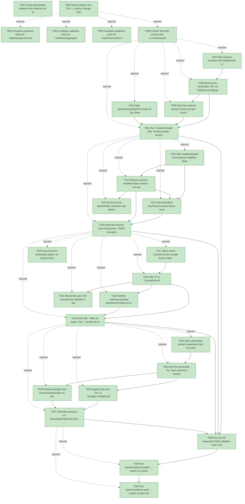

# Task Graph — 037-authoring-audit-robustness

## ✓ Graph is acyclic and consistent

## Skill Match Assessments

| Task | Candidate | Confidence | Signals | Reviewer disposition | Diagnostic |
|------|-----------|------------|---------|----------------------|------------|
| T001 | (none) | none |  | accepted-empty | T001: skillist trusted as declared; no owns-based capability requirement |
| T002 | (none) | none |  | accepted-empty | T002: skillist trusted as declared; no owns-based capability requirement |
| T003 | (none) | none |  | accepted-empty | T003: skillist trusted as declared; no owns-based capability requirement |
| T004 | (none) | none |  | accepted-empty | T004: skillist trusted as declared; no owns-based capability requirement |
| T005 | (none) | none |  | accepted-empty | T005: skillist trusted as declared; no owns-based capability requirement |
| T006 | (none) | none |  | accepted-empty | T006: skillist trusted as declared; no owns-based capability requirement |
| T007 | (none) | none |  | declared | T007: skillist trusted as declared; no owns-based capability requirement |
| T008 | (none) | none |  | declared | T008: skillist trusted as declared; no owns-based capability requirement |
| T009 | (none) | none |  | declared | T009: skillist trusted as declared; no owns-based capability requirement |
| T010 | (none) | none |  | declared | T010: skillist trusted as declared; no owns-based capability requirement |
| T011 | (none) | none |  | declared | T011: skillist trusted as declared; no owns-based capability requirement |
| T012 | (none) | none |  | declared | T012: skillist trusted as declared; no owns-based capability requirement |
| T013 | (none) | none |  | declared | T013: skillist trusted as declared; no owns-based capability requirement |
| T014 | (none) | none |  | declared | T014: skillist trusted as declared; no owns-based capability requirement |
| T015 | (none) | none |  | declared | T015: skillist trusted as declared; no owns-based capability requirement |
| T016 | (none) | none |  | declared | T016: skillist trusted as declared; no owns-based capability requirement |
| T017 | (none) | none |  | declared | T017: skillist trusted as declared; no owns-based capability requirement |
| T018 | (none) | none |  | declared | T018: skillist trusted as declared; no owns-based capability requirement |
| T019 | (none) | none |  | declared | T019: skillist trusted as declared; no owns-based capability requirement |
| T020 | (none) | none |  | declared | T020: skillist trusted as declared; no owns-based capability requirement |
| T021 | (none) | none |  | accepted-empty | T021: skillist trusted as declared; no owns-based capability requirement |
| T022 | (none) | none |  | declared | T022: skillist trusted as declared; no owns-based capability requirement |
| T023 | (none) | none |  | declared | T023: skillist trusted as declared; no owns-based capability requirement |
| T024 | (none) | none |  | declared | T024: skillist trusted as declared; no owns-based capability requirement |
| T025 | (none) | none |  | declared | T025: skillist trusted as declared; no owns-based capability requirement |
| T026 | (none) | none |  | declared | T026: skillist trusted as declared; no owns-based capability requirement |
| T027 | (none) | none |  | declared | T027: skillist trusted as declared; no owns-based capability requirement |
| T028 | (none) | none |  | accepted-empty | T028: skillist trusted as declared; no owns-based capability requirement |
| T029 | (none) | none |  | declared | T029: skillist trusted as declared; no owns-based capability requirement |
| T030 | (none) | none |  | declared | T030: skillist trusted as declared; no owns-based capability requirement |

## Status counts (effective)

| Status | Count |
|--------|-------|
| [X] done | 30 |
| [S] synthetic | 0 |
| [S*] auto-synthetic | 0 |
| accepted [SEH] synthetic | 0 |
| unaccepted synthetic | 0 |

## Graph



## ASCII view

```
T001 [X] Create placeholder evidence files listed by the plan: scaffold `specs/037-authoring-audit-robustness/readiness/` with `logs/`, `audit-fixtures/`, and `fsi/` subdirectories
T002 [X] Record feature Tier (Tier 1, contract change isolated to `ControlEventOrigin`), affected layers (Controls `.fsi`, governance tooling, template), public-contract impact, Elmish/MVU applicability (not applicable — no stateful or I/O-bearing runtime workflow changes), and the evidence obligations from the plan's Evidence Plan
T003 [X] Complete readiness notes for `readiness/governance-risk-levels.md` naming the small, medium, and broad governance risk levels, the focused validation required for the selected level, when broad validation is required, and required evidence
T004 [X] Complete readiness notes for `readiness/aggregate-hang-diagnostics.md` recording verdict, stage, elapsed duration, last observed command, focused rerun, and the non-authoritative aggregate policy
T005 [X] Complete readiness notes for `readiness/runtime-limitations.md` covering .NET 10 desktop, Vulkan, SkiaSharp preview, unsupported macOS/mobile/browser, and no software-renderer fallback
T006 [X] Confirm the three contract files (`contracts/audit-status-region-contract.md`, `contracts/control-event-origin-contract.md`, `contracts/fsi-load-script-contract.md`) capture the authoritative-region grammar and deterministic resolution rule, the `.fsi` surface delta and baseline lines, and the generated `.fsx` shape and in-sync derivation
T007 [X] Add a feature-resolution test (failing-first): a real `feature.json` resolves the active feature and reports its real task count, while an unreadable/empty/missing `feature.json` produces a non-zero/blocking result — asserting the current hardcoded fallback is gone (FR-001, FR-002, FR-003)
T008 [X] Remove the hardcoded `"007-v2-template-packaging"` fallback in `build.fsx` `activeFeatureId`; resolve authoritatively from `.specify/feature.json`; on missing/unreadable/empty, hard-fail with a prominent non-suppressible warning naming the expected source (FR-001, FR-002)
T009 [X] Echo the resolved feature id and real task count from `compute-task-graph.py`, surface any recorded-feature-vs-scanned-directory mismatch in the output, and when the resolved feature's task file is empty or unparseable, report that explicitly (non-zero/blocking) rather than falling back to a stub count (FR-003, US1 scenario 3, spec Edge Cases)
T010 [X] Align `.specify/scripts/bash/common.sh` `get_feature_paths` resolution order (env override → `feature.json` → branch-prefix) so the no-real-feature state is terminal-fail, never a stub fallback (FR-002)
T011 [X] Run `EvidenceGraph` then `EvidenceAudit`; record the resolved id and real task count in `readiness/feature-resolution.md` and `readiness/logs/evidence-graph.txt` / `readiness/logs/evidence-audit.txt`, plus a transcript of the unresolved-feature run showing the non-zero exit and warning, and a transcript of the empty/unparseable-task-file run showing the explicit report (no stub fallback)
T012 [X] Add `readiness/audit-fixtures/prose-negation-clean.md` (blocker terms only inside prose/negation/illustrative text, plus a clean `audit-status` region) and `readiness/audit-fixtures/genuine-violation.md` (a violating value inside the region); demonstrate failing-first that the prose fixture blocks under today's substring scanner (FR-004)
T013 [X] Add verification asserting the prose fixture resolves to PASS after the fix and the genuine-violation fixture BLOCKS both before and after (no true-positive regression) (FR-006)
T014 [X] Restrict machine-readable status reads in `run-audit.sh` to the designated `audit-status` fenced region; drop the bare substring blockers (`taskbar-only` / `mismatch` / `nu1603` in text); first declared region wins, a duplicate key within it is a surfaced parse error, and a malformed key/value (present but unparseable) is surfaced as a parse error rather than silently treated as passing or failing (FR-004, FR-005, spec Edge Cases)
T015 [X] Document the deterministic resolution rule (authoritative region wins; prose never read) in the `speckit-evidence-graph` and `speckit-evidence-audit` SKILL docs and their synchronized `.agents/skills` peers (FR-005)
T016 [X] Audit both fixtures and record prose→PASS and genuine→BLOCK results in `readiness/logs/evidence-audit.txt`, plus the duplicate-key parse-error, malformed-key parse-error, and prose-bullet-does-not-override checks (US2 scenarios 2 & 4, spec Edge Cases)
T017 [X] Add a mixed Scene/Controls compile fixture under `readiness/fsi/` that opens `FS.Skia.UI.Scene` then `FS.Skia.UI.Controls` (Controls last) and constructs an unqualified scene text node plus a bounds literal; failing-first, it reproduces the opaque `ControlEventOrigin` error pre-fix (FR-007, SC-004)
T018 [X] Add `[<RequireQualifiedAccess>]` to `ControlEventOrigin` in `src/Controls/Types.fs` and the matching `src/Controls/Types.fsi`, and qualify any repo usages of its unqualified cases so the `Text` case stops shadowing the scene text construct (FR-007)
T019 [X] Document the predictable pattern for shared structurally-typed types (reuse the shared bounds type to avoid record-field inference hijack) at the point of use in authoring guidance (FR-008)
T020 [X] Refresh `readiness/surface-baselines/FS.Skia.UI.Controls.txt` and `FS.Skia.UI.txt` via `scripts/refresh-surface-baselines.fsx` and confirm `./fake.sh build -t PackageSurfaceCheck` passes with the qualified-access marker
T021 [X] Record the spec 035 reversal and rationale in `specs/035-api-discovery-names/readiness/name-collision-safety.md` — guidance-over-attributes is reversed for `ControlEventOrigin` only — and document the consumer compatibility impact + migration guidance: code referencing `ControlEventOrigin` cases unqualified (`Text`, `Pointer`, …) must now qualify them (`ControlEventOrigin.Text`), with a before/after snippet (FR-010; public-API changes document compatibility impact and migration guidance)
T022 [X] Build with `./fake.sh build -t Dev`, compile the mixed-open fixture, and record the transcript under `readiness/fsi/` confirming it resolves to the scene construct (or fails naming the colliding symbols) — never the opaque error (SC-004)
T023 [X] Add a generated-product expectation that the emitted `.fsx` load script appears in the generated file list and references the app plus its transitive `FS.Skia.UI.*` set (FR-009)
T024 [X] Emit the generated `.fsx` load script from `template/base/` via `GenerateV3Products` in `build.fsx`, derived from the pinned `Directory.Packages.props` set and the generated `Product` output assembly so it stays in sync without being a hand-maintained reference list (FR-009)
T025 [X] Register the new `.fsx` in `.template.config/template.json` generated content and add the FSI-load entry-point guidance to `template/base/README.md` and `template/base/docs/product.md`
T026 [X] Preserve benign host-warning classification on the load path per the spec 021 host-warning contract — benign headless/host warnings stay classified benign while real failures stay fatal
T027 [X] Generate products, run `GeneratedGuidanceCheck` → `TemplateCheck` → `GeneratedProductCheck` (sequential), run the emitted `.fsx` in FSI for a generated app, and record the transcript in `readiness/fsi-load-script.md` showing zero manual reference edits (SC-005)
T028 [X] Run the full sequential FAKE validation order (`Dev` → `GeneratedGuidanceCheck` → `TemplateCheck` → `GeneratedProductCheck`), plus `PackageSurfaceCheck`, and record the non-authoritative aggregate results in `readiness/logs/`
T029 [X] Run `speckit.evidence.graph` — confirm no cycles, no dangling refs, no `[S*]` surprises, and that the resolved feature id and real task count are echoed
T030 [X] Run `speckit.evidence.audit` — confirm verdict PASS (no false blocks on the prose fixture; the genuine-violation fixture still blocks) or document every `--accept-synthetic` override
```

## Injected checkpoint edges (Phase N+1 → Phase N) — FR-007

- T002 → T003  (auto-injected Phase-checkpoint edge)
- T002 → T004  (auto-injected Phase-checkpoint edge)
- T002 → T005  (auto-injected Phase-checkpoint edge)
- T002 → T006  (auto-injected Phase-checkpoint edge)
- T006 → T007  (auto-injected Phase-checkpoint edge)
- T006 → T008  (auto-injected Phase-checkpoint edge)
- T006 → T009  (auto-injected Phase-checkpoint edge)
- T006 → T010  (auto-injected Phase-checkpoint edge)
- T006 → T011  (auto-injected Phase-checkpoint edge)
- T011 → T012  (auto-injected Phase-checkpoint edge)
- T011 → T013  (auto-injected Phase-checkpoint edge)
- T011 → T014  (auto-injected Phase-checkpoint edge)
- T011 → T015  (auto-injected Phase-checkpoint edge)
- T011 → T016  (auto-injected Phase-checkpoint edge)
- T016 → T017  (auto-injected Phase-checkpoint edge)
- T016 → T018  (auto-injected Phase-checkpoint edge)
- T016 → T019  (auto-injected Phase-checkpoint edge)
- T016 → T020  (auto-injected Phase-checkpoint edge)
- T016 → T021  (auto-injected Phase-checkpoint edge)
- T016 → T022  (auto-injected Phase-checkpoint edge)
- T022 → T023  (auto-injected Phase-checkpoint edge)
- T022 → T024  (auto-injected Phase-checkpoint edge)
- T022 → T025  (auto-injected Phase-checkpoint edge)
- T022 → T026  (auto-injected Phase-checkpoint edge)
- T022 → T027  (auto-injected Phase-checkpoint edge)
- T027 → T029  (auto-injected Phase-checkpoint edge)
- T027 → T030  (auto-injected Phase-checkpoint edge)

## Resolved skillist ids — FR-007

Resolved skillist-id set (6): fs-skia-layout-readability, fs-skia-scene, fs-skia-template-update, fs-skia-ui-widgets, speckit-evidence-audit, speckit-evidence-graph

